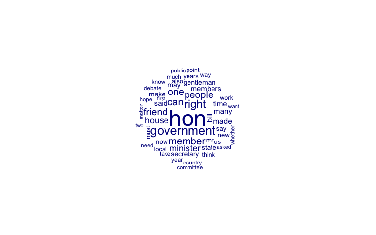
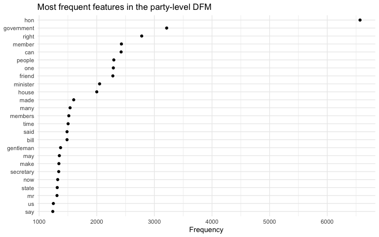
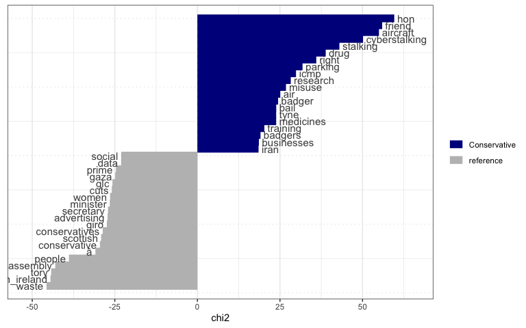
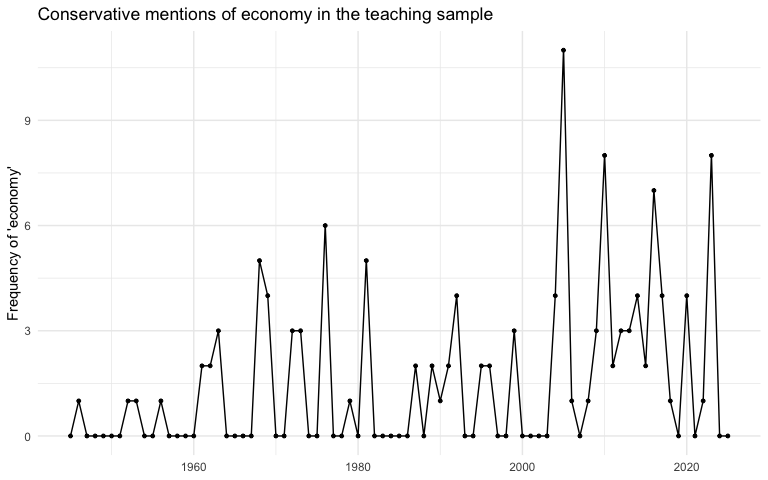
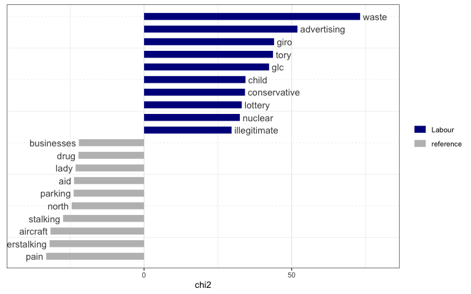

# QTA Lab 02 Answers: String Operations and Inspecting the House of Commons Corpus


## Learning goals

In this lab, you will learn how to:

- use `stringr` to inspect and clean character data;
- use regular expressions to search for patterns in text;
- standardise messy metadata values;
- create a `quanteda` corpus from the House of Commons sample;
- inspect corpus metadata, subset documents, reshape documents, tokenize
  text, and inspect keywords in context;
- create, trim, visualise, and compare document-feature matrices.

The running example is the same House of Commons sample we used in
Lab 1. This sample contains 5,000 speech contributions from 1945 to
2025.

## Load packages

We will use `dplyr` for data manipulation, `stringr` for string
operations, `ggplot2` for plotting, and `quanteda` for corpus
operations. The `quanteda.textstats` and `quanteda.textplots` packages
add useful tools for inspecting features and plotting text objects.

``` r
library(dplyr)
library(stringr)
library(ggplot2)
library(quanteda)
library(quanteda.textstats)
library(quanteda.textplots)
```

## Read the House of Commons sample

``` r
data_path <- "Data/hc_sample_1945_2025.rds"

hoc <- readRDS(data_path)
```

Let us recreate the `year` variable from Lab 1.

``` r
hoc <- hoc |>
  mutate(year = as.integer(format(date, "%Y")))

hoc |>
  select(date, year, speaker, party, agenda, terms, text) |>
  head(5)
```

            date year             speaker        party
    1 1945-01-16 1945       Mr. Johnstone      Liberal
    2 1945-01-16 1945        Mr. Woodburn       Labour
    3 1945-01-24 1945            Mr. Eden Conservative
    4 1945-01-30 1945 Vice-Admiral Taylor Conservative
    5 1945-01-31 1945       Sir M. Sueter Conservative
                                     agenda terms
    1                          Export Trade    72
    2   Fruit and Vegetables (Short Weight)    53
    3    BRITISH PRISONERS OF WAR, FAR EAST    29
    4               FIGHTING SERVICES (PAY)    30
    5 ROYAL NAVY (GERMAN SUBMARINE WARFARE)    50
                                                                                                                                                                                                                                                                                                                                                                                                                                                                                  text
    1 In addition to discussions with a large number of individual merchants and merchant bankers, many meetings connected with our post-war trade have taken place between my Department and Export Groups, a number of which include merchants among their members. The Consultative Committee which advised my Department on its future practice and procedure included a merchant among its members, and I have invited a merchant to join the Overseas Trade Development Council.
    2                                                                                                                                                      asked the President of the Board of Trade whether he is aware of the difficulties encountered by retail fruit and vegetable merchants owing to the absence of any control over the delivery of short weight; and whether he will take steps to ensure the application of weights and measures regulations in this industry.
    3                                                                                                                                                                                                                                                                          Despite several approaches the Japanese Government have shown themselves completely uninterested in exchanges of prisoners of war and have refused even to contemplate an exchange of sick and wounded.
    4                                                                                                                                                                                                                                                                                                       I do not think the hon. Member has a very good case. For years past the Socialist Members have consistently voted against the Estimates, which include the matter of pay——
    5                                                                                                                                                                 asked the First Lord of the Admiralty, in view of the recent pronouncement by General McNaughton, Canadian War Minister, regarding the number of U-boats in the Atlantic, if he can give an assurance that the Allies have sufficient surface vessels and aircraft to deal with this increased submarine menace.

## String operations

R stores text as character data. The House of Commons sample contains
several character variables, including `speaker`, `party`, `agenda`,
`text`, and `speech_url`.

Let us start with a small vector of agenda labels. These are useful for
learning string operations because parliamentary agenda labels are often
messy: they vary in capitalisation, contain repeated phrases, and
sometimes include bracketed contextual information.

``` r
agenda_labels <- hoc$agenda[1:8]

agenda_labels
```

    [1] "Export Trade"                             
    [2] "Fruit and Vegetables (Short Weight)"      
    [3] "BRITISH PRISONERS OF WAR, FAR EAST"       
    [4] "FIGHTING SERVICES (PAY)"                  
    [5] "ROYAL NAVY (GERMAN SUBMARINE WARFARE)"    
    [6] "TOWN AND COUNTRY PLANNING (SCOTLAND) BILL"
    [7] "WAR GRATUITIES"                           
    [8] "WATER BILL"                               

``` r
str(agenda_labels)
```

     chr [1:8] "Export Trade" "Fruit and Vegetables (Short Weight)" ...

The `stringr` package contains many useful functions for working with
character data. We will start with basic pattern matching.

### Extracting and locating patterns

`str_extract()` returns the first match to a pattern.

``` r
str_extract(agenda_labels, "Trade")
```

    [1] "Trade" NA      NA      NA      NA      NA      NA      NA     

``` r
str_extract(agenda_labels, "WAR")
```

    [1] NA    NA    "WAR" NA    "WAR" NA    "WAR" NA   

Pattern matching is case-sensitive by default. Compare the following:

``` r
str_extract(agenda_labels, "war")
```

    [1] NA NA NA NA NA NA NA NA

``` r
str_extract(str_to_lower(agenda_labels), "war")
```

    [1] NA    NA    "war" NA    "war" NA    "war" NA   

`str_which()` returns the positions of strings that contain a match.

``` r
str_which(str_to_lower(agenda_labels), "war")
```

    [1] 3 5 7

``` r
str_which(str_to_lower(agenda_labels), "trade")
```

    [1] 1

`str_locate()` gives the start and end position of the first match
inside each string.

``` r
str_locate(str_to_lower(agenda_labels), "war")
```

         start end
    [1,]    NA  NA
    [2,]    NA  NA
    [3,]    22  24
    [4,]    NA  NA
    [5,]    30  32
    [6,]    NA  NA
    [7,]     1   3
    [8,]    NA  NA

`str_locate_all()` gives the positions of all matches.

``` r
str_locate_all(str_to_lower(agenda_labels), "war")
```

    [[1]]
         start end

    [[2]]
         start end

    [[3]]
         start end
    [1,]    22  24

    [[4]]
         start end

    [[5]]
         start end
    [1,]    30  32

    [[6]]
         start end

    [[7]]
         start end
    [1,]     1   3

    [[8]]
         start end

### Regular expressions

Regular expressions are a compact language for describing text patterns.
They are extremely useful for cleaning and searching text.

The expression `\\d` matches a digit. The expression `\\d+` matches one
or more digits.

We can see this with parliamentary URLs, which contain dates and
identifiers.

``` r
speech_urls <- hoc$speech_url[1:5]

speech_urls
```

    [1] "https://api.parliament.uk/historic-hansard/written_answers/1945/jan/16/export-trade#S5CV0407P0_19450116_CWA_118"                      
    [2] "https://api.parliament.uk/historic-hansard/commons/1945/jan/16/fruit-and-vegetables-short-weight#S5CV0407P0_19450116_HOC_181"         
    [3] "https://api.parliament.uk/historic-hansard/written_answers/1945/jan/24/british-prisoners-of-war-far-east#S5CV0407P0_19450124_CWA_14"  
    [4] "https://api.parliament.uk/historic-hansard/commons/1945/jan/30/fighting-services-pay#S5CV0407P0_19450130_HOC_309"                     
    [5] "https://api.parliament.uk/historic-hansard/written_answers/1945/jan/31/royal-navy-german-submarine-warfare#S5CV0407P0_19450131_CWA_91"

``` r
str_extract(speech_urls, "\\d")
```

    [1] "1" "1" "1" "1" "1"

``` r
str_extract(speech_urls, "\\d+")
```

    [1] "1945" "1945" "1945" "1945" "1945"

``` r
str_extract_all(speech_urls, "\\d+")
```

    [[1]]
    [1] "1945"     "16"       "5"        "0407"     "0"        "19450116" "118"     

    [[2]]
    [1] "1945"     "16"       "5"        "0407"     "0"        "19450116" "181"     

    [[3]]
    [1] "1945"     "24"       "5"        "0407"     "0"        "19450124" "14"      

    [[4]]
    [1] "1945"     "30"       "5"        "0407"     "0"        "19450130" "309"     

    [[5]]
    [1] "1945"     "31"       "5"        "0407"     "0"        "19450131" "91"      

The `+` means “one or more of the preceding pattern”. So `\\d+` collects
a whole run of digits rather than just the first digit.

We can also extract dates from the URLs. The pattern below searches for
four digits, followed by a slash, three lower-case letters, another
slash, and two digits.

``` r
str_extract(speech_urls, "\\d{4}/[a-z]{3}/\\d{2}")
```

    [1] "1945/jan/16" "1945/jan/16" "1945/jan/24" "1945/jan/30" "1945/jan/31"

Here are a few useful regex patterns:

- `[a-z]`: any lower-case letter;
- `[A-Z]`: any upper-case letter;
- `[A-Za-z]`: any upper-case or lower-case letter;
- `\\d`: any digit;
- `\\s`: any whitespace;
- `\\b`: a word boundary;
- `.`: any character;
- `\\.`: a literal full stop.

### Word boundaries

Word boundaries help us avoid accidental matches. For example, `war`
also appears inside longer words such as `towards`. The pattern
`\\bwar\\b` matches `war` as a separate word.

``` r
example_text <- c(
  "The war changed British politics.",
  "The committee moved towards a compromise.",
  "Post-war trade was discussed."
)

str_detect(str_to_lower(example_text), "war")
```

    [1] TRUE TRUE TRUE

``` r
str_detect(str_to_lower(example_text), "\\bwar\\b")
```

    [1]  TRUE FALSE  TRUE

Notice that `post-war` still contains `war` after a hyphen. Hyphens are
treated as boundaries by this pattern. Whether that is desirable depends
on the research question.

### Replacing patterns

`str_replace()` replaces the first match. `str_replace_all()` replaces
every match.

``` r
str_replace(agenda_labels, "Trade", "TRADE")
```

    [1] "Export TRADE"                             
    [2] "Fruit and Vegetables (Short Weight)"      
    [3] "BRITISH PRISONERS OF WAR, FAR EAST"       
    [4] "FIGHTING SERVICES (PAY)"                  
    [5] "ROYAL NAVY (GERMAN SUBMARINE WARFARE)"    
    [6] "TOWN AND COUNTRY PLANNING (SCOTLAND) BILL"
    [7] "WAR GRATUITIES"                           
    [8] "WATER BILL"                               

``` r
str_replace_all(agenda_labels, "[aeiou]", "-")
```

    [1] "Exp-rt Tr-d-"                             
    [2] "Fr--t -nd V-g-t-bl-s (Sh-rt W--ght)"      
    [3] "BRITISH PRISONERS OF WAR, FAR EAST"       
    [4] "FIGHTING SERVICES (PAY)"                  
    [5] "ROYAL NAVY (GERMAN SUBMARINE WARFARE)"    
    [6] "TOWN AND COUNTRY PLANNING (SCOTLAND) BILL"
    [7] "WAR GRATUITIES"                           
    [8] "WATER BILL"                               

In real QTA work, replacement is often used to standardise metadata. For
example, the sample contains several versions of “Business of the
House”.

``` r
hoc |>
  filter(str_detect(str_to_lower(agenda), "business of the house")) |>
  count(agenda, sort = TRUE) |>
  head(10)
```

                                                                                                            agenda
    1                                                                                        BUSINESS OF THE HOUSE
    2                                                                                        Business of the House
    3                                                                                        Business Of The House
    4                                                                         BUSINESS OF THE HOUSE (FINANCE BILL)
    5                                                                       Business Of The House [Defence Policy]
    6                                                           Business Of The House [Modernisation Of The House]
    7  Business Of The House [Orders Of The Day > Child Support, Pensions And Social Security Bill > New Clause 9]
    8                                            Business Of The House [Orders Of The Day > Security Service Bill]
    9                                                                    Business Of The House [Orders Of The Day]
    10                                                           Business Of The House [Prayers > Bills Presented]
        n
    1  56
    2  54
    3  34
    4   1
    5   1
    6   1
    7   1
    8   1
    9   1
    10  1

We can create a cleaned agenda variable by:

- converting to lower case;
- removing extra whitespace;
- changing title case variants into a common label;
- removing bracketed contextual information when we want a shorter
  label.

``` r
hoc <- hoc |>
  mutate(
    agenda_clean = agenda |>
      str_to_lower() |>
      str_squish() |>
      str_replace_all("\\s*\\[.*\\]", ""),
    agenda_clean = case_when(
      agenda_clean == "business of the house" ~ "Business of the House",
      agenda_clean == "points of order" ~ "Points of Order",
      agenda_clean == "topical questions" ~ "Topical Questions",
      str_detect(agenda_clean, "^engagements") ~ "Engagements",
      TRUE ~ str_to_title(agenda_clean)
    )
  )

hoc |>
  count(agenda_clean, sort = TRUE) |>
  head(15)
```

                                    agenda_clean   n
    1                                       <NA> 206
    2                      Business of the House 151
    3                                Engagements  81
    4                          Topical Questions  69
    5                               Finance Bill  18
    6                            Points of Order  15
    7                European Economic Community  14
    8                      Debate On The Address  12
    9  Budget Resolutions And Economic Situation  11
    10                          Northern Ireland  11
    11                          European Council   9
    12                                   Housing   9
    13                  Local Government Finance   9
    14                   National Health Service   9
    15                      Amendment Of The Law   8

This kind of cleaning is not neutral. For example, collapsing all labels
that start with `Engagements` into one category may be helpful for
descriptive plots, but it also removes detail. Cleaning choices should
be documented.

## Inspecting a corpus

So far we have worked with character vectors and data frames. The
`quanteda` package lets us create a corpus object. A corpus stores texts
and document-level metadata together.

``` r
hoc_corpus <- corpus(
  hoc,
  text_field = "text"
)
```

We can inspect the corpus using `summary()`.

``` r
summary(hoc_corpus, n = 10)
```

    Corpus consisting of 5000 documents, showing 10 documents:

       Text Types Tokens Sentences       date
      text1    53     76         2 1945-01-16
      text2    40     55         1 1945-01-16
      text3    26     30         1 1945-01-24
      text4    30     35         3 1945-01-30
      text5    43     54         1 1945-01-31
      text6   236    529        16 1945-02-14
      text7    81    132         3 1945-02-20
      text8    43     52         1 1945-02-21
      text9    26     32         1 1945-02-22
     text10    58     78         3 1945-02-23
                                        agenda speechnumber             speaker
                                  Export Trade      1164121       Mr. Johnstone
           Fruit and Vegetables (Short Weight)      1164131        Mr. Woodburn
            BRITISH PRISONERS OF WAR, FAR EAST      1166439            Mr. Eden
                       FIGHTING SERVICES (PAY)      1167553 Vice-Admiral Taylor
         ROYAL NAVY (GERMAN SUBMARINE WARFARE)      1168346       Sir M. Sueter
     TOWN AND COUNTRY PLANNING (SCOTLAND) BILL      1171770        Mr. Johnston
                                WAR GRATUITIES      1172870     Sir J. Anderson
                                    WATER BILL      1173225         Major Mills
                          Committee of Inquiry      1173549           Mr. Viant
               MINISTRY OF FUEL AND POWER BILL      1173930      Earl Winterton
            party party.facts.id chair terms
          Liberal             NA FALSE    72
           Labour             NA FALSE    53
     Conservative             NA FALSE    29
     Conservative             NA FALSE    30
     Conservative             NA FALSE    50
           Labour             NA FALSE   489
         National             NA FALSE   116
     Conservative             NA FALSE    49
           Labour             NA FALSE    31
     Conservative             NA FALSE    64
                                                                                                                                speech_url
                           https://api.parliament.uk/historic-hansard/written_answers/1945/jan/16/export-trade#S5CV0407P0_19450116_CWA_118
              https://api.parliament.uk/historic-hansard/commons/1945/jan/16/fruit-and-vegetables-short-weight#S5CV0407P0_19450116_HOC_181
       https://api.parliament.uk/historic-hansard/written_answers/1945/jan/24/british-prisoners-of-war-far-east#S5CV0407P0_19450124_CWA_14
                          https://api.parliament.uk/historic-hansard/commons/1945/jan/30/fighting-services-pay#S5CV0407P0_19450130_HOC_309
     https://api.parliament.uk/historic-hansard/written_answers/1945/jan/31/royal-navy-german-submarine-warfare#S5CV0407P0_19450131_CWA_91
        https://api.parliament.uk/historic-hansard/commons/1945/feb/14/town-and-country-planning-scotland-bill#S5CV0408P0_19450214_HOC_306
                                 https://api.parliament.uk/historic-hansard/commons/1945/feb/20/war-gratuities#S5CV0408P0_19450220_HOC_225
                                     https://api.parliament.uk/historic-hansard/commons/1945/feb/21/water-bill#S5CV0408P0_19450221_HOC_266
                           https://api.parliament.uk/historic-hansard/commons/1945/feb/22/committee-of-inquiry#S5CV0408P0_19450222_HOC_119
                 https://api.parliament.uk/historic-hansard/commons/1945/feb/23/ministry-of-fuel-and-power-bill#S5CV0408P0_19450223_HOC_69
            parliament iso3country    party_raw year
     UK-HouseOfCommons         GBR      Liberal 1945
     UK-HouseOfCommons         GBR       Labour 1945
     UK-HouseOfCommons         GBR Conservative 1945
     UK-HouseOfCommons         GBR Conservative 1945
     UK-HouseOfCommons         GBR Conservative 1945
     UK-HouseOfCommons         GBR       Labour 1945
     UK-HouseOfCommons         GBR     National 1945
     UK-HouseOfCommons         GBR Conservative 1945
     UK-HouseOfCommons         GBR       Labour 1945
     UK-HouseOfCommons         GBR Conservative 1945
                                  agenda_clean
                                  Export Trade
           Fruit And Vegetables (Short Weight)
            British Prisoners Of War, Far East
                       Fighting Services (Pay)
         Royal Navy (German Submarine Warfare)
     Town And Country Planning (Scotland) Bill
                                War Gratuities
                                    Water Bill
                          Committee Of Inquiry
               Ministry Of Fuel And Power Bill

The number of documents in the corpus is:

``` r
ndoc(hoc_corpus)
```

    [1] 5000

The document variables, or `docvars`, contain the metadata.

``` r
names(docvars(hoc_corpus))
```

     [1] "date"           "agenda"         "speechnumber"   "speaker"       
     [5] "party"          "party.facts.id" "chair"          "terms"         
     [9] "speech_url"     "parliament"     "iso3country"    "party_raw"     
    [13] "year"           "agenda_clean"  

``` r
head(docvars(hoc_corpus, "party"), 10)
```

     [1] "Liberal"      "Labour"       "Conservative" "Conservative" "Conservative"
     [6] "Labour"       "National"     "Conservative" "Labour"       "Conservative"

``` r
head(docvars(hoc_corpus, "agenda_clean"), 10)
```

     [1] "Export Trade"                             
     [2] "Fruit And Vegetables (Short Weight)"      
     [3] "British Prisoners Of War, Far East"       
     [4] "Fighting Services (Pay)"                  
     [5] "Royal Navy (German Submarine Warfare)"    
     [6] "Town And Country Planning (Scotland) Bill"
     [7] "War Gratuities"                           
     [8] "Water Bill"                               
     [9] "Committee Of Inquiry"                     
    [10] "Ministry Of Fuel And Power Bill"          

We can inspect the text of a document by converting it to a character
vector.

``` r
as.character(hoc_corpus)[1]
```

                                                                                                                                                                                                                                                                                                                                                                                                                                                                                 text1 
    "In addition to discussions with a large number of individual merchants and merchant bankers, many meetings connected with our post-war trade have taken place between my Department and Export Groups, a number of which include merchants among their members. The Consultative Committee which advised my Department on its future practice and procedure included a merchant among its members, and I have invited a merchant to join the Overseas Trade Development Council." 

## Subsetting a corpus

We can subset a corpus using `corpus_subset()`. The following code keeps
Labour speeches since 2010.

``` r
labour_since_2010 <- corpus_subset(
  hoc_corpus,
  party == "Labour" & year >= 2010
)

ndoc(labour_since_2010)
```

    [1] 271

``` r
summary(labour_since_2010, n = 5)
```

    Corpus consisting of 271 documents, showing 5 documents:

         Text Types Tokens Sentences       date
     text4015    77    131         7 2010-01-12
     text4017    98    163         6 2010-01-28
     text4019    93    137         7 2010-02-10
     text4021    53     73         3 2010-02-25
     text4022   181    345        13 2010-03-03
                                                                                    agenda
     NHS Funding [Oral Answers to Questions > Oral Answers to Questions > Health > Health]
                                                   UK Arrest Warrants (Alleged War Crimes)
                                                          Armed Forces Compensation Scheme
                 Topical Questions [Oral Answers to Questions > Energy and Climate Change]
                                                                  Communications Allowance
     speechnumber        speaker  party party.facts.id chair terms speech_url
               81   Mike O'Brien Labour           1516 FALSE   123       <NA>
              377 Barry Gardiner Labour           1516 FALSE   146       <NA>
              193  Bob Ainsworth Labour           1516 FALSE   126       <NA>
              117   Jim McGovern Labour           1516 FALSE    68       <NA>
              293     Keith Hill Labour           1516 FALSE   301       <NA>
            parliament iso3country party_raw year
     UK-HouseOfCommons         GBR       Lab 2010
     UK-HouseOfCommons         GBR       Lab 2010
     UK-HouseOfCommons         GBR       Lab 2010
     UK-HouseOfCommons         GBR       Lab 2010
     UK-HouseOfCommons         GBR       Lab 2010
                                agenda_clean
                                 Nhs Funding
     Uk Arrest Warrants (Alleged War Crimes)
            Armed Forces Compensation Scheme
                           Topical Questions
                    Communications Allowance

We can also subset by string patterns in document variables. For
example, let us keep speeches with agenda labels related to Prime
Minister’s Questions.

``` r
engagements_corpus <- corpus_subset(
  hoc_corpus,
  agenda_clean == "Engagements"
)

ndoc(engagements_corpus)
```

    [1] 81

``` r
summary(engagements_corpus, n = 5)
```

    Corpus consisting of 81 documents, showing 5 documents:

         Text Types Tokens Sentences       date      agenda speechnumber
     text2238    91    153         7 1981-03-05 Engagements       155289
     text2303    30     35         2 1982-04-06 Engagements       279256
     text2350    92    151        10 1983-01-27 Engagements       369787
     text2390    44     51         1 1983-11-03 Engagements       439481
     text2424    31     53         1 1984-03-20 Engagements       505077
                speaker        party party.facts.id chair terms
     The Prime Minister Conservative             NA FALSE   139
     The Prime Minister Conservative             NA FALSE    33
     The Prime Minister Conservative             NA FALSE   130
              Mr. Steel      Liberal             NA FALSE    49
             Mr. Dobson       Labour             NA FALSE    48
                                                                                                        speech_url
            https://api.parliament.uk/historic-hansard/commons/1981/mar/05/engagements#S5CV1000P0_19810305_HOC_140
     https://api.parliament.uk/historic-hansard/written_answers/1982/apr/06/engagements#S6CV0021P0_19820406_CWA_91
            https://api.parliament.uk/historic-hansard/commons/1983/jan/27/engagements#S6CV0035P0_19830127_HOC_125
            https://api.parliament.uk/historic-hansard/commons/1983/nov/03/engagements#S6CV0047P0_19831103_HOC_153
            https://api.parliament.uk/historic-hansard/commons/1984/mar/20/engagements#S6CV0056P0_19840320_HOC_154
            parliament iso3country          party_raw year agenda_clean
     UK-HouseOfCommons         GBR Conservative Party 1981  Engagements
     UK-HouseOfCommons         GBR Conservative Party 1982  Engagements
     UK-HouseOfCommons         GBR Conservative Party 1983  Engagements
     UK-HouseOfCommons         GBR      Liberal Party 1983  Engagements
     UK-HouseOfCommons         GBR       Labour Party 1984  Engagements

## Reshaping a corpus

Sometimes we want a different unit of analysis. `corpus_reshape()` can
reshape documents into sentences or paragraphs. This is useful when
speech-level documents are too long for a coding task.

``` r
engagements_sentences <- corpus_reshape(
  engagements_corpus,
  to = "sentences"
)

ndoc(engagements_corpus)
```

    [1] 81

``` r
ndoc(engagements_sentences)
```

    [1] 364

In the reshaped corpus, each sentence is now treated as a document. This
is a major research design choice: changing the unit of analysis can
change the conclusions of an analysis.

``` r
as.character(engagements_sentences)[1:5]
```

                                                                                                                                                                                                                           text2238.1 
                                                                                                                                                                                                      "With regard to the right hon." 
                                                                                                                                                                                                                           text2238.2 
                   "Gentleman's question on Northern Ireland, I shall, of course, be repeating and emphasising my personal commitment to the guarantee to the people of Northern Ireland, which is enshrined in law in this country." 
                                                                                                                                                                                                                           text2238.3 
                                                                                                                                                                                                 "With regard to what the right hon." 
                                                                                                                                                                                                                           text2238.4 
                                                                                                                                   "Gentleman said about pensioners, I usually see delegations of pensioners in my own constituency." 
                                                                                                                                                                                                                           text2238.5 
    "I stress that the Government have kept 413 the pension slightly ahead of the rise in the cost of living, and our first increase actually provided an additional amount to make up for the shortfall of the previous Government." 

As you can see, the third sentence finishies with the ‘right hon.’ This
is a common abbreviation for ‘right honourable’, which is often used in
parliamentary speech, but it also shows that sentence boundaries are not
always perfect. In this case, the abbreviation contains a full stop,
which is often used to identify sentence boundaries. So before
reshaping, it is important to consider whether the text contains
abbreviations or other punctuation that might interfere with sentence
detection.

## Tokenization and multiword expressions

Tokenization breaks text into smaller units such as words. We will
tokenize the House of Commons corpus and preserve a few multiword
expressions.

``` r
hoc_tokens <- tokens(
  hoc_corpus,
  remove_punct = TRUE,
  remove_symbols = TRUE,
  remove_numbers = FALSE
)
```

Some political concepts are multiword expressions. If we want
`Prime Minister` or `European Union` to be treated as phrases, we can
compound them.

``` r
hoc_tokens <- tokens_compound(
  hoc_tokens,
  pattern = phrase(c(
    "Prime Minister",
    "House of Commons",
    "European Union",
    "National Health Service"
  ))
)
```

Now we can inspect keywords in context using `kwic()`.

``` r
kwic(
  hoc_tokens,
  pattern = phrase("European_Union"),
  window = 8
) |>
  head(10)
```

    Keyword-in-context with 10 matches.                                                                      
     [text1971, 121]          Hull Central Mr McNamara is at the Western |
     [text2832, 297]   CSCE context beyond that available in the Western |
     [text2984, 155]      Chancellor Kohl to impose their blueprint of a |
      [text3048, 41]              is that he wishes Britain to leave the |
      [text3058, 23]            proposal under title VI of the treaty on |
      [text3103, 34]   a significant loosening in our relations with the |
      [text3103, 63]            right to trade with the countries in the |
      [text3144, 28] not to contributions by national Governments to the |
     [text3257, 760]    of our continued and deepening membership of the |
      [text3356, 15]         in Berlin demonstrated by the fact that the |
                                                                          
     European_Union | in Paris It is all very well making                 
     European_Union | His points were echoed to some extent by            
     European_union | on Europe before it realises what has happened      
     European_Union | Is that what he is saying                           
     European_Union | to combat serious fraud against the Community budget
     European_Union | We hope that we will be able to                     
     European_Union | The hill farmers in my hon Friend's constituency    
     European_Union | but to money spent by national Governments on       
     European_Union | We have heard much about national sovereignty What  
     European_Union | development budget for the next seven years was     

We can also inspect a single-word pattern.

``` r
kwic(
  hoc_tokens,
  pattern = "economy",
  window = 8,
  valuetype = "fixed",
  case_insensitive = TRUE
) |>
  head(10)
```

    Keyword-in-context with 10 matches.                                                                         
       [text96, 980] a quadripartite agreement to the administration of the |
      [text105, 209]                  must be a major thing in our national |
      [text147, 318]    serious matters of the readjustment of our national |
      [text405, 305]  considered would be absorbed in the normal peace-time |
      [text472, 450]                 there has been a very real practice of |
      [text537, 987]                   time it must have been the result of |
      [text539, 629]             unless we maintain a firm control upon our |
     [text705, 2326]  inflation by monetary means which depresses the whole |
        [text729, 6]                        and secondly the efficiency and |
      [text737, 390]                       of the world Oil is vital to our |
                                                                             
     economy | of Germany as a single unit there will                        
     economy | from now on As has been pointed out                           
     economy | to peace conditions I see no advantage in                     
     economy | of the countries to which they are exported                   
     economy | in the Royal Household If I may say                           
     economy | in the last Government I can assure hon                       
     economy | inflation and excessive public spending and increased taxation
     economy | The Economic Secretary who I understand will reply            
     economy | of its operation I know the difficulties that                 
     economy | and our Commonwealth should help to provide it                

## From tokens to a document-feature matrix

A document-feature matrix, or DFM, represents documents as rows and
features as columns. In most introductory QTA workflows, these features
are words or phrases. The cell values usually count how often each
feature appears in each document.

The previous section created tokens for KWIC inspection. Now we will
create a second tokens object for DFM construction. For this workflow we
lower-case the text and remove English stopwords. We keep
`padding = TRUE` at first because this helps when identifying
collocations.

``` r
hoc_tokens_dfm <- tokens(
  hoc_corpus,
  what = "word",
  remove_punct = TRUE,
  padding = TRUE,
  remove_symbols = TRUE,
  remove_numbers = FALSE,
  remove_url = TRUE,
  remove_separators = TRUE,
  split_hyphens = FALSE
) |>
  tokens_tolower() |>
  tokens_remove(stopwords("en"), padding = TRUE)
```

### Collocations

Collocations are words that occur together more often than we would
expect by chance. In parliamentary text, examples might include
`prime minister`, `European Union`, or `hon. member`.

``` r
hoc_collocations <- textstat_collocations(
  hoc_tokens_dfm,
  min_count = 10
) |>
  arrange(desc(lambda))

head(hoc_collocations, 20)
```

                 collocation count count_nested length   lambda         z
    975            hong kong    15            0      2 18.01655  8.936495
    933            sri lanka    23            0      2 15.86775 10.706798
    924             per cent   724            0      2 15.86141 11.197966
    951            sinn fein    17            0      2 14.58255 10.028858
    957           belle isle    12            0      2 14.08785  9.655601
    785      sulphur dioxide    10            0      2 13.96352 14.591709
    652               ad hoc    12            0      2 13.79410 16.956018
    779       slum clearance    11            0      2 13.48395 14.707109
    965 antisocial behaviour    18            0      2 13.43125  9.332776
    756              sinn fã    15            0      2 13.25436 14.983942
    586       saddam hussein    15            0      2 13.11126 17.865491
    521    liberal democrats    37            0      2 12.56315 18.846379
    410         dispatch box    23            0      2 12.55494 20.710735
    13      northern ireland   338            0      2 12.41462 52.601297
    821    lifelong learning    11            0      2 12.30193 13.926595
    331 mentally handicapped    14            0      2 12.29736 22.174040
    100       united kingdom   307            0      2 12.18297 30.368548
    507       thames gateway    13            0      2 12.12581 19.071920
    385           privy seal    13            0      2 12.11320 21.252571
    306        raw materials    18            0      2 12.03436 22.646568

We can compound strong collocations so that they are treated as single
features.

``` r
hoc_collocation_phrases <- hoc_collocations |>
  filter(lambda > 10) |>
  pull(collocation) |>
  phrase()

hoc_tokens_dfm <- tokens_compound(
  hoc_tokens_dfm,
  pattern = hoc_collocation_phrases
)

hoc_tokens_dfm <- tokens_remove(hoc_tokens_dfm, "")
```

### Create a DFM

Let us create a DFM and group it by party. This means that each row of
the grouped DFM is a party, and each column is a feature.

``` r
hoc_dfm_party <- dfm(hoc_tokens_dfm)

hoc_dfm_party <- dfm_group(
  hoc_dfm_party,
  groups = docvars(hoc_dfm_party, "party")
)

dim(hoc_dfm_party)
```

    [1]    23 30640

The `topfeatures()` function shows the most common features.

``` r
topfeatures(hoc_dfm_party, 25)
```

           hon government      right     member        can     people        one 
          6569       3213       2780       2428       2423       2296       2288 
        friend   minister      house       made       many    members       time 
          2279       2049       2000       1600       1537       1515       1503 
          bill       said  gentleman        may       make  secretary        now 
          1484       1484       1372       1351       1343       1340       1322 
         state         mr         us        say 
          1314       1310       1247       1237 

Most words do not appear in most documents. For this reason, DFMs are
usually sparse. `quanteda` stores DFMs efficiently, but trimming rare
features still often makes analyses easier to inspect.

``` r
hoc_dfm_party_trimmed <- dfm_trim(
  hoc_dfm_party,
  min_termfreq = 10
)

dim(hoc_dfm_party)
```

    [1]    23 30640

``` r
dim(hoc_dfm_party_trimmed)
```

    [1]   23 5474

Trimming is not neutral. Rare words may be noise, but they may also be
substantively important.

### Visualise features

Wordclouds are a quick way to inspect frequent features. They are not
usually the best final visualisation for research, but they are useful
for a first look.

``` r
textplot_wordcloud(hoc_dfm_party_trimmed, max_words = 50)
```



A frequency plot is often easier to read.

``` r
hoc_feature_frequency <- textstat_frequency(
  hoc_dfm_party_trimmed,
  n = 25
)

hoc_feature_frequency <- hoc_feature_frequency |>
  mutate(feature = reorder(feature, frequency))

ggplot(
  hoc_feature_frequency,
  aes(x = feature, y = frequency)
) +
  geom_point() +
  coord_flip() +
  labs(
    x = NULL,
    y = "Frequency",
    title = "Most frequent features in the party-level DFM"
  ) +
  theme_minimal()
```



### Compare parties using keyness

Keyness compares feature usage in a target group with feature usage in a
reference group. Here we inspect which features are relatively
distinctive of Conservative speeches compared with the other parties in
the sample.

``` r
conservative_keyness <- textstat_keyness(
  hoc_dfm_party_trimmed,
  target = docnames(hoc_dfm_party_trimmed) == "Conservative"
)

head(conservative_keyness, 20)
```

             feature     chi2            p n_target n_reference
    1            hon 59.60149 1.165734e-14     3303        3266
    2         friend 55.94153 7.460699e-14     1216        1063
    3       aircraft 54.96878 1.224576e-13      116          38
    4  cyberstalking 50.16056 1.416645e-12       42           0
    5       stalking 42.99415 5.490386e-11       36           0
    6           drug 38.84916 4.578508e-10       54          10
    7          right 35.99095 1.982363e-09     1424        1356
    8        parking 31.82940 1.683252e-08       36           4
    9           icmp 29.85626 4.652923e-08       25           0
    10      research 28.26946 1.055484e-07      117          62
    11        misuse 26.81702 2.236585e-07       25           1
    12           air 25.09368 5.461162e-07      110          60
    13        badger 24.44132 7.660780e-07       23           1
    14          bail 23.87148 1.029863e-06       27           3
    15     medicines 23.85041 1.041196e-06       31           5
    16          tyne 23.85041 1.041196e-06       31           5
    17      training 20.28065 6.687365e-06      125          79
    18       badgers 19.10759 1.235523e-05       16           0
    19    businesses 18.61571 1.598976e-05      113          71
    20          iran 18.51407 1.686546e-05       18           1

``` r
textplot_keyness(conservative_keyness, n = 20)
```



### Track a feature over time

We can also create a DFM grouped by year. Here we focus on Conservative
speeches and count how often the feature `economy` appears in each year.

``` r
hoc_dfm_year_conservative <- dfm(hoc_tokens_dfm)

hoc_dfm_year_conservative <- dfm_subset(
  hoc_dfm_year_conservative,
  party == "Conservative"
)

hoc_dfm_year_conservative <- dfm_group(
  hoc_dfm_year_conservative,
  groups = docvars(hoc_dfm_year_conservative, "year")
)

docvars(hoc_dfm_year_conservative, "economy") <- as.numeric(
  hoc_dfm_year_conservative[, "economy"]
)

economy_by_year <- docvars(hoc_dfm_year_conservative)

ggplot(economy_by_year, aes(x = as.integer(year), y = economy)) +
  geom_line() +
  geom_point(size = 1) +
  labs(
    x = NULL,
    y = "Frequency of 'economy'",
    title = "Conservative mentions of economy in the teaching sample"
  ) +
  theme_minimal()
```



## Practice exercises

1.  Create a character vector called `speaker_names` that contains the
    first 20 speaker names in `hoc`. Use `str_detect()` to identify
    which contain `Sir`.

``` r
speaker_names <- hoc$speaker[1:20]

speaker_names
```

     [1] "Mr. Johnstone"       "Mr. Woodburn"        "Mr. Eden"           
     [4] "Vice-Admiral Taylor" "Sir M. Sueter"       "Mr. Johnston"       
     [7] "Sir J. Anderson"     "Major Mills"         "Mr. Viant"          
    [10] "Earl Winterton"      "Mr. Sorensen"        "Sir J. Anderson"    
    [13] "Mr. Kendall"         "Sir M. Sueter"       "The Prime Minister" 
    [16] "Mr. McNeil"          "Mr. H. Morrison"     "Mr. Turton"         
    [19] "Sir D. Somervell"    "Mr. Loftus"         

``` r
str_detect(speaker_names, "Sir")
```

     [1] FALSE FALSE FALSE FALSE  TRUE FALSE  TRUE FALSE FALSE FALSE FALSE  TRUE
    [13] FALSE  TRUE FALSE FALSE FALSE FALSE  TRUE FALSE

``` r
speaker_names[str_detect(speaker_names, "Sir")]
```

    [1] "Sir M. Sueter"    "Sir J. Anderson"  "Sir J. Anderson"  "Sir M. Sueter"   
    [5] "Sir D. Somervell"

2.  Use `str_extract_all()` to extract all four-digit years from the
    first 20 `speech_url` values.

``` r
speech_urls_20 <- hoc$speech_url[1:20]

str_extract_all(speech_urls_20, "\\b\\d{4}\\b")
```

    [[1]]
    [1] "1945"

    [[2]]
    [1] "1945"

    [[3]]
    [1] "1945"

    [[4]]
    [1] "1945"

    [[5]]
    [1] "1945"

    [[6]]
    [1] "1945"

    [[7]]
    [1] "1945"

    [[8]]
    [1] "1945"

    [[9]]
    [1] "1945"

    [[10]]
    [1] "1945"

    [[11]]
    [1] "1945"

    [[12]]
    [1] "1945" "1914"

    [[13]]
    [1] "1945" "1945"

    [[14]]
    [1] "1945"

    [[15]]
    [1] "1945"

    [[16]]
    [1] "1945"

    [[17]]
    [1] "1945"

    [[18]]
    [1] "1945"

    [[19]]
    [1] "1945"

    [[20]]
    [1] "1945"

3.  Create a new variable called `mentions_prime_minister` that detects
    the phrase `Prime Minister` in the speech text. How many speeches
    mention this phrase?

``` r
hoc <- hoc |>
  mutate(
    mentions_prime_minister = str_detect(
      str_to_lower(text),
      "\\bprime minister\\b"
    )
  )

sum(hoc$mentions_prime_minister)
```

    [1] 279

4.  Use `corpus_subset()` to create a corpus of Conservative speeches
    from 2016 onwards. How many documents does this corpus contain?

``` r
conservative_since_2016 <- corpus_subset(
  hoc_corpus,
  party == "Conservative" & year >= 2016
)

ndoc(conservative_since_2016)
```

    [1] 368

``` r
summary(conservative_since_2016, n = 5)
```

    Corpus consisting of 368 documents, showing 5 documents:

         Text Types Tokens Sentences       date
     text4383    53     68         3 2016-01-11
     text4384    95    143         7 2016-01-18
     text4385    66     80         5 2016-01-18
     text4387    81    133         8 2016-01-28
     text4388    34     39         2 2016-01-28
                                                                      agenda
     Contraband: Entry into UK [Oral Answers to Questions > Home Department]
                            Soft Power [Oral Answers to Questions > Defence]
                     Nuclear Deterrent [Oral Answers to Questions > Defence]
                                                  Arms Sales to Saudi Arabia
                                              NHS and Social Care Commission
     speechnumber           speaker        party party.facts.id chair terms
               43 James Brokenshire Conservative           1567 FALSE    64
               75      Edward Leigh Conservative           1567 FALSE   129
              100    Michael Fallon Conservative           1567 FALSE    73
              266    Tobias Ellwood Conservative           1567 FALSE   116
              410      Chris Davies Conservative           1567 FALSE    34
     speech_url        parliament iso3country party_raw year
           <NA> UK-HouseOfCommons         GBR       Con 2016
           <NA> UK-HouseOfCommons         GBR       Con 2016
           <NA> UK-HouseOfCommons         GBR       Con 2016
           <NA> UK-HouseOfCommons         GBR       Con 2016
           <NA> UK-HouseOfCommons         GBR       Con 2016
                       agenda_clean
          Contraband: Entry Into Uk
                         Soft Power
                  Nuclear Deterrent
         Arms Sales To Saudi Arabia
     Nhs And Social Care Commission

5.  Reshape the Conservative corpus from exercise 4 to sentences. How
    many sentence-level documents does it contain?

``` r
conservative_sentences <- corpus_reshape(
  conservative_since_2016,
  to = "sentences"
)

ndoc(conservative_sentences)
```

    [1] 2995

``` r
as.character(conservative_sentences)[1:5]
```

                                                                                                                                                                                                                                                                                                         text4383.1 
                                                                                                                                                                                                                                                                  "We are taking this forward at a European level." 
                                                                                                                                                                                                                                                                                                         text4383.2 
                                                                                                                                                                                                                                                                                                    "My right hon." 
                                                                                                                                                                                                                                                                                                         text4383.3 
    "Friend the Home Secretary is in discussions with other European leaders on how best we can co-ordinate with and lobby Governments beyond Europe as well, to share the focus that we as a Government have on confronting the smuggling of weapons and ensuring that this issue is dealt with even more firmly." 
                                                                                                                                                                                                                                                                                                         text4384.1 
                                                                                                                                                                                                   "Will the Minister make a comment about increasing our security in the Baltic region in relation to soft power?" 
                                                                                                                                                                                                                                                                                                         text4384.2 
                                                                                                                                                                                                                                         "In the context of soft power, may I apologise on behalf of my right hon." 

6.  Tokenize the full House of Commons corpus and preserve the multiword
    expressions `Prime Minister`, `European Union`, and
    `House of Commons`. Use `kwic()` to inspect `Prime_Minister`.

``` r
hoc_tokens_exercise <- tokens(
  hoc_corpus,
  remove_punct = TRUE,
  remove_symbols = TRUE,
  remove_numbers = FALSE
)

hoc_tokens_exercise <- tokens_compound(
  hoc_tokens_exercise,
  pattern = phrase(c(
    "Prime Minister",
    "European Union",
    "House of Commons"
  ))
)

kwic(
  hoc_tokens_exercise,
  pattern = phrase("Prime_Minister"),
  window = 8
) |>
  head(10)
```

    Keyword-in-context with 10 matches.                                                                  
       [text16, 30]              to say that he could answer for the |
      [text43, 239]     very strong and public support from the then |
       [text52, 41]  appropriateness In fact my right hon Friend the |
       [text52, 49] Prime_Minister has lately been in touch with the |
     [text156, 363]            a letter from my right hon Friend the |
       [text278, 7]                      At least he can consult the |
      [text280, 16]          for the words that have fallen from the |
       [text424, 3]                                        asked the |
       [text544, 3]                                        asked the |
      [text544, 27]          of the United States of America and the |
                                                                      
     Prime_Minister | but I can say that when the Home                
     Prime_Minister | and the Government of this country When the     
     Prime_Minister | has lately been in touch with the Prime_Minister
     Prime_Minister | of Canada on this and other matters             
     Prime_Minister | that this matter is being considered at the     
     Prime_Minister | over this matter and see whether it cannot      
     Prime_Minister | of Northern Ireland and from his Minister of    
     Prime_Minister | if the speech of the Secretary of State         
     Prime_Minister | whether in view of his welcome restoration to   
     Prime_Minister | of France to resume the arrangements for the    

7.  The sample contains both `agenda` and `agenda_clean`. Count the 10
    most common values of each. What changed after cleaning?

``` r
hoc |>
  count(agenda, sort = TRUE) |>
  head(10)
```

                                                                          agenda
    1                                                                       <NA>
    2                                                      BUSINESS OF THE HOUSE
    3                                                      Business of the House
    4                                                      Business Of The House
    5                                                          Topical Questions
    6                   Engagements [Oral Answers to Questions > Prime Minister]
    7                                                                Engagements
    8  Engagements [Oral Answers To Questions > Prime Minister > Prime Minister]
    9                                                               Finance Bill
    10                                                          European Council
         n
    1  206
    2   56
    3   54
    4   34
    5   24
    6   23
    7   18
    8   18
    9   12
    10   9

``` r
hoc |>
  count(agenda_clean, sort = TRUE) |>
  head(10)
```

                                    agenda_clean   n
    1                                       <NA> 206
    2                      Business of the House 151
    3                                Engagements  81
    4                          Topical Questions  69
    5                               Finance Bill  18
    6                            Points of Order  15
    7                European Economic Community  14
    8                      Debate On The Address  12
    9  Budget Resolutions And Economic Situation  11
    10                          Northern Ireland  11

``` r
# Cleaning collapses capitalization differences such as "BUSINESS OF THE HOUSE",
# "Business of the House", and "Business Of The House" into one label. It also
# collapses agenda labels beginning with "Engagements" into a common
# "Engagements" category.
```

8.  Display the most common three-word collocations in `hoc_tokens_dfm`.

``` r
textstat_collocations(
  hoc_tokens_dfm,
  size = 3,
  min_count = 5
) |>
  arrange(desc(lambda)) |>
  head(20)
```

                        collocation count count_nested length   lambda        z
    34    transport general workers     7            0      3 8.119809 3.275857
    22  european economic community     9            0      3 8.026347 3.671224
    51 state commonwealth relations     5            0      3 7.126365 2.861315
    3         state home department    28            0      3 7.099060 5.618443
    35         lords said amendment     5            0      3 6.967612 3.249923
    39       national farmers union    11            0      3 6.925794 3.171465
    45        general workers union     6            0      3 6.641970 3.021601
    42     department work pensions     7            0      3 6.549383 3.148884
    46        general needs housing     6            0      3 6.343273 3.007404
    12         private members time     8            0      3 6.288444 3.986629
    44          national coal board    14            0      3 6.277167 3.039486
    43       greater london council    12            0      3 6.241621 3.057219
    81           lord chief justice     9            0      3 6.119386 2.472207
    82       environment food rural    13            0      3 6.042873 2.446875
    65        town country planning     5            0      3 5.879678 2.664581
    52      home department whether     6            0      3 5.865489 2.861206
    30                bill now read     6            0      3 5.864393 3.445057
    55        asked president board    29            0      3 5.768125 2.852030
    9    minister pensions national    10            0      3 5.610909 4.647448
    38      hold government account     5            0      3 5.527632 3.193026

9.  Create a DFM from `hoc_tokens_dfm` and group it by `party`. Call the
    result `hoc_dfm_exercise`. How many documents and features does it
    have?

``` r
hoc_dfm_exercise <- dfm(hoc_tokens_dfm)

hoc_dfm_exercise <- dfm_group(
  hoc_dfm_exercise,
  groups = docvars(hoc_dfm_exercise, "party")
)

dim(hoc_dfm_exercise)
```

    [1]    23 30640

``` r
topfeatures(hoc_dfm_exercise, 20)
```

           hon government      right     member        can     people        one 
          6569       3213       2780       2428       2423       2296       2288 
        friend   minister      house       made       many    members       time 
          2279       2049       2000       1600       1537       1515       1503 
          bill       said  gentleman        may       make  secretary 
          1484       1484       1372       1351       1343       1340 

10. Trim `hoc_dfm_exercise` so that it only contains features that
    appear at least 20 times. Inspect the new dimensions.

``` r
hoc_dfm_exercise_trimmed <- dfm_trim(
  hoc_dfm_exercise,
  min_termfreq = 20
)

dim(hoc_dfm_exercise)
```

    [1]    23 30640

``` r
dim(hoc_dfm_exercise_trimmed)
```

    [1]   23 3424

11. Use `textstat_keyness()` to display the most distinctive features
    for Labour speeches compared with all other parties.

``` r
labour_keyness <- textstat_keyness(
  hoc_dfm_exercise_trimmed,
  target = docnames(hoc_dfm_exercise_trimmed) == "Labour"
)

head(labour_keyness, 10)
```

            feature     chi2            p n_target n_reference
    1         waste 73.18169 0.000000e+00      124          38
    2   advertising 51.95577 5.676570e-13       64          12
    3          giro 44.03569 3.224421e-11       36           1
    4          tory 43.68173 3.863621e-11       73          22
    5           glc 42.34350 7.657031e-11       37           2
    6         child 34.35619 4.589373e-09      165         106
    7  conservative 34.18764 5.004582e-09      203         142
    8       lottery 33.09979 8.754839e-09       32           3
    9       nuclear 32.45001 1.222982e-08      120          68
    10 illegitimate 29.64764 5.181577e-08       25           1

``` r
textplot_keyness(labour_keyness, n = 10)
```


