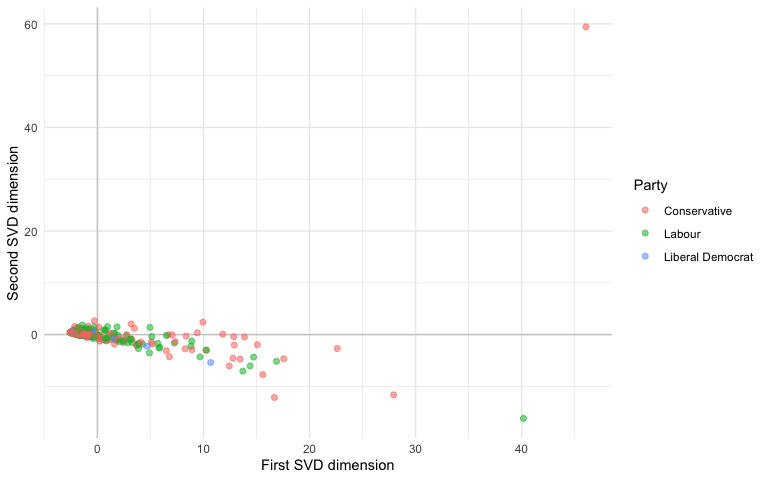
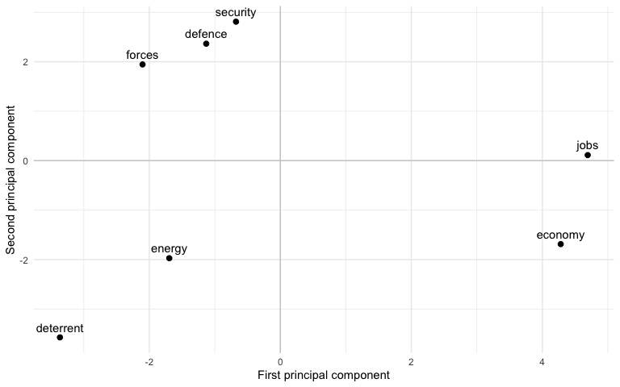

# QTA Lab 03 Answers: Comparing Text Representations with Word Embeddings


## Learning goals

In this lab, you will learn how to:

- compare several representations of text: raw text, document-feature
  matrices, reduced document vectors, and word embeddings;
- compare simple vectors using cosine similarity, Euclidean distance,
  and Jaccard similarity;
- create a feature co-occurrence matrix as the input for a word
  embedding model;
- train a small GloVe word embeddings model with `text2vec`;
- inspect nearest neighbours and cosine similarity between word vectors;
- distinguish sparse document vectors, dense static word vectors, and
  contextual vector representations;
- think critically about what word embeddings can and cannot tell us.

The lecture for today is about comparing representations. In Labs 1 and
2, we worked with text as character data, corpora, tokens, and
document-feature matrices. Today we move through four families of vector
representations:

1.  sparse document vectors, such as count DFMs;
2.  dense document vectors, such as SVD/LSA representations;
3.  dense static word vectors, such as GloVe;
4.  contextual vectors, such as BERT-style and LLM embeddings.

The first three are hands-on in this lab. The fourth is introduced
conceptually, and we return to transformer-based models later in the
course.

## Load packages

``` r
library(dplyr)
library(stringr)
library(ggplot2)
library(quanteda)
library(quanteda.textstats)
library(text2vec)
```

## Import the House of Commons sample

``` r
data_path <- "Data/hc_sample_1945_2025.rds"

hoc <- readRDS(data_path)
```

Let us inspect the data.

``` r
class(hoc)
```

    [1] "data.frame"

``` r
dim(hoc)
```

    [1] 5000   13

``` r
names(hoc)
```

     [1] "date"           "agenda"         "speechnumber"   "speaker"       
     [5] "party"          "party.facts.id" "chair"          "terms"         
     [9] "text"           "speech_url"     "parliament"     "iso3country"   
    [13] "party_raw"     

``` r
hoc <- hoc |>
  mutate(
    year = as.integer(format(date, "%Y")),
    decade = paste0(floor(year / 10) * 10, "s")
  )

hoc |>
  select(date, year, speaker, party, agenda, terms, text) |>
  head(5)
```

            date year             speaker        party
    1 1945-01-16 1945       Mr. Johnstone      Liberal
    2 1945-01-16 1945        Mr. Woodburn       Labour
    3 1945-01-24 1945            Mr. Eden Conservative
    4 1945-01-30 1945 Vice-Admiral Taylor Conservative
    5 1945-01-31 1945       Sir M. Sueter Conservative
                                     agenda terms
    1                          Export Trade    72
    2   Fruit and Vegetables (Short Weight)    53
    3    BRITISH PRISONERS OF WAR, FAR EAST    29
    4               FIGHTING SERVICES (PAY)    30
    5 ROYAL NAVY (GERMAN SUBMARINE WARFARE)    50
                                                                                                                                                                                                                                                                                                                                                                                                                                                                                  text
    1 In addition to discussions with a large number of individual merchants and merchant bankers, many meetings connected with our post-war trade have taken place between my Department and Export Groups, a number of which include merchants among their members. The Consultative Committee which advised my Department on its future practice and procedure included a merchant among its members, and I have invited a merchant to join the Overseas Trade Development Council.
    2                                                                                                                                                      asked the President of the Board of Trade whether he is aware of the difficulties encountered by retail fruit and vegetable merchants owing to the absence of any control over the delivery of short weight; and whether he will take steps to ensure the application of weights and measures regulations in this industry.
    3                                                                                                                                                                                                                                                                          Despite several approaches the Japanese Government have shown themselves completely uninterested in exchanges of prisoners of war and have refused even to contemplate an exchange of sick and wounded.
    4                                                                                                                                                                                                                                                                                                       I do not think the hon. Member has a very good case. For years past the Socialist Members have consistently voted against the Estimates, which include the matter of pay——
    5                                                                                                                                                                 asked the First Lord of the Admiralty, in view of the recent pronouncement by General McNaughton, Canadian War Minister, regarding the number of U-boats in the Atlantic, if he can give an assurance that the Allies have sufficient surface vessels and aircraft to deal with this increased submarine menace.

## Representation 1: raw text

The first representation is the text as a character vector. This is the
form in which a human reader, and often an LLM, encounters the speech.

``` r
speech_text <- hoc$text[1:3]

speech_text
```

    [1] "In addition to discussions with a large number of individual merchants and merchant bankers, many meetings connected with our post-war trade have taken place between my Department and Export Groups, a number of which include merchants among their members. The Consultative Committee which advised my Department on its future practice and procedure included a merchant among its members, and I have invited a merchant to join the Overseas Trade Development Council."
    [2] "asked the President of the Board of Trade whether he is aware of the difficulties encountered by retail fruit and vegetable merchants owing to the absence of any control over the delivery of short weight; and whether he will take steps to ensure the application of weights and measures regulations in this industry."                                                                                                                                                     
    [3] "Despite several approaches the Japanese Government have shown themselves completely uninterested in exchanges of prisoners of war and have refused even to contemplate an exchange of sick and wounded."                                                                                                                                                                                                                                                                         

``` r
str_length(speech_text)
```

    [1] 464 315 199

Raw text keeps word order, punctuation, and context. It is
interpretable, but it is not immediately suitable for most statistical
models.

## Representation 2: a document-feature matrix

A document-feature matrix, or DFM, represents documents as rows and
features as columns. The cell values count how often each feature occurs
in each document.

``` r
hoc_corpus <- corpus(
  hoc,
  text_field = "text"
)

ndoc(hoc_corpus)
```

    [1] 5000

We tokenize the corpus, remove punctuation, remove stopwords, and
lower-case all tokens.

``` r
hoc_tokens <- tokens(
  hoc_corpus,
  what = "word",
  remove_punct = TRUE,
  remove_symbols = TRUE,
  remove_numbers = TRUE,
  remove_url = TRUE,
  remove_separators = TRUE,
  split_hyphens = FALSE
) |>
  tokens_tolower() |>
  tokens_remove(stopwords("en"), padding = FALSE)
```

Now we create a DFM and inspect the most frequent features.

``` r
hoc_dfm <- dfm(hoc_tokens)

dim(hoc_dfm)
```

    [1]  5000 29149

``` r
topfeatures(hoc_dfm, 25)
```

           hon government      right     member        can     people        one 
          6569       3213       2780       2428       2423       2296       2288 
        friend   minister      house       made       many    members       time 
          2279       2049       2000       1600       1537       1515       1503 
          bill       said  gentleman        may       make  secretary        now 
          1484       1484       1372       1351       1343       1340       1322 
         state         mr         us        say 
          1314       1310       1247       1237 

The DFM is useful because it gives us a transparent representation of
word frequencies. For example, we can group the DFM by party and inspect
selected features.

``` r
hoc_dfm_party <- dfm_group(
  hoc_dfm,
  groups = docvars(hoc_dfm, "party")
)

dfm_select(
  hoc_dfm_party,
  pattern = c("economy", "economic", "health", "defence", "security")
)
```

    Document-feature matrix of: 23 documents, 5 features (55.65% sparse) and 4 docvars.
                                        features
    docs                                 health defence security economy economic
      Alliance Party of Northern Ireland      0       0        1       0        0
      Communist Party of Great Britain        0       0        0       0        0
      Conservative                          270     139      110     123      158
      Democratic Unionist Party              15       0        7       4        0
      Green Party of England and Wales        1       0        0       0        0
      Independent                             2       1        1       0        0
    [ reached max_ndoc ... 17 more documents ]

The DFM treats each feature as independent. It knows that `economy` and
`economic` are different columns, but it does not know that they are
semantically related.

## Step 1: sparse count vectors

The DFM is already a vector representation. Each speech is represented
by a long vector of feature counts. Because most speeches use only a
small subset of the full vocabulary, this representation is
**high-dimensional** and **sparse**.

This is useful because it is transparent: if a value is high, we know
exactly which word is responsible. It is limited because related words
such as `economy`, `economic`, and `growth` still live in separate
columns.

## Comparing vectors by hand

Before we compare real speeches, let us use the small example from the
lecture. Suppose two short speeches are represented by three binary
features:

``` r
a <- c(security = 1, forces = 1, energy = 0)
b <- c(security = 1, forces = 0, energy = 1)

toy_vectors <- rbind(
  defence_speech = a,
  energy_speech = b
)

toy_vectors
```

                   security forces energy
    defence_speech        1      1      0
    energy_speech         1      0      1

The code below calculates three ways to compare the same two vectors.

- **Cosine similarity** asks whether the vectors point in a similar
  direction.
- **Euclidean distance** asks how far apart the two points are.
- **Jaccard similarity** asks how much overlap there is between the
  present features.

``` r
dot_product <- sum(a * b)
length_a <- sqrt(sum(a^2))
length_b <- sqrt(sum(b^2))

cosine_similarity <- dot_product / (length_a * length_b)
euclidean_distance <- sqrt(sum((a - b)^2))
jaccard_similarity <- sum(a > 0 & b > 0) / sum(a > 0 | b > 0)

tibble(
  metric = c("cosine similarity", "Euclidean distance", "Jaccard similarity"),
  value = c(cosine_similarity, euclidean_distance, jaccard_similarity)
)
```

    # A tibble: 3 × 2
      metric             value
      <chr>              <dbl>
    1 cosine similarity  0.5  
    2 Euclidean distance 1.41 
    3 Jaccard similarity 0.333

The same vectors can therefore look more or less similar depending on
the question we ask. For embeddings, cosine similarity is usually the
default starting point.

## Step 2: dense document vectors

SVD, also known as latent semantic analysis in this context, compresses
a sparse document-feature matrix into a smaller number of dense
dimensions.

The code below uses a sample of speeches so that the example runs
quickly. We also trim rare and extremely common terms before applying
SVD. This keeps the matrix smaller and removes features that are less
useful for this demonstration.

``` r
set.seed(20260706)

sample_doc_ids <- sample(seq_len(ndoc(hoc_dfm)), size = 500)

hoc_dfm_sample <- hoc_dfm[sample_doc_ids, ] |>
  dfm_trim(
    min_termfreq = 10,
    max_docfreq = 0.5,
    docfreq_type = "prop"
  )

dim(hoc_dfm_sample)
```

    [1]  500 1056

The next block creates the reduced document representation. It does four
things:

1.  `as.matrix()` converts the sparse DFM into a regular numeric matrix.
    SVD needs this matrix form.
2.  `scale(..., center = TRUE, scale = FALSE)` subtracts the average
    value of each feature. This means the SVD focuses on how documents
    differ from the average pattern of word use, rather than on the
    overall frequency of common terms.
3.  `svd(..., nu = 2, nv = 0)` asks R to keep the first two document
    dimensions. These are the two strongest patterns of variation among
    the sampled speeches.
4.  `svd_model$u[, 1] * svd_model$d[1]` and
    `svd_model$u[, 2] * svd_model$d[2]` turn those two dimensions into
    coordinates for each document.

We use two dimensions because they can be plotted. In a research
project, we would usually keep more dimensions and validate the
representation more carefully.

``` r
svd_input <- as.matrix(hoc_dfm_sample)
svd_input <- scale(svd_input, center = TRUE, scale = FALSE)

svd_model <- svd(svd_input, nu = 2, nv = 0)

svd_documents <- data.frame(
  document = docnames(hoc_dfm_sample),
  dim1 = svd_model$u[, 1] * svd_model$d[1],
  dim2 = svd_model$u[, 2] * svd_model$d[2],
  party = docvars(hoc_dfm_sample, "party")
)

head(svd_documents)
```

      document       dim1       dim2            party
    1  text113 -2.2952656  0.4289807           Labour
    2 text3565  9.6647275 -4.3117743           Labour
    3 text3264 -1.1196747  0.2588816 Liberal Democrat
    4 text1811 -2.3561028  0.2816947           Labour
    5 text2235 -0.8906022  1.6496892     Conservative
    6  text192 -1.8924029  0.5103149           Labour

``` r
svd_documents |>
  filter(party %in% c("Conservative", "Labour", "Liberal Democrat")) |>
  ggplot(aes(x = dim1, y = dim2, colour = party)) +
  geom_hline(yintercept = 0, colour = "grey80") +
  geom_vline(xintercept = 0, colour = "grey80") +
  geom_point(alpha = 0.55, size = 1.8) +
  labs(
    x = "First SVD dimension",
    y = "Second SVD dimension",
    colour = "Party"
  ) +
  theme_minimal()
```



Count DFMs are sparse document vectors. SVD turns sparse document
vectors into dense document vectors. GloVe, which we use next, learns
dense **word** vectors instead.

## Step 3: dense static word vectors

Dense static word-vector models give each word type one vector. In this
lab, we focus on GloVe because it builds directly on word-window
information we can create with `quanteda`.

## Word co-occurrence

First, we trim the vocabulary to features that occur at least 15 times.
This keeps the exercise quick and removes very rare terms.

``` r
features <- hoc_dfm |>
  dfm_trim(min_termfreq = 15) |>
  featnames()

length(features)
```

    [1] 4065

``` r
hoc_tokens_trimmed <- tokens_select(
  hoc_tokens,
  pattern = features,
  padding = TRUE
)
```

Next, we create a feature co-occurrence matrix. This matrix records how
often words appear near each other within a window. We create it because
GloVe uses these local co-occurrence patterns to learn word vectors.

``` r
hoc_fcm <- fcm(
  hoc_tokens_trimmed,
  context = "window",
  window = 5,
  tri = TRUE
)

dim(hoc_fcm)
```

    [1] 4065 4065

We do not need to inspect the whole matrix. It is large, sparse, and
mostly useful here as the input to the embedding model.

## Training a GloVe model

We now train a small GloVe model using `text2vec` (Selivanov et
al. 2022). GloVe learns dense word vectors from the co-occurrence
matrix.

The intuition is simple: words that appear in similar contexts should
end up close to each other in the vector space. If `economy`, `growth`,
and `investment` often occur near similar words, the model should learn
vectors that place them near one another. The model does not know what
these words “mean” in a human sense. It learns a statistical
representation of meaning from patterns of co-occurrence.

The code below does four things:

1.  `set.seed()` makes the results reproducible.
2.  `GlobalVectors$new()` defines the model. `rank = 30` means that each
    word will be represented by 30 numbers. These dimensions are not
    directly interpretable like columns in a DFM; they are latent
    dimensions learned from the data.
3.  `fit_transform()` trains the model on the feature co-occurrence
    matrix. `n_iter = 5` means that the model makes five passes over the
    data.
4.  The final word vector combines a main word vector and a context word
    vector. This is standard for GloVe-style embeddings.

For teaching purposes, we use 30 dimensions and 5 iterations. A larger
corpus, more dimensions, and more iterations will produce better
vectors, but they also take longer to run. These settings are therefore
chosen to make the lab run quickly, not because they are optimal for a
research project.

``` r
set.seed(20260706)

glove <- GlobalVectors$new(
  rank = 30,
  x_max = 10
)

word_vectors_main <- glove$fit_transform(
  hoc_fcm,
  n_iter = 5,
  convergence_tol = 0.01,
  n_threads = 2
)
```

    INFO  [09:53:37.585] epoch 1, loss 0.1050
    INFO  [09:53:37.922] epoch 2, loss 0.0749
    INFO  [09:53:38.244] epoch 3, loss 0.0672
    INFO  [09:53:38.608] epoch 4, loss 0.0629
    INFO  [09:53:39.049] epoch 5, loss 0.0601

``` r
word_vectors_context <- glove$components
word_vectors <- word_vectors_main + t(word_vectors_context)

dim(word_vectors)
```

    [1] 4065   30

Each row is now a word, and each column is a latent vector dimension of
length 30.

``` r
word_vectors[1:5, 1:6]
```

                        [,1]        [,2]        [,3]       [,4]        [,5]
    addition    -0.230016871 -0.39464425 -0.13931976  0.6023242 -0.19629285
    discussions  0.076409458  0.16210982 -0.20173873 -0.3936617 -0.17330606
    large        0.656891913 -0.06725879 -0.03882749  0.6206929  0.16370325
    number       0.966142273  0.19612786  0.02485543  0.4361718  0.41503572
    individual  -0.009735954 -0.23258337 -0.36103534  0.2655375  0.09322459
                       [,6]
    addition    -0.38546407
    discussions  0.11505691
    large       -0.01050624
    number      -0.15750056
    individual   0.12461207

## Inspecting nearest neighbours

Words that appear in similar contexts should have similar vectors. We
can inspect this using cosine similarity. We’ll define a function that
finds the nearest neighbours of a word in the embedding space.

``` r
find_similar_words <- function(word, word_vectors, n = 10) {
  if (!word %in% rownames(word_vectors)) {
    stop(paste0("The word '", word, "' is not in the embedding vocabulary."))
  }

  similarities <- sim2(
    x = word_vectors,
    y = word_vectors[word, , drop = FALSE],
    method = "cosine",
    norm = "l2"
  )

  similarities <- similarities[, 1]
  similarities <- similarities[names(similarities) != word]

  similarities |>
    sort(decreasing = TRUE) |>
    head(n)
}
```

Let us inspect several words from the lecture example.

``` r
find_similar_words("security", word_vectors)
```

         social       civil     defence    services     justice  department 
      0.7445620   0.6655104   0.6439987   0.6284435   0.6242465   0.6213333 
        service   transport      forces environment 
      0.6197864   0.5988069   0.5918252   0.5738976 

``` r
find_similar_words("defence", word_vectors)
```

       security     foreign   announced     affairs environment   statement 
      0.6439987   0.6056380   0.5915898   0.5847372   0.5633609   0.5490588 
          state        home   estimates   secretary 
      0.5434971   0.5433466   0.5383302   0.5313182 

``` r
find_similar_words("energy", word_vectors)
```

     efficiency      atomic    ambition      crisis sympathetic    industry 
      0.7186041   0.6615007   0.5654728   0.5643933   0.5316631   0.5131484 
      admission     expects     freight    activity 
      0.5115146   0.4957573   0.4849358   0.4827828 

The results are not definitions. They show words that occur in similar
local contexts in this sample. This is useful for exploration,
dictionary development, and validation, but it should always be checked
against the underlying texts.

## Comparing word vectors

Cosine similarity can also compare a small set of selected words.

``` r
comparison_words <- c(
  "security",
  "forces",
  "defence",
  "deterrent",
  "energy",
  "economy",
  "jobs"
)

comparison_words <- intersect(comparison_words, rownames(word_vectors))

word_similarity <- sim2(
  x = word_vectors[comparison_words, , drop = FALSE],
  y = word_vectors[comparison_words, , drop = FALSE],
  method = "cosine",
  norm = "l2"
)

round(word_similarity, 2)
```

              security forces defence deterrent energy economy  jobs
    security      1.00   0.59    0.64      0.14   0.44    0.25  0.35
    forces        0.59   1.00    0.38      0.47   0.40    0.15  0.39
    defence       0.64   0.38    1.00      0.19   0.47    0.21  0.22
    deterrent     0.14   0.47    0.19      1.00   0.45    0.02 -0.03
    energy        0.44   0.40    0.47      0.45   1.00    0.16  0.22
    economy       0.25   0.15    0.21      0.02   0.16    1.00  0.53
    jobs          0.35   0.39    0.22     -0.03   0.22    0.53  1.00

This kind of comparison is different from a DFM comparison. In a DFM,
`economy` and `economic` are separate count variables. In an embedding
model, they can be close in vector space because they appear in related
contexts.

## Counts and embeddings answer different questions

Before interpreting embedding similarities, it is useful to return to
counts. Counts tell us whether terms occur often enough to support
analysis.

``` r
security_terms <- c(
  "security",
  "forces",
  "defence",
  "deterrent",
  "energy",
  "economy",
  "jobs"
)

security_terms <- intersect(security_terms, featnames(hoc_dfm))

textstat_frequency(
  dfm_select(hoc_dfm, pattern = security_terms)
) |>
  select(feature, frequency, rank, docfreq)
```

        feature frequency rank docfreq
    1   defence       332    1     162
    2   economy       274    2     161
    3  security       266    3     173
    4    forces       214    4     119
    5      jobs       205    5     127
    6    energy       187    6      97
    7 deterrent        34    7      24

The embedding model asks a different question: which terms are used in
similar local contexts? We already calculated this with cosine
similarity in the previous section. The matrix below is useful for
exploration, but it is not a final interpretation.

``` r
round(word_similarity, 2)
```

              security forces defence deterrent energy economy  jobs
    security      1.00   0.59    0.64      0.14   0.44    0.25  0.35
    forces        0.59   1.00    0.38      0.47   0.40    0.15  0.39
    defence       0.64   0.38    1.00      0.19   0.47    0.21  0.22
    deterrent     0.14   0.47    0.19      1.00   0.45    0.02 -0.03
    energy        0.44   0.40    0.47      0.45   1.00    0.16  0.22
    economy       0.25   0.15    0.21      0.02   0.16    1.00  0.53
    jobs          0.35   0.39    0.22     -0.03   0.22    0.53  1.00

## Plotting selected word vectors

We can also make a simple two-dimensional plot of selected word vectors.
This uses principal component analysis (PCA) to project the
30-dimensional vectors into two dimensions. The plot is useful for
intuition, but the distances in the plot are only an approximation of
the full embedding space.

The projection also depends on which terms we select. The underlying
30-dimensional word vectors do not change, but the two PCA axes are
estimated from the selected terms. If we add or remove terms, the plot
can rotate, stretch, or make clusters look stronger or weaker. Use this
plot as an exploratory visualisation, not as final evidence.

``` r
plot_terms <- intersect(security_terms, rownames(word_vectors))

plot_pca <- prcomp(
  word_vectors[plot_terms, , drop = FALSE],
  scale. = TRUE
)

plot_data <- data.frame(
  word = plot_terms,
  x = plot_pca$x[, 1],
  y = plot_pca$x[, 2]
)

ggplot(plot_data, aes(x = x, y = y, label = word)) +
  geom_hline(yintercept = 0, colour = "grey80") +
  geom_vline(xintercept = 0, colour = "grey80") +
  geom_point(size = 2) +
  geom_text(vjust = -0.7, check_overlap = TRUE) +
  labs(
    x = "First principal component",
    y = "Second principal component"
  ) +
  theme_minimal()
```



This gives us a useful rule of thumb. Use BoW/DFM representations when
you want transparent counts or document-level features. Use embeddings
when you want to explore contextual similarity between words. In both
cases, the representation is a measurement choice that needs validation.

## Step 4: contextual vector representations

GloVe, word2vec, and FastText are **static** word-vector models. They
give each word type one vector. In our example, `security` gets one
representation even though it can be used in defence, energy, economic,
or public-order contexts.

Transformer-based models work differently. BERT-style models and modern
LLMs create **contextual** vectors. This means that a token’s vector
depends on the sentence or document in which it appears.

| Representation | Example | What changes? |
|----|----|----|
| Static word vector | GloVe vector for `security` | one vector for the word type |
| Contextual token vector | BERT vector for `security` in a sentence | vector changes with context |
| Document embedding | embedding for a whole speech | one vector summarising a text |

This matters for political text. A static embedding blends all uses of
`security` into one vector. A contextual model can represent `security`
differently when it appears near `deterrent` and `forces` than when it
appears near `energy`, `economy`, and `jobs`.

We will not train transformer embeddings in this lab because doing so
adds extra dependencies and computational overhead. But the conceptual
link is important: modern LLM-based methods still depend on
representation choices. They simply use richer, contextual
representations than the count-based and GloVe models we have built
here.

## Comparing representations

Let us put the three representations side by side.

- Raw text preserves order and context, but is hard to use directly in
  standard statistical models.
- Count DFMs are transparent and easy to model, but treat features as
  independent columns.
- SVD can turn sparse document vectors into lower-dimensional dense
  document vectors.
- Static word embeddings encode contextual similarity between word
  types, but their dimensions are harder to interpret and need careful
  validation.
- Contextual embeddings allow the same word to have different
  representations in different contexts, but they are computationally
  heavier and less transparent.

## Practice exercises

1.  Inspect the nearest neighbours of `security`, `energy`, and
    `defence`. Which neighbours look substantively plausible? Which ones
    look surprising?

``` r
find_similar_words("security", word_vectors)
```

         social       civil     defence    services     justice  department 
      0.7445620   0.6655104   0.6439987   0.6284435   0.6242465   0.6213333 
        service   transport      forces environment 
      0.6197864   0.5988069   0.5918252   0.5738976 

``` r
find_similar_words("energy", word_vectors)
```

     efficiency      atomic    ambition      crisis sympathetic    industry 
      0.7186041   0.6615007   0.5654728   0.5643933   0.5316631   0.5131484 
      admission     expects     freight    activity 
      0.5115146   0.4957573   0.4849358   0.4827828 

``` r
find_similar_words("defence", word_vectors)
```

       security     foreign   announced     affairs environment   statement 
      0.6439987   0.6056380   0.5915898   0.5847372   0.5633609   0.5490588 
          state        home   estimates   secretary 
      0.5434971   0.5433466   0.5383302   0.5313182 

``` r
# Interpretation:
# - Plausible neighbours are words that fit the same parliamentary context,
#   for example defence-related words near "security" or economic/infrastructure
#   words near "energy".
# - Surprising neighbours are not necessarily errors. They may reflect the
#   particular mix of speeches in the teaching sample, procedural language, or
#   the fact that this is a small model trained for speed.
```

2.  Create a cosine similarity matrix for the words `health`, `nhs`,
    `hospital`, `care`, and `patients`.

``` r
health_words <- c(
  "health",
  "nhs",
  "hospital",
  "care",
  "patients"
)

health_words <- intersect(health_words, rownames(word_vectors))

health_similarity <- sim2(
  x = word_vectors[health_words, , drop = FALSE],
  y = word_vectors[health_words, , drop = FALSE],
  method = "cosine",
  norm = "l2"
)

round(health_similarity, 2)
```

             health  nhs hospital care patients
    health     1.00 0.66     0.47 0.75     0.44
    nhs        0.66 1.00     0.54 0.53     0.61
    hospital   0.47 0.54     1.00 0.32     0.42
    care       0.75 0.53     0.32 1.00     0.54
    patients   0.44 0.61     0.42 0.54     1.00

3.  Pick one result from the embedding model that looks plausible and
    one that looks odd. Use `kwic()` on `hoc_tokens` to inspect the
    original contexts.

``` r
find_similar_words("security", word_vectors)
```

         social       civil     defence    services     justice  department 
      0.7445620   0.6655104   0.6439987   0.6284435   0.6242465   0.6213333 
        service   transport      forces environment 
      0.6197864   0.5988069   0.5918252   0.5738976 

``` r
# Suppose we want to inspect whether "security" is being used in defence,
# energy, or economic contexts. KWIC lets us return to the original text.
kwic_security <- kwic(
  hoc_tokens,
  pattern = "security",
  window = 8
)

head(kwic_security, 12)
```

    Keyword-in-context with 12 matches.               
       [text24, 20]
     [text246, 367]
     [text246, 663]
       [text355, 4]
     [text399, 199]
     [text399, 224]
     [text471, 115]
     [text471, 127]
      [text524, 60]
      [text524, 70]
      [text563, 22]
       [text770, 8]
                                                                                    
         superior officials maintaining contact governments home basis international
                               full account already given house first raise question
     deliberations current assembly without taking account observance non-observance
                                                               view interest matters
                                  now finance bill aims merely social justice social
                                  badly done hon members opposite still cling social
                         draw comparison many hon members pay lip-service collective
                   united nations organisation favour comes fighting back collective
                                occupying lessees long leases rent control means get
                                    regard houses own—i go deal done moment—will get
                        canned peaches fruits included among imports financed mutual
                             said statement reply questions tuesday reasons national
                 
     | security |
     | security |
     | security |
     | security |
     | security |
     | security |
     | security |
     | security |
     | security |
     | security |
     | security |
     | security |
                                                                             
     essential strengthening whole thing                                     
     council advanced initiative took initiative assembly sponsoring getting 
     council truce must make clear consideration giving establishment        
     particularly demonstrated opposition fact contrary public interest great
     national economic planning idea somehow using taxable capacity          
     well social justice given masses people country say                     
     favour speeches made united nations organisation favour comes           
     like many pay lip-service monarchy feel unpopular comes                 
     tenure regard houses own—i go deal done moment—will                     
     tenure areas except pockets wales housing shortage passes               
     act whole matter examination position make statement present            
     unable pass house detailed information precise type design              

``` r
# A plausible result should be supported by these contexts. For example, if a
# neighbour points toward defence, we should see examples where "security"
# appears near terms such as "defence", "forces", "deterrent", or "military".
# If a neighbour looks odd, KWIC helps us decide whether it reflects a real
# usage pattern or noise in the small embedding model.
```

4.  In one paragraph, explain when you would prefer a DFM and when you
    would prefer an embedding model for a social science research
    question.

``` r
# I would prefer a DFM when my research question is about transparent document-
# level measurement: how often parties mention a term, which speeches contain
# a keyword, or whether a dictionary category changes over time. I would prefer
# an embedding model when my question is about contextual similarity: whether
# words are used in similar surroundings, whether a concept such as "security"
# is closer to defence or energy language, or whether candidate dictionary terms
# seem semantically related. In both cases, the representation is not neutral:
# it determines what information is preserved and what must be validated.
```
