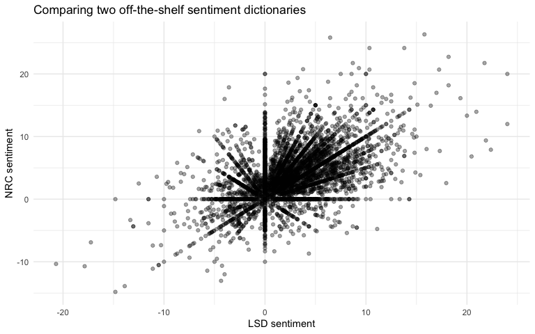
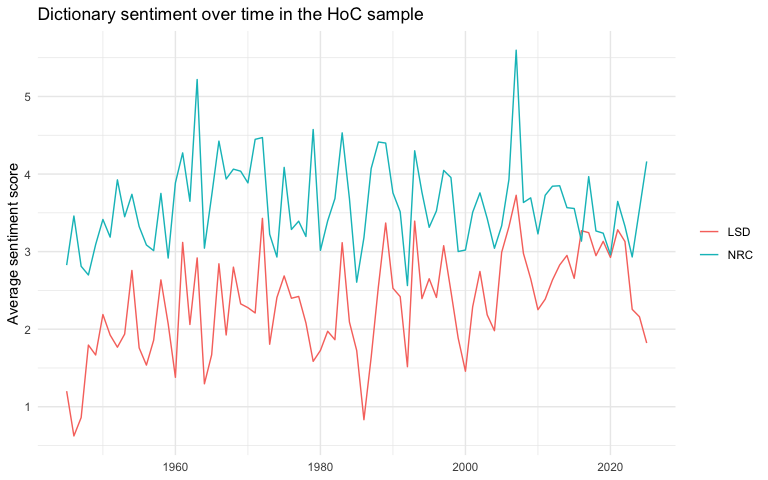
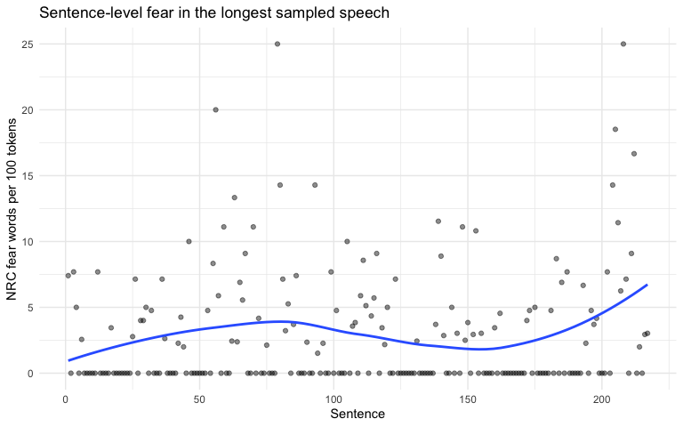
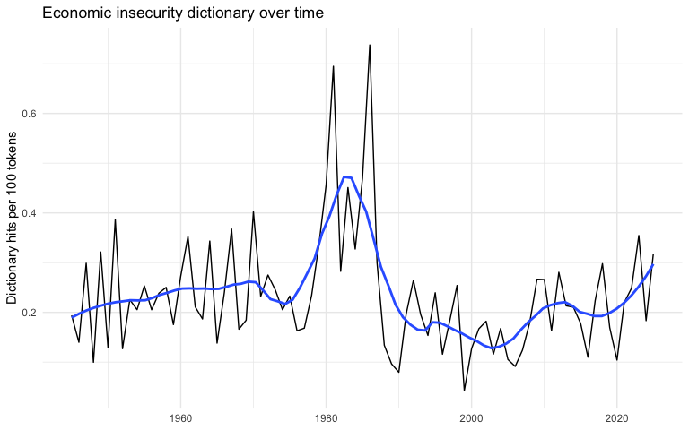

# QTA Lab 04 Answers: Dictionary methods with House of Commons speeches


## Learning goals

In this lab, you will learn how to:

- apply off-the-shelf dictionaries to House of Commons speeches;
- calculate dictionary-based rates rather than raw counts;
- compare two sentiment dictionaries;
- build, apply, and adapt a small economic insecurity dictionary;
- inspect false positives and false negatives using KWIC;
- use static embeddings and LLM prompts as sources of candidate terms;
- report dictionary choices transparently.

Dictionary methods are transparent: we know which words are counted.
That is their great strength. Their weakness is that word lists rarely
map perfectly onto a concept, especially in political language where the
same word can mean different things in different contexts. Today we use
economic insecurity as the running example.

## Load packages

If you have not installed `quanteda.sentiment`, you may need to install
it from GitHub:

``` r
# install.packages("remotes")
# remotes::install_github("quanteda/quanteda.sentiment")
```

``` r
library(dplyr)
library(stringr)
library(ggplot2)
library(quanteda)
library(quanteda.sentiment)
```

## Read the House of Commons sample

``` r
data_path <- "Data/hc_sample_1945_2025.rds"

hoc <- readRDS(data_path)

hoc <- hoc |>
  mutate(year = as.integer(format(date, "%Y")))
```

``` r
hoc <- hoc |>
  select(date, year, speaker, party, agenda, terms, text) 
```

## Create a corpus, tokens, and DFM

We first create a `quanteda` corpus. Then we tokenize the speeches and
create a document-feature matrix.

``` r
hoc_corpus <- corpus(
  hoc,
  text_field = "text"
)

ndoc(hoc_corpus)
```

    [1] 5000

For the sentiment dictionary, we also compound simple negation patterns
such as `not good`. This is a simplified approach, but it demonstrates
that dictionary methods often require preprocessing decisions.

``` r
hoc_tokens <- tokens(
  hoc_corpus,
  what = "word",
  remove_punct = TRUE,
  remove_symbols = TRUE,
  remove_numbers = FALSE,
  remove_url = TRUE,
  remove_separators = TRUE,
  split_hyphens = FALSE,
  padding = FALSE
) |>
  tokens_tolower()

hoc_tokens <- tokens_compound(
  hoc_tokens,
  pattern = phrase("not *")
)

hoc_dfm <- dfm(hoc_tokens)

dim(hoc_dfm)
```

    [1]  5000 32118

``` r
topfeatures(
  dfm_select(hoc_dfm, pattern = "not_*", valuetype = "glob"),
  n = 10
)
```

       not_be  not_have  not_only   not_the     not_a    not_to  not_want not_think 
          514       327       300       284       254       218       183       182 
     not_been  not_just 
          180       160 

## Counts and rates

House of Commons speeches differ greatly in length. If we only count
dictionary hits, longer speeches have more opportunities to match
dictionary terms. For most comparisons, we therefore use a rate:

`100 * dictionary hits / number of tokens`

This gives us dictionary hits per 100 tokens.

``` r
docvars(hoc_dfm) |>
  summarise(
    min_terms = min(terms),
    median_terms = median(terms),
    max_terms = max(terms)
  )
```

      min_terms median_terms max_terms
    1        20           72      4844

## Off-the-shelf dictionaries

The `quanteda.sentiment` package contains several off-the-shelf
sentiment dictionaries. We will use:

- the Lexicoder Sentiment Dictionary, `data_dictionary_LSD2015`;
- the NRC Word-Emotion Association Lexicon, `data_dictionary_NRC`.

``` r
summary(data_dictionary_LSD2015)
```

                 Length Class  Mode     
    negative     2858   -none- character
    positive     1709   -none- character
    neg_positive 1721   -none- character
    neg_negative 2860   -none- character

``` r
print(data_dictionary_LSD2015, max_nval = 5)
```

    Dictionary object with 4 key entries.
    Polarities: pos = "positive", "neg_negative"; neg = "negative", "neg_positive" 
    - [negative]:
      - a lie, abandon*, abas*, abattoir*, abdicat* [ ... and 2,853 more ]
    - [positive]:
      - ability*, abound*, absolv*, absorbent*, absorption* [ ... and 1,704 more ]
    - [neg_positive]:
      - best not, better not, no damag*, no no, not ability* [ ... and 1,716 more ]
    - [neg_negative]:
      - not a lie, not abandon*, not abas*, not abattoir*, not abdicat* [ ... and 2,855 more ]

### Lexicoder Sentiment Dictionary

We apply the dictionary using `dfm_lookup()`.

``` r
hoc_lsd <- dfm_lookup(
  hoc_dfm,
  dictionary = data_dictionary_LSD2015
)

head(hoc_lsd)
```

    Document-feature matrix of: 6 documents, 4 features (58.33% sparse) and 6 docvars.
           features
    docs    negative positive neg_positive neg_negative
      text1        0        1            0            0
      text2        1        1            0            0
      text3        6        0            0            0
      text4        1        1            0            0
      text5        2        2            0            0
      text6        6       13            0            0

``` r
featnames(hoc_lsd)
```

    [1] "negative"     "positive"     "neg_positive" "neg_negative"

``` r
docvars(hoc_dfm) |>
  mutate(
    docname = docnames(hoc_dfm),
    neg_positive = as.numeric(hoc_lsd[, "neg_positive"]),
    neg_negative = as.numeric(hoc_lsd[, "neg_negative"])
  ) |>
  filter(neg_positive > 0 | neg_negative > 0) |>
  select(docname, date, speaker, party, agenda, neg_positive, neg_negative) |>
  head(10)
```

       docname       date
    1   text21 1945-06-05
    2   text39 1945-10-24
    3   text54 1945-11-28
    4   text62 1945-12-20
    5   text72 1946-03-15
    6   text81 1946-05-13
    7   text87 1946-05-30
    8   text96 1946-07-29
    9  text116 1946-12-05
    10 text122 1946-12-17
                                                          speaker        party
    1                                                  Mr. Turton Conservative
    2                                                Mr. Marquand       Labour
    3                                                  Mr. Eccles Conservative
    4  The Financial Secretary to the Treasury (Mr. Glenvil Hall)       Labour
    5                                                   Mr. Paget       Labour
    6                                           Mr. Glenvil Hall:       Labour
    7                                          The Prime Minister       Labour
    8                                                    Mr. Hynd       Labour
    9                                               Mr. Churchill Conservative
    10                               Lieut.-Commander Braithwaite Conservative
                                                                                               agenda
    1                                                          HOUSING (TEMPORARY ACCOMMODATION) BILL
    2                                                              CLOTHING COUPONS (AMERICAN BRIDES)
    3  Clause 28. — (Relief not to be given for deficiencies of profits occurring after end of 1946.)
    4                                                     CIVIL SERVICE (CONTROL OF EMPLOYMENT) ORDER
    5                                                    GOVERNMENTDEPARTMENTS(CORRESPONDENCE DELAYS)
    6                                                              COAL INDUSTRY NATIONALISATION BILL
    7                                                                                STATE ACCOUNTING
    8                                                                             GERMANY AND AUSTRIA
    9                                                                           BUSINESS OF THE HOUSE
    10                                                           LATE SITTINGS (TRANSPORT FACILITIES)
       neg_positive neg_negative
    1             1            0
    2             1            0
    3             1            0
    4             0            1
    5             1            0
    6             0            1
    7             1            0
    8             2            1
    9             1            0
    10            1            0

``` r
lsd_negation_patterns <- data_dictionary_LSD2015[c(
  "neg_positive",
  "neg_negative"
)] |>
  as.list() |>
  unlist() |>
  gsub(pattern = " ", replacement = "_", fixed = TRUE)

kwic(
  hoc_tokens,
  pattern = lsd_negation_patterns,
  valuetype = "glob",
  window = 4
) |>
  as.data.frame() |>
  select(docname, pre, keyword, post) |>
  head(10)
```

       docname                         pre           keyword
    1   text21          silkin said he was    not_interested
    2   text39           country and it is     not_desirable
    3   text54               is that it is          not_fair
    4   text62            of this house is not_unfortunately
    5   text72                in mind i do          not_like
    6   text81 individual and companies do           not_die
    7   text87              i confess i am         not_clear
    8   text96   be extremely difficult if    not_impossible
    9   text96             that basis i do         not_agree
    10  text96          of internees it is          not_true
                          post
    1         in what is going
    2  to give more favourable
    3           for the tax to
    4     under my control the
    5  disagreeing with my hon
    6     and pay death duties
    7          what was in the
    8  636 the present effects
    9       with the right hon
    10        as i believe the

The LSD dictionary includes positive and negative words, as well as
negated positive and negated negative words. We create a sentiment score
as:

`100 * (positive words - negative words) / total tokens`

``` r
docvars(hoc_dfm, "lsd_negative") <- as.numeric(hoc_lsd[, "negative"]) +
  as.numeric(hoc_lsd[, "neg_positive"])

docvars(hoc_dfm, "lsd_positive") <- as.numeric(hoc_lsd[, "positive"]) +
  as.numeric(hoc_lsd[, "neg_negative"])

docvars(hoc_dfm, "lsd_sentiment") <- 100 *
  (docvars(hoc_dfm, "lsd_positive") - docvars(hoc_dfm, "lsd_negative")) /
  ntoken(hoc_dfm)

docvars(hoc_dfm) |>
  select(date, speaker, party, lsd_positive, lsd_negative, lsd_sentiment) |>
  head(10)
```

             date             speaker        party lsd_positive lsd_negative
    1  1945-01-16       Mr. Johnstone      Liberal            1            0
    2  1945-01-16        Mr. Woodburn       Labour            1            1
    3  1945-01-24            Mr. Eden Conservative            0            6
    4  1945-01-30 Vice-Admiral Taylor Conservative            1            1
    5  1945-01-31       Sir M. Sueter Conservative            2            2
    6  1945-02-14        Mr. Johnston       Labour           13            6
    7  1945-02-20     Sir J. Anderson     National            3            6
    8  1945-02-21         Major Mills Conservative            7            0
    9  1945-02-22           Mr. Viant       Labour            1            1
    10 1945-02-23      Earl Winterton Conservative            2            2
       lsd_sentiment
    1       1.408451
    2       0.000000
    3     -20.689655
    4       0.000000
    5       0.000000
    6       1.467505
    7      -2.586207
    8      14.583333
    9       0.000000
    10      0.000000

### NRC sentiment and emotion dictionary

The NRC dictionary contains both positive/negative categories and
emotion categories such as fear, trust, anger, and joy.

``` r
hoc_nrc <- dfm_lookup(
  hoc_dfm,
  dictionary = data_dictionary_NRC
)

head(hoc_nrc)
```

    Document-feature matrix of: 6 documents, 10 features (20.00% sparse) and 9 docvars.
           features
    docs    anger anticipation disgust fear joy negative positive sadness surprise
      text1     0            1       0    1   0        0        6       0        0
      text2     1            4       2    3   1        4        3       4        1
      text3     0            0       1    2   0        5        2       3        0
      text4     1            2       1    2   2        2        3       2        1
      text5     1            1       1    2   1        3        4       0        1
      text6     3            9       3    4   3        9       29       6        0
           features
    docs    trust
      text1     8
      text2     4
      text3     1
      text4     2
      text5     4
      text6    10

``` r
featnames(hoc_nrc)
```

     [1] "anger"        "anticipation" "disgust"      "fear"         "joy"         
     [6] "negative"     "positive"     "sadness"      "surprise"     "trust"       

``` r
docvars(hoc_dfm, "nrc_negative") <- as.numeric(hoc_nrc[, "negative"])
docvars(hoc_dfm, "nrc_positive") <- as.numeric(hoc_nrc[, "positive"])
docvars(hoc_dfm, "nrc_fear") <- as.numeric(hoc_nrc[, "fear"])

docvars(hoc_dfm, "nrc_sentiment") <- 100 *
  (docvars(hoc_dfm, "nrc_positive") - docvars(hoc_dfm, "nrc_negative")) /
  ntoken(hoc_dfm)

docvars(hoc_dfm, "nrc_fear_rate") <- 100 *
  docvars(hoc_dfm, "nrc_fear") /
  ntoken(hoc_dfm)

docvars(hoc_dfm) |>
  select(date, speaker, party, nrc_sentiment, nrc_fear_rate) |>
  head(10)
```

             date             speaker        party nrc_sentiment nrc_fear_rate
    1  1945-01-16       Mr. Johnstone      Liberal      8.450704     1.4084507
    2  1945-01-16        Mr. Woodburn       Labour     -1.886792     5.6603774
    3  1945-01-24            Mr. Eden Conservative    -10.344828     6.8965517
    4  1945-01-30 Vice-Admiral Taylor Conservative      3.448276     6.8965517
    5  1945-01-31       Sir M. Sueter Conservative      2.040816     4.0816327
    6  1945-02-14        Mr. Johnston       Labour      4.192872     0.8385744
    7  1945-02-20     Sir J. Anderson     National     -4.310345     4.3103448
    8  1945-02-21         Major Mills Conservative     10.416667     0.0000000
    9  1945-02-22           Mr. Viant       Labour     -3.225806     0.0000000
    10 1945-02-23      Earl Winterton Conservative      4.838710     1.6129032

## Comparing sentiment dictionaries

The two dictionaries are intended to measure related constructs, but
they are not identical. Let us inspect the correlation and scatterplot.

``` r
cor(
  docvars(hoc_dfm, "lsd_sentiment"),
  docvars(hoc_dfm, "nrc_sentiment"),
  use = "complete.obs"
)
```

    [1] 0.5081207

``` r
sentiment_comparison <- ggplot(
  docvars(hoc_dfm),
  aes(x = lsd_sentiment, y = nrc_sentiment)
) +
  geom_point(alpha = 0.35) +
  labs(
    x = "LSD sentiment",
    y = "NRC sentiment",
    title = "Comparing two off-the-shelf sentiment dictionaries"
  ) +
  theme_minimal()

sentiment_comparison
```



The correlation may be positive, but disagreement is substantively
important. It tells us that dictionary choice matters.

## Sentiment over time

Because the sample is approximately balanced by year, we can use it to
create simple yearly summaries. These are teaching examples rather than
population estimates.

``` r
sentiment_year <- docvars(hoc_dfm) |>
  group_by(year) |>
  summarise(
    lsd_sentiment = mean(lsd_sentiment, na.rm = TRUE),
    nrc_sentiment = mean(nrc_sentiment, na.rm = TRUE),
    nrc_fear_rate = mean(nrc_fear_rate, na.rm = TRUE),
    .groups = "drop"
  )

ggplot(sentiment_year, aes(x = year)) +
  geom_line(aes(y = lsd_sentiment, colour = "LSD")) +
  geom_line(aes(y = nrc_sentiment, colour = "NRC")) +
  labs(
    x = NULL,
    y = "Average sentiment score",
    colour = NULL,
    title = "Dictionary sentiment over time in the HoC sample"
  ) +
  theme_minimal()
```



## A sentence-level example

Dictionary methods can be applied at different units of analysis. Let us
select the longest speech in the sample, reshape it to sentences, and
inspect the sentence-level NRC fear rate.

``` r
longest_speech <- corpus_subset(
  hoc_corpus,
  terms == max(terms)
)

docvars(longest_speech) |>
  select(date, speaker, party, agenda, terms)
```

            date     speaker  party                      agenda terms
    1 1995-07-12 Clive Betts Labour Radioactive Waste [Prayers]  4844

``` r
longest_speech_sentences <- corpus_reshape(
  longest_speech,
  to = "sentences"
)

ndoc(longest_speech_sentences)
```

    [1] 217

``` r
sentence_tokens <- tokens(
  longest_speech_sentences,
  what = "word",
  remove_punct = TRUE,
  remove_symbols = TRUE,
  remove_numbers = FALSE,
  remove_url = TRUE,
  remove_separators = TRUE,
  split_hyphens = FALSE
) |>
  tokens_tolower()

sentence_dfm <- dfm(sentence_tokens)
sentence_nrc <- dfm_lookup(sentence_dfm, dictionary = data_dictionary_NRC)

docvars(sentence_dfm, "sentence") <- seq_len(ndoc(sentence_dfm))
docvars(sentence_dfm, "fear_rate") <- 100 *
  as.numeric(sentence_nrc[, "fear"]) /
  ntoken(sentence_dfm)

ggplot(docvars(sentence_dfm), aes(x = sentence, y = fear_rate)) +
  geom_point(alpha = 0.45) +
  geom_smooth(se = FALSE) +
  labs(
    x = "Sentence",
    y = "NRC fear words per 100 tokens",
    title = "Sentence-level fear in the longest sampled speech"
  ) +
  theme_minimal()
```



## Building a first economic insecurity dictionary

We now turn to the concept from the lecture: **economic insecurity**. By
this we mean references to material hardship, financial vulnerability,
unstable income, unaffordable living costs, debt burdens, precarious
employment, and anxiety about meeting basic needs.

We start with a deliberately simple seed dictionary. It is not meant to
be final. It is a first measurement instrument that we can inspect,
criticize, and revise.

``` r
insecurity_dictionary_seed <- dictionary(list(
  economic_insecurity = c(
    "poverty", "unemploy*", "inflation*", "wage*", "rent*",
    "bills", "debt*", "cost*", "price*"
  )
))

insecurity_seed_lookup <- dfm_lookup(
  hoc_dfm,
  dictionary = insecurity_dictionary_seed
)

docvars(hoc_dfm, "insecurity_hits_seed") <-
  as.numeric(insecurity_seed_lookup[, "economic_insecurity"])

docvars(hoc_dfm, "insecurity_rate_seed") <- 100 *
  docvars(hoc_dfm, "insecurity_hits_seed") /
  ntoken(hoc_dfm)
```

Let us inspect the speeches with the highest rates. The rate is the
number of dictionary hits per 100 tokens.

``` r
top_insecurity_seed <- docvars(hoc_dfm) |>
  select(
    date, speaker, party, agenda, terms,
    insecurity_hits_seed, insecurity_rate_seed
  ) |>
  arrange(desc(insecurity_rate_seed))

top_insecurity_seed |>
  head(12)
```

             date         speaker        party
    1  1986-04-17       Mr. Moore Conservative
    2  1949-03-28    Mr. Williams       Labour
    3  1954-12-20        Mr. Vane Conservative
    4  1992-07-09 Richard Ottaway Conservative
    5  2009-01-22   Lindsay Hoyle       Labour
    6  2023-04-18   Jack Brereton Conservative
    7  1947-08-12     Mr. Belcher       Labour
    8  1995-03-07 Michael Neubert Conservative
    9  1955-07-04         Mr. Jay       Labour
    10 1986-01-29      Mr. Gummer Conservative
    11 1998-04-28   Nick St Aubyn Conservative
    12 1950-03-14  Captain Duncan Conservative
                                                                                 agenda
    1                                                                Unemployment Costs
    2                                                                  Livestock Prices
    3                                                               Imports from France
    4                          Inflation [Oral Answers To Questions > National Finance]
    5         Topical Questions [Oral Answers to Questions > Energy and Climate Change]
    6                                                                 Topical Questions
    7                                                         Surplus Army Boots (Sale)
    8                             Minimum Wage [Oral Answers To Questions > Employment]
    9                                                                            Prices
    10                                                              Intervention Stores
    11 Rates Of Duties And Rebates [Orders Of The Day > Finance (No 2) Bill > Clause 7]
    12                                                               Sisal Rope (Price)
       terms insecurity_hits_seed insecurity_rate_seed
    1     46                    4             8.695652
    2     24                    2             8.333333
    3     24                    2             8.333333
    4     24                    2             8.333333
    5     52                    4             7.692308
    6     69                    5             7.352941
    7     57                    4             7.142857
    8     28                    2             7.142857
    9     50                    3             6.250000
    10    49                    3             6.250000
    11    32                    2             6.250000
    12    50                    3             6.122449

## Rates are not validation

High dictionary rates are useful for finding speeches to inspect. They
do not prove that the dictionary measures economic insecurity well.

The next step is to read examples. We will inspect a likely true
positive and a likely false positive.

``` r
hoc |>
  filter(
    (date == as.Date("1986-04-17") & agenda == "Unemployment Costs") |
      (date == as.Date("2024-05-16") & speaker == "Penny Mordaunt")
  ) |>
  select(date, speaker, party, agenda, text)
```

            date        speaker        party                agenda
    1 1986-04-17      Mr. Moore Conservative    Unemployment Costs
    2 2024-05-16 Penny Mordaunt Conservative Business of the House
                                                                                                                                                                                                                                                                                                                                                                                                                                                                                                                                                                                                                                                                                                                                                                                                                                                                                                                                                                                                                                                                                                                                                                                                                                                                                                                                                                                                                                                                                                                                                                                                                                                                                                                                                                                                                                                                                                                                                                                                                                                                                                                                                                                                                                                                                                                                                                                                                                                                                                                                                                                                                                                                                                                                                                                                                                                                                                                                                                                                                                                                                                                                                                                                                                                                                                                                                                                                                                                                                                                                                                                                                                                                                                                                                                                                                                                                                                                                                                                                                                                                                                                                                                                                                                                                                                                                                                                                                                                                                                                                                                                                                                                                                                                                                                                                                                                                                                                                                                                                                                                         text
    1                                                                                                                                                                                                                                                                                                                                                                                                                                                                                                                                                                                                                                                                                                                                                                                                                                                                                                                                                                                                                                                                                                                                                                                                                                                                                                                                                                                                                                                                                                                                                                                                                                                                                                                                                                                                                                                                                                                                                                                                                                                                                                                                                                                                                                                                                                                                                                                                                                                                                                                                                                                                                                                                                                                                                                                                                                                                                                                                                                                                                                                                                                                                                                                                                                                                                                                                                                                                                                                                                                                                                                                                                                                                                                                                                                                                                                                                                                                                                                                                                                                                                                                                                                                                                                                                                                                                                                                                                                                                                                                                                                                                                                                                                                                                               The answer certainly illustrates the problems and costs of unemployment. However, as the hon. Gentleman will notice from the employment and unemployment data published yesterday, alongside the tragic levels of unemployment there has been a rise in employment of 1 million new jobs since June 1983.
    2 First, may I send my good wishes for a full and speedy recovery to Prime Minister Fico following the horrific attempt on his life? I echo the comments from the hon. Lady regarding the Speaker’s Chaplain and wish her well on her next chapter. I thank Mr Speaker for his statement this morning, which was very helpful. I also thank Anthony Wickins and his colleagues for coming to Parliament this week to promote and help us all understand the importance of dementia support in this important week. I join the hon. Lady in thanking not just the two lead Members, but all Members who helped to bring forward the important report on birth trauma, which has had a huge response across the country. I know that not just the Prime Minister and Ministers on the Front Bench, but many organisations concerned with the care of mums-to-be and new mums are taking this report seriously. I hope it will do much good on this important matter. The hon. Lady mentioned my hon. Friend the Member for Lewes (Maria Caulfield), and I am sorry that she made those comments and implied that my hon. Friend has antisemitic views. That is quite wrong, and I am afraid it is a pattern of behaviour of inciting unpleasant things. We have seen it this week following Monday’s vote, which has led to the statement that Mr Speaker had to make. I am pleased that we brought that motion forward, with the work that the Commission did and that we now have a scheme in place. I am sorry that all Members did not have an opportunity to vote on that final motion, and I am sorry that one result of the debate is that our environment has become less safe for certain Members—ironically, female Members of Parliament —following some of the actions since that debate. The hon. Lady talks about the Criminal Justice Bill. She will understand that it is normal for the Government to talk to people proposing amendments before a Bill comes back, but that does not mean work is not being done on the Bill. The Bill deals with complex issues, and Members will of course be given a good opportunity to have oversight on any amendments or changes being brought forward. The hon. Lady talks about business being light. I just remind her that in this short final Session of this Parliament, we have already introduced more Bills than Labour’s last four Sessions in office by a considerable margin. If business collapses, it is not the fault of those on the Government Benches, but those who are here to oppose. We have even had that happen in Opposition day debates. It is our business, and we are getting it through the House. If it takes less time because the Opposition fail to show up, that is not our problem. Today, we have had the Leader of the Opposition setting out his first steps, but he has already been on quite a journey. He got on at Islington North with a flexible principles ticket. He claims that he is taking his party and us to Dover and Deal, but it is becoming clear that, due to industrial action, fewer trains under a Labour Government and running out of other people’s money, he will have to join a rail replacement bus service terminating at Rayners Lane. I hope for the sake of those at Dover waiting on a promise of a train that will never arrive that there is a compensation scheme in place—perhaps a daily allowance in the other place. I do not think that the public, who have long memories, will fall for the stunt going on in parallel to business questions. They have long memories and can look at what is happening in Labour-run Wales. They will not fall for today’s pledge card. Economic stability? The author of the “there is no money” note still sits on Labour’s Benches. Cut waiting lists? The only NHS cuts that Labour has ever made have been not to waiting lists but to its budget; it cut the NHS budget three times. Border security command? Labour would end the new systems command and legislation that is having an effect on small boats, even when it agrees that that is working. Public ownership of energy? How is that working out for Nottingham Council? Tackle antisocial behaviour? Under Labour, crime was twice what it is now. Those in a Labour police and crime commissioner area are 40% more likely to be a victim of crime. New teachers? There were 30,000 fewer teachers under Labour than there are now. Labour has plans to tax education, destroying a ladder for many children and increasing the burden on the state sector. There is nothing there—no vision, no plan and no principles on which to steer—which is why that pledge card will go the way of all the others. With apologies to The Beatles, this Leader of the Opposition is a nowhere man, sitting in his nowhere land, making all his nowhere plans for nobody. He doesn’t have a point of view. He’s no good for me or you. Judging by this latest pledge card, he is nowhere near good enough for Britain.

In the 1986 example, terms such as `costs` and `unemployment` are
clearly relevant to economic insecurity. In the 2024 example, `Bills`
refers to proposed legislation rather than household bills. This is a
false positive.

## Inspecting context with KWIC

Keyword-in-context output helps us inspect whether a dictionary term is
behaving as intended. Let us look at `bills`.

``` r
kwic(
  hoc_tokens,
  pattern = "bills",
  window = 10
) |>
  head(30)
```

    Keyword-in-context with 30 matches.                 
        [text321, 44]
        [text321, 99]
       [text584, 344]
       [text774, 303]
       [text774, 961]
      [text774, 1944]
      [text990, 1522]
      [text1047, 129]
        [text1212, 9]
      [text1382, 637]
      [text1407, 297]
       [text1437, 29]
      [text1743, 937]
       [text1865, 51]
       [text1909, 13]
       [text1909, 30]
      [text1994, 567]
       [text2053, 35]
       [text2053, 99]
      [text2053, 115]
      [text2053, 195]
      [text2095, 149]
       [text2220, 45]
     [text2277, 1378]
     [text2277, 1421]
      [text2481, 137]
       [text2848, 13]
       [text2872, 74]
       [text2925, 58]
       [text3237, 31]
                                                                              
                     followed by a debate on the luton corporation bill both |
            will happen have speeches reproducing the same arguments on both |
            put this philosophical difficulty because i feel that on finance |
                     deal easier if instead of having all these vast finance |
                              law is laid down by this house in past finance |
            that with which we have become familiar through previous finance |
                    of 519 being fortunate in the ballot for private members |
     taxpayer has two capacities—taxpayer and consumer—and he will foot both |
                     working drawings were first completed last december and |
                          come to parliament at all to signify her assent to |
               unnecessary if we had not_been mucked up with private members |
            representations to be made by private members on private members |
               able to reclaim tax on business expenditure such as telephone |
                       on how much this expensive nonsense will add to their |
                   quite impossible to mention in the queen's speech all the |
                        the last session we received the royal assent for 75 |
                    after they have paid rent rates gas electricity and food |
                   of what are known as blocking motions relating to private |
                    to use procedures which are available to deal with other |
                   motions which do not_appear on the order paper about such |
                        the house for debates to take place on these private |
         british rail which is apparently having to meet certain significant |
            introduction this will depend upon the prowess of other scottish |
                    unpalatable facts as a result it paid the mounting staff |
                private sector was expected and ultimately forced to pay the |
                                do we know that it will not_be done on other |
                 has indeed tempted me in my experience many private members |
                           in 1993 surely both sides of the house want lower |
          conservatives during the election campaign as next year's poll tax |
                  say virtually nothing they have a contribution to make and |
            
     bills |
     bills |
     bills |
     bills |
     bills |
     bills |
     bills |
     bills |
     bills |
     bills |
     bills |
     bills |
     bills |
     bills |
     bills |
     bills |
     bills |
     bills |
     bills |
     bills |
     bills |
     bills |
     bills |
     bills |
     bills |
     bills |
     bills |
     bills |
     bills |
     bills |
                                                                               
     seek to create new county borough authorities and both raise              
                                                                               
     the metaphysical elements in our taxation system and indeed in            
     and consolidation measures you just said that income tax shall            
     to take another case rather nearer to the sort of                         
                                                                               
     and having to choose a subject the officer who was                        
     the house must appreciate the significance of these remarks i             
     of quantities last march the board commissioned a geological survey       
     she should come to the seat of power the house                            
     and if the government had not_abused the whole idea of                    
                                                                               
     and stationery no tax will be payable on sales of                         
     as ratepayers and taxpayers                                               
     to be introduced for example in the last session we                       
     but only 20 measures were mentioned in the queen's speech                 
     have nothing over with which to contribute to their sons                  
     this device is well known to everyone in the house                        
     and in respect of blocking motions which do not_appear on                 
     as the government's proposed electricity bill which is not_being brought  
     i want to know why we are prevented from having                           
     such a move would assist the workers on british rail                      
     if the bill is not_introduced until 1981–82 i will ensure                 
     by slaughtering the capital programmes we all remember the social         
     unemployment rose relentlessly under the last labour government however it
     we are dealing with an authoritarian type of government if                
     leave committee with much less in them than they they                     
     for constituents the council tax seems to have been a                     
     flood through the post boxes will he now accept that                      
     should be timetabled in such a way that government as                     

Some uses of `bills` refer to household costs, but others refer to
parliamentary bills. That means `bills` is too ambiguous as a
single-word dictionary entry.

## Adapting the dictionary

One way to adapt the dictionary is to remove the ambiguous single-word
term `bills` and add more specific multiword phrases such as
`energy bills`, `household bills`, and `council tax bills`.

To count multiword expressions in `quanteda`, we first compound them in
the token object.

``` r
insecurity_phrases <- phrase(c(
  "cost of living",
  "energy bills",
  "household bills",
  "council tax bills",
  "food banks",
  "zero hours",
  "universal credit"
))

hoc_tokens_insecurity <- tokens_compound(
  hoc_tokens,
  pattern = insecurity_phrases
)

hoc_dfm_insecurity <- dfm(hoc_tokens_insecurity)
```

``` r
insecurity_dictionary_adapted <- dictionary(list(
  economic_insecurity = c(
    "poverty", "unemploy*", "inflation*", "wage*", "rent*",
    "debt*", "cost*", "price*", "afford*", "arrear*",
    "cost_of_living", "energy_bills", "household_bills",
    "council_tax_bills", "food_banks", "zero_hours",
    "universal_credit"
  )
))

insecurity_adapted_lookup <- dfm_lookup(
  hoc_dfm_insecurity,
  dictionary = insecurity_dictionary_adapted
)

docvars(hoc_dfm_insecurity, "insecurity_hits_adapted") <-
  as.numeric(insecurity_adapted_lookup[, "economic_insecurity"])

docvars(hoc_dfm_insecurity, "insecurity_rate_adapted") <- 100 *
  docvars(hoc_dfm_insecurity, "insecurity_hits_adapted") /
  ntoken(hoc_dfm_insecurity)
```

## Comparing the first and adapted dictionaries

``` r
dictionary_comparison <- tibble(
  date = docvars(hoc_dfm, "date"),
  speaker = docvars(hoc_dfm, "speaker"),
  party = docvars(hoc_dfm, "party"),
  agenda = docvars(hoc_dfm, "agenda"),
  seed_rate = docvars(hoc_dfm, "insecurity_rate_seed"),
  adapted_rate = docvars(hoc_dfm_insecurity, "insecurity_rate_adapted")
) |>
  mutate(change = adapted_rate - seed_rate)

dictionary_comparison |>
  arrange(desc(abs(change))) |>
  head(12)
```

    # A tibble: 12 × 7
       date       speaker          party        agenda seed_rate adapted_rate change
       <date>     <chr>            <chr>        <chr>      <dbl>        <dbl>  <dbl>
     1 1986-07-18 Mr. Soames       Conservative New T…      0            6.06   6.06
     2 1975-11-24 Mr. Short        Labour       Oral …      5            0     -5   
     3 1968-04-26 Mr. Watkins      Labour       Order…      3.45         0     -3.45
     4 2013-12-18 Brian H Donohoe  Labour       Food …      0            2.86   2.86
     5 2025-11-24 Steve Reed       Labour/Co-o… Socia…      0            2.70   2.70
     6 1992-01-20 Alan Meale       Labour       Stamp…      0            2.63   2.63
     7 2008-11-13 David Taylor     Labour       Busin…      2.5          0     -2.5 
     8 2016-03-17 Rory Stewart     Conservative Topic…      0            2.47   2.47
     9 1954-06-02 Mr. Shinwell     Labour       SUEZ …      0            2.44   2.44
    10 2021-11-08 David Rutley     Conservative Unive…      0            2.38   2.38
    11 1950-04-26 Mr. Lennox-Boyd  Conservative ILFOR…      2.02         0     -2.02
    12 1961-03-02 Mr. A. C. Manuel Labour       VOTE …      2            4      2   

The `change` column shows how much the adapted dictionary changes the
rate. Positive values mean that the adapted dictionary captures
additional insecurity language, for example phrases such as
`cost_of_living`, `food_banks`, or `universal_credit`. Negative values
mean that the adapted dictionary is more conservative, often because
broad or ambiguous terms such as `bills` are no longer counted
automatically. The adapted dictionary is not automatically better, but
it makes the measurement choices more explicit.

## Economic insecurity over time

Because the sample is approximately balanced by year, we can inspect the
average adapted dictionary rate over time. Treat this as a teaching
example, not a population estimate.

``` r
insecurity_year <- docvars(hoc_dfm_insecurity) |>
  group_by(year) |>
  summarise(
    insecurity_rate = mean(insecurity_rate_adapted, na.rm = TRUE),
    .groups = "drop"
  )

ggplot(insecurity_year, aes(x = year, y = insecurity_rate)) +
  geom_line() +
  geom_smooth(se = FALSE, span = 0.25) +
  labs(
    x = NULL,
    y = "Dictionary hits per 100 tokens",
    title = "Economic insecurity dictionary over time"
  ) +
  theme_minimal()
```



## Static embeddings for candidate terms

In the lecture, we discussed static embeddings as one way to expand a
dictionary. The idea is simple: start with seed terms, find words that
appear in similar contexts, and then inspect them as possible additions.

We will not train a new embedding model here, because we did that in Lab
3. The important point for dictionary construction is the workflow:

1.  Start with seeds such as `poverty`, `unemployment`, `inflation`, and
    `debt`.
2.  Use embeddings to find nearby terms.
3.  Treat neighbours as candidate terms.
4.  Inspect KWIC examples before adding anything to the dictionary.

**Exercise:** choose two seed terms from the economic insecurity
dictionary. Based on your substantive knowledge, write down three
additional terms that might appear in similar contexts. Then inspect
those terms with `kwic()`.

``` r
# Example candidate terms to inspect:
candidate_terms <- c("hardship", "afford", "arrears")

kwic(
  hoc_tokens,
  pattern = candidate_terms,
  window = 8
) |>
  head(30)
```

    Keyword-in-context with 30 matches.                                                                          
       [text96, 1277]            all time even if the british taxpayer could |
       [text138, 150]        play its part in creating conditions which will |
        [text160, 46]           utility furniture whether he is aware of the |
      [text195, 1650]                      had to pay 350 which he could ill |
       [text257, 406]                  it as we may that many parents cannot |
       [text257, 424]                 are parents who are better off and can |
       [text257, 465] lives from repatriating bodies simply because they can |
       [text257, 478]          would confer no advantage on those who cannot |
       [text429, 664]            be imagined that this has resulted in great |
        [text592, 40]                     of troops in the canal zone can we |
         [text686, 7]                         i appreciate that there may be |
       [text851, 746]                this debate in our view this nation can |
       [text883, 214]                of great help we in this country cannot |
       [text902, 323]     government that there was another parallel type of |
       [text902, 544]     the provision which parliament should make so that |
        [text933, 16]          can only be obtained without proof of greater |
       [text944, 444]             of talent a waste which this nation cannot |
      [text953, 1887]         the country there are young couples who cannot |
      [text953, 2089]                   are trying to get a house but cannot |
        [text968, 52]     a reorganisation of capital thus the bankers could |
       [text1001, 46]          alternatively how many does he think we could |
      [text1081, 243]        of widows and the older service pensioners real |
      [text1081, 756]                 is a degree of inflation then there is |
     [text1081, 1297]                 the highest ranks there is a degree of |
      [text1083, 257]             to be concentrated in the centre we cannot |
       [text1151, 55]        might go a little way towards alleviating great |
      [text1221, 224]             the resentment felt by such people and the |
      [text1441, 628]                   as a form of charity which we cannot |
      [text1496, 128]    that this widow has been treated with unjustifiable |
      [text1496, 267]                   of the act in this case which causes |
                                                                        
      afford  | it the report draws particular attention to the         
      afford  | a proper basis for confidence have the government       
     hardship | so caused to a relatively small number of               
      afford  | that has been the price of health in                    
      afford  | to have bodies repatriated on the other hand            
      afford  | it it is the inequality that i dislike                  
      afford  | it to do so would confer no advantage                   
      afford  | it so what i have tried to do                           
     hardship | to local authorities i hope that the minister           
      afford  | it                                                      
     hardship | in such cases just as when there is                     
      afford  | neither the industrial stagnation of 1958 nor the       
      afford  | if it could be 1402 afforded anywhere to                
     hardship | which could be provided for and provided for            
     hardship | may be relieved but the door not_opened to              
     hardship | to the landlord if the premises are outside             
      afford  | in the years to come for me one                         
      afford  | to buy a house of their own and                         
      afford  | to buy one of their own the best                        
      afford  | to let the company have the additional money            
      afford  | over the next decade                                    
     hardship | exists especially among those who possess no private    
     hardship | and constituents badger their members and members badger
     hardship | and i suppose risk and direct personal responsibility   
      afford  | to throw away land like that we cannot                  
     hardship | though it did not_go nearly far enough to               
     hardship | to which countless thousands of deserving citizens at   
      afford  | i put it to the house that it                           
     hardship | the minister suggested that had the widow or            
     hardship | and injustice looking at the amount of levy             

``` r
# These terms are plausible additions, but the KWIC output should determine
# whether they mostly capture economic insecurity in this corpus.
```

## LLM-assisted dictionary development

An LLM can also help generate candidate dictionary terms. A strong
prompt starts from a seed list and asks the model to structure its
suggestions.

``` text
You are helping build a dictionary for economic insecurity in UK
parliamentary speeches: hardship, unstable income, unaffordable living
costs, debt, precarious work, and anxiety about basic needs.

Start from: poverty, unemployment, inflation, wages, rent, bills, debt.

Suggest additional terms for: income/wages, employment insecurity,
cost of living, housing insecurity, debt, poverty/deprivation,
welfare insecurity, and general hardship language.

Return a table: category | terms/phrases | why it fits | ambiguity or
validation notes. Include UK policy terms, multiword phrases, wildcards,
and likely false positives.
```

The output from this prompt should be treated as a hypothesis. You still
need to inspect examples in the corpus and validate the dictionary
against human judgment.

## A small validation exercise

Suppose we hand-code 20 speeches after applying the adapted economic
insecurity dictionary:

|                   | Human relevant | Human not relevant |
|-------------------|---------------:|-------------------:|
| Dictionary hits   |              5 |                  3 |
| Dictionary misses |              4 |                  8 |

**Exercise:** calculate precision and recall.

``` r
precision <- 5 / (5 + 3)
recall <- 5 / (5 + 4)

precision
```

    [1] 0.625

``` r
recall
```

    [1] 0.5555556

Precision is 0.625 and recall is about 0.56. In words, a little under
two thirds of the dictionary hits were relevant, and the dictionary
missed about 44 percent of the relevant speeches in the validation
sample.

## Practice exercises

1.  Inspect the top 20 speeches according to `insecurity_rate_adapted`.
    Which look like true positives? Which look doubtful?

``` r
docvars(hoc_dfm_insecurity) |>
  select(
    date, speaker, party, agenda, terms,
    insecurity_rate_adapted
  ) |>
  arrange(desc(insecurity_rate_adapted)) |>
  head(20)
```

             date           speaker            party
    1  1986-04-17         Mr. Moore     Conservative
    2  1949-03-28      Mr. Williams           Labour
    3  1954-12-20          Mr. Vane     Conservative
    4  1992-07-09   Richard Ottaway     Conservative
    5  2009-01-22     Lindsay Hoyle           Labour
    6  2023-04-18     Jack Brereton     Conservative
    7  1947-08-12       Mr. Belcher           Labour
    8  1995-03-07   Michael Neubert     Conservative
    9  1955-07-04           Mr. Jay           Labour
    10 1986-01-29        Mr. Gummer     Conservative
    11 1998-04-28     Nick St Aubyn     Conservative
    12 1950-03-14    Captain Duncan     Conservative
    13 1972-03-07        Mr. Jenkin     Conservative
    14 1986-07-18        Mr. Soames     Conservative
    15 1955-03-21      Mr. W. Wells           Labour
    16 1998-07-01      Robert Smith Liberal Democrat
    17 1957-10-29 Mr. N. Macpherson National Liberal
    18 1961-05-18      Sir E. Boyle     Conservative
    19 1975-12-08    Mr. Giles Shaw     Conservative
    20 1983-07-18    Mr. Bermingham           Labour
                                                                                 agenda
    1                                                                Unemployment Costs
    2                                                                  Livestock Prices
    3                                                               Imports from France
    4                          Inflation [Oral Answers To Questions > National Finance]
    5         Topical Questions [Oral Answers to Questions > Energy and Climate Change]
    6                                                                 Topical Questions
    7                                                         Surplus Army Boots (Sale)
    8                             Minimum Wage [Oral Answers To Questions > Employment]
    9                                                                            Prices
    10                                                              Intervention Stores
    11 Rates Of Duties And Rebates [Orders Of The Day > Finance (No 2) Bill > Clause 7]
    12                                                               Sisal Rope (Price)
    13                                                                 Personal Incomes
    14                                                                        New Towns
    15                                                                             Meat
    16                  Repeals [Orders Of The Day > Finance (No 2) Bill > Schedule 27]
    17                                                     Road Schemes, Outer Hebrides
    18                                                              Prosecution (Costs)
    19                                                                  Price Restraint
    20                                                                       St. Helens
       terms insecurity_rate_adapted
    1     46                8.695652
    2     24                8.333333
    3     24                8.333333
    4     24                8.333333
    5     52                7.692308
    6     69                7.352941
    7     57                7.142857
    8     28                7.142857
    9     50                6.250000
    10    49                6.250000
    11    32                6.250000
    12    50                6.122449
    13    83                6.097561
    14    33                6.060606
    15    34                5.882353
    16    35                5.714286
    17    36                5.555556
    18    37                5.405405
    19    37                5.405405
    20    39                5.405405

``` r
# A good answer should identify several likely true positives and also flag
# speeches where the matches may be administrative, procedural, or otherwise
# not about economic insecurity.
```

2.  Use `kwic()` to inspect three ambiguous terms from the adapted
    dictionary, such as `cost`, `price`, and `rent`. For each term, note
    whether it usually captures economic insecurity.

``` r
kwic(
  hoc_tokens,
  pattern = c("cost", "price", "rent"),
  window = 8
) |>
  head(40)
```

    Keyword-in-context with 40 matches.                                                                              
        [text6, 311]                 taken into account in fixing the march 1939 |
        [text6, 387]                    case of the owner-occupier is due to the |
        [text6, 459]      certain circumstances to a reasonable addition for the |
         [text7, 35]                  length of service of the various ranks the |
         [text7, 98]            leave and civilian outfits alone are expected to |
         [text20, 6]                                         if the whole of the |
       [text59, 234]                uselessly employed at our docks and all this |
        [text60, 16]                       he will give an estimate of the added |
        [text60, 25]         arising from breakage in transit and the difficulty |
        [text96, 51]                        i may proceed to the question of the |
        [text96, 85]             during the last 12 months towards reducing this |
       [text96, 103]           the committee's report to answer that charge this |
       [text96, 211]                     the report says the only answer to this |
       [text96, 523]                    zone the task of reducing the 80 million |
        [text97, 17]                   of the last war—in 1918 to be precise—the |
        [text97, 29]                         in this country was 6d but the high |
      [text105, 678]       on perfectly normal everyday tenancies subject to the |
       [text107, 37]                       control with a view to the raising of |
       [text110, 48] advice and consider giving financial assistance towards the |
       [text126, 25]        the 364,000,000 subsidy and what is their respective |
      [text138, 703]                  to the shoemakers it would only reduce the |
       [text144, 22]            do not_understand why the recent increase in the |
      [text147, 519]            which the efficiency of our transport system its |
        [text168, 2]                                                         the |
       [text168, 20]                department who considered that it was a fair |
       [text168, 43]                         is possible to get more than a fair |
       [text168, 56]                 government's policy to get more than a fair |
       [text175, 18]                 coal brought from america to avonmouth at a |
       [text175, 34]                   239w to eire or northern ireland and what |
     [text195, 1404]                          be admitted to a private ward at a |
     [text195, 1424]            was located and an operation performed the total |
     [text195, 1549]                      he will be there about a fortnight the |
     [text195, 1573]                fees 30 guineas i am not_quibbling about the |
     [text195, 1628]                        credits to be speeded up that is the |
     [text195, 1655]                       he could ill afford that has been the |
     [text195, 1664]                             of health in the past it is the |
     [text195, 1679]                  we are determined that it shall not_be the |
       [text216, 31]            but the legislative council has decided that the |
       [text249, 43]                      and staff this sum is exclusive of the |
      [text257, 516]           b.a.o.r the war office does not_actually bear the |
                                                                        
     price | for example if there had been improvements to              
     cost  | of replacement the owner-occupier must find himself another
     cost  | of these improvements and should there be any              
     cost  | for this war of paying the same gratuities                 
     cost  | some 40,000,000 for officers in addition there will        
     cost  | is to be borne by the national exchequer                   
     cost  | is continually going on to the exports which               
     cost  | arising from breakage in transit and the difficulty        
     cost  | and delay consequent upon supplies being delivered to      
     cost  | which after all is the main substance of                   
     cost  | i would only refer him to paragraph 15                     
     cost  | of a total of 130 million is set                           
     cost  | is more output from german industry but before             
     cost  | to the british taxpayer or of increasing the               
     price | of an egg in this country was 6d                           
     price | received brought other producers into the market and       
     rent  | restriction acts and so on does he agree                   
     price | and whatever else may be urged against the                 
     cost  | of the work involved                                       
     cost  | to the taxpayer                                            
     cost  | per pair of shoes by 1 ¾ d                                 
     price | of cigarettes and tobacco applies to empire brands         
     cost  | its capacity to discharge its job for the                  
     price | of 26s was arrived at by officials of                      
     price | in view of the shortage at the moment                      
     price | but it is not_the government's policy to get               
     price |                                                            
     cost  | of 8 per ton has been exported 239w                        
     price | was paid for it by eire or northern                        
     cost  | of 53 guineas a week eventually the cause                  
     cost  | to me was close on 300 which was                           
     cost  | of the room will be from eight to                          
     cost  | as my son has suffered more than enough                    
     price | which this poor individual has had to pay                  
     price | of health in the past it is the                            
     price | of health now it is because we are                         
     price | of health in the future that this act                      
     cost  | involved is too great for the colony's finances            
     cost  | of allied services such as office accommodation stationery 
     cost  | of transit from any part of the b.a.o.r                    

``` r
# "Cost" and "price" are often relevant but can refer to government projects,
# procurement, or market prices rather than household hardship. "Rent" is more
# specific, but it can still occur in procedural or policy contexts.
```

3.  Add three terms or phrases to `insecurity_dictionary_adapted`, apply
    the revised dictionary, and compare the top speeches before and
    after the change.

``` r
extra_phrases <- phrase(c("low pay", "fuel poverty", "payday loans"))

hoc_tokens_revised <- tokens_compound(
  hoc_tokens_insecurity,
  pattern = extra_phrases
)

hoc_dfm_revised <- dfm(hoc_tokens_revised)

insecurity_dictionary_revised <- dictionary(list(
  economic_insecurity = c(
    insecurity_dictionary_adapted[["economic_insecurity"]],
    "low_pay", "fuel_poverty", "payday_loans"
  )
))

insecurity_revised_lookup <- dfm_lookup(
  hoc_dfm_revised,
  dictionary = insecurity_dictionary_revised
)

docvars(hoc_dfm_revised, "insecurity_rate_revised") <- 100 *
  as.numeric(insecurity_revised_lookup[, "economic_insecurity"]) /
  ntoken(hoc_dfm_revised)

tibble(
  date = docvars(hoc_dfm_revised, "date"),
  speaker = docvars(hoc_dfm_revised, "speaker"),
  party = docvars(hoc_dfm_revised, "party"),
  agenda = docvars(hoc_dfm_revised, "agenda"),
  revised_rate = docvars(hoc_dfm_revised, "insecurity_rate_revised")
) |>
  arrange(desc(revised_rate)) |>
  head(12)
```

    # A tibble: 12 × 5
       date       speaker         party        agenda                   revised_rate
       <date>     <chr>           <chr>        <chr>                           <dbl>
     1 1986-04-17 Mr. Moore       Conservative Unemployment Costs               8.70
     2 1949-03-28 Mr. Williams    Labour       Livestock Prices                 8.33
     3 1954-12-20 Mr. Vane        Conservative Imports from France              8.33
     4 1992-07-09 Richard Ottaway Conservative Inflation [Oral Answers…         8.33
     5 2009-01-22 Lindsay Hoyle   Labour       Topical Questions [Oral…         8   
     6 2023-04-18 Jack Brereton   Conservative Topical Questions                7.35
     7 1947-08-12 Mr. Belcher     Labour       Surplus Army Boots (Sal…         7.14
     8 1995-03-07 Michael Neubert Conservative Minimum Wage [Oral Answ…         7.14
     9 1955-07-04 Mr. Jay         Labour       Prices                           6.25
    10 1986-01-29 Mr. Gummer      Conservative Intervention Stores              6.25
    11 1998-04-28 Nick St Aubyn   Conservative Rates Of Duties And Reb…         6.25
    12 1950-03-14 Captain Duncan  Conservative Sisal Rope (Price)               6.12

4.  Write a short validation plan for the economic insecurity
    dictionary. Include how you would sample speeches, what counts as a
    true positive, and how you would report changes to the dictionary.

``` r
# I would first define economic insecurity clearly and create inclusion and
# exclusion rules. I would then sample speeches across high, medium, and zero
# dictionary scores, and hand-code whether each speech genuinely discusses
# hardship, unaffordable costs, unstable income, debt, housing insecurity, or
# welfare vulnerability. A true positive is a dictionary hit in a speech that
# human coders judge relevant to economic insecurity. I would calculate
# precision and recall, inspect false positives and false negatives, revise the
# dictionary, and report all additions, removals, and validation results.
```
