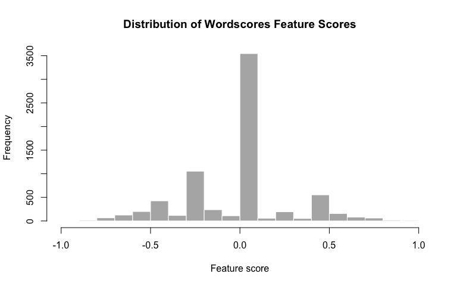
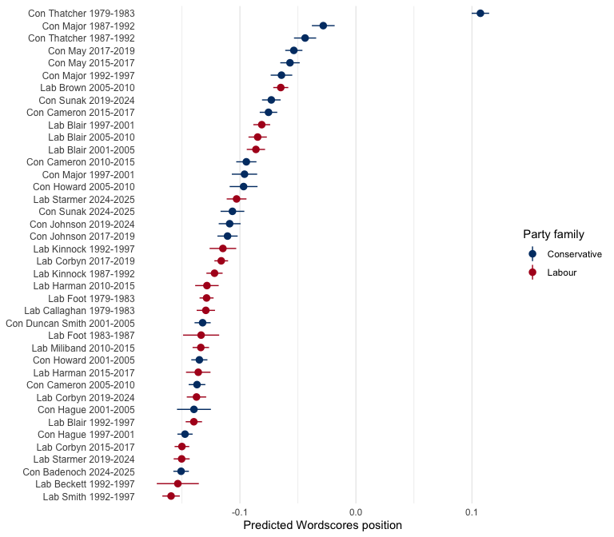
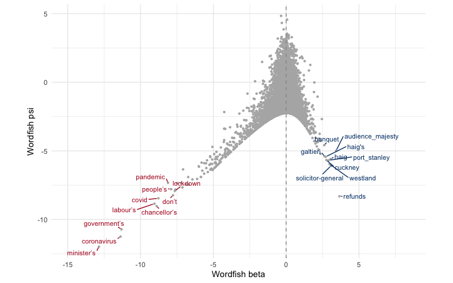
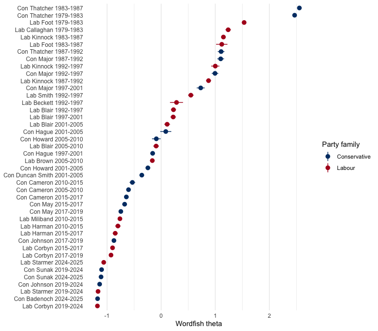
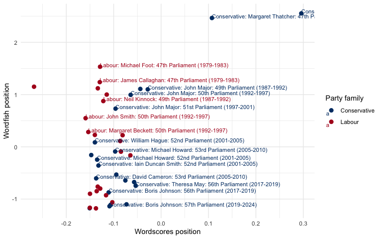
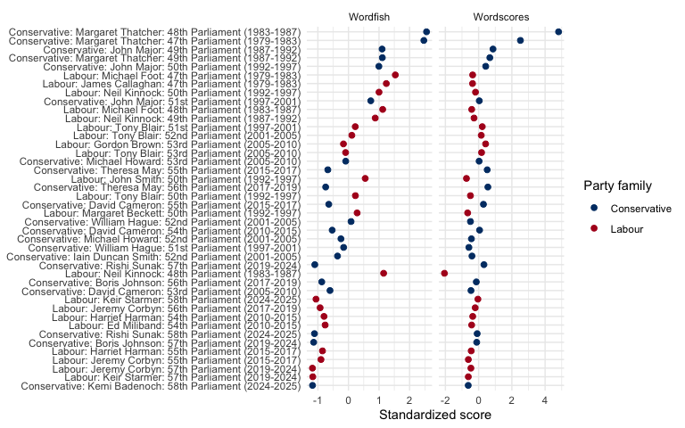
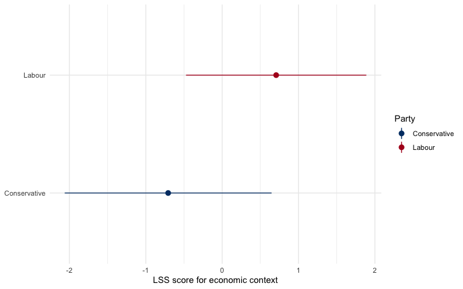

# QTA Lab 06: Scaling House of Commons speeches


## Learning goals

In this lab, you will learn how to:

- distinguish supervised, unsupervised, and semi-supervised scaling
  methods;
- aggregate short parliamentary speeches into longer political
  documents;
- estimate a Wordscores model using reference texts;
- estimate a Wordfish model without reference scores;
- apply Latent Semantic Scaling (LSS) to economic language;
- compare what different scaling methods appear to measure;
- validate whether an estimated scale means what we think it means;
- think about how LLMs can help, and mislead, when choosing anchors,
  seed words, or prompts.

The running example is a House of Commons leader-period sample. It
contains up to 200 speeches by each Labour and Conservative party leader
in each legislative period from the 47th Parliament, beginning with the
3 May 1979 general election, to the 58th Parliament, beginning with the
4 July 2024 general election.

Scaling methods often work better on longer texts than on single short
interventions, so we combine speeches into leader-election-period
documents: one document for each party leader in each legislative period
in which they served.

The substantive problem is simple: if we place leader-election-period
documents on one dimension, what does that dimension actually capture?
It might be party ideology, leader style, election period,
government/opposition role, policy agenda, rhetorical style, or some
mixture of these.

## Load packages

``` r
library(dplyr)
library(stringr)
library(ggplot2)
library(quanteda)
library(quanteda.textmodels)
library(quanteda.textstats)
library(quanteda.textplots)
library(LSX)

party_colors <- c(
  "Conservative" = "#003B73",
  "Labour" = "#B00020"
)
```

## Read and prepare the data

``` r
data_path <- "Data/hc_leader_period_sample_1979_2024.rds"

hoc <- readRDS(data_path)

hoc <- hoc |>
  mutate(year = as.integer(format(date, "%Y")))
```

The election dates were scraped from Wikipedia’s list of UK general
elections. Labour and Conservative leadership dates were scraped from
the Wikipedia leader tables. These dates were then used to sample from
the full House of Commons dataset.

The next block checks the sample and then aggregates individual speeches
into one document per leader-election-period combination. As a result,
the unit of analysis becomes a party leader in a legislative period, not
an individual speech.

For grouping, we need the party, leader, and election number. The
remaining period variables are metadata that we carry along with
`first()`.

``` r
leader_counts <- hoc |>
  count(
    election_no,
    election_period,
    party,
    leader,
    leader_period_start,
    leader_period_end,
    name = "n_speeches"
  )

leader_counts
```

    # A tibble: 42 × 7
       election_no election_period             party      leader leader_period_start
             <int> <chr>                       <chr>      <chr>  <date>             
     1          47 47th Parliament (1979-1983) Conservat… Marga… 1979-05-03         
     2          47 47th Parliament (1979-1983) Labour     James… 1979-05-03         
     3          47 47th Parliament (1979-1983) Labour     Micha… 1980-11-10         
     4          48 48th Parliament (1983-1987) Conservat… Marga… 1983-06-09         
     5          48 48th Parliament (1983-1987) Labour     Micha… 1983-06-09         
     6          48 48th Parliament (1983-1987) Labour     Neil … 1983-10-02         
     7          49 49th Parliament (1987-1992) Conservat… John … 1990-11-27         
     8          49 49th Parliament (1987-1992) Conservat… Marga… 1987-06-11         
     9          49 49th Parliament (1987-1992) Labour     Neil … 1987-06-11         
    10          50 50th Parliament (1992-1997) Conservat… John … 1992-04-09         
    # ℹ 32 more rows
    # ℹ 2 more variables: leader_period_end <date>, n_speeches <int>

``` r
scaling_docs <- hoc |>
  group_by(
    party_family = party,
    leader,
    election_no
  ) |>
  summarise(
    period = first(election_period),
    election_date = first(election_date),
    next_election_date = first(next_election_date),
    leader_period_start = first(leader_period_start),
    leader_period_end = first(leader_period_end),
    text = paste(text, collapse = " "),
    n_speeches = n(),
    .groups = "drop"
  ) |>
  mutate(
    leader_period_doc = paste(party_family, leader, period, sep = ": "),
    party_period = leader_period_doc
  )

scaling_docs |>
  select(party_family, leader, election_no, period, leader_period_start, leader_period_end, n_speeches)
```

    # A tibble: 42 × 7
       party_family leader  election_no period leader_period_start leader_period_end
       <chr>        <chr>         <int> <chr>  <date>              <date>           
     1 Conservative Boris …          56 56th … 2019-07-23          2019-12-11       
     2 Conservative Boris …          57 57th … 2019-12-12          2022-09-05       
     3 Conservative David …          53 53rd … 2005-12-06          2010-05-05       
     4 Conservative David …          54 54th … 2010-05-06          2015-05-06       
     5 Conservative David …          55 55th … 2015-05-07          2016-07-11       
     6 Conservative Iain D…          52 52nd … 2001-09-13          2003-11-06       
     7 Conservative John M…          49 49th … 1990-11-27          1992-04-08       
     8 Conservative John M…          50 50th … 1992-04-09          1997-04-30       
     9 Conservative John M…          51 51st … 1997-05-01          1997-06-19       
    10 Conservative Kemi B…          58 58th … 2024-11-02          2025-12-31       
    # ℹ 32 more rows
    # ℹ 1 more variable: n_speeches <int>

## Create a corpus, tokens, and DFM

``` r
scaling_corpus <- corpus(
  scaling_docs,
  text_field = "text",
  docid_field = "party_period"
)

ndoc(scaling_corpus)
```

    [1] 42

We remove very common parliamentary language Some of these words are
substantively meaningful in other contexts, but here they mostly
identify House of Commons procedure.

``` r
scaling_tokens <- tokens(
  scaling_corpus,
  what = "word",
  remove_punct = TRUE,
  remove_symbols = TRUE,
  remove_numbers = TRUE,
  remove_url = TRUE,
  remove_separators = TRUE,
  split_hyphens = FALSE
) |>
  tokens_tolower() |>
  tokens_remove(stopwords(source = "smart")) |>
  tokens_remove(
    c(
      "hon", "member", "right", "friend", "sir", "gentleman", "lady", "house", "commons", "speaker", "minister", "secretary", "mr", "mrs", "ms", "madam", "lord"
    )
  )
```

As in earlier labs, we can detect common multi-word expressions and
compound the most frequent collocations.

``` r
hoc_collocations <- scaling_tokens |>
  textstat_collocations(
    min_count = 10,
    size = 2:3
  ) |>
  arrange(desc(lambda))

head(hoc_collocations, 20)
```

                      collocation count count_nested length   lambda         z
    1231                hong kong    32           32      2 17.71861  8.825423
    1126                sinn fein    22           22      2 15.15368 10.065235
    1174                ebbw vale    11           11      2 15.07033  9.556270
    1181                bin laden    10           10      2 14.64288  9.489669
    1176            parity esteem    11           11      2 14.48254  9.530499
    1185           waltham forest    10           10      2 14.39157  9.453698
    1173                 lib dems    14           14      2 14.20350  9.570991
    1160             saudi arabia    22           22      2 14.13200  9.695736
    1205             westland plc    10           10      2 13.54425  9.151358
    1197 devolved administrations    22           22      2 13.45903  9.320372
    1208               privy seal    10           10      2 13.45328  9.107122
    838         chambers commerce    12           12      2 12.95647 13.811620
    829         buckingham palace    13           13      2 12.90826 13.932379
    493              sidcup heath    19           19      2 12.81335 18.198702
    215              dispatch box    56           56      2 12.76212 24.256666
    1245           inland revenue    11           11      2 12.63665  8.674698
    871             bexley sidcup    11           11      2 12.36225 13.539790
    790      antisocial behaviour    41           41      2 12.13689 14.419436
    378          hereditary peers    20           20      2 12.12790 20.312841
    764            united kingdom   403          403      2 12.04380 14.704962

``` r
if (nrow(hoc_collocations) > 0) {
  scaling_tokens <- tokens_compound(
    scaling_tokens,
    phrase(head(hoc_collocations$collocation, 50))
  )
}
```

``` r
scaling_dfm <- dfm(scaling_tokens) |>
  dfm_trim(
    min_termfreq = 5,
    min_docfreq = 2
  )

dim(scaling_dfm)
```

    [1]   42 7088

``` r
topfeatures(scaling_dfm, 30)
```

         prime government     people    country       time       made       make 
          6268       4454       3695       2247       1595       1464       1451 
       support      today          â      years   european       work    british 
          1338       1323       1309       1303       1269       1200       1197 
          year    members     labour        tax      party      clear chancellor 
          1190       1142       1084       1073       1069       1063        992 
          deal     public   question  important        put   national     health 
           974        948        938        918        893        878        870 
       britain   security 
           856        835 

At this point, `scaling_dfm` is the representation used by Wordscores
and Wordfish. Rows are leader-election-period documents; columns are
word features; cells are word counts. Different scaling methods use this
same DFM in different ways.

## Wordscores

Wordscores is a supervised scaling method. We give known reference
scores to anchor texts, and the model estimates word and document scores
from those anchors.

The intuition is:

``` text
reference documents -> word scores -> new document scores
```

If Labour reference documents use a word frequently, that word is pulled
toward the Labour side of the scale. If Conservative reference documents
use it frequently, it is pulled toward the Conservative side. New
documents are then positioned by the weighted average of the words they
contain.

Here, we use Neil Kinnock and Margaret Thatcher in the 48th Parliament
(1983-1987) as the reference texts. Kinnock is the Labour anchor (-1),
and Thatcher is the Conservative anchor (+1). All other leader-period
documents are scored by the model, but they do not define the scale.

``` r
wordscores_anchor_period <- "48th Parliament (1983-1987)"
labour_anchor_leader <- "Neil Kinnock"
conservative_anchor_leader <- "Margaret Thatcher"

docvars(scaling_dfm, "reference_score") <- case_when(
  docvars(scaling_dfm, "party_family") == "Labour" &
    docvars(scaling_dfm, "leader") == labour_anchor_leader &
    docvars(scaling_dfm, "period") == wordscores_anchor_period ~ -1,
  docvars(scaling_dfm, "party_family") == "Conservative" &
    docvars(scaling_dfm, "leader") == conservative_anchor_leader &
    docvars(scaling_dfm, "period") == wordscores_anchor_period ~ 1,
  TRUE ~ NA_real_
)

data.frame(
  document = docnames(scaling_dfm),
  party = docvars(scaling_dfm, "party_family"),
  leader = docvars(scaling_dfm, "leader"),
  period = docvars(scaling_dfm, "period"),
  reference_score = docvars(scaling_dfm, "reference_score")
) |>
  mutate(
    role = if_else(
      is.na(reference_score),
      "virgin text",
      "reference text"
    )
  ) |>
  arrange(is.na(reference_score), party, period)
```

                                                           document        party
    1  Conservative: Margaret Thatcher: 48th Parliament (1983-1987) Conservative
    2             Labour: Neil Kinnock: 48th Parliament (1983-1987)       Labour
    3  Conservative: Margaret Thatcher: 47th Parliament (1979-1983) Conservative
    4         Conservative: John Major: 49th Parliament (1987-1992) Conservative
    5  Conservative: Margaret Thatcher: 49th Parliament (1987-1992) Conservative
    6         Conservative: John Major: 50th Parliament (1992-1997) Conservative
    7         Conservative: John Major: 51st Parliament (1997-2001) Conservative
    8      Conservative: William Hague: 51st Parliament (1997-2001) Conservative
    9  Conservative: Iain Duncan Smith: 52nd Parliament (2001-2005) Conservative
    10    Conservative: Michael Howard: 52nd Parliament (2001-2005) Conservative
    11     Conservative: William Hague: 52nd Parliament (2001-2005) Conservative
    12     Conservative: David Cameron: 53rd Parliament (2005-2010) Conservative
    13    Conservative: Michael Howard: 53rd Parliament (2005-2010) Conservative
    14     Conservative: David Cameron: 54th Parliament (2010-2015) Conservative
    15     Conservative: David Cameron: 55th Parliament (2015-2017) Conservative
    16       Conservative: Theresa May: 55th Parliament (2015-2017) Conservative
    17     Conservative: Boris Johnson: 56th Parliament (2017-2019) Conservative
    18       Conservative: Theresa May: 56th Parliament (2017-2019) Conservative
    19     Conservative: Boris Johnson: 57th Parliament (2019-2024) Conservative
    20       Conservative: Rishi Sunak: 57th Parliament (2019-2024) Conservative
    21     Conservative: Kemi Badenoch: 58th Parliament (2024-2025) Conservative
    22       Conservative: Rishi Sunak: 58th Parliament (2024-2025) Conservative
    23         Labour: James Callaghan: 47th Parliament (1979-1983)       Labour
    24            Labour: Michael Foot: 47th Parliament (1979-1983)       Labour
    25            Labour: Michael Foot: 48th Parliament (1983-1987)       Labour
    26            Labour: Neil Kinnock: 49th Parliament (1987-1992)       Labour
    27              Labour: John Smith: 50th Parliament (1992-1997)       Labour
    28        Labour: Margaret Beckett: 50th Parliament (1992-1997)       Labour
    29            Labour: Neil Kinnock: 50th Parliament (1992-1997)       Labour
    30              Labour: Tony Blair: 50th Parliament (1992-1997)       Labour
    31              Labour: Tony Blair: 51st Parliament (1997-2001)       Labour
    32              Labour: Tony Blair: 52nd Parliament (2001-2005)       Labour
    33            Labour: Gordon Brown: 53rd Parliament (2005-2010)       Labour
    34              Labour: Tony Blair: 53rd Parliament (2005-2010)       Labour
    35             Labour: Ed Miliband: 54th Parliament (2010-2015)       Labour
    36          Labour: Harriet Harman: 54th Parliament (2010-2015)       Labour
    37          Labour: Harriet Harman: 55th Parliament (2015-2017)       Labour
    38           Labour: Jeremy Corbyn: 55th Parliament (2015-2017)       Labour
    39           Labour: Jeremy Corbyn: 56th Parliament (2017-2019)       Labour
    40           Labour: Jeremy Corbyn: 57th Parliament (2019-2024)       Labour
    41            Labour: Keir Starmer: 57th Parliament (2019-2024)       Labour
    42            Labour: Keir Starmer: 58th Parliament (2024-2025)       Labour
                  leader                      period reference_score           role
    1  Margaret Thatcher 48th Parliament (1983-1987)               1 reference text
    2       Neil Kinnock 48th Parliament (1983-1987)              -1 reference text
    3  Margaret Thatcher 47th Parliament (1979-1983)              NA    virgin text
    4         John Major 49th Parliament (1987-1992)              NA    virgin text
    5  Margaret Thatcher 49th Parliament (1987-1992)              NA    virgin text
    6         John Major 50th Parliament (1992-1997)              NA    virgin text
    7         John Major 51st Parliament (1997-2001)              NA    virgin text
    8      William Hague 51st Parliament (1997-2001)              NA    virgin text
    9  Iain Duncan Smith 52nd Parliament (2001-2005)              NA    virgin text
    10    Michael Howard 52nd Parliament (2001-2005)              NA    virgin text
    11     William Hague 52nd Parliament (2001-2005)              NA    virgin text
    12     David Cameron 53rd Parliament (2005-2010)              NA    virgin text
    13    Michael Howard 53rd Parliament (2005-2010)              NA    virgin text
    14     David Cameron 54th Parliament (2010-2015)              NA    virgin text
    15     David Cameron 55th Parliament (2015-2017)              NA    virgin text
    16       Theresa May 55th Parliament (2015-2017)              NA    virgin text
    17     Boris Johnson 56th Parliament (2017-2019)              NA    virgin text
    18       Theresa May 56th Parliament (2017-2019)              NA    virgin text
    19     Boris Johnson 57th Parliament (2019-2024)              NA    virgin text
    20       Rishi Sunak 57th Parliament (2019-2024)              NA    virgin text
    21     Kemi Badenoch 58th Parliament (2024-2025)              NA    virgin text
    22       Rishi Sunak 58th Parliament (2024-2025)              NA    virgin text
    23   James Callaghan 47th Parliament (1979-1983)              NA    virgin text
    24      Michael Foot 47th Parliament (1979-1983)              NA    virgin text
    25      Michael Foot 48th Parliament (1983-1987)              NA    virgin text
    26      Neil Kinnock 49th Parliament (1987-1992)              NA    virgin text
    27        John Smith 50th Parliament (1992-1997)              NA    virgin text
    28  Margaret Beckett 50th Parliament (1992-1997)              NA    virgin text
    29      Neil Kinnock 50th Parliament (1992-1997)              NA    virgin text
    30        Tony Blair 50th Parliament (1992-1997)              NA    virgin text
    31        Tony Blair 51st Parliament (1997-2001)              NA    virgin text
    32        Tony Blair 52nd Parliament (2001-2005)              NA    virgin text
    33      Gordon Brown 53rd Parliament (2005-2010)              NA    virgin text
    34        Tony Blair 53rd Parliament (2005-2010)              NA    virgin text
    35       Ed Miliband 54th Parliament (2010-2015)              NA    virgin text
    36    Harriet Harman 54th Parliament (2010-2015)              NA    virgin text
    37    Harriet Harman 55th Parliament (2015-2017)              NA    virgin text
    38     Jeremy Corbyn 55th Parliament (2015-2017)              NA    virgin text
    39     Jeremy Corbyn 56th Parliament (2017-2019)              NA    virgin text
    40     Jeremy Corbyn 57th Parliament (2019-2024)              NA    virgin text
    41      Keir Starmer 57th Parliament (2019-2024)              NA    virgin text
    42      Keir Starmer 58th Parliament (2024-2025)              NA    virgin text

Only two leader-period documents define the scale. This is close to the
original Wordscores logic: use a small number of substantively
meaningful reference texts, then ask where the other documents fall
relative to those anchors.

``` r
count(
  data.frame(reference_score = docvars(scaling_dfm, "reference_score")),
  reference_score
)
```

      reference_score  n
    1              -1  1
    2               1  1
    3              NA 40

``` r
hoc_wordscores <- textmodel_wordscores(
  scaling_dfm,
  y = docvars(scaling_dfm, "reference_score"),
  smooth = 1
)

summary(hoc_wordscores, n = 10)
```


    Call:
    textmodel_wordscores.dfm(x = scaling_dfm, y = docvars(scaling_dfm, 
        "reference_score"), smooth = 1)

    Reference Document Statistics:
                                                                 score total min
    Conservative: Boris Johnson: 56th Parliament (2017-2019)        NA  6270   0
    Conservative: Boris Johnson: 57th Parliament (2019-2024)        NA  5300   0
    Conservative: David Cameron: 53rd Parliament (2005-2010)        NA 10739   0
    Conservative: David Cameron: 54th Parliament (2010-2015)        NA  6583   0
    Conservative: David Cameron: 55th Parliament (2015-2017)        NA  8672   0
    Conservative: Iain Duncan Smith: 52nd Parliament (2001-2005)    NA 11067   0
    Conservative: John Major: 49th Parliament (1987-1992)           NA  5909   0
    Conservative: John Major: 50th Parliament (1992-1997)           NA  6538   0
    Conservative: John Major: 51st Parliament (1997-2001)           NA  4572   0
    Conservative: Kemi Badenoch: 58th Parliament (2024-2025)        NA 11237   0
    Conservative: Margaret Thatcher: 47th Parliament (1979-1983)    NA 13293   0
    Conservative: Margaret Thatcher: 48th Parliament (1983-1987)     1 10044   0
    Conservative: Margaret Thatcher: 49th Parliament (1987-1992)    NA  6083   0
    Conservative: Michael Howard: 52nd Parliament (2001-2005)       NA 11113   0
    Conservative: Michael Howard: 53rd Parliament (2005-2010)       NA  3594   0
    Conservative: Rishi Sunak: 57th Parliament (2019-2024)          NA  7421   0
    Conservative: Rishi Sunak: 58th Parliament (2024-2025)          NA  4782   0
    Conservative: Theresa May: 55th Parliament (2015-2017)          NA  7742   0
    Conservative: Theresa May: 56th Parliament (2017-2019)          NA  9173   0
    Conservative: William Hague: 51st Parliament (1997-2001)        NA 12403   0
    Conservative: William Hague: 52nd Parliament (2001-2005)        NA  2286   0
    Labour: Ed Miliband: 54th Parliament (2010-2015)                NA 10942   0
    Labour: Gordon Brown: 53rd Parliament (2005-2010)               NA 12084   0
    Labour: Harriet Harman: 54th Parliament (2010-2015)             NA  4796   0
    Labour: Harriet Harman: 55th Parliament (2015-2017)             NA  4632   0
    Labour: James Callaghan: 47th Parliament (1979-1983)            NA  8731   0
    Labour: Jeremy Corbyn: 55th Parliament (2015-2017)              NA 12966   0
    Labour: Jeremy Corbyn: 56th Parliament (2017-2019)              NA 14514   0
    Labour: Jeremy Corbyn: 57th Parliament (2019-2024)              NA  7260   0
    Labour: John Smith: 50th Parliament (1992-1997)                 NA  9304   0
    Labour: Keir Starmer: 57th Parliament (2019-2024)               NA 10483   0
    Labour: Keir Starmer: 58th Parliament (2024-2025)               NA  6713   0
    Labour: Margaret Beckett: 50th Parliament (1992-1997)           NA  1708   0
    Labour: Michael Foot: 47th Parliament (1979-1983)               NA 13890   0
    Labour: Michael Foot: 48th Parliament (1983-1987)               NA  2088   0
    Labour: Neil Kinnock: 48th Parliament (1983-1987)               -1 13001   0
    Labour: Neil Kinnock: 49th Parliament (1987-1992)               NA 10939   0
    Labour: Neil Kinnock: 50th Parliament (1992-1997)               NA  4107   0
    Labour: Tony Blair: 50th Parliament (1992-1997)                 NA 10775   0
    Labour: Tony Blair: 51st Parliament (1997-2001)                 NA  9559   0
    Labour: Tony Blair: 52nd Parliament (2001-2005)                 NA  8325   0
    Labour: Tony Blair: 53rd Parliament (2005-2010)                 NA  8158   0
                                                                 max   mean median
    Conservative: Boris Johnson: 56th Parliament (2017-2019)     107 0.8846      0
    Conservative: Boris Johnson: 57th Parliament (2019-2024)     100 0.7477      0
    Conservative: David Cameron: 53rd Parliament (2005-2010)     504 1.5151      0
    Conservative: David Cameron: 54th Parliament (2010-2015)     107 0.9288      0
    Conservative: David Cameron: 55th Parliament (2015-2017)     129 1.2235      0
    Conservative: Iain Duncan Smith: 52nd Parliament (2001-2005) 419 1.5614      0
    Conservative: John Major: 49th Parliament (1987-1992)         54 0.8337      0
    Conservative: John Major: 50th Parliament (1992-1997)         53 0.9224      0
    Conservative: John Major: 51st Parliament (1997-2001)         87 0.6450      0
    Conservative: Kemi Badenoch: 58th Parliament (2024-2025)     410 1.5854      0
    Conservative: Margaret Thatcher: 47th Parliament (1979-1983) 224 1.8754      0
    Conservative: Margaret Thatcher: 48th Parliament (1983-1987) 331 1.4170      0
    Conservative: Margaret Thatcher: 49th Parliament (1987-1992)  83 0.8582      0
    Conservative: Michael Howard: 52nd Parliament (2001-2005)    479 1.5679      0
    Conservative: Michael Howard: 53rd Parliament (2005-2010)    121 0.5071      0
    Conservative: Rishi Sunak: 57th Parliament (2019-2024)        79 1.0470      0
    Conservative: Rishi Sunak: 58th Parliament (2024-2025)       131 0.6747      0
    Conservative: Theresa May: 55th Parliament (2015-2017)       109 1.0923      0
    Conservative: Theresa May: 56th Parliament (2017-2019)       114 1.2942      0
    Conservative: William Hague: 51st Parliament (1997-2001)     446 1.7499      0
    Conservative: William Hague: 52nd Parliament (2001-2005)      61 0.3225      0
    Labour: Ed Miliband: 54th Parliament (2010-2015)             423 1.5437      0
    Labour: Gordon Brown: 53rd Parliament (2005-2010)            157 1.7049      0
    Labour: Harriet Harman: 54th Parliament (2010-2015)          150 0.6766      0
    Labour: Harriet Harman: 55th Parliament (2015-2017)          136 0.6535      0
    Labour: James Callaghan: 47th Parliament (1979-1983)         148 1.2318      0
    Labour: Jeremy Corbyn: 55th Parliament (2015-2017)           356 1.8293      0
    Labour: Jeremy Corbyn: 56th Parliament (2017-2019)           404 2.0477      0
    Labour: Jeremy Corbyn: 57th Parliament (2019-2024)           165 1.0243      0
    Labour: John Smith: 50th Parliament (1992-1997)              275 1.3126      0
    Labour: Keir Starmer: 57th Parliament (2019-2024)            426 1.4790      0
    Labour: Keir Starmer: 58th Parliament (2024-2025)             73 0.9471      0
    Labour: Margaret Beckett: 50th Parliament (1992-1997)         75 0.2410      0
    Labour: Michael Foot: 47th Parliament (1979-1983)            281 1.9597      0
    Labour: Michael Foot: 48th Parliament (1983-1987)             49 0.2946      0
    Labour: Neil Kinnock: 48th Parliament (1983-1987)            194 1.8342      0
    Labour: Neil Kinnock: 49th Parliament (1987-1992)            263 1.5433      0
    Labour: Neil Kinnock: 50th Parliament (1992-1997)             97 0.5794      0
    Labour: Tony Blair: 50th Parliament (1992-1997)              267 1.5202      0
    Labour: Tony Blair: 51st Parliament (1997-2001)              116 1.3486      0
    Labour: Tony Blair: 52nd Parliament (2001-2005)              118 1.1745      0
    Labour: Tony Blair: 53rd Parliament (2005-2010)              108 1.1510      0

    Wordscores:
    (showing first 10 elements)
            good conservative        party        heart       labour       record 
        -0.17401     -0.71304     -0.66525      0.07944     -0.35343     -0.26080 
            past        years      measure  opportunity 
        -0.43795     -0.33893     -0.43795     -0.59374 

The `smooth = 1` setting avoids zero probabilities for words that appear
in one set of reference documents but not the other. This is useful in
sparse text data, where many words appear in only a small number of
documents.

Inspect words at each end of the Wordscores dimension.

``` r
head(sort(hoc_wordscores$wordscores), 20)
```

           cuts  minister's     poverty     conduct     workers        bill 
     -0.9103948  -0.9068351  -0.8709485  -0.8454318  -0.8454318  -0.8219636 
         lady's     obvious        tory      crisis     explain     failure 
     -0.8219636  -0.8219636  -0.8219636  -0.8149392  -0.8073376  -0.8073376 
          night consequence     plainly      credit         vol     billion 
     -0.8073376  -0.8073376  -0.8073376  -0.8073376  -0.8073376  -0.7900935 
       attitude        show 
     -0.7900935  -0.7900935 

``` r
tail(sort(hoc_wordscores$wordscores), 20)
```

            welcomed       presidency        kingdom's       considered 
           0.8268909        0.8268909        0.8268909        0.8428415 
             lasting          banquet           agreed        attending 
           0.8428415        0.8428415        0.8536309        0.8561007 
                king      community's      accompanied          morning 
           0.8851658        0.8851658        0.9044626        0.9228329 
          colleagues         presided          evening audience_majesty 
           0.9325349        0.9464534        0.9530817        0.9592474 
            meetings            queen      ministerial  addition_duties 
           0.9597285        0.9657871        0.9802484        0.9897161 

``` r
hist(
  hoc_wordscores$wordscores,
  col = "grey70",
  border = "white",
  main = "Distribution of Wordscores Feature Scores",
  xlab = "Feature score"
)
```



Now predict document scores for all leader-election-period documents.

``` r
hoc_wordscores_pred <- predict(
  hoc_wordscores,
  newdata = scaling_dfm,
  se = TRUE
)

wordscores_document_scores <- data.frame(
  party_period = docnames(scaling_dfm),
  party_family = docvars(scaling_dfm, "party_family"),
  leader = docvars(scaling_dfm, "leader"),
  period = docvars(scaling_dfm, "period"),
  reference_score = docvars(scaling_dfm, "reference_score"),
  wordscores = as.numeric(hoc_wordscores_pred$fit),
  se = as.numeric(hoc_wordscores_pred$se.fit)
)

wordscores_document_scores <- wordscores_document_scores |>
  mutate(
    party_short = recode(
      party_family,
      "Conservative" = "Con",
      "Labour" = "Lab"
    ),
    period_years = str_extract(period, "\\d{4}-\\d{4}"),
    leader_short = case_when(
      leader == "Iain Duncan Smith" ~ "Duncan Smith",
      TRUE ~ str_replace(leader, "^.* ", "")
    ),
    plot_label = paste(party_short, leader_short, period_years)
)

wordscores_document_scores |>
  arrange(wordscores)
```

                                                       party_period party_family
    1             Labour: Neil Kinnock: 48th Parliament (1983-1987)       Labour
    2               Labour: John Smith: 50th Parliament (1992-1997)       Labour
    3         Labour: Margaret Beckett: 50th Parliament (1992-1997)       Labour
    4      Conservative: Kemi Badenoch: 58th Parliament (2024-2025) Conservative
    5             Labour: Keir Starmer: 57th Parliament (2019-2024)       Labour
    6            Labour: Jeremy Corbyn: 55th Parliament (2015-2017)       Labour
    7      Conservative: William Hague: 51st Parliament (1997-2001) Conservative
    8               Labour: Tony Blair: 50th Parliament (1992-1997)       Labour
    9      Conservative: William Hague: 52nd Parliament (2001-2005) Conservative
    10           Labour: Jeremy Corbyn: 57th Parliament (2019-2024)       Labour
    11     Conservative: David Cameron: 53rd Parliament (2005-2010) Conservative
    12          Labour: Harriet Harman: 55th Parliament (2015-2017)       Labour
    13    Conservative: Michael Howard: 52nd Parliament (2001-2005) Conservative
    14             Labour: Ed Miliband: 54th Parliament (2010-2015)       Labour
    15            Labour: Michael Foot: 48th Parliament (1983-1987)       Labour
    16 Conservative: Iain Duncan Smith: 52nd Parliament (2001-2005) Conservative
    17         Labour: James Callaghan: 47th Parliament (1979-1983)       Labour
    18            Labour: Michael Foot: 47th Parliament (1979-1983)       Labour
    19          Labour: Harriet Harman: 54th Parliament (2010-2015)       Labour
    20            Labour: Neil Kinnock: 49th Parliament (1987-1992)       Labour
    21           Labour: Jeremy Corbyn: 56th Parliament (2017-2019)       Labour
    22            Labour: Neil Kinnock: 50th Parliament (1992-1997)       Labour
    23     Conservative: Boris Johnson: 56th Parliament (2017-2019) Conservative
    24     Conservative: Boris Johnson: 57th Parliament (2019-2024) Conservative
    25       Conservative: Rishi Sunak: 58th Parliament (2024-2025) Conservative
    26            Labour: Keir Starmer: 58th Parliament (2024-2025)       Labour
    27    Conservative: Michael Howard: 53rd Parliament (2005-2010) Conservative
    28        Conservative: John Major: 51st Parliament (1997-2001) Conservative
    29     Conservative: David Cameron: 54th Parliament (2010-2015) Conservative
    30              Labour: Tony Blair: 52nd Parliament (2001-2005)       Labour
    31              Labour: Tony Blair: 53rd Parliament (2005-2010)       Labour
    32              Labour: Tony Blair: 51st Parliament (1997-2001)       Labour
    33     Conservative: David Cameron: 55th Parliament (2015-2017) Conservative
    34       Conservative: Rishi Sunak: 57th Parliament (2019-2024) Conservative
    35            Labour: Gordon Brown: 53rd Parliament (2005-2010)       Labour
    36        Conservative: John Major: 50th Parliament (1992-1997) Conservative
    37       Conservative: Theresa May: 55th Parliament (2015-2017) Conservative
    38       Conservative: Theresa May: 56th Parliament (2017-2019) Conservative
    39 Conservative: Margaret Thatcher: 49th Parliament (1987-1992) Conservative
    40        Conservative: John Major: 49th Parliament (1987-1992) Conservative
    41 Conservative: Margaret Thatcher: 47th Parliament (1979-1983) Conservative
    42 Conservative: Margaret Thatcher: 48th Parliament (1983-1987) Conservative
                  leader                      period reference_score  wordscores
    1       Neil Kinnock 48th Parliament (1983-1987)              -1 -0.26807562
    2         John Smith 50th Parliament (1992-1997)              NA -0.15936001
    3   Margaret Beckett 50th Parliament (1992-1997)              NA -0.15355798
    4      Kemi Badenoch 58th Parliament (2024-2025)              NA -0.15071260
    5       Keir Starmer 57th Parliament (2019-2024)              NA -0.15023605
    6      Jeremy Corbyn 55th Parliament (2015-2017)              NA -0.15000820
    7      William Hague 51st Parliament (1997-2001)              NA -0.14735493
    8         Tony Blair 50th Parliament (1992-1997)              NA -0.13973412
    9      William Hague 52nd Parliament (2001-2005)              NA -0.13964821
    10     Jeremy Corbyn 57th Parliament (2019-2024)              NA -0.13745921
    11     David Cameron 53rd Parliament (2005-2010)              NA -0.13701059
    12    Harriet Harman 55th Parliament (2015-2017)              NA -0.13592962
    13    Michael Howard 52nd Parliament (2001-2005)              NA -0.13498371
    14       Ed Miliband 54th Parliament (2010-2015)              NA -0.13372945
    15      Michael Foot 48th Parliament (1983-1987)              NA -0.13347404
    16 Iain Duncan Smith 52nd Parliament (2001-2005)              NA -0.13217833
    17   James Callaghan 47th Parliament (1979-1983)              NA -0.12939711
    18      Michael Foot 47th Parliament (1979-1983)              NA -0.12876239
    19    Harriet Harman 54th Parliament (2010-2015)              NA -0.12845750
    20      Neil Kinnock 49th Parliament (1987-1992)              NA -0.12191808
    21     Jeremy Corbyn 56th Parliament (2017-2019)              NA -0.11613040
    22      Neil Kinnock 50th Parliament (1992-1997)              NA -0.11468616
    23     Boris Johnson 56th Parliament (2017-2019)              NA -0.11069303
    24     Boris Johnson 57th Parliament (2019-2024)              NA -0.10887391
    25       Rishi Sunak 58th Parliament (2024-2025)              NA -0.10646924
    26      Keir Starmer 58th Parliament (2024-2025)              NA -0.10290180
    27    Michael Howard 53rd Parliament (2005-2010)              NA -0.09685282
    28        John Major 51st Parliament (1997-2001)              NA -0.09607352
    29     David Cameron 54th Parliament (2010-2015)              NA -0.09449434
    30        Tony Blair 52nd Parliament (2001-2005)              NA -0.08623108
    31        Tony Blair 53rd Parliament (2005-2010)              NA -0.08472956
    32        Tony Blair 51st Parliament (1997-2001)              NA -0.08121117
    33     David Cameron 55th Parliament (2015-2017)              NA -0.07539370
    34       Rishi Sunak 57th Parliament (2019-2024)              NA -0.07295723
    35      Gordon Brown 53rd Parliament (2005-2010)              NA -0.06480639
    36        John Major 50th Parliament (1992-1997)              NA -0.06420838
    37       Theresa May 55th Parliament (2015-2017)              NA -0.05686319
    38       Theresa May 56th Parliament (2017-2019)              NA -0.05355651
    39 Margaret Thatcher 49th Parliament (1987-1992)              NA -0.04384819
    40        John Major 49th Parliament (1987-1992)              NA -0.02818854
    41 Margaret Thatcher 47th Parliament (1979-1983)              NA  0.10728046
    42 Margaret Thatcher 48th Parliament (1983-1987)               1  0.29581626
                se party_short period_years leader_short                 plot_label
    1  0.002941812         Lab    1983-1987      Kinnock      Lab Kinnock 1983-1987
    2  0.003841634         Lab    1992-1997        Smith        Lab Smith 1992-1997
    3  0.009246541         Lab    1992-1997      Beckett      Lab Beckett 1992-1997
    4  0.003417083         Con    2024-2025     Badenoch     Con Badenoch 2024-2025
    5  0.003519449         Lab    2019-2024      Starmer      Lab Starmer 2019-2024
    6  0.003224907         Lab    2015-2017       Corbyn       Lab Corbyn 2015-2017
    7  0.003343961         Con    1997-2001        Hague        Con Hague 1997-2001
    8  0.003601904         Lab    1992-1997        Blair        Lab Blair 1992-1997
    9  0.007454587         Con    2001-2005        Hague        Con Hague 2001-2005
    10 0.004273573         Lab    2019-2024       Corbyn       Lab Corbyn 2019-2024
    11 0.003670148         Con    2005-2010      Cameron      Con Cameron 2005-2010
    12 0.005390454         Lab    2015-2017       Harman       Lab Harman 2015-2017
    13 0.003549879         Con    2001-2005       Howard       Con Howard 2001-2005
    14 0.003623074         Lab    2010-2015     Miliband     Lab Miliband 2010-2015
    15 0.007950758         Lab    1983-1987         Foot         Lab Foot 1983-1987
    16 0.003550837         Con    2001-2005 Duncan Smith Con Duncan Smith 2001-2005
    17 0.004037793         Lab    1979-1983    Callaghan    Lab Callaghan 1979-1983
    18 0.003087923         Lab    1979-1983         Foot         Lab Foot 1979-1983
    19 0.005172479         Lab    2010-2015       Harman       Lab Harman 2010-2015
    20 0.003570614         Lab    1987-1992      Kinnock      Lab Kinnock 1987-1992
    21 0.003015924         Lab    2017-2019       Corbyn       Lab Corbyn 2017-2019
    22 0.005858789         Lab    1992-1997      Kinnock      Lab Kinnock 1992-1997
    23 0.004455375         Con    2017-2019      Johnson      Con Johnson 2017-2019
    24 0.004811680         Con    2019-2024      Johnson      Con Johnson 2019-2024
    25 0.005227355         Con    2024-2025        Sunak        Con Sunak 2024-2025
    26 0.004351911         Lab    2024-2025      Starmer      Lab Starmer 2024-2025
    27 0.006127976         Con    2005-2010       Howard       Con Howard 2005-2010
    28 0.005579631         Con    1997-2001        Major        Con Major 1997-2001
    29 0.004444875         Con    2010-2015      Cameron      Con Cameron 2010-2015
    30 0.004026465         Lab    2001-2005        Blair        Lab Blair 2001-2005
    31 0.004036604         Lab    2005-2010        Blair        Lab Blair 2005-2010
    32 0.003705501         Lab    1997-2001        Blair        Lab Blair 1997-2001
    33 0.003859337         Con    2015-2017      Cameron      Con Cameron 2015-2017
    34 0.004083206         Con    2019-2024        Sunak        Con Sunak 2019-2024
    35 0.003305077         Lab    2005-2010        Brown        Lab Brown 2005-2010
    36 0.004743305         Con    1992-1997        Major        Con Major 1992-1997
    37 0.004273943         Con    2015-2017          May          Con May 2015-2017
    38 0.003779064         Con    2017-2019          May          Con May 2017-2019
    39 0.004876185         Con    1987-1992     Thatcher     Con Thatcher 1987-1992
    40 0.005014205         Con    1987-1992        Major        Con Major 1987-1992
    41 0.003847492         Con    1979-1983     Thatcher     Con Thatcher 1979-1983
    42 0.004329275         Con    1983-1987     Thatcher     Con Thatcher 1983-1987

The two reference documents define the endpoints of the scale, so they
sit far away from the other documents. To make the predicted positions
easier to inspect, the plot below focuses on the non-reference
leader-period documents only.

``` r
wordscores_virgin_scores <- wordscores_document_scores |>
  filter(is.na(reference_score))

ggplot(
  wordscores_virgin_scores,
  aes(
    x = reorder(plot_label, wordscores),
    y = wordscores,
    ymin = wordscores - 1.96 * se,
    ymax = wordscores + 1.96 * se,
    color = party_family
  )
) +
  geom_pointrange() +
  coord_flip() +
  labs(
    x = NULL,
    y = "Predicted Wordscores position",
    color = "Party family"
  ) +
  scale_color_manual(values = party_colors) +
  theme_minimal() +
  theme(
    axis.text.y = element_text(size = 9),
    panel.grid.major.y = element_blank()
  )
```



The interpretation depends heavily on the reference texts. If the Labour
and Conservative documents differ by period, topic, office status, or
parliamentary role, Wordscores may partly pick up those differences too.

## Wordfish

Wordfish is an unsupervised scaling method. It estimates a latent
dimension without reference scores. Instead of telling the model where
Labour and Conservative should sit, we ask it to find the strongest
pattern of word-use differences in the DFM.

This makes Wordfish powerful but also risky. The strongest pattern may
be ideological, but it may also be election period, leader style,
parliamentary role, policy agenda, or style. We still choose the
direction of the scale after estimation. To make the Wordfish scale
easier to compare with Wordscores, we orient it using the same 1983-1987
leader-period documents: Neil Kinnock lower than Margaret Thatcher. This
does not make Wordfish supervised; it only fixes which side of the
estimated dimension is treated as low or high.

``` r
labour_anchor_index <- which(
  docvars(scaling_dfm, "party_family") == "Labour" &
    docvars(scaling_dfm, "leader") == labour_anchor_leader &
    docvars(scaling_dfm, "period") == wordscores_anchor_period
)

conservative_anchor_index <- which(
  docvars(scaling_dfm, "party_family") == "Conservative" &
    docvars(scaling_dfm, "leader") == conservative_anchor_leader &
    docvars(scaling_dfm, "period") == wordscores_anchor_period
)

hoc_wordfish <- textmodel_wordfish(
  scaling_dfm,
  dir = c(labour_anchor_index, conservative_anchor_index)
)

summary(hoc_wordfish)
```


    Call:
    textmodel_wordfish.dfm(x = scaling_dfm, dir = c(labour_anchor_index, 
        conservative_anchor_index))

    Estimated Document Positions:
                                                                    theta       se
    Conservative: Boris Johnson: 56th Parliament (2017-2019)     -0.87312 0.020162
    Conservative: Boris Johnson: 57th Parliament (2019-2024)     -1.13722 0.011678
    Conservative: David Cameron: 53rd Parliament (2005-2010)     -0.60352 0.019912
    Conservative: David Cameron: 54th Parliament (2010-2015)     -0.53228 0.026427
    Conservative: David Cameron: 55th Parliament (2015-2017)     -0.64361 0.021601
    Conservative: Iain Duncan Smith: 52nd Parliament (2001-2005) -0.35799 0.021823
    Conservative: John Major: 49th Parliament (1987-1992)         1.10007 0.032053
    Conservative: John Major: 50th Parliament (1992-1997)         0.99502 0.030803
    Conservative: John Major: 51st Parliament (1997-2001)         0.73066 0.037490
    Conservative: Kemi Badenoch: 58th Parliament (2024-2025)     -1.17538 0.006995
    Conservative: Margaret Thatcher: 47th Parliament (1979-1983)  2.46645 0.015102
    Conservative: Margaret Thatcher: 48th Parliament (1983-1987)  2.55425 0.016756
    Conservative: Margaret Thatcher: 49th Parliament (1987-1992)  1.10784 0.031564
    Conservative: Michael Howard: 52nd Parliament (2001-2005)    -0.24572 0.022453
    Conservative: Michael Howard: 53rd Parliament (2005-2010)    -0.08970 0.040693
    Conservative: Rishi Sunak: 57th Parliament (2019-2024)       -1.10111 0.011117
    Conservative: Rishi Sunak: 58th Parliament (2024-2025)       -1.11101 0.013418
    Conservative: Theresa May: 55th Parliament (2015-2017)       -0.67519 0.022356
    Conservative: Theresa May: 56th Parliament (2017-2019)       -0.74545 0.019371
    Conservative: William Hague: 51st Parliament (1997-2001)     -0.15757 0.021657
    Conservative: William Hague: 52nd Parliament (2001-2005)      0.08517 0.052174
    Labour: Ed Miliband: 54th Parliament (2010-2015)             -0.76253 0.017448
    Labour: Gordon Brown: 53rd Parliament (2005-2010)            -0.16375 0.021915
    Labour: Harriet Harman: 54th Parliament (2010-2015)          -0.79960 0.025338
    Labour: Harriet Harman: 55th Parliament (2015-2017)          -0.84939 0.024250
    Labour: James Callaghan: 47th Parliament (1979-1983)          1.23859 0.025919
    Labour: Jeremy Corbyn: 55th Parliament (2015-2017)           -0.89866 0.013483
    Labour: Jeremy Corbyn: 56th Parliament (2017-2019)           -0.92712 0.012144
    Labour: Jeremy Corbyn: 57th Parliament (2019-2024)           -1.17801 0.008617
    Labour: John Smith: 50th Parliament (1992-1997)               0.54849 0.026412
    Labour: Keir Starmer: 57th Parliament (2019-2024)            -1.16676 0.007476
    Labour: Keir Starmer: 58th Parliament (2024-2025)            -1.06169 0.013145
    Labour: Margaret Beckett: 50th Parliament (1992-1997)         0.28363 0.061227
    Labour: Michael Foot: 47th Parliament (1979-1983)             1.53299 0.019559
    Labour: Michael Foot: 48th Parliament (1983-1987)             1.11991 0.053749
    Labour: Neil Kinnock: 48th Parliament (1983-1987)             1.15054 0.021488
    Labour: Neil Kinnock: 49th Parliament (1987-1992)             0.87578 0.024049
    Labour: Neil Kinnock: 50th Parliament (1992-1997)             1.00002 0.038835
    Labour: Tony Blair: 50th Parliament (1992-1997)               0.22759 0.024339
    Labour: Tony Blair: 51st Parliament (1997-2001)               0.22241 0.025831
    Labour: Tony Blair: 52nd Parliament (2001-2005)               0.11048 0.027435
    Labour: Tony Blair: 53rd Parliament (2005-2010)              -0.09351 0.027006

    Estimated Feature Scores:
             good conservative    party   heart  labour  record    past   years
    beta -0.01923      0.05594 -0.08195 -0.4719 -0.2184 -0.1474 0.03948 0.07678
    psi   2.65978      2.79922  3.12496  0.9476  3.1165  2.0578 2.35945 3.32854
         measure opportunity   child  school comfort   person     job   time
    beta  0.2309     0.04295 -0.3559 -0.4293  0.4951 -0.03301 -0.2059 0.0616
    psi   0.5686     1.97698  1.3274  1.2970 -1.0115  0.89089  1.8801 3.5312
            life   hope disadvantaged   young university     joy  couple   move
    beta 0.02583 0.3928       -0.3809 -0.2516   -0.02843 -0.1579 -0.1716 0.1348
    psi  1.73661 2.8129       -1.5193  1.6963    0.10622 -1.4622  0.2806 1.4992
            home politics exchanges dispatch_box  eloquent speeches
    beta -0.5456  -0.2746    0.3420      -0.3706 -0.006781  0.33447
    psi   2.4410   1.0981   -0.8005       0.1116 -2.234499  0.08116

## Inspect Wordfish features

Wordfish estimates word-level parameters. The `beta` parameter captures
a word’s estimated position on the latent dimension. Words with large
positive or negative `beta` values are especially useful for
interpreting what the scale seems to measure. The `psi` parameter
captures how common a word is overall.

``` r
wordfish_feature_scores <- data.frame(
  beta = hoc_wordfish$beta,
  psi = hoc_wordfish$psi,
  feature = hoc_wordfish$features
)

wordfish_feature_scores |>
  arrange(beta) |>
  head(20)
```

             beta        psi      feature
    1  -12.861497 -11.981568   minister’s
    2  -11.374514 -11.247383  coronavirus
    3  -11.312235 -10.718080 government’s
    4   -9.050284  -8.849023     labour’s
    5   -8.894943  -9.022802 chancellor’s
    6   -8.776504  -8.457021        covid
    7   -8.118681  -7.324981     pandemic
    8   -7.897422  -7.790134     people’s
    9   -7.771268  -8.237732        don’t
    10  -7.646610  -7.917084     lockdown
    11  -7.606200  -7.818220          cps
    12  -7.498362  -7.347384      today’s
    13  -7.219563  -7.339454      putin’s
    14  -7.122366  -7.663116      david’s
    15  -7.078882  -6.351547        virus
    16  -6.904198  -7.423207    two-child
    17  -6.733121  -6.910201    country’s
    18  -6.699677  -7.461375  secretary’s
    19  -6.686053  -7.446466       stolen
    20  -6.438446  -7.080769 self-isolate

``` r
wordfish_feature_scores |>
  arrange(desc(beta)) |>
  head(20)
```

           beta       psi           feature
    1  3.658931 -8.306869           refunds
    2  3.430312 -4.987513  audience_majesty
    3  3.072337 -6.093532 solicitor-general
    4  3.045215 -5.593295              haig
    5  2.975709 -5.958063          westland
    6  2.901914 -5.687520      port_stanley
    7  2.759802 -5.671338           cuckney
    8  2.709147 -5.435282            haig's
    9  2.641004 -5.394886          galtieri
    10 2.616425 -4.584338           banquet
    11 2.449878 -2.680451         argentine
    12 2.363631 -4.278552          falkland
    13 2.354022 -5.212643         antarctic
    14 2.299278 -3.756249         islanders
    15 2.249106 -4.105523            venice
    16 2.210320 -4.896447            signor
    17 2.173695 -4.347195           hussein
    18 2.163612 -4.325478          deptford
    19 2.163447 -4.325125              bonn
    20 2.158300 -1.051164          presided

``` r
wordfish_feature_labels <- bind_rows(
  wordfish_feature_scores |>
    slice_min(order_by = beta, n = 10, with_ties = FALSE) |>
    mutate(direction = "Low beta"),
  wordfish_feature_scores |>
    slice_max(order_by = beta, n = 10, with_ties = FALSE) |>
    mutate(direction = "High beta")
)

ggplot(wordfish_feature_scores, aes(x = beta, y = psi)) +
  geom_point(color = "grey70", size = 0.8) +
  geom_vline(xintercept = 0, linetype = "dashed", color = "grey60") +
  ggrepel::geom_text_repel(
    data = wordfish_feature_labels,
    aes(label = feature, color = direction),
    size = 3,
    nudge_x = if_else(wordfish_feature_labels$direction == "Low beta", -0.6, 0.6),
    max.overlaps = Inf,
    box.padding = 0.25,
    point.padding = 0.15,
    min.segment.length = 0,
    seed = 20260713,
    show.legend = FALSE
  ) +
  labs(
    x = "Wordfish beta",
    y = "Wordfish psi",
    color = NULL
  ) +
  scale_color_manual(
    values = c("Low beta" = "#B00020", "High beta" = "#003B73")
  ) +
  scale_x_continuous(expand = expansion(mult = c(0.15, 0.30))) +
  coord_cartesian(clip = "off") +
  theme_minimal() +
  theme(
    legend.position = "none",
    plot.margin = margin(5.5, 35, 5.5, 35)
  )
```



## Inspect Wordfish document positions

The document positions are stored in `theta`. These are the estimated
locations of the leader-election-period documents on the Wordfish
dimension. The sign of the scale is arbitrary until we orient it, so
interpretation should focus on the ordering and on the words that define
the extremes.

``` r
wordfish_document_scores <- data.frame(
  party_period = docnames(scaling_dfm),
  party_family = docvars(scaling_dfm, "party_family"),
  leader = docvars(scaling_dfm, "leader"),
  period = docvars(scaling_dfm, "period"),
  theta = hoc_wordfish$theta,
  se = hoc_wordfish$se.theta
)

wordfish_document_scores <- wordfish_document_scores |>
  mutate(
    party_short = recode(
      party_family,
      "Conservative" = "Con",
      "Labour" = "Lab"
    ),
    period_years = str_extract(period, "\\d{4}-\\d{4}"),
    leader_short = case_when(
      leader == "Iain Duncan Smith" ~ "Duncan Smith",
      TRUE ~ str_replace(leader, "^.* ", "")
    ),
    plot_label = paste(party_short, leader_short, period_years)
  )

wordfish_document_scores |>
  arrange(theta)
```

                                                       party_period party_family
    1            Labour: Jeremy Corbyn: 57th Parliament (2019-2024)       Labour
    2      Conservative: Kemi Badenoch: 58th Parliament (2024-2025) Conservative
    3             Labour: Keir Starmer: 57th Parliament (2019-2024)       Labour
    4      Conservative: Boris Johnson: 57th Parliament (2019-2024) Conservative
    5        Conservative: Rishi Sunak: 58th Parliament (2024-2025) Conservative
    6        Conservative: Rishi Sunak: 57th Parliament (2019-2024) Conservative
    7             Labour: Keir Starmer: 58th Parliament (2024-2025)       Labour
    8            Labour: Jeremy Corbyn: 56th Parliament (2017-2019)       Labour
    9            Labour: Jeremy Corbyn: 55th Parliament (2015-2017)       Labour
    10     Conservative: Boris Johnson: 56th Parliament (2017-2019) Conservative
    11          Labour: Harriet Harman: 55th Parliament (2015-2017)       Labour
    12          Labour: Harriet Harman: 54th Parliament (2010-2015)       Labour
    13             Labour: Ed Miliband: 54th Parliament (2010-2015)       Labour
    14       Conservative: Theresa May: 56th Parliament (2017-2019) Conservative
    15       Conservative: Theresa May: 55th Parliament (2015-2017) Conservative
    16     Conservative: David Cameron: 55th Parliament (2015-2017) Conservative
    17     Conservative: David Cameron: 53rd Parliament (2005-2010) Conservative
    18     Conservative: David Cameron: 54th Parliament (2010-2015) Conservative
    19 Conservative: Iain Duncan Smith: 52nd Parliament (2001-2005) Conservative
    20    Conservative: Michael Howard: 52nd Parliament (2001-2005) Conservative
    21            Labour: Gordon Brown: 53rd Parliament (2005-2010)       Labour
    22     Conservative: William Hague: 51st Parliament (1997-2001) Conservative
    23              Labour: Tony Blair: 53rd Parliament (2005-2010)       Labour
    24    Conservative: Michael Howard: 53rd Parliament (2005-2010) Conservative
    25     Conservative: William Hague: 52nd Parliament (2001-2005) Conservative
    26              Labour: Tony Blair: 52nd Parliament (2001-2005)       Labour
    27              Labour: Tony Blair: 51st Parliament (1997-2001)       Labour
    28              Labour: Tony Blair: 50th Parliament (1992-1997)       Labour
    29        Labour: Margaret Beckett: 50th Parliament (1992-1997)       Labour
    30              Labour: John Smith: 50th Parliament (1992-1997)       Labour
    31        Conservative: John Major: 51st Parliament (1997-2001) Conservative
    32            Labour: Neil Kinnock: 49th Parliament (1987-1992)       Labour
    33        Conservative: John Major: 50th Parliament (1992-1997) Conservative
    34            Labour: Neil Kinnock: 50th Parliament (1992-1997)       Labour
    35        Conservative: John Major: 49th Parliament (1987-1992) Conservative
    36 Conservative: Margaret Thatcher: 49th Parliament (1987-1992) Conservative
    37            Labour: Michael Foot: 48th Parliament (1983-1987)       Labour
    38            Labour: Neil Kinnock: 48th Parliament (1983-1987)       Labour
    39         Labour: James Callaghan: 47th Parliament (1979-1983)       Labour
    40            Labour: Michael Foot: 47th Parliament (1979-1983)       Labour
    41 Conservative: Margaret Thatcher: 47th Parliament (1979-1983) Conservative
    42 Conservative: Margaret Thatcher: 48th Parliament (1983-1987) Conservative
                  leader                      period       theta          se
    1      Jeremy Corbyn 57th Parliament (2019-2024) -1.17801159 0.008616828
    2      Kemi Badenoch 58th Parliament (2024-2025) -1.17537639 0.006994754
    3       Keir Starmer 57th Parliament (2019-2024) -1.16675510 0.007476441
    4      Boris Johnson 57th Parliament (2019-2024) -1.13721944 0.011678452
    5        Rishi Sunak 58th Parliament (2024-2025) -1.11100801 0.013417834
    6        Rishi Sunak 57th Parliament (2019-2024) -1.10110658 0.011116694
    7       Keir Starmer 58th Parliament (2024-2025) -1.06168509 0.013145114
    8      Jeremy Corbyn 56th Parliament (2017-2019) -0.92712238 0.012143597
    9      Jeremy Corbyn 55th Parliament (2015-2017) -0.89866160 0.013482761
    10     Boris Johnson 56th Parliament (2017-2019) -0.87312178 0.020162030
    11    Harriet Harman 55th Parliament (2015-2017) -0.84939120 0.024250151
    12    Harriet Harman 54th Parliament (2010-2015) -0.79960466 0.025337917
    13       Ed Miliband 54th Parliament (2010-2015) -0.76252719 0.017447728
    14       Theresa May 56th Parliament (2017-2019) -0.74545235 0.019370796
    15       Theresa May 55th Parliament (2015-2017) -0.67519126 0.022356160
    16     David Cameron 55th Parliament (2015-2017) -0.64361302 0.021601223
    17     David Cameron 53rd Parliament (2005-2010) -0.60352293 0.019912435
    18     David Cameron 54th Parliament (2010-2015) -0.53228287 0.026427375
    19 Iain Duncan Smith 52nd Parliament (2001-2005) -0.35798853 0.021823112
    20    Michael Howard 52nd Parliament (2001-2005) -0.24571897 0.022452865
    21      Gordon Brown 53rd Parliament (2005-2010) -0.16374924 0.021914930
    22     William Hague 51st Parliament (1997-2001) -0.15756942 0.021657215
    23        Tony Blair 53rd Parliament (2005-2010) -0.09351232 0.027005555
    24    Michael Howard 53rd Parliament (2005-2010) -0.08970066 0.040693439
    25     William Hague 52nd Parliament (2001-2005)  0.08516915 0.052174228
    26        Tony Blair 52nd Parliament (2001-2005)  0.11047633 0.027435160
    27        Tony Blair 51st Parliament (1997-2001)  0.22241288 0.025831257
    28        Tony Blair 50th Parliament (1992-1997)  0.22759052 0.024338965
    29  Margaret Beckett 50th Parliament (1992-1997)  0.28363499 0.061226734
    30        John Smith 50th Parliament (1992-1997)  0.54849270 0.026412044
    31        John Major 51st Parliament (1997-2001)  0.73065984 0.037490282
    32      Neil Kinnock 49th Parliament (1987-1992)  0.87578200 0.024049409
    33        John Major 50th Parliament (1992-1997)  0.99501728 0.030802528
    34      Neil Kinnock 50th Parliament (1992-1997)  1.00001591 0.038835002
    35        John Major 49th Parliament (1987-1992)  1.10006760 0.032053026
    36 Margaret Thatcher 49th Parliament (1987-1992)  1.10784250 0.031564030
    37      Michael Foot 48th Parliament (1983-1987)  1.11990536 0.053749273
    38      Neil Kinnock 48th Parliament (1983-1987)  1.15053667 0.021487957
    39   James Callaghan 47th Parliament (1979-1983)  1.23859138 0.025919083
    40      Michael Foot 47th Parliament (1979-1983)  1.53299216 0.019558602
    41 Margaret Thatcher 47th Parliament (1979-1983)  2.46645073 0.015102105
    42 Margaret Thatcher 48th Parliament (1983-1987)  2.55425455 0.016755926
       party_short period_years leader_short                 plot_label
    1          Lab    2019-2024       Corbyn       Lab Corbyn 2019-2024
    2          Con    2024-2025     Badenoch     Con Badenoch 2024-2025
    3          Lab    2019-2024      Starmer      Lab Starmer 2019-2024
    4          Con    2019-2024      Johnson      Con Johnson 2019-2024
    5          Con    2024-2025        Sunak        Con Sunak 2024-2025
    6          Con    2019-2024        Sunak        Con Sunak 2019-2024
    7          Lab    2024-2025      Starmer      Lab Starmer 2024-2025
    8          Lab    2017-2019       Corbyn       Lab Corbyn 2017-2019
    9          Lab    2015-2017       Corbyn       Lab Corbyn 2015-2017
    10         Con    2017-2019      Johnson      Con Johnson 2017-2019
    11         Lab    2015-2017       Harman       Lab Harman 2015-2017
    12         Lab    2010-2015       Harman       Lab Harman 2010-2015
    13         Lab    2010-2015     Miliband     Lab Miliband 2010-2015
    14         Con    2017-2019          May          Con May 2017-2019
    15         Con    2015-2017          May          Con May 2015-2017
    16         Con    2015-2017      Cameron      Con Cameron 2015-2017
    17         Con    2005-2010      Cameron      Con Cameron 2005-2010
    18         Con    2010-2015      Cameron      Con Cameron 2010-2015
    19         Con    2001-2005 Duncan Smith Con Duncan Smith 2001-2005
    20         Con    2001-2005       Howard       Con Howard 2001-2005
    21         Lab    2005-2010        Brown        Lab Brown 2005-2010
    22         Con    1997-2001        Hague        Con Hague 1997-2001
    23         Lab    2005-2010        Blair        Lab Blair 2005-2010
    24         Con    2005-2010       Howard       Con Howard 2005-2010
    25         Con    2001-2005        Hague        Con Hague 2001-2005
    26         Lab    2001-2005        Blair        Lab Blair 2001-2005
    27         Lab    1997-2001        Blair        Lab Blair 1997-2001
    28         Lab    1992-1997        Blair        Lab Blair 1992-1997
    29         Lab    1992-1997      Beckett      Lab Beckett 1992-1997
    30         Lab    1992-1997        Smith        Lab Smith 1992-1997
    31         Con    1997-2001        Major        Con Major 1997-2001
    32         Lab    1987-1992      Kinnock      Lab Kinnock 1987-1992
    33         Con    1992-1997        Major        Con Major 1992-1997
    34         Lab    1992-1997      Kinnock      Lab Kinnock 1992-1997
    35         Con    1987-1992        Major        Con Major 1987-1992
    36         Con    1987-1992     Thatcher     Con Thatcher 1987-1992
    37         Lab    1983-1987         Foot         Lab Foot 1983-1987
    38         Lab    1983-1987      Kinnock      Lab Kinnock 1983-1987
    39         Lab    1979-1983    Callaghan    Lab Callaghan 1979-1983
    40         Lab    1979-1983         Foot         Lab Foot 1979-1983
    41         Con    1979-1983     Thatcher     Con Thatcher 1979-1983
    42         Con    1983-1987     Thatcher     Con Thatcher 1983-1987

``` r
ggplot(
  wordfish_document_scores,
  aes(
    x = reorder(plot_label, theta),
    y = theta,
    ymin = theta - 1.96 * se,
    ymax = theta + 1.96 * se,
    color = party_family
  )
) +
  geom_pointrange() +
  coord_flip() +
  labs(
    x = NULL,
    y = "Wordfish theta",
    color = "Party family"
  ) +
  scale_color_manual(values = party_colors) +
  theme_minimal() +
  theme(
    axis.text.y = element_text(size = 9),
    panel.grid.major.y = element_blank()
  )
```



## Compare Wordscores and Wordfish

If the supervised and unsupervised models recover a similar dimension,
their document scores should be correlated. If not, they may be
measuring different mixtures of party, time, agenda, and style.

This comparison is a validation step. We are not asking which method is
automatically “correct.” We are asking what kind of textual signal each
method seems to have found.

``` r
comparison_scores <- wordscores_document_scores |>
  select(party_period, party_family, period, wordscores) |>
  left_join(
    wordfish_document_scores |>
      select(party_period, wordfish = theta),
    by = "party_period"
  )

ggplot(
  comparison_scores,
  aes(
    x = wordscores,
    y = wordfish,
    label = party_period,
    color = party_family
  )
) +
  geom_point(size = 2.5) +
  geom_text(
    hjust = 0,
    vjust = 0,
    size = 3,
    check_overlap = TRUE
  ) +
  labs(
    x = "Wordscores position",
    y = "Wordfish position",
    color = "Party family"
  ) +
  scale_color_manual(values = party_colors) +
  theme_minimal()
```



``` r
cor.test(
  comparison_scores$wordscores,
  comparison_scores$wordfish
)
```


        Pearson's product-moment correlation

    data:  comparison_scores$wordscores and comparison_scores$wordfish
    t = 3.3153, df = 40, p-value = 0.001953
    alternative hypothesis: true correlation is not equal to 0
    95 percent confidence interval:
     0.1866849 0.6732101
    sample estimates:
          cor 
    0.4642737 

``` r
comparison_long <- rbind(
  data.frame(
    party_period = comparison_scores$party_period,
    party_family = comparison_scores$party_family,
    method = "Wordscores",
    score = as.numeric(scale(comparison_scores$wordscores))
  ),
  data.frame(
    party_period = comparison_scores$party_period,
    party_family = comparison_scores$party_family,
    method = "Wordfish",
    score = as.numeric(scale(comparison_scores$wordfish))
  )
)

ggplot(
  comparison_long,
  aes(
    x = score,
    y = reorder(party_period, score),
    color = party_family
  )
) +
  geom_point(size = 2) +
  facet_wrap(~ method, scales = "free_x") +
  labs(
    x = "Standardized score",
    y = NULL,
    color = "Party family"
  ) +
  scale_color_manual(values = party_colors) +
  theme_minimal()
```



## Latent Semantic Scaling

Latent Semantic Scaling (LSS) is semi-supervised. We provide seed words,
then the model uses distributional information from the corpus to infer
polarity scores for other words.

The intuition is:

``` text
seed words -> nearby context words -> document scores
```

This makes LSS a bridge between dictionary methods and embeddings. Like
a dictionary, we provide a small amount of conceptual guidance. Like
embeddings, the method uses the corpus to learn which other words occur
in similar contexts.

Here, we use the built-in positive and negative seed words, then focus
on terms that occur in the context of economic language. Substantively,
this asks: when parties talk near economic terms, is the surrounding
language more positive or negative according to this seed-based semantic
scale?

We will move through the LSS workflow in small steps:

1.  create a sentence-level corpus;
2.  turn those sentences into a DFM;
3.  define the seed words that anchor the scale;
4.  identify economy-related context terms;
5.  estimate the LSS model and inspect the results.

For classroom speed, we use a reproducible sample of speeches from the
leader-period corpus. The model still uses sentence-level text
internally, because LSS learns word meaning from local context.

``` r
lss_docs <- hoc |>
  filter(
    party %in% c("Conservative", "Labour")
  )

set.seed(20260710)

sample_size <- min(nrow(lss_docs), 1200)
lss_docs <- slice_sample(lss_docs, n = sample_size)

lss_corpus <- corpus(
  lss_docs,
  text_field = "text"
)

lss_sentence_corpus <- corpus_reshape(
  lss_corpus,
  to = "sentences"
)
```

The next block creates the representation used by LSS. Each row is now a
sentence; each column is a feature. We remove punctuation, symbols,
numbers, URLs, and stopwords so that the model is driven more by
substantive language than by parliamentary glue words.

``` r
lss_tokens <- tokens(
  lss_sentence_corpus,
  what = "word",
  remove_punct = TRUE,
  remove_symbols = TRUE,
  remove_numbers = TRUE,
  remove_url = TRUE,
  remove_separators = TRUE,
  split_hyphens = FALSE
) |>
  tokens_tolower() |>
  tokens_remove(stopwords("en"))

lss_dfm <- dfm(lss_tokens) |>
  dfm_trim(min_termfreq = 5)

dim(lss_dfm)
```

    [1] 10086  2925

``` r
topfeatures(lss_dfm, 30)
```

         prime   minister        hon government      right     people      house 
          1238       1175        998        895        777        732        643 
           can    country       said        now        one         us  gentleman 
           514        455        454        430        430        364        339 
           say     friend       time       made       make       know   european 
           316        306        305        297        287        283        281 
          last        way       also      years       year       must      today 
           281        270        268        264        263        262        252 
         first  secretary 
           246        243 

The seed words define the poles of the scale. Here we use the positive
and negative seed words that come with `LSX`. This gives us a general
positive-negative semantic scale, which we will apply only to terms that
appear near economic language.

``` r
sentiment_seed <- as.seedwords(data_dictionary_sentiment)

sentiment_seed
```

           good        nice   excellent    positive   fortunate     correct 
              1           1           1           1           1           1 
       superior         bad       nasty        poor    negative unfortunate 
              1          -1          -1          -1          -1          -1 
          wrong    inferior 
             -1          -1 

We identify words that occur near economic search terms. The resulting
`economy_terms` object limits the model to language that is plausibly
connected to the economy, instead of scoring every word in the corpus.

``` r
economy_patterns <- c(
  "econom*",
  "tax*",
  "budget*",
  "inflation",
  "growth"
)

economy_terms <- char_context(
  lss_tokens,
  pattern = economy_patterns,
  p = 0.05
)

economy_terms <- unique(economy_terms)
economy_terms <- economy_terms[economy_terms %in% featnames(lss_dfm)]

head(economy_terms, 50)
```

     [1] "rate"         "cut"          "income"       "chancellor"   "cutting"     
     [6] "monetary"     "increases"    "poll"         "burden"       "higher"      
    [11] "deficit"      "cuts"         "insurance"    "rises"        "businesses"  
    [16] "cent"         "low"          "increased"    "year"         "increase"    
    [21] "per"          "borrowing"    "jobs"         "next"         "policies"    
    [26] "rise"         "fiscal"       "rates"        "raising"      "recovery"    
    [31] "unemployment" "spending"     "working"      "development"  "raise"       
    [36] "â"            "result"       "promised"     "failed"       "services"    
    [41] "political"    "cost"         "labour"       "measures"     "employment"  
    [46] "business"     "public"       "previous"     "strong"       "billion"     

``` r
length(economy_terms)
```

    [1] 74

Now we estimate the LSS model. The `seeds` argument tells the model what
the two semantic poles look like. The `terms` argument tells the model
which context terms to score. The `k = 100` argument controls the number
of latent dimensions used internally when estimating semantic proximity.

``` r
hoc_lss <- textmodel_lss(
  lss_dfm,
  seeds = sentiment_seed,
  terms = economy_terms,
  k = 100,
  cache = FALSE
)
```

In a research project, these choices should be checked for robustness:
different seeds, different economic search terms, and different values
of `k` can all change what the scale captures.

``` r
lss_term_scores <- data.frame(
  feature = names(coef(hoc_lss)),
  score = as.numeric(coef(hoc_lss))
)

lss_term_scores |>
  arrange(score) |>
  head(20)
```

          feature       score
    1     deficit -0.11400572
    2      policy -0.10483106
    3      fiscal -0.09810429
    4      failed -0.09705819
    5  businesses -0.07301968
    6     cutting -0.05919591
    7    promised -0.05876285
    8  employment -0.05330717
    9     million -0.05249294
    10 investment -0.04620705
    11   monetary -0.04582423
    12    working -0.04444679
    13  insurance -0.04395273
    14     higher -0.04355786
    15   increase -0.04121896
    16      years -0.03993519
    17   previous -0.03746313
    18       jobs -0.03708705
    19   recovery -0.03664151
    20      rates -0.03660177

``` r
lss_term_scores |>
  arrange(desc(score)) |>
  head(20)
```

            feature      score
    1      services 0.06931255
    2        strong 0.05645742
    3          poll 0.04870985
    4        summit 0.04765916
    5          cost 0.04096656
    6       britain 0.03234384
    7        burden 0.03043795
    8          cent 0.02767245
    9           per 0.02686676
    10    increases 0.02633829
    11         real 0.02614089
    12 unemployment 0.02522205
    13     policies 0.02507698
    14        rises 0.02079863
    15     business 0.02026321
    16    increased 0.02016496
    17      british 0.01984276
    18         next 0.01871241
    19        money 0.01781845
    20    political 0.01676691

Lower-scoring terms are closer to the negative seed pole; higher-scoring
terms are closer to the positive seed pole. Always inspect these terms
before interpreting the document scores.

To obtain party-level scores, we group the sentence-level DFM by party
and predict with the LSS model. This asks whether the economy-related
language used by each party is more positive or negative on this
seed-based scale.

``` r
lss_party_dfm <- dfm_group(
  lss_dfm,
  groups = docvars(lss_dfm, "party")
)

hoc_lss_party_pred <- predict(
  hoc_lss,
  newdata = lss_party_dfm,
  se = TRUE
)

lss_party_scores <- data.frame(
  party = docnames(lss_party_dfm),
  fit = as.numeric(hoc_lss_party_pred$fit),
  se = as.numeric(hoc_lss_party_pred$se.fit)
)

lss_party_scores |>
  arrange(fit)
```

             party        fit        se
    1 Conservative -0.7071068 0.6910641
    2       Labour  0.7071068 0.6023778

``` r
ggplot(
  lss_party_scores,
  aes(
    x = reorder(party, fit),
    y = fit,
    ymin = fit - 1.96 * se,
    ymax = fit + 1.96 * se,
    color = party
  )
) +
  geom_pointrange() +
  coord_flip() +
  labs(
    x = NULL,
    y = "LSS score for economic context",
    color = "Party"
  ) +
  scale_color_manual(values = party_colors) +
  theme_minimal()
```



## Instruction-based scaling and LLMs

LLMs can be useful when developing scaling analyses. For example, they
can help brainstorm possible reference texts, propose seed words,
identify parliamentary formulae to remove, or explain surprising
features. They can also be used more directly to assign scores to texts
from a written scale definition.

For example, an instruction-based scaling prompt might ask an LLM to
place each speech on a -1 to +1 economic left-right scale and return a
short justification. That can be useful, but it is not automatically a
valid measurement model.

Scaling choices remain research choices. Reference texts, seed words,
prompts, and validation cases define what the scale can mean, so they
need theoretical justification and validation against known cases.

In practice, you should inspect:

- whether anchor texts differ on the intended dimension;
- whether high-scoring and low-scoring features make substantive sense;
- whether results change when anchors, periods, or preprocessing choices
  change;
- whether an LLM-proposed seed list introduces ideological, temporal, or
  stylistic bias.

## Practice exercises

1.  Inspect the `leader_counts` and `scaling_docs` objects. Which
    leader-period documents contain fewer than 200 speeches? How many
    leader-period documents are created after aggregation?

``` r
# Your answer here
```

2.  Estimate an alternative Wordscores model using the most recent
    Labour and Conservative leader-period documents as reference texts.
    Use Labour as -1 and Conservative as +1.

``` r
# Your answer here
```

3.  Predict document scores from the alternative Wordscores model and
    plot the results. How do they compare with the original Wordscores
    scores?

``` r
# Your answer here
```

4.  Re-estimate Wordfish using the same 1983-1987 Kinnock and Thatcher
    documents to orient the scale. Display the document positions.

``` r
# Your answer here
```

5.  Identify the 20 Wordfish features with the largest absolute `beta`
    values. What kinds of language seem to define the dimension?

``` r
# Your answer here
```

6.  Use LSS to scale sentiment around health language rather than
    economic language. Search for context terms around `health*`, `nhs`,
    `hospital*`, and `patient*`, then fit a model called
    `hoc_health_lss`.

``` r
# Your answer here
```

7.  Predict health-context LSS scores by party and plot them.

``` r
# Your answer here
```

8.  Write a short reflection: where could an LLM help when building a
    Wordscores or LSS analysis, and which decisions should remain under
    human control?

``` r
# Your notes here
```
