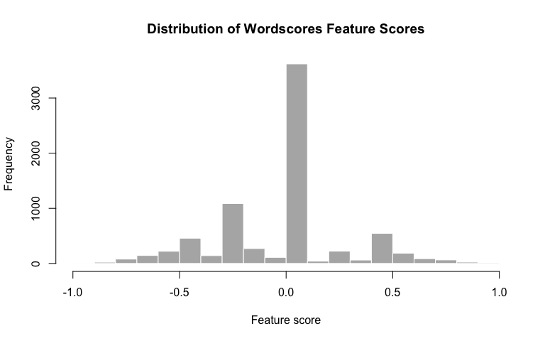
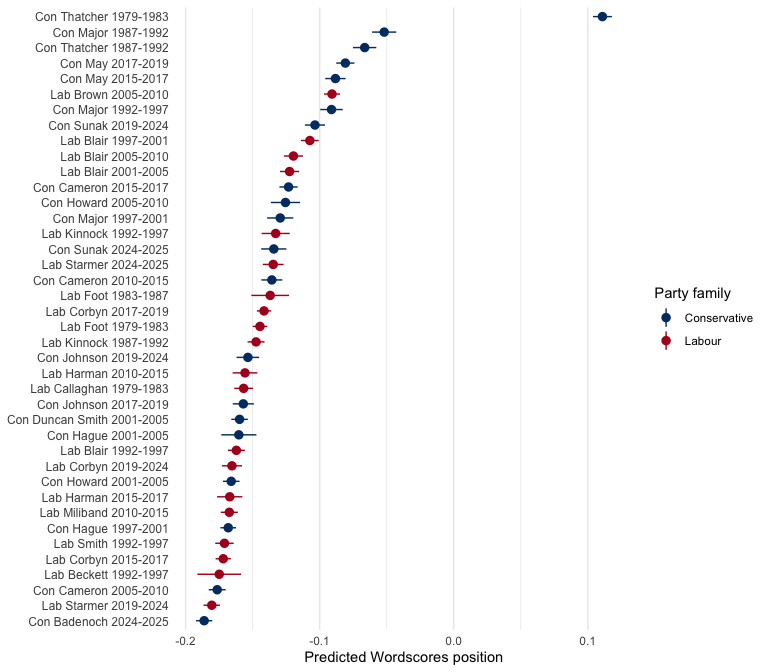
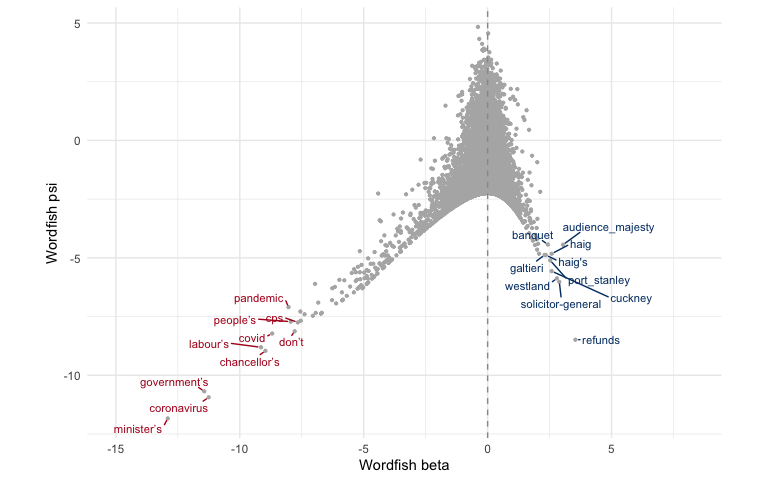
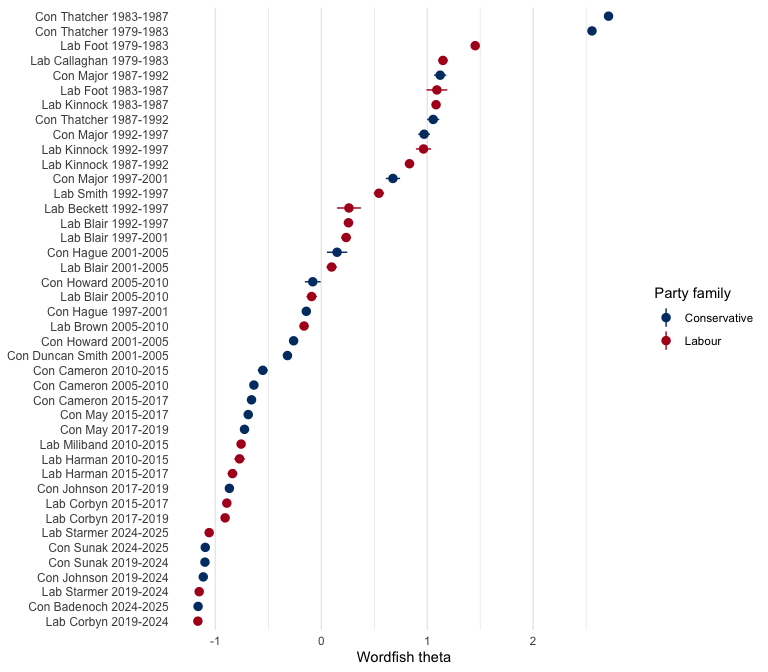
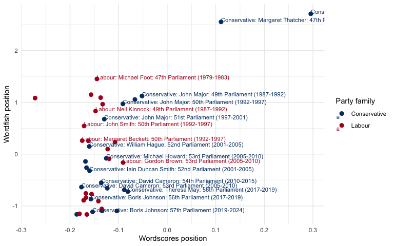
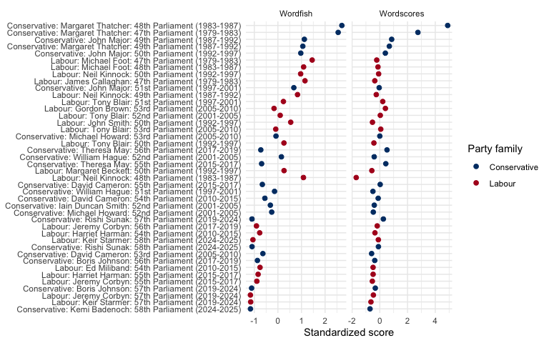
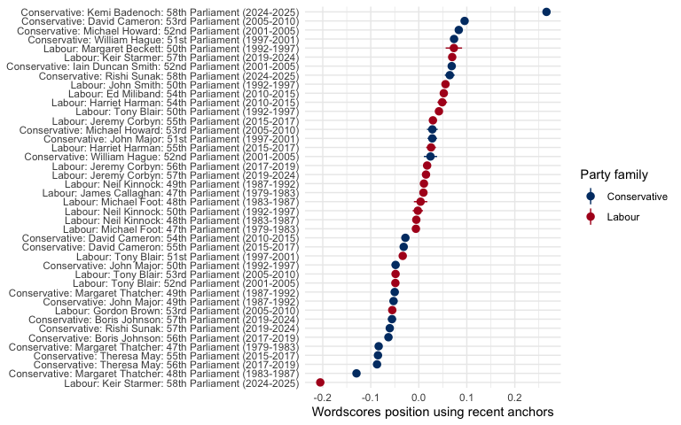
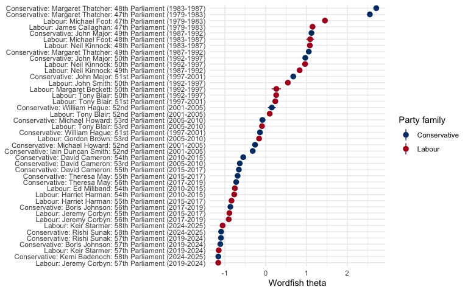
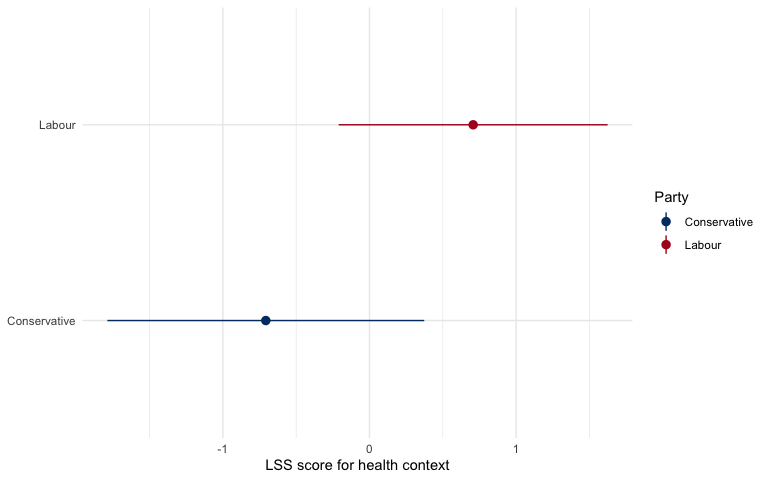

# QTA Lab 06 Answers: Scaling House of Commons speeches


## Learning goals

In this lab, you will learn how to:

- distinguish supervised, unsupervised, and semi-supervised scaling
  methods;
- aggregate short parliamentary speeches into longer political
  documents;
- estimate a Wordscores model using reference texts;
- estimate a Wordfish model without reference scores;
- apply Latent Semantic Scaling (LSS) to economic language;
- compare what different scaling methods appear to measure;
- validate whether an estimated scale means what we think it means;
- think about how LLMs can help, and mislead, when choosing anchors,
  seed words, or prompts.

The running example is a House of Commons leader-period sample. It
contains up to 200 speeches by each Labour and Conservative party leader
in each legislative period from the 47th Parliament, beginning with the
3 May 1979 general election, to the 58th Parliament, beginning with the
4 July 2024 general election.

Scaling methods often work better on longer texts than on single short
interventions, so we combine speeches into leader-election-period
documents: one document for each party leader in each legislative period
in which they served.

The substantive problem is simple but important: if we place
leader-election-period documents on one dimension, what does that
dimension actually capture? It might be party ideology, leader style,
election period, government/opposition role, policy agenda, rhetorical
style, or some mixture of these.

| Question | Evidence we need |
|----|----|
| Do Labour and Conservative leaders separate? | estimated document positions and the words defining the scale |
| Do recent documents separate from older documents? | positions by election period |
| Does the method recover ideology, time, agenda, or style? | validation through features, document reading, and alternative specifications |

## Load packages

``` r
library(dplyr)
library(stringr)
library(ggplot2)
library(quanteda)
library(quanteda.textmodels)
library(quanteda.textstats)
library(quanteda.textplots)
library(LSX)

party_colors <- c(
  "Conservative" = "#003B73",
  "Labour" = "#B00020"
)
```

## Read and prepare the data

``` r
data_path <- "Data/hc_leader_period_sample_1979_2024.rds"

hoc <- readRDS(data_path)

hoc <- hoc |>
  mutate(year = as.integer(format(date, "%Y")))
```

The election dates were scraped from Wikipedia’s list of UK general
elections. Labour and Conservative leadership dates were scraped from
the Wikipedia leader tables. These dates were then used to sample from
the full House of Commons dataset.

The next block checks the sample and then aggregates individual speeches
into one document per leader-election-period combination. This
aggregation step is crucial: the unit of analysis becomes a party leader
in a legislative period, not an individual speech.

For grouping, we need the party, leader, and election number. The
remaining period variables are metadata that we carry along with
`first()`.

``` r
leader_counts <- hoc |>
  count(
    election_no,
    election_period,
    party,
    leader,
    leader_period_start,
    leader_period_end,
    name = "n_speeches"
  )

leader_counts
```

    # A tibble: 42 × 7
       election_no election_period             party      leader leader_period_start
             <int> <chr>                       <chr>      <chr>  <date>             
     1          47 47th Parliament (1979-1983) Conservat… Marga… 1979-05-03         
     2          47 47th Parliament (1979-1983) Labour     James… 1979-05-03         
     3          47 47th Parliament (1979-1983) Labour     Micha… 1980-11-10         
     4          48 48th Parliament (1983-1987) Conservat… Marga… 1983-06-09         
     5          48 48th Parliament (1983-1987) Labour     Micha… 1983-06-09         
     6          48 48th Parliament (1983-1987) Labour     Neil … 1983-10-02         
     7          49 49th Parliament (1987-1992) Conservat… John … 1990-11-27         
     8          49 49th Parliament (1987-1992) Conservat… Marga… 1987-06-11         
     9          49 49th Parliament (1987-1992) Labour     Neil … 1987-06-11         
    10          50 50th Parliament (1992-1997) Conservat… John … 1992-04-09         
    # ℹ 32 more rows
    # ℹ 2 more variables: leader_period_end <date>, n_speeches <int>

``` r
scaling_docs <- hoc |>
  group_by(
    party_family = party,
    leader,
    election_no
  ) |>
  summarise(
    period = first(election_period),
    election_date = first(election_date),
    next_election_date = first(next_election_date),
    leader_period_start = first(leader_period_start),
    leader_period_end = first(leader_period_end),
    text = paste(text, collapse = " "),
    n_speeches = n(),
    .groups = "drop"
  ) |>
  mutate(
    leader_period_doc = paste(party_family, leader, period, sep = ": "),
    party_period = leader_period_doc
  )

scaling_docs |>
  select(party_family, leader, election_no, period, leader_period_start, leader_period_end, n_speeches)
```

    # A tibble: 42 × 7
       party_family leader  election_no period leader_period_start leader_period_end
       <chr>        <chr>         <int> <chr>  <date>              <date>           
     1 Conservative Boris …          56 56th … 2019-07-23          2019-12-11       
     2 Conservative Boris …          57 57th … 2019-12-12          2022-09-05       
     3 Conservative David …          53 53rd … 2005-12-06          2010-05-05       
     4 Conservative David …          54 54th … 2010-05-06          2015-05-06       
     5 Conservative David …          55 55th … 2015-05-07          2016-07-11       
     6 Conservative Iain D…          52 52nd … 2001-09-13          2003-11-06       
     7 Conservative John M…          49 49th … 1990-11-27          1992-04-08       
     8 Conservative John M…          50 50th … 1992-04-09          1997-04-30       
     9 Conservative John M…          51 51st … 1997-05-01          1997-06-19       
    10 Conservative Kemi B…          58 58th … 2024-11-02          2025-12-31       
    # ℹ 32 more rows
    # ℹ 1 more variable: n_speeches <int>

## Create a corpus, tokens, and DFM

``` r
scaling_corpus <- corpus(
  scaling_docs,
  text_field = "text",
  docid_field = "party_period"
)

ndoc(scaling_corpus)
```

    [1] 42

We remove very common parliamentary formulae. Some of these words are
substantively meaningful in other contexts, but here they mostly
identify House of Commons procedure.

``` r
scaling_tokens <- tokens(
  scaling_corpus,
  what = "word",
  remove_punct = TRUE,
  remove_symbols = TRUE,
  remove_numbers = TRUE,
  remove_url = TRUE,
  remove_separators = TRUE,
  split_hyphens = FALSE
) |>
  tokens_tolower() |>
  tokens_remove(stopwords("en")) |>
  tokens_remove(
    c(
      "hon", "member", "right", "friend", "sir", "gentleman",
      "lady", "house", "commons", "speaker", "minister", "secretary"
    )
  )
```

As in earlier labs, we can detect common multi-word expressions and
compound the most frequent collocations.

``` r
hoc_collocations <- scaling_tokens |>
  textstat_collocations(
    min_count = 10,
    size = 2:3
  ) |>
  arrange(desc(lambda))

head(hoc_collocations, 20)
```

                      collocation count count_nested length   lambda         z
    1763                hong kong    32           32      2 17.93094  8.931183
    1500                 per cent   625          625      2 15.71066 11.073456
    1549                    vol c    43           43      2 15.51437 10.565188
    1591                sinn fein    22           22      2 15.36600 10.206267
    1657                ebbw vale    11           11      2 15.28265  9.690906
    1665                bin laden    10           10      2 14.85521  9.627269
    1660            parity esteem    11           11      2 14.69486  9.670222
    1670           waltham forest    10           10      2 14.60389  9.593171
    1653                 lib dems    14           14      2 14.41582  9.714067
    1637             saudi arabia    22           22      2 14.34434  9.841415
    1715             westland plc    10           10      2 13.75658  9.294819
    1693 devolved administrations    22           22      2 13.67137  9.467417
    1725               privy seal    10           10      2 13.66560  9.250856
    1165        chambers commerce    12           12      2 13.16879 14.037963
    1149        buckingham palace    13           13      2 13.12059 14.161554
    289              dispatch box    56           56      2 12.97447 24.660297
    1781           inland revenue    11           11      2 12.84898  8.820461
    1189            bexley sidcup    11           11      2 12.57458 13.772346
    1089     antisocial behaviour    41           41      2 12.34925 14.671744
    489          hereditary peers    20           20      2 12.34023 20.668485

``` r
if (nrow(hoc_collocations) > 0) {
  scaling_tokens <- tokens_compound(
    scaling_tokens,
    phrase(head(hoc_collocations$collocation, 40))
  )
}
```

``` r
scaling_dfm <- dfm(scaling_tokens) |>
  dfm_trim(
    min_termfreq = 5,
    min_docfreq = 2
  )

dim(scaling_dfm)
```

    [1]   42 7398

``` r
topfeatures(scaling_dfm, 30)
```

         prime government     people        can       said    country        now 
          6268       4454       3695       2917       2355       2247       2243 
            us        one       time       made        say       also       make 
          2158       1998       1595       1464       1459       1456       1451 
          last       know    support      today          â      years   european 
          1448       1369       1338       1323       1309       1303       1269 
          many       must        new        way       work       just    british 
          1254       1242       1241       1206       1200       1199       1197 
          year       want 
          1190       1189 

At this point, `scaling_dfm` is the representation used by Wordscores
and Wordfish. Rows are leader-election-period documents; columns are
word features; cells are word counts. Different scaling methods use this
same DFM in different ways.

## Wordscores

Wordscores is a supervised scaling method. We give known reference
scores to anchor texts, and the model estimates word and document scores
from those anchors.

The intuition is:

``` text
reference documents -> word scores -> new document scores
```

If Labour reference documents use a word frequently, that word is pulled
toward the Labour side of the scale. If Conservative reference documents
use it frequently, it is pulled toward the Conservative side. New
documents are then positioned by the weighted average of the words they
contain.

Here, we use Neil Kinnock and Margaret Thatcher in the 48th Parliament
(1983-1987) as the reference texts. Kinnock is the Labour anchor (-1),
and Thatcher is the Conservative anchor (+1). All other leader-period
documents are treated as virgin texts: they are scored by the model, but
they do not define the scale.

``` r
wordscores_anchor_period <- "48th Parliament (1983-1987)"
labour_anchor_leader <- "Neil Kinnock"
conservative_anchor_leader <- "Margaret Thatcher"

docvars(scaling_dfm, "reference_score") <- case_when(
  docvars(scaling_dfm, "party_family") == "Labour" &
    docvars(scaling_dfm, "leader") == labour_anchor_leader &
    docvars(scaling_dfm, "period") == wordscores_anchor_period ~ -1,
  docvars(scaling_dfm, "party_family") == "Conservative" &
    docvars(scaling_dfm, "leader") == conservative_anchor_leader &
    docvars(scaling_dfm, "period") == wordscores_anchor_period ~ 1,
  TRUE ~ NA_real_
)

data.frame(
  document = docnames(scaling_dfm),
  party = docvars(scaling_dfm, "party_family"),
  leader = docvars(scaling_dfm, "leader"),
  period = docvars(scaling_dfm, "period"),
  reference_score = docvars(scaling_dfm, "reference_score")
) |>
  mutate(
    role = if_else(
      is.na(reference_score),
      "virgin text",
      "reference text"
    )
  ) |>
  arrange(is.na(reference_score), party, period)
```

                                                           document        party
    1  Conservative: Margaret Thatcher: 48th Parliament (1983-1987) Conservative
    2             Labour: Neil Kinnock: 48th Parliament (1983-1987)       Labour
    3  Conservative: Margaret Thatcher: 47th Parliament (1979-1983) Conservative
    4         Conservative: John Major: 49th Parliament (1987-1992) Conservative
    5  Conservative: Margaret Thatcher: 49th Parliament (1987-1992) Conservative
    6         Conservative: John Major: 50th Parliament (1992-1997) Conservative
    7         Conservative: John Major: 51st Parliament (1997-2001) Conservative
    8      Conservative: William Hague: 51st Parliament (1997-2001) Conservative
    9  Conservative: Iain Duncan Smith: 52nd Parliament (2001-2005) Conservative
    10    Conservative: Michael Howard: 52nd Parliament (2001-2005) Conservative
    11     Conservative: William Hague: 52nd Parliament (2001-2005) Conservative
    12     Conservative: David Cameron: 53rd Parliament (2005-2010) Conservative
    13    Conservative: Michael Howard: 53rd Parliament (2005-2010) Conservative
    14     Conservative: David Cameron: 54th Parliament (2010-2015) Conservative
    15     Conservative: David Cameron: 55th Parliament (2015-2017) Conservative
    16       Conservative: Theresa May: 55th Parliament (2015-2017) Conservative
    17     Conservative: Boris Johnson: 56th Parliament (2017-2019) Conservative
    18       Conservative: Theresa May: 56th Parliament (2017-2019) Conservative
    19     Conservative: Boris Johnson: 57th Parliament (2019-2024) Conservative
    20       Conservative: Rishi Sunak: 57th Parliament (2019-2024) Conservative
    21     Conservative: Kemi Badenoch: 58th Parliament (2024-2025) Conservative
    22       Conservative: Rishi Sunak: 58th Parliament (2024-2025) Conservative
    23         Labour: James Callaghan: 47th Parliament (1979-1983)       Labour
    24            Labour: Michael Foot: 47th Parliament (1979-1983)       Labour
    25            Labour: Michael Foot: 48th Parliament (1983-1987)       Labour
    26            Labour: Neil Kinnock: 49th Parliament (1987-1992)       Labour
    27              Labour: John Smith: 50th Parliament (1992-1997)       Labour
    28        Labour: Margaret Beckett: 50th Parliament (1992-1997)       Labour
    29            Labour: Neil Kinnock: 50th Parliament (1992-1997)       Labour
    30              Labour: Tony Blair: 50th Parliament (1992-1997)       Labour
    31              Labour: Tony Blair: 51st Parliament (1997-2001)       Labour
    32              Labour: Tony Blair: 52nd Parliament (2001-2005)       Labour
    33            Labour: Gordon Brown: 53rd Parliament (2005-2010)       Labour
    34              Labour: Tony Blair: 53rd Parliament (2005-2010)       Labour
    35             Labour: Ed Miliband: 54th Parliament (2010-2015)       Labour
    36          Labour: Harriet Harman: 54th Parliament (2010-2015)       Labour
    37          Labour: Harriet Harman: 55th Parliament (2015-2017)       Labour
    38           Labour: Jeremy Corbyn: 55th Parliament (2015-2017)       Labour
    39           Labour: Jeremy Corbyn: 56th Parliament (2017-2019)       Labour
    40           Labour: Jeremy Corbyn: 57th Parliament (2019-2024)       Labour
    41            Labour: Keir Starmer: 57th Parliament (2019-2024)       Labour
    42            Labour: Keir Starmer: 58th Parliament (2024-2025)       Labour
                  leader                      period reference_score           role
    1  Margaret Thatcher 48th Parliament (1983-1987)               1 reference text
    2       Neil Kinnock 48th Parliament (1983-1987)              -1 reference text
    3  Margaret Thatcher 47th Parliament (1979-1983)              NA    virgin text
    4         John Major 49th Parliament (1987-1992)              NA    virgin text
    5  Margaret Thatcher 49th Parliament (1987-1992)              NA    virgin text
    6         John Major 50th Parliament (1992-1997)              NA    virgin text
    7         John Major 51st Parliament (1997-2001)              NA    virgin text
    8      William Hague 51st Parliament (1997-2001)              NA    virgin text
    9  Iain Duncan Smith 52nd Parliament (2001-2005)              NA    virgin text
    10    Michael Howard 52nd Parliament (2001-2005)              NA    virgin text
    11     William Hague 52nd Parliament (2001-2005)              NA    virgin text
    12     David Cameron 53rd Parliament (2005-2010)              NA    virgin text
    13    Michael Howard 53rd Parliament (2005-2010)              NA    virgin text
    14     David Cameron 54th Parliament (2010-2015)              NA    virgin text
    15     David Cameron 55th Parliament (2015-2017)              NA    virgin text
    16       Theresa May 55th Parliament (2015-2017)              NA    virgin text
    17     Boris Johnson 56th Parliament (2017-2019)              NA    virgin text
    18       Theresa May 56th Parliament (2017-2019)              NA    virgin text
    19     Boris Johnson 57th Parliament (2019-2024)              NA    virgin text
    20       Rishi Sunak 57th Parliament (2019-2024)              NA    virgin text
    21     Kemi Badenoch 58th Parliament (2024-2025)              NA    virgin text
    22       Rishi Sunak 58th Parliament (2024-2025)              NA    virgin text
    23   James Callaghan 47th Parliament (1979-1983)              NA    virgin text
    24      Michael Foot 47th Parliament (1979-1983)              NA    virgin text
    25      Michael Foot 48th Parliament (1983-1987)              NA    virgin text
    26      Neil Kinnock 49th Parliament (1987-1992)              NA    virgin text
    27        John Smith 50th Parliament (1992-1997)              NA    virgin text
    28  Margaret Beckett 50th Parliament (1992-1997)              NA    virgin text
    29      Neil Kinnock 50th Parliament (1992-1997)              NA    virgin text
    30        Tony Blair 50th Parliament (1992-1997)              NA    virgin text
    31        Tony Blair 51st Parliament (1997-2001)              NA    virgin text
    32        Tony Blair 52nd Parliament (2001-2005)              NA    virgin text
    33      Gordon Brown 53rd Parliament (2005-2010)              NA    virgin text
    34        Tony Blair 53rd Parliament (2005-2010)              NA    virgin text
    35       Ed Miliband 54th Parliament (2010-2015)              NA    virgin text
    36    Harriet Harman 54th Parliament (2010-2015)              NA    virgin text
    37    Harriet Harman 55th Parliament (2015-2017)              NA    virgin text
    38     Jeremy Corbyn 55th Parliament (2015-2017)              NA    virgin text
    39     Jeremy Corbyn 56th Parliament (2017-2019)              NA    virgin text
    40     Jeremy Corbyn 57th Parliament (2019-2024)              NA    virgin text
    41      Keir Starmer 57th Parliament (2019-2024)              NA    virgin text
    42      Keir Starmer 58th Parliament (2024-2025)              NA    virgin text

Only two leader-period documents define the scale. This is close to the
original Wordscores logic: use a small number of substantively
meaningful reference texts, then ask where the other documents fall
relative to those anchors.

``` r
count(
  data.frame(reference_score = docvars(scaling_dfm, "reference_score")),
  reference_score
)
```

      reference_score  n
    1              -1  1
    2               1  1
    3              NA 40

``` r
hoc_wordscores <- textmodel_wordscores(
  scaling_dfm,
  y = docvars(scaling_dfm, "reference_score"),
  smooth = 1
)

summary(hoc_wordscores, n = 10)
```


    Call:
    textmodel_wordscores.dfm(x = scaling_dfm, y = docvars(scaling_dfm, 
        "reference_score"), smooth = 1)

    Reference Document Statistics:
                                                                 score total min
    Conservative: Boris Johnson: 56th Parliament (2017-2019)        NA  8317   0
    Conservative: Boris Johnson: 57th Parliament (2019-2024)        NA  7163   0
    Conservative: David Cameron: 53rd Parliament (2005-2010)        NA 13868   0
    Conservative: David Cameron: 54th Parliament (2010-2015)        NA  8526   0
    Conservative: David Cameron: 55th Parliament (2015-2017)        NA 11397   0
    Conservative: Iain Duncan Smith: 52nd Parliament (2001-2005)    NA 14132   0
    Conservative: John Major: 49th Parliament (1987-1992)           NA  7362   0
    Conservative: John Major: 50th Parliament (1992-1997)           NA  8320   0
    Conservative: John Major: 51st Parliament (1997-2001)           NA  5833   0
    Conservative: Kemi Badenoch: 58th Parliament (2024-2025)        NA 14195   0
    Conservative: Margaret Thatcher: 47th Parliament (1979-1983)    NA 15989   0
    Conservative: Margaret Thatcher: 48th Parliament (1983-1987)     1 12183   0
    Conservative: Margaret Thatcher: 49th Parliament (1987-1992)    NA  7738   0
    Conservative: Michael Howard: 52nd Parliament (2001-2005)       NA 14131   0
    Conservative: Michael Howard: 53rd Parliament (2005-2010)       NA  4534   0
    Conservative: Rishi Sunak: 57th Parliament (2019-2024)          NA  9095   0
    Conservative: Rishi Sunak: 58th Parliament (2024-2025)          NA  5883   0
    Conservative: Theresa May: 55th Parliament (2015-2017)          NA  9710   0
    Conservative: Theresa May: 56th Parliament (2017-2019)          NA 11402   0
    Conservative: William Hague: 51st Parliament (1997-2001)        NA 15409   0
    Conservative: William Hague: 52nd Parliament (2001-2005)        NA  2885   0
    Labour: Ed Miliband: 54th Parliament (2010-2015)                NA 13841   0
    Labour: Gordon Brown: 53rd Parliament (2005-2010)               NA 14880   0
    Labour: Harriet Harman: 54th Parliament (2010-2015)             NA  5919   0
    Labour: Harriet Harman: 55th Parliament (2015-2017)             NA  5877   0
    Labour: James Callaghan: 47th Parliament (1979-1983)            NA 11310   0
    Labour: Jeremy Corbyn: 55th Parliament (2015-2017)              NA 15856   0
    Labour: Jeremy Corbyn: 56th Parliament (2017-2019)              NA 17873   0
    Labour: Jeremy Corbyn: 57th Parliament (2019-2024)              NA  9145   0
    Labour: John Smith: 50th Parliament (1992-1997)                 NA 11293   0
    Labour: Keir Starmer: 57th Parliament (2019-2024)               NA 13318   0
    Labour: Keir Starmer: 58th Parliament (2024-2025)               NA  8521   0
    Labour: Margaret Beckett: 50th Parliament (1992-1997)           NA  2100   0
    Labour: Michael Foot: 47th Parliament (1979-1983)               NA 17793   0
    Labour: Michael Foot: 48th Parliament (1983-1987)               NA  2596   0
    Labour: Neil Kinnock: 48th Parliament (1983-1987)               -1 16106   0
    Labour: Neil Kinnock: 49th Parliament (1987-1992)               NA 13529   0
    Labour: Neil Kinnock: 50th Parliament (1992-1997)               NA  4986   0
    Labour: Tony Blair: 50th Parliament (1992-1997)                 NA 13655   0
    Labour: Tony Blair: 51st Parliament (1997-2001)                 NA 12074   0
    Labour: Tony Blair: 52nd Parliament (2001-2005)                 NA 10857   0
    Labour: Tony Blair: 53rd Parliament (2005-2010)                 NA 10583   0
                                                                 max   mean median
    Conservative: Boris Johnson: 56th Parliament (2017-2019)     107 1.1242      0
    Conservative: Boris Johnson: 57th Parliament (2019-2024)     100 0.9682      0
    Conservative: David Cameron: 53rd Parliament (2005-2010)     504 1.8746      0
    Conservative: David Cameron: 54th Parliament (2010-2015)     107 1.1525      0
    Conservative: David Cameron: 55th Parliament (2015-2017)     129 1.5406      0
    Conservative: Iain Duncan Smith: 52nd Parliament (2001-2005) 419 1.9102      0
    Conservative: John Major: 49th Parliament (1987-1992)         54 0.9951      0
    Conservative: John Major: 50th Parliament (1992-1997)         55 1.1246      0
    Conservative: John Major: 51st Parliament (1997-2001)         87 0.7885      0
    Conservative: Kemi Badenoch: 58th Parliament (2024-2025)     410 1.9188      0
    Conservative: Margaret Thatcher: 47th Parliament (1979-1983) 224 2.1613      0
    Conservative: Margaret Thatcher: 48th Parliament (1983-1987) 331 1.6468      0
    Conservative: Margaret Thatcher: 49th Parliament (1987-1992)  83 1.0460      0
    Conservative: Michael Howard: 52nd Parliament (2001-2005)    479 1.9101      0
    Conservative: Michael Howard: 53rd Parliament (2005-2010)    121 0.6129      0
    Conservative: Rishi Sunak: 57th Parliament (2019-2024)        90 1.2294      0
    Conservative: Rishi Sunak: 58th Parliament (2024-2025)       131 0.7952      0
    Conservative: Theresa May: 55th Parliament (2015-2017)       109 1.3125      0
    Conservative: Theresa May: 56th Parliament (2017-2019)       114 1.5412      0
    Conservative: William Hague: 51st Parliament (1997-2001)     446 2.0829      0
    Conservative: William Hague: 52nd Parliament (2001-2005)      61 0.3900      0
    Labour: Ed Miliband: 54th Parliament (2010-2015)             423 1.8709      0
    Labour: Gordon Brown: 53rd Parliament (2005-2010)            157 2.0114      0
    Labour: Harriet Harman: 54th Parliament (2010-2015)          150 0.8001      0
    Labour: Harriet Harman: 55th Parliament (2015-2017)          136 0.7944      0
    Labour: James Callaghan: 47th Parliament (1979-1983)         148 1.5288      0
    Labour: Jeremy Corbyn: 55th Parliament (2015-2017)           356 2.1433      0
    Labour: Jeremy Corbyn: 56th Parliament (2017-2019)           404 2.4159      0
    Labour: Jeremy Corbyn: 57th Parliament (2019-2024)           165 1.2361      0
    Labour: John Smith: 50th Parliament (1992-1997)              275 1.5265      0
    Labour: Keir Starmer: 57th Parliament (2019-2024)            426 1.8002      0
    Labour: Keir Starmer: 58th Parliament (2024-2025)             73 1.1518      0
    Labour: Margaret Beckett: 50th Parliament (1992-1997)         75 0.2839      0
    Labour: Michael Foot: 47th Parliament (1979-1983)            281 2.4051      0
    Labour: Michael Foot: 48th Parliament (1983-1987)             49 0.3509      0
    Labour: Neil Kinnock: 48th Parliament (1983-1987)            194 2.1771      0
    Labour: Neil Kinnock: 49th Parliament (1987-1992)            263 1.8287      0
    Labour: Neil Kinnock: 50th Parliament (1992-1997)             97 0.6740      0
    Labour: Tony Blair: 50th Parliament (1992-1997)              267 1.8458      0
    Labour: Tony Blair: 51st Parliament (1997-2001)              116 1.6321      0
    Labour: Tony Blair: 52nd Parliament (2001-2005)              118 1.4676      0
    Labour: Tony Blair: 53rd Parliament (2005-2010)              108 1.4305      0

    Wordscores:
    (showing first 10 elements)
            good          see conservative        party        heart          can 
        -0.16265     -0.09229     -0.70724     -0.65869      0.09105     -0.56288 
             say       labour          let         just 
        -0.58789     -0.34316     -0.11097     -0.60212 

The `smooth = 1` setting avoids zero probabilities for words that appear
in one set of reference documents but not the other. This is useful in
sparse text data, where many words appear in only a small number of
documents.

Inspect words at each end of the Wordscores dimension.

``` r
head(sort(hoc_wordscores$wordscores), 20)
```

          cuts minister's        ask    poverty     saying    conduct    workers 
    -0.9083717 -0.9047357 -0.8867615 -0.8680962 -0.8518122 -0.8420632 -0.8420632 
       welcome       bill     lady's        got    obvious       tory     crisis 
    -0.8181340 -0.8181340 -0.8181340 -0.8181340 -0.8181340 -0.8181340 -0.8109741 
         thank   entirely    perhaps    explain    failure      night 
    -0.8032274 -0.8032274 -0.8032274 -0.8032274 -0.8032274 -0.8032274 

``` r
tail(sort(hoc_wordscores$wordscores), 20)
```

             lasting          banquet           agreed           others 
           0.8461949        0.8461949        0.8567720        0.8569257 
           attending            shall         addition             king 
           0.8591928        0.8637969        0.8715944        0.8876711 
         community's            later      accompanied          morning 
           0.8876711        0.8907403        0.9065678        0.9245493 
          colleagues         presided          evening audience_majesty 
           0.9340430        0.9476587        0.9541414        0.9601707 
            meetings            queen           duties      ministerial 
           0.9606411        0.9665647        0.9804743        0.9807005 

``` r
hist(
  hoc_wordscores$wordscores,
  col = "grey70",
  border = "white",
  main = "Distribution of Wordscores Feature Scores",
  xlab = "Feature score"
)
```



Now predict document scores for all leader-election-period documents.

``` r
hoc_wordscores_pred <- predict(
  hoc_wordscores,
  newdata = scaling_dfm,
  se = TRUE
)

wordscores_document_scores <- data.frame(
  party_period = docnames(scaling_dfm),
  party_family = docvars(scaling_dfm, "party_family"),
  leader = docvars(scaling_dfm, "leader"),
  period = docvars(scaling_dfm, "period"),
  reference_score = docvars(scaling_dfm, "reference_score"),
  wordscores = as.numeric(hoc_wordscores_pred$fit),
  se = as.numeric(hoc_wordscores_pred$se.fit)
)

wordscores_document_scores <- wordscores_document_scores |>
  mutate(
    party_short = recode(
      party_family,
      "Conservative" = "Con",
      "Labour" = "Lab"
    ),
    period_years = str_extract(period, "\\d{4}-\\d{4}"),
    leader_short = case_when(
      leader == "Iain Duncan Smith" ~ "Duncan Smith",
      TRUE ~ str_replace(leader, "^.* ", "")
    ),
    plot_label = paste(party_short, leader_short, period_years)
)

wordscores_document_scores |>
  arrange(wordscores)
```

                                                       party_period party_family
    1             Labour: Neil Kinnock: 48th Parliament (1983-1987)       Labour
    2      Conservative: Kemi Badenoch: 58th Parliament (2024-2025) Conservative
    3             Labour: Keir Starmer: 57th Parliament (2019-2024)       Labour
    4      Conservative: David Cameron: 53rd Parliament (2005-2010) Conservative
    5         Labour: Margaret Beckett: 50th Parliament (1992-1997)       Labour
    6            Labour: Jeremy Corbyn: 55th Parliament (2015-2017)       Labour
    7               Labour: John Smith: 50th Parliament (1992-1997)       Labour
    8      Conservative: William Hague: 51st Parliament (1997-2001) Conservative
    9              Labour: Ed Miliband: 54th Parliament (2010-2015)       Labour
    10          Labour: Harriet Harman: 55th Parliament (2015-2017)       Labour
    11    Conservative: Michael Howard: 52nd Parliament (2001-2005) Conservative
    12           Labour: Jeremy Corbyn: 57th Parliament (2019-2024)       Labour
    13              Labour: Tony Blair: 50th Parliament (1992-1997)       Labour
    14     Conservative: William Hague: 52nd Parliament (2001-2005) Conservative
    15 Conservative: Iain Duncan Smith: 52nd Parliament (2001-2005) Conservative
    16     Conservative: Boris Johnson: 56th Parliament (2017-2019) Conservative
    17         Labour: James Callaghan: 47th Parliament (1979-1983)       Labour
    18          Labour: Harriet Harman: 54th Parliament (2010-2015)       Labour
    19     Conservative: Boris Johnson: 57th Parliament (2019-2024) Conservative
    20            Labour: Neil Kinnock: 49th Parliament (1987-1992)       Labour
    21            Labour: Michael Foot: 47th Parliament (1979-1983)       Labour
    22           Labour: Jeremy Corbyn: 56th Parliament (2017-2019)       Labour
    23            Labour: Michael Foot: 48th Parliament (1983-1987)       Labour
    24     Conservative: David Cameron: 54th Parliament (2010-2015) Conservative
    25            Labour: Keir Starmer: 58th Parliament (2024-2025)       Labour
    26       Conservative: Rishi Sunak: 58th Parliament (2024-2025) Conservative
    27            Labour: Neil Kinnock: 50th Parliament (1992-1997)       Labour
    28        Conservative: John Major: 51st Parliament (1997-2001) Conservative
    29    Conservative: Michael Howard: 53rd Parliament (2005-2010) Conservative
    30     Conservative: David Cameron: 55th Parliament (2015-2017) Conservative
    31              Labour: Tony Blair: 52nd Parliament (2001-2005)       Labour
    32              Labour: Tony Blair: 53rd Parliament (2005-2010)       Labour
    33              Labour: Tony Blair: 51st Parliament (1997-2001)       Labour
    34       Conservative: Rishi Sunak: 57th Parliament (2019-2024) Conservative
    35        Conservative: John Major: 50th Parliament (1992-1997) Conservative
    36            Labour: Gordon Brown: 53rd Parliament (2005-2010)       Labour
    37       Conservative: Theresa May: 55th Parliament (2015-2017) Conservative
    38       Conservative: Theresa May: 56th Parliament (2017-2019) Conservative
    39 Conservative: Margaret Thatcher: 49th Parliament (1987-1992) Conservative
    40        Conservative: John Major: 49th Parliament (1987-1992) Conservative
    41 Conservative: Margaret Thatcher: 47th Parliament (1979-1983) Conservative
    42 Conservative: Margaret Thatcher: 48th Parliament (1983-1987) Conservative
                  leader                      period reference_score  wordscores
    1       Neil Kinnock 48th Parliament (1983-1987)              -1 -0.27185385
    2      Kemi Badenoch 58th Parliament (2024-2025)              NA -0.18615377
    3       Keir Starmer 57th Parliament (2019-2024)              NA -0.18048298
    4      David Cameron 53rd Parliament (2005-2010)              NA -0.17643363
    5   Margaret Beckett 50th Parliament (1992-1997)              NA -0.17489738
    6      Jeremy Corbyn 55th Parliament (2015-2017)              NA -0.17190126
    7         John Smith 50th Parliament (1992-1997)              NA -0.17102229
    8      William Hague 51st Parliament (1997-2001)              NA -0.16820485
    9        Ed Miliband 54th Parliament (2010-2015)              NA -0.16739380
    10    Harriet Harman 55th Parliament (2015-2017)              NA -0.16708859
    11    Michael Howard 52nd Parliament (2001-2005)              NA -0.16597280
    12     Jeremy Corbyn 57th Parliament (2019-2024)              NA -0.16543769
    13        Tony Blair 50th Parliament (1992-1997)              NA -0.16212534
    14     William Hague 52nd Parliament (2001-2005)              NA -0.16029646
    15 Iain Duncan Smith 52nd Parliament (2001-2005)              NA -0.15975368
    16     Boris Johnson 56th Parliament (2017-2019)              NA -0.15695975
    17   James Callaghan 47th Parliament (1979-1983)              NA -0.15671399
    18    Harriet Harman 54th Parliament (2010-2015)              NA -0.15569062
    19     Boris Johnson 57th Parliament (2019-2024)              NA -0.15353738
    20      Neil Kinnock 49th Parliament (1987-1992)              NA -0.14744458
    21      Michael Foot 47th Parliament (1979-1983)              NA -0.14454714
    22     Jeremy Corbyn 56th Parliament (2017-2019)              NA -0.14149581
    23      Michael Foot 48th Parliament (1983-1987)              NA -0.13689588
    24     David Cameron 54th Parliament (2010-2015)              NA -0.13566477
    25      Keir Starmer 58th Parliament (2024-2025)              NA -0.13465399
    26       Rishi Sunak 58th Parliament (2024-2025)              NA -0.13420256
    27      Neil Kinnock 50th Parliament (1992-1997)              NA -0.13282116
    28        John Major 51st Parliament (1997-2001)              NA -0.12941511
    29    Michael Howard 53rd Parliament (2005-2010)              NA -0.12551050
    30     David Cameron 55th Parliament (2015-2017)              NA -0.12320690
    31        Tony Blair 52nd Parliament (2001-2005)              NA -0.12245878
    32        Tony Blair 53rd Parliament (2005-2010)              NA -0.11956754
    33        Tony Blair 51st Parliament (1997-2001)              NA -0.10732375
    34       Rishi Sunak 57th Parliament (2019-2024)              NA -0.10351507
    35        John Major 50th Parliament (1992-1997)              NA -0.09117193
    36      Gordon Brown 53rd Parliament (2005-2010)              NA -0.09080183
    37       Theresa May 55th Parliament (2015-2017)              NA -0.08823139
    38       Theresa May 56th Parliament (2017-2019)              NA -0.08084793
    39 Margaret Thatcher 49th Parliament (1987-1992)              NA -0.06642585
    40        John Major 49th Parliament (1987-1992)              NA -0.05185996
    41 Margaret Thatcher 47th Parliament (1979-1983)              NA  0.11090522
    42 Margaret Thatcher 48th Parliament (1983-1987)               1  0.29558338
                se party_short period_years leader_short                 plot_label
    1  0.002652711         Lab    1983-1987      Kinnock      Lab Kinnock 1983-1987
    2  0.003067769         Con    2024-2025     Badenoch     Con Badenoch 2024-2025
    3  0.003155058         Lab    2019-2024      Starmer      Lab Starmer 2019-2024
    4  0.003219291         Con    2005-2010      Cameron      Con Cameron 2005-2010
    5  0.008328471         Lab    1992-1997      Beckett      Lab Beckett 1992-1997
    6  0.002921759         Lab    2015-2017       Corbyn       Lab Corbyn 2015-2017
    7  0.003503362         Lab    1992-1997        Smith        Lab Smith 1992-1997
    8  0.002999695         Con    1997-2001        Hague        Con Hague 1997-2001
    9  0.003238536         Lab    2010-2015     Miliband     Lab Miliband 2010-2015
    10 0.004819536         Lab    2015-2017       Harman       Lab Harman 2015-2017
    11 0.003161558         Con    2001-2005       Howard       Con Howard 2001-2005
    12 0.003840658         Lab    2019-2024       Corbyn       Lab Corbyn 2019-2024
    13 0.003235358         Lab    1992-1997        Blair        Lab Blair 1992-1997
    14 0.006686599         Con    2001-2005        Hague        Con Hague 2001-2005
    15 0.003142269         Con    2001-2005 Duncan Smith Con Duncan Smith 2001-2005
    16 0.004008510         Con    2017-2019      Johnson      Con Johnson 2017-2019
    17 0.003568231         Lab    1979-1983    Callaghan    Lab Callaghan 1979-1983
    18 0.004704157         Lab    2010-2015       Harman       Lab Harman 2010-2015
    19 0.004304929         Con    2019-2024      Johnson      Con Johnson 2019-2024
    20 0.003228504         Lab    1987-1992      Kinnock      Lab Kinnock 1987-1992
    21 0.002776085         Lab    1979-1983         Foot         Lab Foot 1979-1983
    22 0.002739838         Lab    2017-2019       Corbyn       Lab Corbyn 2017-2019
    23 0.007192522         Lab    1983-1987         Foot         Lab Foot 1983-1987
    24 0.003982579         Con    2010-2015      Cameron      Con Cameron 2010-2015
    25 0.003959766         Lab    2024-2025      Starmer      Lab Starmer 2024-2025
    26 0.004801283         Con    2024-2025        Sunak        Con Sunak 2024-2025
    27 0.005363934         Lab    1992-1997      Kinnock      Lab Kinnock 1992-1997
    28 0.004973253         Con    1997-2001        Major        Con Major 1997-2001
    29 0.005557464         Con    2005-2010       Howard       Con Howard 2005-2010
    30 0.003475380         Con    2015-2017      Cameron      Con Cameron 2015-2017
    31 0.003634022         Lab    2001-2005        Blair        Lab Blair 2001-2005
    32 0.003638518         Lab    2005-2010        Blair        Lab Blair 2005-2010
    33 0.003386695         Lab    1997-2001        Blair        Lab Blair 1997-2001
    34 0.003832252         Con    2019-2024        Sunak        Con Sunak 2019-2024
    35 0.004288364         Con    1992-1997        Major        Con Major 1992-1997
    36 0.003033023         Lab    2005-2010        Brown        Lab Brown 2005-2010
    37 0.003876645         Con    2015-2017          May          Con May 2015-2017
    38 0.003462364         Con    2017-2019          May          Con May 2017-2019
    39 0.004440325         Con    1987-1992     Thatcher     Con Thatcher 1987-1992
    40 0.004615152         Con    1987-1992        Major        Con Major 1987-1992
    41 0.003600196         Con    1979-1983     Thatcher     Con Thatcher 1979-1983
    42 0.004070390         Con    1983-1987     Thatcher     Con Thatcher 1983-1987

The two reference documents define the endpoints of the scale, so they
sit far away from the other documents. To make the predicted positions
easier to inspect, the plot below focuses on the non-reference
leader-period documents only.

``` r
wordscores_virgin_scores <- wordscores_document_scores |>
  filter(is.na(reference_score))

ggplot(
  wordscores_virgin_scores,
  aes(
    x = reorder(plot_label, wordscores),
    y = wordscores,
    ymin = wordscores - 1.96 * se,
    ymax = wordscores + 1.96 * se,
    color = party_family
  )
) +
  geom_pointrange() +
  coord_flip() +
  labs(
    x = NULL,
    y = "Predicted Wordscores position",
    color = "Party family"
  ) +
  scale_color_manual(values = party_colors) +
  theme_minimal() +
  theme(
    axis.text.y = element_text(size = 9),
    panel.grid.major.y = element_blank()
  )
```



The interpretation depends heavily on the reference texts. If the Labour
and Conservative documents differ by period, topic, office status, or
parliamentary role, Wordscores may partly pick up those differences too.

## Wordfish

Wordfish is an unsupervised scaling method. It estimates a latent
dimension without reference scores. Instead of telling the model where
Labour and Conservative should sit, we ask it to find the strongest
pattern of word-use differences in the DFM.

This makes Wordfish powerful but also risky. The strongest pattern may
be ideological, but it may also be election period, leader style,
parliamentary role, policy agenda, or style. We still choose the
direction of the scale after estimation. To make the Wordfish scale
easier to compare with Wordscores, we orient it using the same 1983-1987
leader-period documents: Neil Kinnock lower than Margaret Thatcher. This
does not make Wordfish supervised; it only fixes which side of the
estimated dimension is treated as low or high.

``` r
labour_anchor_index <- which(
  docvars(scaling_dfm, "party_family") == "Labour" &
    docvars(scaling_dfm, "leader") == labour_anchor_leader &
    docvars(scaling_dfm, "period") == wordscores_anchor_period
)

conservative_anchor_index <- which(
  docvars(scaling_dfm, "party_family") == "Conservative" &
    docvars(scaling_dfm, "leader") == conservative_anchor_leader &
    docvars(scaling_dfm, "period") == wordscores_anchor_period
)

hoc_wordfish <- textmodel_wordfish(
  scaling_dfm,
  dir = c(labour_anchor_index, conservative_anchor_index)
)

summary(hoc_wordfish)
```


    Call:
    textmodel_wordfish.dfm(x = scaling_dfm, dir = c(labour_anchor_index, 
        conservative_anchor_index))

    Estimated Document Positions:
                                                                    theta       se
    Conservative: Boris Johnson: 56th Parliament (2017-2019)     -0.86763 0.018899
    Conservative: Boris Johnson: 57th Parliament (2019-2024)     -1.11420 0.011534
    Conservative: David Cameron: 53rd Parliament (2005-2010)     -0.63640 0.018313
    Conservative: David Cameron: 54th Parliament (2010-2015)     -0.55212 0.024479
    Conservative: David Cameron: 55th Parliament (2015-2017)     -0.65875 0.019905
    Conservative: Iain Duncan Smith: 52nd Parliament (2001-2005) -0.31967 0.020677
    Conservative: John Major: 49th Parliament (1987-1992)         1.12198 0.029571
    Conservative: John Major: 50th Parliament (1992-1997)         0.97017 0.028280
    Conservative: John Major: 51st Parliament (1997-2001)         0.67577 0.034502
    Conservative: Kemi Badenoch: 58th Parliament (2024-2025)     -1.16312 0.006895
    Conservative: Margaret Thatcher: 47th Parliament (1979-1983)  2.55446 0.014715
    Conservative: Margaret Thatcher: 48th Parliament (1983-1987)  2.71074 0.016064
    Conservative: Margaret Thatcher: 49th Parliament (1987-1992)  1.05594 0.029064
    Conservative: Michael Howard: 52nd Parliament (2001-2005)    -0.26149 0.020969
    Conservative: Michael Howard: 53rd Parliament (2005-2010)    -0.08076 0.038200
    Conservative: Rishi Sunak: 57th Parliament (2019-2024)       -1.09812 0.010786
    Conservative: Rishi Sunak: 58th Parliament (2024-2025)       -1.09510 0.013540
    Conservative: Theresa May: 55th Parliament (2015-2017)       -0.68950 0.021093
    Conservative: Theresa May: 56th Parliament (2017-2019)       -0.72494 0.018920
    Conservative: William Hague: 51st Parliament (1997-2001)     -0.14160 0.020545
    Conservative: William Hague: 52nd Parliament (2001-2005)      0.14848 0.048947
    Labour: Ed Miliband: 54th Parliament (2010-2015)             -0.75709 0.016682
    Labour: Gordon Brown: 53rd Parliament (2005-2010)            -0.16291 0.020833
    Labour: Harriet Harman: 54th Parliament (2010-2015)          -0.77160 0.025146
    Labour: Harriet Harman: 55th Parliament (2015-2017)          -0.83861 0.023384
    Labour: James Callaghan: 47th Parliament (1979-1983)          1.14797 0.023786
    Labour: Jeremy Corbyn: 55th Parliament (2015-2017)           -0.89180 0.013201
    Labour: Jeremy Corbyn: 56th Parliament (2017-2019)           -0.90802 0.012112
    Labour: Jeremy Corbyn: 57th Parliament (2019-2024)           -1.16497 0.008531
    Labour: John Smith: 50th Parliament (1992-1997)               0.54374 0.024924
    Labour: Keir Starmer: 57th Parliament (2019-2024)            -1.15269 0.007397
    Labour: Keir Starmer: 58th Parliament (2024-2025)            -1.05839 0.012559
    Labour: Margaret Beckett: 50th Parliament (1992-1997)         0.26077 0.057657
    Labour: Michael Foot: 47th Parliament (1979-1983)             1.45237 0.018140
    Labour: Michael Foot: 48th Parliament (1983-1987)             1.09072 0.049941
    Labour: Neil Kinnock: 48th Parliament (1983-1987)             1.08290 0.020089
    Labour: Neil Kinnock: 49th Parliament (1987-1992)             0.83223 0.022445
    Labour: Neil Kinnock: 50th Parliament (1992-1997)             0.96452 0.036541
    Labour: Tony Blair: 50th Parliament (1992-1997)               0.25640 0.022639
    Labour: Tony Blair: 51st Parliament (1997-2001)               0.23432 0.024055
    Labour: Tony Blair: 52nd Parliament (2001-2005)               0.09742 0.025164
    Labour: Tony Blair: 53rd Parliament (2005-2010)              -0.09141 0.024977

    Estimated Feature Scores:
             good     see conservative   party   heart     can     say  labour
    beta -0.06247 -0.1134      0.01775 -0.1172 -0.5175 -0.2247 -0.1499 -0.2569
    psi   2.65956  2.8493      2.79962  3.1251  0.9448  4.1126  3.4322  3.1160
             let    just something  record     past     three   years measure
    beta -0.4883 -0.5334   -0.3442 -0.1884 0.003176 -0.007632 0.04225  0.1887
    psi   2.8650  3.1299    1.8390  2.0571 2.359778  2.043298 3.32891  0.5707
         opportunity   every   child      now   better  school comfort   person
    beta    0.004996 -0.3186 -0.3995 -0.09884 -0.02699 -0.4647  0.4418 -0.07083
    psi     1.977323  2.9106  1.3254  3.86807  2.39906  1.2979 -1.0015  0.89094
             job   first    time     life   hope disadvantaged
    beta -0.2408 0.06443 0.02665 -0.04905 0.3598       -0.4451
    psi   1.8804 3.22356 3.53159  1.78002 2.8130       -1.5284

## Inspect Wordfish features

Wordfish estimates word-level parameters. The `beta` parameter captures
a word’s estimated position on the latent dimension. Words with large
positive or negative `beta` values are especially useful for
interpreting what the scale seems to measure. The `psi` parameter
captures how common a word is overall.

``` r
wordfish_feature_scores <- data.frame(
  beta = hoc_wordfish$beta,
  psi = hoc_wordfish$psi,
  feature = hoc_wordfish$features
)

wordfish_feature_scores |>
  arrange(beta) |>
  head(20)
```

             beta        psi      feature
    1  -12.907559 -11.838187   minister’s
    2  -11.436569 -10.683355 government’s
    3  -11.257983 -10.940472  coronavirus
    4   -9.144346  -8.809127     labour’s
    5   -8.965260  -8.958511 chancellor’s
    6   -8.691880  -8.222570        covid
    7   -8.034005  -7.099999     pandemic
    8   -7.947950  -7.716874     people’s
    9   -7.786676  -8.127578        don’t
    10  -7.656730  -7.748748          cps
    11  -7.554515  -7.285465      today’s
    12  -7.539238  -7.674220     lockdown
    13  -7.387355  -7.402904      putin’s
    14  -7.052043  -7.468504      david’s
    15  -6.963887  -6.109091        virus
    16  -6.936531  -7.343106    two-child
    17  -6.832945  -6.905417    country’s
    18  -6.726526  -7.378056  secretary’s
    19  -6.689749  -7.338308       stolen
    20  -6.278624  -6.800342 self-isolate

``` r
wordfish_feature_scores |>
  arrange(desc(beta)) |>
  head(20)
```

           beta        psi           feature
    1  3.542106 -8.4844505           refunds
    2  3.044517 -4.4404037  audience_majesty
    3  2.892905 -6.0261527 solicitor-general
    4  2.795024 -5.8742753          westland
    5  2.587009 -4.8244666              haig
    6  2.581659 -5.5650142           cuckney
    7  2.526413 -5.1104142      port_stanley
    8  2.426675 -4.4314245           banquet
    9  2.348896 -4.8795056            haig's
    10 2.297968 -4.8753682          galtieri
    11 2.122780 -2.1865042         argentine
    12 2.075011 -4.8239199         antarctic
    13 2.036256 -4.3991642            refund
    14 2.008130 -3.3370639         islanders
    15 2.003087 -4.1907065           hussein
    16 2.002542 -0.9265877          presided
    17 1.997871 -4.6489818            signor
    18 1.980499 -4.1400295              bonn
    19 1.977109 -3.7269836            venice
    20 1.929207 -4.0260479          deptford

``` r
wordfish_feature_labels <- bind_rows(
  wordfish_feature_scores |>
    slice_min(order_by = beta, n = 10, with_ties = FALSE) |>
    mutate(direction = "Low beta"),
  wordfish_feature_scores |>
    slice_max(order_by = beta, n = 10, with_ties = FALSE) |>
    mutate(direction = "High beta")
)

ggplot(wordfish_feature_scores, aes(x = beta, y = psi)) +
  geom_point(color = "grey70", size = 0.8) +
  geom_vline(xintercept = 0, linetype = "dashed", color = "grey60") +
  ggrepel::geom_text_repel(
    data = wordfish_feature_labels,
    aes(label = feature, color = direction),
    size = 3,
    nudge_x = if_else(wordfish_feature_labels$direction == "Low beta", -0.6, 0.6),
    max.overlaps = Inf,
    box.padding = 0.25,
    point.padding = 0.15,
    min.segment.length = 0,
    seed = 20260713,
    show.legend = FALSE
  ) +
  labs(
    x = "Wordfish beta",
    y = "Wordfish psi",
    color = NULL
  ) +
  scale_color_manual(
    values = c("Low beta" = "#B00020", "High beta" = "#003B73")
  ) +
  scale_x_continuous(expand = expansion(mult = c(0.15, 0.30))) +
  coord_cartesian(clip = "off") +
  theme_minimal() +
  theme(
    legend.position = "none",
    plot.margin = margin(5.5, 35, 5.5, 35)
  )
```



## Inspect Wordfish document positions

The document positions are stored in `theta`. These are the estimated
locations of the leader-election-period documents on the Wordfish
dimension. The sign of the scale is arbitrary until we orient it, so
interpretation should focus on the ordering and on the words that define
the extremes.

``` r
wordfish_document_scores <- data.frame(
  party_period = docnames(scaling_dfm),
  party_family = docvars(scaling_dfm, "party_family"),
  leader = docvars(scaling_dfm, "leader"),
  period = docvars(scaling_dfm, "period"),
  theta = hoc_wordfish$theta,
  se = hoc_wordfish$se.theta
)

wordfish_document_scores <- wordfish_document_scores |>
  mutate(
    party_short = recode(
      party_family,
      "Conservative" = "Con",
      "Labour" = "Lab"
    ),
    period_years = str_extract(period, "\\d{4}-\\d{4}"),
    leader_short = case_when(
      leader == "Iain Duncan Smith" ~ "Duncan Smith",
      TRUE ~ str_replace(leader, "^.* ", "")
    ),
    plot_label = paste(party_short, leader_short, period_years)
  )

wordfish_document_scores |>
  arrange(theta)
```

                                                       party_period party_family
    1            Labour: Jeremy Corbyn: 57th Parliament (2019-2024)       Labour
    2      Conservative: Kemi Badenoch: 58th Parliament (2024-2025) Conservative
    3             Labour: Keir Starmer: 57th Parliament (2019-2024)       Labour
    4      Conservative: Boris Johnson: 57th Parliament (2019-2024) Conservative
    5        Conservative: Rishi Sunak: 57th Parliament (2019-2024) Conservative
    6        Conservative: Rishi Sunak: 58th Parliament (2024-2025) Conservative
    7             Labour: Keir Starmer: 58th Parliament (2024-2025)       Labour
    8            Labour: Jeremy Corbyn: 56th Parliament (2017-2019)       Labour
    9            Labour: Jeremy Corbyn: 55th Parliament (2015-2017)       Labour
    10     Conservative: Boris Johnson: 56th Parliament (2017-2019) Conservative
    11          Labour: Harriet Harman: 55th Parliament (2015-2017)       Labour
    12          Labour: Harriet Harman: 54th Parliament (2010-2015)       Labour
    13             Labour: Ed Miliband: 54th Parliament (2010-2015)       Labour
    14       Conservative: Theresa May: 56th Parliament (2017-2019) Conservative
    15       Conservative: Theresa May: 55th Parliament (2015-2017) Conservative
    16     Conservative: David Cameron: 55th Parliament (2015-2017) Conservative
    17     Conservative: David Cameron: 53rd Parliament (2005-2010) Conservative
    18     Conservative: David Cameron: 54th Parliament (2010-2015) Conservative
    19 Conservative: Iain Duncan Smith: 52nd Parliament (2001-2005) Conservative
    20    Conservative: Michael Howard: 52nd Parliament (2001-2005) Conservative
    21            Labour: Gordon Brown: 53rd Parliament (2005-2010)       Labour
    22     Conservative: William Hague: 51st Parliament (1997-2001) Conservative
    23              Labour: Tony Blair: 53rd Parliament (2005-2010)       Labour
    24    Conservative: Michael Howard: 53rd Parliament (2005-2010) Conservative
    25              Labour: Tony Blair: 52nd Parliament (2001-2005)       Labour
    26     Conservative: William Hague: 52nd Parliament (2001-2005) Conservative
    27              Labour: Tony Blair: 51st Parliament (1997-2001)       Labour
    28              Labour: Tony Blair: 50th Parliament (1992-1997)       Labour
    29        Labour: Margaret Beckett: 50th Parliament (1992-1997)       Labour
    30              Labour: John Smith: 50th Parliament (1992-1997)       Labour
    31        Conservative: John Major: 51st Parliament (1997-2001) Conservative
    32            Labour: Neil Kinnock: 49th Parliament (1987-1992)       Labour
    33            Labour: Neil Kinnock: 50th Parliament (1992-1997)       Labour
    34        Conservative: John Major: 50th Parliament (1992-1997) Conservative
    35 Conservative: Margaret Thatcher: 49th Parliament (1987-1992) Conservative
    36            Labour: Neil Kinnock: 48th Parliament (1983-1987)       Labour
    37            Labour: Michael Foot: 48th Parliament (1983-1987)       Labour
    38        Conservative: John Major: 49th Parliament (1987-1992) Conservative
    39         Labour: James Callaghan: 47th Parliament (1979-1983)       Labour
    40            Labour: Michael Foot: 47th Parliament (1979-1983)       Labour
    41 Conservative: Margaret Thatcher: 47th Parliament (1979-1983) Conservative
    42 Conservative: Margaret Thatcher: 48th Parliament (1983-1987) Conservative
                  leader                      period       theta          se
    1      Jeremy Corbyn 57th Parliament (2019-2024) -1.16496542 0.008531406
    2      Kemi Badenoch 58th Parliament (2024-2025) -1.16311854 0.006895113
    3       Keir Starmer 57th Parliament (2019-2024) -1.15268935 0.007397158
    4      Boris Johnson 57th Parliament (2019-2024) -1.11420457 0.011533661
    5        Rishi Sunak 57th Parliament (2019-2024) -1.09811870 0.010785924
    6        Rishi Sunak 58th Parliament (2024-2025) -1.09509956 0.013539556
    7       Keir Starmer 58th Parliament (2024-2025) -1.05839291 0.012559295
    8      Jeremy Corbyn 56th Parliament (2017-2019) -0.90801657 0.012111630
    9      Jeremy Corbyn 55th Parliament (2015-2017) -0.89180490 0.013200874
    10     Boris Johnson 56th Parliament (2017-2019) -0.86762909 0.018898851
    11    Harriet Harman 55th Parliament (2015-2017) -0.83860504 0.023383766
    12    Harriet Harman 54th Parliament (2010-2015) -0.77159974 0.025145991
    13       Ed Miliband 54th Parliament (2010-2015) -0.75709175 0.016682232
    14       Theresa May 56th Parliament (2017-2019) -0.72493616 0.018920143
    15       Theresa May 55th Parliament (2015-2017) -0.68950139 0.021093013
    16     David Cameron 55th Parliament (2015-2017) -0.65874520 0.019904844
    17     David Cameron 53rd Parliament (2005-2010) -0.63640298 0.018312687
    18     David Cameron 54th Parliament (2010-2015) -0.55212231 0.024479154
    19 Iain Duncan Smith 52nd Parliament (2001-2005) -0.31966930 0.020677081
    20    Michael Howard 52nd Parliament (2001-2005) -0.26149211 0.020968797
    21      Gordon Brown 53rd Parliament (2005-2010) -0.16291298 0.020832847
    22     William Hague 51st Parliament (1997-2001) -0.14159597 0.020545064
    23        Tony Blair 53rd Parliament (2005-2010) -0.09141371 0.024976990
    24    Michael Howard 53rd Parliament (2005-2010) -0.08076113 0.038200043
    25        Tony Blair 52nd Parliament (2001-2005)  0.09741771 0.025164147
    26     William Hague 52nd Parliament (2001-2005)  0.14847633 0.048947412
    27        Tony Blair 51st Parliament (1997-2001)  0.23431972 0.024054550
    28        Tony Blair 50th Parliament (1992-1997)  0.25639775 0.022639010
    29  Margaret Beckett 50th Parliament (1992-1997)  0.26077363 0.057656524
    30        John Smith 50th Parliament (1992-1997)  0.54373771 0.024923782
    31        John Major 51st Parliament (1997-2001)  0.67577073 0.034502462
    32      Neil Kinnock 49th Parliament (1987-1992)  0.83223319 0.022444935
    33      Neil Kinnock 50th Parliament (1992-1997)  0.96451858 0.036541423
    34        John Major 50th Parliament (1992-1997)  0.97016674 0.028280030
    35 Margaret Thatcher 49th Parliament (1987-1992)  1.05593555 0.029064426
    36      Neil Kinnock 48th Parliament (1983-1987)  1.08290474 0.020089272
    37      Michael Foot 48th Parliament (1983-1987)  1.09071699 0.049941488
    38        John Major 49th Parliament (1987-1992)  1.12198195 0.029571194
    39   James Callaghan 47th Parliament (1979-1983)  1.14797260 0.023786158
    40      Michael Foot 47th Parliament (1979-1983)  1.45237328 0.018140043
    41 Margaret Thatcher 47th Parliament (1979-1983)  2.55445644 0.014715299
    42 Margaret Thatcher 48th Parliament (1983-1987)  2.71073574 0.016064460
       party_short period_years leader_short                 plot_label
    1          Lab    2019-2024       Corbyn       Lab Corbyn 2019-2024
    2          Con    2024-2025     Badenoch     Con Badenoch 2024-2025
    3          Lab    2019-2024      Starmer      Lab Starmer 2019-2024
    4          Con    2019-2024      Johnson      Con Johnson 2019-2024
    5          Con    2019-2024        Sunak        Con Sunak 2019-2024
    6          Con    2024-2025        Sunak        Con Sunak 2024-2025
    7          Lab    2024-2025      Starmer      Lab Starmer 2024-2025
    8          Lab    2017-2019       Corbyn       Lab Corbyn 2017-2019
    9          Lab    2015-2017       Corbyn       Lab Corbyn 2015-2017
    10         Con    2017-2019      Johnson      Con Johnson 2017-2019
    11         Lab    2015-2017       Harman       Lab Harman 2015-2017
    12         Lab    2010-2015       Harman       Lab Harman 2010-2015
    13         Lab    2010-2015     Miliband     Lab Miliband 2010-2015
    14         Con    2017-2019          May          Con May 2017-2019
    15         Con    2015-2017          May          Con May 2015-2017
    16         Con    2015-2017      Cameron      Con Cameron 2015-2017
    17         Con    2005-2010      Cameron      Con Cameron 2005-2010
    18         Con    2010-2015      Cameron      Con Cameron 2010-2015
    19         Con    2001-2005 Duncan Smith Con Duncan Smith 2001-2005
    20         Con    2001-2005       Howard       Con Howard 2001-2005
    21         Lab    2005-2010        Brown        Lab Brown 2005-2010
    22         Con    1997-2001        Hague        Con Hague 1997-2001
    23         Lab    2005-2010        Blair        Lab Blair 2005-2010
    24         Con    2005-2010       Howard       Con Howard 2005-2010
    25         Lab    2001-2005        Blair        Lab Blair 2001-2005
    26         Con    2001-2005        Hague        Con Hague 2001-2005
    27         Lab    1997-2001        Blair        Lab Blair 1997-2001
    28         Lab    1992-1997        Blair        Lab Blair 1992-1997
    29         Lab    1992-1997      Beckett      Lab Beckett 1992-1997
    30         Lab    1992-1997        Smith        Lab Smith 1992-1997
    31         Con    1997-2001        Major        Con Major 1997-2001
    32         Lab    1987-1992      Kinnock      Lab Kinnock 1987-1992
    33         Lab    1992-1997      Kinnock      Lab Kinnock 1992-1997
    34         Con    1992-1997        Major        Con Major 1992-1997
    35         Con    1987-1992     Thatcher     Con Thatcher 1987-1992
    36         Lab    1983-1987      Kinnock      Lab Kinnock 1983-1987
    37         Lab    1983-1987         Foot         Lab Foot 1983-1987
    38         Con    1987-1992        Major        Con Major 1987-1992
    39         Lab    1979-1983    Callaghan    Lab Callaghan 1979-1983
    40         Lab    1979-1983         Foot         Lab Foot 1979-1983
    41         Con    1979-1983     Thatcher     Con Thatcher 1979-1983
    42         Con    1983-1987     Thatcher     Con Thatcher 1983-1987

``` r
ggplot(
  wordfish_document_scores,
  aes(
    x = reorder(plot_label, theta),
    y = theta,
    ymin = theta - 1.96 * se,
    ymax = theta + 1.96 * se,
    color = party_family
  )
) +
  geom_pointrange() +
  coord_flip() +
  labs(
    x = NULL,
    y = "Wordfish theta",
    color = "Party family"
  ) +
  scale_color_manual(values = party_colors) +
  theme_minimal() +
  theme(
    axis.text.y = element_text(size = 9),
    panel.grid.major.y = element_blank()
  )
```



## Compare Wordscores and Wordfish

If the supervised and unsupervised models recover a similar dimension,
their document scores should be correlated. If not, they may be
measuring different mixtures of party, time, agenda, and style.

This comparison is a validation step. We are not asking which method is
automatically “correct.” We are asking what kind of textual signal each
method seems to have found.

``` r
comparison_scores <- wordscores_document_scores |>
  select(party_period, party_family, period, wordscores) |>
  left_join(
    wordfish_document_scores |>
      select(party_period, wordfish = theta),
    by = "party_period"
  )

ggplot(
  comparison_scores,
  aes(
    x = wordscores,
    y = wordfish,
    label = party_period,
    color = party_family
  )
) +
  geom_point(size = 2.5) +
  geom_text(
    hjust = 0,
    vjust = 0,
    size = 3,
    check_overlap = TRUE
  ) +
  labs(
    x = "Wordscores position",
    y = "Wordfish position",
    color = "Party family"
  ) +
  scale_color_manual(values = party_colors) +
  theme_minimal()
```



``` r
cor.test(
  comparison_scores$wordscores,
  comparison_scores$wordfish
)
```


        Pearson's product-moment correlation

    data:  comparison_scores$wordscores and comparison_scores$wordfish
    t = 4.3305, df = 40, p-value = 9.701e-05
    alternative hypothesis: true correlation is not equal to 0
    95 percent confidence interval:
     0.3151526 0.7415646
    sample estimates:
          cor 
    0.5649686 

``` r
comparison_long <- rbind(
  data.frame(
    party_period = comparison_scores$party_period,
    party_family = comparison_scores$party_family,
    method = "Wordscores",
    score = as.numeric(scale(comparison_scores$wordscores))
  ),
  data.frame(
    party_period = comparison_scores$party_period,
    party_family = comparison_scores$party_family,
    method = "Wordfish",
    score = as.numeric(scale(comparison_scores$wordfish))
  )
)

ggplot(
  comparison_long,
  aes(
    x = score,
    y = reorder(party_period, score),
    color = party_family
  )
) +
  geom_point(size = 2) +
  facet_wrap(~ method, scales = "free_x") +
  labs(
    x = "Standardized score",
    y = NULL,
    color = "Party family"
  ) +
  scale_color_manual(values = party_colors) +
  theme_minimal()
```



## Latent Semantic Scaling

Latent Semantic Scaling (LSS) is semi-supervised. We provide seed words,
then the model uses distributional information from the corpus to infer
polarity scores for other words.

The intuition is:

``` text
seed words -> nearby context words -> document scores
```

This makes LSS a bridge between dictionary methods and embeddings. Like
a dictionary, we provide a small amount of conceptual guidance. Like
embeddings, the method uses the corpus to learn which other words occur
in similar contexts.

Here, we use the built-in positive and negative seed words, then focus
on terms that occur in the context of economic language. Substantively,
this asks: when parties talk near economic terms, is the surrounding
language more positive or negative according to this seed-based semantic
scale?

We will move through the LSS workflow in small steps:

1.  create a sentence-level corpus;
2.  turn those sentences into a DFM;
3.  define the seed words that anchor the scale;
4.  identify economy-related context terms;
5.  estimate the LSS model and inspect the results.

For classroom speed, we use a reproducible sample of speeches from the
leader-period corpus. The model still uses sentence-level text
internally, because LSS learns word meaning from local context.

``` r
lss_docs <- hoc |>
  filter(
    party %in% c("Conservative", "Labour")
  )

set.seed(20260710)

sample_size <- min(nrow(lss_docs), 1200)
lss_docs <- slice_sample(lss_docs, n = sample_size)

lss_corpus <- corpus(
  lss_docs,
  text_field = "text"
)

lss_sentence_corpus <- corpus_reshape(
  lss_corpus,
  to = "sentences"
)
```

The next block creates the representation used by LSS. Each row is now a
sentence; each column is a feature. We remove punctuation, symbols,
numbers, URLs, and stopwords so that the model is driven more by
substantive language than by parliamentary glue words.

``` r
lss_tokens <- tokens(
  lss_sentence_corpus,
  what = "word",
  remove_punct = TRUE,
  remove_symbols = TRUE,
  remove_numbers = TRUE,
  remove_url = TRUE,
  remove_separators = TRUE,
  split_hyphens = FALSE
) |>
  tokens_tolower() |>
  tokens_remove(stopwords("en"))

lss_dfm <- dfm(lss_tokens) |>
  dfm_trim(min_termfreq = 5)

dim(lss_dfm)
```

    [1] 10086  2925

``` r
topfeatures(lss_dfm, 30)
```

         prime   minister        hon government      right     people      house 
          1238       1175        998        895        777        732        643 
           can    country       said        now        one         us  gentleman 
           514        455        454        430        430        364        339 
           say     friend       time       made       make       know   european 
           316        306        305        297        287        283        281 
          last        way       also      years       year       must      today 
           281        270        268        264        263        262        252 
         first  secretary 
           246        243 

The seed words define the poles of the scale. Here we use the positive
and negative seed words that come with `LSX`. This gives us a general
positive-negative semantic scale, which we will apply only to terms that
appear near economic language.

``` r
sentiment_seed <- as.seedwords(data_dictionary_sentiment)

sentiment_seed
```

           good        nice   excellent    positive   fortunate     correct 
              1           1           1           1           1           1 
       superior         bad       nasty        poor    negative unfortunate 
              1          -1          -1          -1          -1          -1 
          wrong    inferior 
             -1          -1 

We identify words that occur near economic search terms. The resulting
`economy_terms` object limits the model to language that is plausibly
connected to the economy, instead of scoring every word in the corpus.

``` r
economy_patterns <- c(
  "econom*",
  "tax*",
  "budget*",
  "inflation",
  "growth"
)

economy_terms <- char_context(
  lss_tokens,
  pattern = economy_patterns,
  p = 0.05
)

economy_terms <- unique(economy_terms)
economy_terms <- economy_terms[economy_terms %in% featnames(lss_dfm)]

head(economy_terms, 50)
```

     [1] "rate"         "cut"          "income"       "chancellor"   "cutting"     
     [6] "monetary"     "increases"    "poll"         "burden"       "higher"      
    [11] "deficit"      "cuts"         "insurance"    "rises"        "businesses"  
    [16] "cent"         "low"          "increased"    "year"         "increase"    
    [21] "per"          "borrowing"    "jobs"         "next"         "policies"    
    [26] "rise"         "fiscal"       "rates"        "raising"      "recovery"    
    [31] "unemployment" "spending"     "working"      "development"  "raise"       
    [36] "â"            "result"       "promised"     "failed"       "services"    
    [41] "political"    "cost"         "labour"       "measures"     "employment"  
    [46] "business"     "public"       "previous"     "strong"       "billion"     

``` r
length(economy_terms)
```

    [1] 74

Now we estimate the LSS model. The `seeds` argument tells the model what
the two semantic poles look like. The `terms` argument tells the model
which context terms to score. The `k = 100` argument controls the number
of latent dimensions used internally when estimating semantic proximity.

``` r
hoc_lss <- textmodel_lss(
  lss_dfm,
  seeds = sentiment_seed,
  terms = economy_terms,
  k = 100,
  cache = FALSE
)
```

In a research project, these choices should be checked for robustness:
different seeds, different economic search terms, and different values
of `k` can all change what the scale captures.

``` r
lss_term_scores <- data.frame(
  feature = names(coef(hoc_lss)),
  score = as.numeric(coef(hoc_lss))
)

lss_term_scores |>
  arrange(score) |>
  head(20)
```

          feature       score
    1     deficit -0.11400572
    2      policy -0.10483106
    3      fiscal -0.09810429
    4      failed -0.09705819
    5  businesses -0.07301968
    6     cutting -0.05919591
    7    promised -0.05876285
    8  employment -0.05330717
    9     million -0.05249294
    10 investment -0.04620705
    11   monetary -0.04582423
    12    working -0.04444679
    13  insurance -0.04395273
    14     higher -0.04355786
    15   increase -0.04121896
    16      years -0.03993519
    17   previous -0.03746313
    18       jobs -0.03708705
    19   recovery -0.03664151
    20      rates -0.03660177

``` r
lss_term_scores |>
  arrange(desc(score)) |>
  head(20)
```

            feature      score
    1      services 0.06931255
    2        strong 0.05645742
    3          poll 0.04870985
    4        summit 0.04765916
    5          cost 0.04096656
    6       britain 0.03234384
    7        burden 0.03043795
    8          cent 0.02767245
    9           per 0.02686676
    10    increases 0.02633829
    11         real 0.02614089
    12 unemployment 0.02522205
    13     policies 0.02507698
    14        rises 0.02079863
    15     business 0.02026321
    16    increased 0.02016496
    17      british 0.01984276
    18         next 0.01871241
    19        money 0.01781845
    20    political 0.01676691

Lower-scoring terms are closer to the negative seed pole; higher-scoring
terms are closer to the positive seed pole. Always inspect these terms
before interpreting the document scores.

To obtain party-level scores, we group the sentence-level DFM by party
and predict with the LSS model. This asks whether the economy-related
language used by each party is more positive or negative on this
seed-based scale.

``` r
lss_party_dfm <- dfm_group(
  lss_dfm,
  groups = docvars(lss_dfm, "party")
)

hoc_lss_party_pred <- predict(
  hoc_lss,
  newdata = lss_party_dfm,
  se = TRUE
)

lss_party_scores <- data.frame(
  party = docnames(lss_party_dfm),
  fit = as.numeric(hoc_lss_party_pred$fit),
  se = as.numeric(hoc_lss_party_pred$se.fit)
)

lss_party_scores |>
  arrange(fit)
```

             party        fit        se
    1 Conservative -0.7071068 0.6910641
    2       Labour  0.7071068 0.6023778

``` r
ggplot(
  lss_party_scores,
  aes(
    x = reorder(party, fit),
    y = fit,
    ymin = fit - 1.96 * se,
    ymax = fit + 1.96 * se,
    color = party
  )
) +
  geom_pointrange() +
  coord_flip() +
  labs(
    x = NULL,
    y = "LSS score for economic context",
    color = "Party"
  ) +
  scale_color_manual(values = party_colors) +
  theme_minimal()
```


## Instruction-based scaling and LLMs

LLMs can be useful when developing scaling analyses. For example, they
can help brainstorm possible reference texts, propose seed words,
identify parliamentary formulae to remove, or explain surprising
features. They can also be used more directly to assign scores to texts
from a written scale definition.

For example, an instruction-based scaling prompt might ask an LLM to
place each speech on a -1 to +1 economic left-right scale and return a
short justification. That can be useful, but it is not automatically a
valid measurement model.

Scaling choices remain research choices. Reference texts, seed words,
prompts, and validation cases define what the scale can mean, so they
need theoretical justification and validation against known cases.

In practice, you should inspect:

- whether anchor texts differ on the intended dimension;
- whether high-scoring and low-scoring features make substantive sense;
- whether results change when anchors, periods, or preprocessing choices
  change;
- whether an LLM-proposed seed list introduces ideological, temporal, or
  stylistic bias.

## Practice exercises

1.  Inspect the `leader_counts` and `scaling_docs` objects. Which
    leader-period documents contain fewer than 200 speeches? How many
    leader-period documents are created after aggregation?

``` r
leader_counts |>
  arrange(election_no, party, leader)
```

    # A tibble: 42 × 7
       election_no election_period             party      leader leader_period_start
             <int> <chr>                       <chr>      <chr>  <date>             
     1          47 47th Parliament (1979-1983) Conservat… Marga… 1979-05-03         
     2          47 47th Parliament (1979-1983) Labour     James… 1979-05-03         
     3          47 47th Parliament (1979-1983) Labour     Micha… 1980-11-10         
     4          48 48th Parliament (1983-1987) Conservat… Marga… 1983-06-09         
     5          48 48th Parliament (1983-1987) Labour     Micha… 1983-06-09         
     6          48 48th Parliament (1983-1987) Labour     Neil … 1983-10-02         
     7          49 49th Parliament (1987-1992) Conservat… John … 1990-11-27         
     8          49 49th Parliament (1987-1992) Conservat… Marga… 1987-06-11         
     9          49 49th Parliament (1987-1992) Labour     Neil … 1987-06-11         
    10          50 50th Parliament (1992-1997) Conservat… John … 1992-04-09         
    # ℹ 32 more rows
    # ℹ 2 more variables: leader_period_end <date>, n_speeches <int>

``` r
leader_counts |>
  filter(n_speeches < 200) |>
  arrange(election_no, party, leader)
```

    # A tibble: 13 × 7
       election_no election_period             party      leader leader_period_start
             <int> <chr>                       <chr>      <chr>  <date>             
     1          47 47th Parliament (1979-1983) Labour     James… 1979-05-03         
     2          47 47th Parliament (1979-1983) Labour     Micha… 1980-11-10         
     3          48 48th Parliament (1983-1987) Labour     Micha… 1983-06-09         
     4          48 48th Parliament (1983-1987) Labour     Neil … 1983-10-02         
     5          50 50th Parliament (1992-1997) Labour     Marga… 1994-05-12         
     6          50 50th Parliament (1992-1997) Labour     Neil … 1992-04-09         
     7          51 51st Parliament (1997-2001) Conservat… John … 1997-05-01         
     8          52 52nd Parliament (2001-2005) Conservat… Willi… 2001-06-07         
     9          53 53rd Parliament (2005-2010) Conservat… Micha… 2005-05-05         
    10          54 54th Parliament (2010-2015) Labour     Harri… 2010-05-11         
    11          55 55th Parliament (2015-2017) Labour     Harri… 2015-05-08         
    12          57 57th Parliament (2019-2024) Labour     Jerem… 2019-12-12         
    13          58 58th Parliament (2024-2025) Conservat… Rishi… 2024-07-04         
    # ℹ 2 more variables: leader_period_end <date>, n_speeches <int>

``` r
scaling_docs |>
  arrange(election_no, party_family, leader) |>
  select(party_family, leader, election_no, period, n_speeches)
```

    # A tibble: 42 × 5
       party_family leader            election_no period                  n_speeches
       <chr>        <chr>                   <int> <chr>                        <int>
     1 Conservative Margaret Thatcher          47 47th Parliament (1979-…        200
     2 Labour       James Callaghan            47 47th Parliament (1979-…        147
     3 Labour       Michael Foot               47 47th Parliament (1979-…         61
     4 Conservative Margaret Thatcher          48 48th Parliament (1983-…        200
     5 Labour       Michael Foot               48 48th Parliament (1983-…          9
     6 Labour       Neil Kinnock               48 48th Parliament (1983-…        100
     7 Conservative John Major                 49 49th Parliament (1987-…        200
     8 Conservative Margaret Thatcher          49 49th Parliament (1987-…        200
     9 Labour       Neil Kinnock               49 49th Parliament (1987-…        200
    10 Conservative John Major                 50 50th Parliament (1992-…        200
    # ℹ 32 more rows

``` r
nrow(scaling_docs)
```

    [1] 42

2.  Estimate an alternative Wordscores model using the most recent
    Labour and Conservative leader-period documents as reference texts.
    Use Labour as -1 and Conservative as +1.

``` r
latest_election_no <- max(scaling_docs$election_no)

recent_reference_docs <- scaling_docs |>
  filter(election_no == latest_election_no) |>
  group_by(party_family) |>
  slice_max(order_by = leader_period_start, n = 1, with_ties = FALSE) |>
  ungroup()

labour_recent_doc <- recent_reference_docs |>
  filter(party_family == "Labour") |>
  pull(party_period)

conservative_recent_doc <- recent_reference_docs |>
  filter(party_family == "Conservative") |>
  pull(party_period)

latest_labour_doc <- labour_recent_doc
latest_conservative_doc <- conservative_recent_doc

docvars(scaling_dfm, "recent_reference_score") <- case_when(
  docnames(scaling_dfm) == latest_labour_doc ~ -1,
  docnames(scaling_dfm) == latest_conservative_doc ~ 1,
  TRUE ~ NA_real_
)

data.frame(
  document = docnames(scaling_dfm),
  party = docvars(scaling_dfm, "party_family"),
  leader = docvars(scaling_dfm, "leader"),
  period = docvars(scaling_dfm, "period"),
  recent_reference_score = docvars(scaling_dfm, "recent_reference_score")
)
```

                                                           document        party
    1      Conservative: Boris Johnson: 56th Parliament (2017-2019) Conservative
    2      Conservative: Boris Johnson: 57th Parliament (2019-2024) Conservative
    3      Conservative: David Cameron: 53rd Parliament (2005-2010) Conservative
    4      Conservative: David Cameron: 54th Parliament (2010-2015) Conservative
    5      Conservative: David Cameron: 55th Parliament (2015-2017) Conservative
    6  Conservative: Iain Duncan Smith: 52nd Parliament (2001-2005) Conservative
    7         Conservative: John Major: 49th Parliament (1987-1992) Conservative
    8         Conservative: John Major: 50th Parliament (1992-1997) Conservative
    9         Conservative: John Major: 51st Parliament (1997-2001) Conservative
    10     Conservative: Kemi Badenoch: 58th Parliament (2024-2025) Conservative
    11 Conservative: Margaret Thatcher: 47th Parliament (1979-1983) Conservative
    12 Conservative: Margaret Thatcher: 48th Parliament (1983-1987) Conservative
    13 Conservative: Margaret Thatcher: 49th Parliament (1987-1992) Conservative
    14    Conservative: Michael Howard: 52nd Parliament (2001-2005) Conservative
    15    Conservative: Michael Howard: 53rd Parliament (2005-2010) Conservative
    16       Conservative: Rishi Sunak: 57th Parliament (2019-2024) Conservative
    17       Conservative: Rishi Sunak: 58th Parliament (2024-2025) Conservative
    18       Conservative: Theresa May: 55th Parliament (2015-2017) Conservative
    19       Conservative: Theresa May: 56th Parliament (2017-2019) Conservative
    20     Conservative: William Hague: 51st Parliament (1997-2001) Conservative
    21     Conservative: William Hague: 52nd Parliament (2001-2005) Conservative
    22             Labour: Ed Miliband: 54th Parliament (2010-2015)       Labour
    23            Labour: Gordon Brown: 53rd Parliament (2005-2010)       Labour
    24          Labour: Harriet Harman: 54th Parliament (2010-2015)       Labour
    25          Labour: Harriet Harman: 55th Parliament (2015-2017)       Labour
    26         Labour: James Callaghan: 47th Parliament (1979-1983)       Labour
    27           Labour: Jeremy Corbyn: 55th Parliament (2015-2017)       Labour
    28           Labour: Jeremy Corbyn: 56th Parliament (2017-2019)       Labour
    29           Labour: Jeremy Corbyn: 57th Parliament (2019-2024)       Labour
    30              Labour: John Smith: 50th Parliament (1992-1997)       Labour
    31            Labour: Keir Starmer: 57th Parliament (2019-2024)       Labour
    32            Labour: Keir Starmer: 58th Parliament (2024-2025)       Labour
    33        Labour: Margaret Beckett: 50th Parliament (1992-1997)       Labour
    34            Labour: Michael Foot: 47th Parliament (1979-1983)       Labour
    35            Labour: Michael Foot: 48th Parliament (1983-1987)       Labour
    36            Labour: Neil Kinnock: 48th Parliament (1983-1987)       Labour
    37            Labour: Neil Kinnock: 49th Parliament (1987-1992)       Labour
    38            Labour: Neil Kinnock: 50th Parliament (1992-1997)       Labour
    39              Labour: Tony Blair: 50th Parliament (1992-1997)       Labour
    40              Labour: Tony Blair: 51st Parliament (1997-2001)       Labour
    41              Labour: Tony Blair: 52nd Parliament (2001-2005)       Labour
    42              Labour: Tony Blair: 53rd Parliament (2005-2010)       Labour
                  leader                      period recent_reference_score
    1      Boris Johnson 56th Parliament (2017-2019)                     NA
    2      Boris Johnson 57th Parliament (2019-2024)                     NA
    3      David Cameron 53rd Parliament (2005-2010)                     NA
    4      David Cameron 54th Parliament (2010-2015)                     NA
    5      David Cameron 55th Parliament (2015-2017)                     NA
    6  Iain Duncan Smith 52nd Parliament (2001-2005)                     NA
    7         John Major 49th Parliament (1987-1992)                     NA
    8         John Major 50th Parliament (1992-1997)                     NA
    9         John Major 51st Parliament (1997-2001)                     NA
    10     Kemi Badenoch 58th Parliament (2024-2025)                      1
    11 Margaret Thatcher 47th Parliament (1979-1983)                     NA
    12 Margaret Thatcher 48th Parliament (1983-1987)                     NA
    13 Margaret Thatcher 49th Parliament (1987-1992)                     NA
    14    Michael Howard 52nd Parliament (2001-2005)                     NA
    15    Michael Howard 53rd Parliament (2005-2010)                     NA
    16       Rishi Sunak 57th Parliament (2019-2024)                     NA
    17       Rishi Sunak 58th Parliament (2024-2025)                     NA
    18       Theresa May 55th Parliament (2015-2017)                     NA
    19       Theresa May 56th Parliament (2017-2019)                     NA
    20     William Hague 51st Parliament (1997-2001)                     NA
    21     William Hague 52nd Parliament (2001-2005)                     NA
    22       Ed Miliband 54th Parliament (2010-2015)                     NA
    23      Gordon Brown 53rd Parliament (2005-2010)                     NA
    24    Harriet Harman 54th Parliament (2010-2015)                     NA
    25    Harriet Harman 55th Parliament (2015-2017)                     NA
    26   James Callaghan 47th Parliament (1979-1983)                     NA
    27     Jeremy Corbyn 55th Parliament (2015-2017)                     NA
    28     Jeremy Corbyn 56th Parliament (2017-2019)                     NA
    29     Jeremy Corbyn 57th Parliament (2019-2024)                     NA
    30        John Smith 50th Parliament (1992-1997)                     NA
    31      Keir Starmer 57th Parliament (2019-2024)                     NA
    32      Keir Starmer 58th Parliament (2024-2025)                     -1
    33  Margaret Beckett 50th Parliament (1992-1997)                     NA
    34      Michael Foot 47th Parliament (1979-1983)                     NA
    35      Michael Foot 48th Parliament (1983-1987)                     NA
    36      Neil Kinnock 48th Parliament (1983-1987)                     NA
    37      Neil Kinnock 49th Parliament (1987-1992)                     NA
    38      Neil Kinnock 50th Parliament (1992-1997)                     NA
    39        Tony Blair 50th Parliament (1992-1997)                     NA
    40        Tony Blair 51st Parliament (1997-2001)                     NA
    41        Tony Blair 52nd Parliament (2001-2005)                     NA
    42        Tony Blair 53rd Parliament (2005-2010)                     NA

``` r
hoc_wordscores_recent <- textmodel_wordscores(
  scaling_dfm,
  y = docvars(scaling_dfm, "recent_reference_score"),
  smooth = 1
)

summary(hoc_wordscores_recent, n = 10)
```


    Call:
    textmodel_wordscores.dfm(x = scaling_dfm, y = docvars(scaling_dfm, 
        "recent_reference_score"), smooth = 1)

    Reference Document Statistics:
                                                                 score total min
    Conservative: Boris Johnson: 56th Parliament (2017-2019)        NA  8317   0
    Conservative: Boris Johnson: 57th Parliament (2019-2024)        NA  7163   0
    Conservative: David Cameron: 53rd Parliament (2005-2010)        NA 13868   0
    Conservative: David Cameron: 54th Parliament (2010-2015)        NA  8526   0
    Conservative: David Cameron: 55th Parliament (2015-2017)        NA 11397   0
    Conservative: Iain Duncan Smith: 52nd Parliament (2001-2005)    NA 14132   0
    Conservative: John Major: 49th Parliament (1987-1992)           NA  7362   0
    Conservative: John Major: 50th Parliament (1992-1997)           NA  8320   0
    Conservative: John Major: 51st Parliament (1997-2001)           NA  5833   0
    Conservative: Kemi Badenoch: 58th Parliament (2024-2025)         1 14195   0
    Conservative: Margaret Thatcher: 47th Parliament (1979-1983)    NA 15989   0
    Conservative: Margaret Thatcher: 48th Parliament (1983-1987)    NA 12183   0
    Conservative: Margaret Thatcher: 49th Parliament (1987-1992)    NA  7738   0
    Conservative: Michael Howard: 52nd Parliament (2001-2005)       NA 14131   0
    Conservative: Michael Howard: 53rd Parliament (2005-2010)       NA  4534   0
    Conservative: Rishi Sunak: 57th Parliament (2019-2024)          NA  9095   0
    Conservative: Rishi Sunak: 58th Parliament (2024-2025)          NA  5883   0
    Conservative: Theresa May: 55th Parliament (2015-2017)          NA  9710   0
    Conservative: Theresa May: 56th Parliament (2017-2019)          NA 11402   0
    Conservative: William Hague: 51st Parliament (1997-2001)        NA 15409   0
    Conservative: William Hague: 52nd Parliament (2001-2005)        NA  2885   0
    Labour: Ed Miliband: 54th Parliament (2010-2015)                NA 13841   0
    Labour: Gordon Brown: 53rd Parliament (2005-2010)               NA 14880   0
    Labour: Harriet Harman: 54th Parliament (2010-2015)             NA  5919   0
    Labour: Harriet Harman: 55th Parliament (2015-2017)             NA  5877   0
    Labour: James Callaghan: 47th Parliament (1979-1983)            NA 11310   0
    Labour: Jeremy Corbyn: 55th Parliament (2015-2017)              NA 15856   0
    Labour: Jeremy Corbyn: 56th Parliament (2017-2019)              NA 17873   0
    Labour: Jeremy Corbyn: 57th Parliament (2019-2024)              NA  9145   0
    Labour: John Smith: 50th Parliament (1992-1997)                 NA 11293   0
    Labour: Keir Starmer: 57th Parliament (2019-2024)               NA 13318   0
    Labour: Keir Starmer: 58th Parliament (2024-2025)               -1  8521   0
    Labour: Margaret Beckett: 50th Parliament (1992-1997)           NA  2100   0
    Labour: Michael Foot: 47th Parliament (1979-1983)               NA 17793   0
    Labour: Michael Foot: 48th Parliament (1983-1987)               NA  2596   0
    Labour: Neil Kinnock: 48th Parliament (1983-1987)               NA 16106   0
    Labour: Neil Kinnock: 49th Parliament (1987-1992)               NA 13529   0
    Labour: Neil Kinnock: 50th Parliament (1992-1997)               NA  4986   0
    Labour: Tony Blair: 50th Parliament (1992-1997)                 NA 13655   0
    Labour: Tony Blair: 51st Parliament (1997-2001)                 NA 12074   0
    Labour: Tony Blair: 52nd Parliament (2001-2005)                 NA 10857   0
    Labour: Tony Blair: 53rd Parliament (2005-2010)                 NA 10583   0
                                                                 max   mean median
    Conservative: Boris Johnson: 56th Parliament (2017-2019)     107 1.1242      0
    Conservative: Boris Johnson: 57th Parliament (2019-2024)     100 0.9682      0
    Conservative: David Cameron: 53rd Parliament (2005-2010)     504 1.8746      0
    Conservative: David Cameron: 54th Parliament (2010-2015)     107 1.1525      0
    Conservative: David Cameron: 55th Parliament (2015-2017)     129 1.5406      0
    Conservative: Iain Duncan Smith: 52nd Parliament (2001-2005) 419 1.9102      0
    Conservative: John Major: 49th Parliament (1987-1992)         54 0.9951      0
    Conservative: John Major: 50th Parliament (1992-1997)         55 1.1246      0
    Conservative: John Major: 51st Parliament (1997-2001)         87 0.7885      0
    Conservative: Kemi Badenoch: 58th Parliament (2024-2025)     410 1.9188      0
    Conservative: Margaret Thatcher: 47th Parliament (1979-1983) 224 2.1613      0
    Conservative: Margaret Thatcher: 48th Parliament (1983-1987) 331 1.6468      0
    Conservative: Margaret Thatcher: 49th Parliament (1987-1992)  83 1.0460      0
    Conservative: Michael Howard: 52nd Parliament (2001-2005)    479 1.9101      0
    Conservative: Michael Howard: 53rd Parliament (2005-2010)    121 0.6129      0
    Conservative: Rishi Sunak: 57th Parliament (2019-2024)        90 1.2294      0
    Conservative: Rishi Sunak: 58th Parliament (2024-2025)       131 0.7952      0
    Conservative: Theresa May: 55th Parliament (2015-2017)       109 1.3125      0
    Conservative: Theresa May: 56th Parliament (2017-2019)       114 1.5412      0
    Conservative: William Hague: 51st Parliament (1997-2001)     446 2.0829      0
    Conservative: William Hague: 52nd Parliament (2001-2005)      61 0.3900      0
    Labour: Ed Miliband: 54th Parliament (2010-2015)             423 1.8709      0
    Labour: Gordon Brown: 53rd Parliament (2005-2010)            157 2.0114      0
    Labour: Harriet Harman: 54th Parliament (2010-2015)          150 0.8001      0
    Labour: Harriet Harman: 55th Parliament (2015-2017)          136 0.7944      0
    Labour: James Callaghan: 47th Parliament (1979-1983)         148 1.5288      0
    Labour: Jeremy Corbyn: 55th Parliament (2015-2017)           356 2.1433      0
    Labour: Jeremy Corbyn: 56th Parliament (2017-2019)           404 2.4159      0
    Labour: Jeremy Corbyn: 57th Parliament (2019-2024)           165 1.2361      0
    Labour: John Smith: 50th Parliament (1992-1997)              275 1.5265      0
    Labour: Keir Starmer: 57th Parliament (2019-2024)            426 1.8002      0
    Labour: Keir Starmer: 58th Parliament (2024-2025)             73 1.1518      0
    Labour: Margaret Beckett: 50th Parliament (1992-1997)         75 0.2839      0
    Labour: Michael Foot: 47th Parliament (1979-1983)            281 2.4051      0
    Labour: Michael Foot: 48th Parliament (1983-1987)             49 0.3509      0
    Labour: Neil Kinnock: 48th Parliament (1983-1987)            194 2.1771      0
    Labour: Neil Kinnock: 49th Parliament (1987-1992)            263 1.8287      0
    Labour: Neil Kinnock: 50th Parliament (1992-1997)             97 0.6740      0
    Labour: Tony Blair: 50th Parliament (1992-1997)              267 1.8458      0
    Labour: Tony Blair: 51st Parliament (1997-2001)              116 1.6321      0
    Labour: Tony Blair: 52nd Parliament (2001-2005)              118 1.4676      0
    Labour: Tony Blair: 53rd Parliament (2005-2010)              108 1.4305      0

    Wordscores:
    (showing first 10 elements)
            good          see conservative        party        heart          can 
        -0.35691      0.03142      0.07872      0.09765     -0.66519      0.01581 
             say       labour          let         just 
         0.03905      0.74301      0.24777      0.18518 

3.  Predict document scores from the alternative Wordscores model and
    plot the results. How do they compare with the original Wordscores
    scores?

``` r
hoc_wordscores_recent_pred <- predict(
  hoc_wordscores_recent,
  newdata = scaling_dfm,
  se = TRUE
)

recent_wordscores_document_scores <- data.frame(
  party_period = docnames(scaling_dfm),
  party_family = docvars(scaling_dfm, "party_family"),
  leader = docvars(scaling_dfm, "leader"),
  period = docvars(scaling_dfm, "period"),
  wordscores_recent = as.numeric(hoc_wordscores_recent_pred$fit),
  se = as.numeric(hoc_wordscores_recent_pred$se.fit)
)

recent_wordscores_document_scores |>
  arrange(wordscores_recent)
```

                                                       party_period party_family
    1             Labour: Keir Starmer: 58th Parliament (2024-2025)       Labour
    2  Conservative: Margaret Thatcher: 48th Parliament (1983-1987) Conservative
    3        Conservative: Theresa May: 56th Parliament (2017-2019) Conservative
    4        Conservative: Theresa May: 55th Parliament (2015-2017) Conservative
    5  Conservative: Margaret Thatcher: 47th Parliament (1979-1983) Conservative
    6      Conservative: Boris Johnson: 56th Parliament (2017-2019) Conservative
    7        Conservative: Rishi Sunak: 57th Parliament (2019-2024) Conservative
    8      Conservative: Boris Johnson: 57th Parliament (2019-2024) Conservative
    9             Labour: Gordon Brown: 53rd Parliament (2005-2010)       Labour
    10        Conservative: John Major: 49th Parliament (1987-1992) Conservative
    11 Conservative: Margaret Thatcher: 49th Parliament (1987-1992) Conservative
    12              Labour: Tony Blair: 52nd Parliament (2001-2005)       Labour
    13              Labour: Tony Blair: 53rd Parliament (2005-2010)       Labour
    14        Conservative: John Major: 50th Parliament (1992-1997) Conservative
    15              Labour: Tony Blair: 51st Parliament (1997-2001)       Labour
    16     Conservative: David Cameron: 55th Parliament (2015-2017) Conservative
    17     Conservative: David Cameron: 54th Parliament (2010-2015) Conservative
    18            Labour: Michael Foot: 47th Parliament (1979-1983)       Labour
    19            Labour: Neil Kinnock: 48th Parliament (1983-1987)       Labour
    20            Labour: Neil Kinnock: 50th Parliament (1992-1997)       Labour
    21            Labour: Michael Foot: 48th Parliament (1983-1987)       Labour
    22         Labour: James Callaghan: 47th Parliament (1979-1983)       Labour
    23            Labour: Neil Kinnock: 49th Parliament (1987-1992)       Labour
    24           Labour: Jeremy Corbyn: 57th Parliament (2019-2024)       Labour
    25           Labour: Jeremy Corbyn: 56th Parliament (2017-2019)       Labour
    26     Conservative: William Hague: 52nd Parliament (2001-2005) Conservative
    27          Labour: Harriet Harman: 55th Parliament (2015-2017)       Labour
    28        Conservative: John Major: 51st Parliament (1997-2001) Conservative
    29    Conservative: Michael Howard: 53rd Parliament (2005-2010) Conservative
    30           Labour: Jeremy Corbyn: 55th Parliament (2015-2017)       Labour
    31              Labour: Tony Blair: 50th Parliament (1992-1997)       Labour
    32          Labour: Harriet Harman: 54th Parliament (2010-2015)       Labour
    33             Labour: Ed Miliband: 54th Parliament (2010-2015)       Labour
    34              Labour: John Smith: 50th Parliament (1992-1997)       Labour
    35       Conservative: Rishi Sunak: 58th Parliament (2024-2025) Conservative
    36 Conservative: Iain Duncan Smith: 52nd Parliament (2001-2005) Conservative
    37            Labour: Keir Starmer: 57th Parliament (2019-2024)       Labour
    38        Labour: Margaret Beckett: 50th Parliament (1992-1997)       Labour
    39     Conservative: William Hague: 51st Parliament (1997-2001) Conservative
    40    Conservative: Michael Howard: 52nd Parliament (2001-2005) Conservative
    41     Conservative: David Cameron: 53rd Parliament (2005-2010) Conservative
    42     Conservative: Kemi Badenoch: 58th Parliament (2024-2025) Conservative
                  leader                      period wordscores_recent          se
    1       Keir Starmer 58th Parliament (2024-2025)      -0.205214555 0.003917222
    2  Margaret Thatcher 48th Parliament (1983-1987)      -0.129759682 0.003414873
    3        Theresa May 56th Parliament (2017-2019)      -0.086957036 0.003423900
    4        Theresa May 55th Parliament (2015-2017)      -0.085007142 0.003684029
    5  Margaret Thatcher 47th Parliament (1979-1983)      -0.083559755 0.002910935
    6      Boris Johnson 56th Parliament (2017-2019)      -0.063189119 0.003980286
    7        Rishi Sunak 57th Parliament (2019-2024)      -0.060442631 0.003917425
    8      Boris Johnson 57th Parliament (2019-2024)      -0.055838555 0.004267446
    9       Gordon Brown 53rd Parliament (2005-2010)      -0.055257886 0.002900869
    10        John Major 49th Parliament (1987-1992)      -0.052605232 0.004238458
    11 Margaret Thatcher 49th Parliament (1987-1992)      -0.050135899 0.004046318
    12        Tony Blair 52nd Parliament (2001-2005)      -0.048762605 0.003549573
    13        Tony Blair 53rd Parliament (2005-2010)      -0.048378896 0.003540671
    14        John Major 50th Parliament (1992-1997)      -0.048325902 0.004111395
    15        Tony Blair 51st Parliament (1997-2001)      -0.033446824 0.003302356
    16     David Cameron 55th Parliament (2015-2017)      -0.031438312 0.003345003
    17     David Cameron 54th Parliament (2010-2015)      -0.027915849 0.003980280
    18      Michael Foot 47th Parliament (1979-1983)      -0.006000322 0.002837175
    19      Neil Kinnock 48th Parliament (1983-1987)      -0.005175848 0.003008739
    20      Neil Kinnock 50th Parliament (1992-1997)      -0.001999423 0.005473839
    21      Michael Foot 48th Parliament (1983-1987)       0.003757580 0.007123723
    22   James Callaghan 47th Parliament (1979-1983)       0.009672511 0.003539681
    23      Neil Kinnock 49th Parliament (1987-1992)       0.010710273 0.003272835
    24     Jeremy Corbyn 57th Parliament (2019-2024)       0.015035573 0.004022297
    25     Jeremy Corbyn 56th Parliament (2017-2019)       0.017373031 0.002806908
    26     William Hague 52nd Parliament (2001-2005)       0.024386380 0.007019370
    27    Harriet Harman 55th Parliament (2015-2017)       0.025590534 0.005132687
    28        John Major 51st Parliament (1997-2001)       0.028137622 0.004993479
    29    Michael Howard 53rd Parliament (2005-2010)       0.028251713 0.005673688
    30     Jeremy Corbyn 55th Parliament (2015-2017)       0.029423224 0.003089811
    31        Tony Blair 50th Parliament (1992-1997)       0.041966246 0.003284890
    32    Harriet Harman 54th Parliament (2010-2015)       0.048842341 0.005154046
    33       Ed Miliband 54th Parliament (2010-2015)       0.052073808 0.003342471
    34        John Smith 50th Parliament (1992-1997)       0.055610596 0.003705119
    35       Rishi Sunak 58th Parliament (2024-2025)       0.064529340 0.005221849
    36 Iain Duncan Smith 52nd Parliament (2001-2005)       0.068587443 0.003334929
    37      Keir Starmer 57th Parliament (2019-2024)       0.069595041 0.003444495
    38  Margaret Beckett 50th Parliament (1992-1997)       0.073059927 0.008716057
    39     William Hague 51st Parliament (1997-2001)       0.073469461 0.003180046
    40    Michael Howard 52nd Parliament (2001-2005)       0.083280869 0.003307383
    41     David Cameron 53rd Parliament (2005-2010)       0.095421182 0.003312009
    42     Kemi Badenoch 58th Parliament (2024-2025)       0.266012174 0.003021569

``` r
ggplot(
  recent_wordscores_document_scores,
  aes(
    x = reorder(party_period, wordscores_recent),
    y = wordscores_recent,
    ymin = wordscores_recent - 1.96 * se,
    ymax = wordscores_recent + 1.96 * se,
    color = party_family
  )
) +
  geom_pointrange() +
  coord_flip() +
  labs(
    x = NULL,
    y = "Wordscores position using recent anchors",
    color = "Party family"
  ) +
  scale_color_manual(values = party_colors) +
  theme_minimal()
```



``` r
wordscores_document_scores |>
  select(party_period, original_wordscores = wordscores) |>
  left_join(
    recent_wordscores_document_scores |>
      select(party_period, recent_wordscores = wordscores_recent),
    by = "party_period"
  ) |>
  arrange(recent_wordscores)
```

                                                       party_period
    1             Labour: Keir Starmer: 58th Parliament (2024-2025)
    2  Conservative: Margaret Thatcher: 48th Parliament (1983-1987)
    3        Conservative: Theresa May: 56th Parliament (2017-2019)
    4        Conservative: Theresa May: 55th Parliament (2015-2017)
    5  Conservative: Margaret Thatcher: 47th Parliament (1979-1983)
    6      Conservative: Boris Johnson: 56th Parliament (2017-2019)
    7        Conservative: Rishi Sunak: 57th Parliament (2019-2024)
    8      Conservative: Boris Johnson: 57th Parliament (2019-2024)
    9             Labour: Gordon Brown: 53rd Parliament (2005-2010)
    10        Conservative: John Major: 49th Parliament (1987-1992)
    11 Conservative: Margaret Thatcher: 49th Parliament (1987-1992)
    12              Labour: Tony Blair: 52nd Parliament (2001-2005)
    13              Labour: Tony Blair: 53rd Parliament (2005-2010)
    14        Conservative: John Major: 50th Parliament (1992-1997)
    15              Labour: Tony Blair: 51st Parliament (1997-2001)
    16     Conservative: David Cameron: 55th Parliament (2015-2017)
    17     Conservative: David Cameron: 54th Parliament (2010-2015)
    18            Labour: Michael Foot: 47th Parliament (1979-1983)
    19            Labour: Neil Kinnock: 48th Parliament (1983-1987)
    20            Labour: Neil Kinnock: 50th Parliament (1992-1997)
    21            Labour: Michael Foot: 48th Parliament (1983-1987)
    22         Labour: James Callaghan: 47th Parliament (1979-1983)
    23            Labour: Neil Kinnock: 49th Parliament (1987-1992)
    24           Labour: Jeremy Corbyn: 57th Parliament (2019-2024)
    25           Labour: Jeremy Corbyn: 56th Parliament (2017-2019)
    26     Conservative: William Hague: 52nd Parliament (2001-2005)
    27          Labour: Harriet Harman: 55th Parliament (2015-2017)
    28        Conservative: John Major: 51st Parliament (1997-2001)
    29    Conservative: Michael Howard: 53rd Parliament (2005-2010)
    30           Labour: Jeremy Corbyn: 55th Parliament (2015-2017)
    31              Labour: Tony Blair: 50th Parliament (1992-1997)
    32          Labour: Harriet Harman: 54th Parliament (2010-2015)
    33             Labour: Ed Miliband: 54th Parliament (2010-2015)
    34              Labour: John Smith: 50th Parliament (1992-1997)
    35       Conservative: Rishi Sunak: 58th Parliament (2024-2025)
    36 Conservative: Iain Duncan Smith: 52nd Parliament (2001-2005)
    37            Labour: Keir Starmer: 57th Parliament (2019-2024)
    38        Labour: Margaret Beckett: 50th Parliament (1992-1997)
    39     Conservative: William Hague: 51st Parliament (1997-2001)
    40    Conservative: Michael Howard: 52nd Parliament (2001-2005)
    41     Conservative: David Cameron: 53rd Parliament (2005-2010)
    42     Conservative: Kemi Badenoch: 58th Parliament (2024-2025)
       original_wordscores recent_wordscores
    1          -0.13465399      -0.205214555
    2           0.29558338      -0.129759682
    3          -0.08084793      -0.086957036
    4          -0.08823139      -0.085007142
    5           0.11090522      -0.083559755
    6          -0.15695975      -0.063189119
    7          -0.10351507      -0.060442631
    8          -0.15353738      -0.055838555
    9          -0.09080183      -0.055257886
    10         -0.05185996      -0.052605232
    11         -0.06642585      -0.050135899
    12         -0.12245878      -0.048762605
    13         -0.11956754      -0.048378896
    14         -0.09117193      -0.048325902
    15         -0.10732375      -0.033446824
    16         -0.12320690      -0.031438312
    17         -0.13566477      -0.027915849
    18         -0.14454714      -0.006000322
    19         -0.27185385      -0.005175848
    20         -0.13282116      -0.001999423
    21         -0.13689588       0.003757580
    22         -0.15671399       0.009672511
    23         -0.14744458       0.010710273
    24         -0.16543769       0.015035573
    25         -0.14149581       0.017373031
    26         -0.16029646       0.024386380
    27         -0.16708859       0.025590534
    28         -0.12941511       0.028137622
    29         -0.12551050       0.028251713
    30         -0.17190126       0.029423224
    31         -0.16212534       0.041966246
    32         -0.15569062       0.048842341
    33         -0.16739380       0.052073808
    34         -0.17102229       0.055610596
    35         -0.13420256       0.064529340
    36         -0.15975368       0.068587443
    37         -0.18048298       0.069595041
    38         -0.17489738       0.073059927
    39         -0.16820485       0.073469461
    40         -0.16597280       0.083280869
    41         -0.17643363       0.095421182
    42         -0.18615377       0.266012174

4.  Re-estimate Wordfish using the same 1983-1987 Kinnock and Thatcher
    documents to orient the scale. Display the document positions.

``` r
hoc_wordfish_anchor <- textmodel_wordfish(
  scaling_dfm,
  dir = c(labour_anchor_index, conservative_anchor_index)
)

wordfish_anchor_document_scores <- data.frame(
  party_period = docnames(scaling_dfm),
  party_family = docvars(scaling_dfm, "party_family"),
  leader = docvars(scaling_dfm, "leader"),
  period = docvars(scaling_dfm, "period"),
  theta = hoc_wordfish_anchor$theta,
  se = hoc_wordfish_anchor$se.theta
)

wordfish_anchor_document_scores |>
  arrange(theta)
```

                                                       party_period party_family
    1            Labour: Jeremy Corbyn: 57th Parliament (2019-2024)       Labour
    2      Conservative: Kemi Badenoch: 58th Parliament (2024-2025) Conservative
    3             Labour: Keir Starmer: 57th Parliament (2019-2024)       Labour
    4      Conservative: Boris Johnson: 57th Parliament (2019-2024) Conservative
    5        Conservative: Rishi Sunak: 57th Parliament (2019-2024) Conservative
    6        Conservative: Rishi Sunak: 58th Parliament (2024-2025) Conservative
    7             Labour: Keir Starmer: 58th Parliament (2024-2025)       Labour
    8            Labour: Jeremy Corbyn: 56th Parliament (2017-2019)       Labour
    9            Labour: Jeremy Corbyn: 55th Parliament (2015-2017)       Labour
    10     Conservative: Boris Johnson: 56th Parliament (2017-2019) Conservative
    11          Labour: Harriet Harman: 55th Parliament (2015-2017)       Labour
    12          Labour: Harriet Harman: 54th Parliament (2010-2015)       Labour
    13             Labour: Ed Miliband: 54th Parliament (2010-2015)       Labour
    14       Conservative: Theresa May: 56th Parliament (2017-2019) Conservative
    15       Conservative: Theresa May: 55th Parliament (2015-2017) Conservative
    16     Conservative: David Cameron: 55th Parliament (2015-2017) Conservative
    17     Conservative: David Cameron: 53rd Parliament (2005-2010) Conservative
    18     Conservative: David Cameron: 54th Parliament (2010-2015) Conservative
    19 Conservative: Iain Duncan Smith: 52nd Parliament (2001-2005) Conservative
    20    Conservative: Michael Howard: 52nd Parliament (2001-2005) Conservative
    21            Labour: Gordon Brown: 53rd Parliament (2005-2010)       Labour
    22     Conservative: William Hague: 51st Parliament (1997-2001) Conservative
    23              Labour: Tony Blair: 53rd Parliament (2005-2010)       Labour
    24    Conservative: Michael Howard: 53rd Parliament (2005-2010) Conservative
    25              Labour: Tony Blair: 52nd Parliament (2001-2005)       Labour
    26     Conservative: William Hague: 52nd Parliament (2001-2005) Conservative
    27              Labour: Tony Blair: 51st Parliament (1997-2001)       Labour
    28              Labour: Tony Blair: 50th Parliament (1992-1997)       Labour
    29        Labour: Margaret Beckett: 50th Parliament (1992-1997)       Labour
    30              Labour: John Smith: 50th Parliament (1992-1997)       Labour
    31        Conservative: John Major: 51st Parliament (1997-2001) Conservative
    32            Labour: Neil Kinnock: 49th Parliament (1987-1992)       Labour
    33            Labour: Neil Kinnock: 50th Parliament (1992-1997)       Labour
    34        Conservative: John Major: 50th Parliament (1992-1997) Conservative
    35 Conservative: Margaret Thatcher: 49th Parliament (1987-1992) Conservative
    36            Labour: Neil Kinnock: 48th Parliament (1983-1987)       Labour
    37            Labour: Michael Foot: 48th Parliament (1983-1987)       Labour
    38        Conservative: John Major: 49th Parliament (1987-1992) Conservative
    39         Labour: James Callaghan: 47th Parliament (1979-1983)       Labour
    40            Labour: Michael Foot: 47th Parliament (1979-1983)       Labour
    41 Conservative: Margaret Thatcher: 47th Parliament (1979-1983) Conservative
    42 Conservative: Margaret Thatcher: 48th Parliament (1983-1987) Conservative
                  leader                      period       theta          se
    1      Jeremy Corbyn 57th Parliament (2019-2024) -1.16496542 0.008531406
    2      Kemi Badenoch 58th Parliament (2024-2025) -1.16311854 0.006895113
    3       Keir Starmer 57th Parliament (2019-2024) -1.15268935 0.007397158
    4      Boris Johnson 57th Parliament (2019-2024) -1.11420457 0.011533661
    5        Rishi Sunak 57th Parliament (2019-2024) -1.09811870 0.010785924
    6        Rishi Sunak 58th Parliament (2024-2025) -1.09509956 0.013539556
    7       Keir Starmer 58th Parliament (2024-2025) -1.05839291 0.012559295
    8      Jeremy Corbyn 56th Parliament (2017-2019) -0.90801657 0.012111630
    9      Jeremy Corbyn 55th Parliament (2015-2017) -0.89180490 0.013200874
    10     Boris Johnson 56th Parliament (2017-2019) -0.86762909 0.018898851
    11    Harriet Harman 55th Parliament (2015-2017) -0.83860504 0.023383766
    12    Harriet Harman 54th Parliament (2010-2015) -0.77159974 0.025145991
    13       Ed Miliband 54th Parliament (2010-2015) -0.75709175 0.016682232
    14       Theresa May 56th Parliament (2017-2019) -0.72493616 0.018920143
    15       Theresa May 55th Parliament (2015-2017) -0.68950139 0.021093013
    16     David Cameron 55th Parliament (2015-2017) -0.65874520 0.019904844
    17     David Cameron 53rd Parliament (2005-2010) -0.63640298 0.018312687
    18     David Cameron 54th Parliament (2010-2015) -0.55212231 0.024479154
    19 Iain Duncan Smith 52nd Parliament (2001-2005) -0.31966930 0.020677081
    20    Michael Howard 52nd Parliament (2001-2005) -0.26149211 0.020968797
    21      Gordon Brown 53rd Parliament (2005-2010) -0.16291298 0.020832847
    22     William Hague 51st Parliament (1997-2001) -0.14159597 0.020545064
    23        Tony Blair 53rd Parliament (2005-2010) -0.09141371 0.024976990
    24    Michael Howard 53rd Parliament (2005-2010) -0.08076113 0.038200043
    25        Tony Blair 52nd Parliament (2001-2005)  0.09741771 0.025164147
    26     William Hague 52nd Parliament (2001-2005)  0.14847633 0.048947412
    27        Tony Blair 51st Parliament (1997-2001)  0.23431972 0.024054550
    28        Tony Blair 50th Parliament (1992-1997)  0.25639775 0.022639010
    29  Margaret Beckett 50th Parliament (1992-1997)  0.26077363 0.057656524
    30        John Smith 50th Parliament (1992-1997)  0.54373771 0.024923782
    31        John Major 51st Parliament (1997-2001)  0.67577073 0.034502462
    32      Neil Kinnock 49th Parliament (1987-1992)  0.83223319 0.022444935
    33      Neil Kinnock 50th Parliament (1992-1997)  0.96451858 0.036541423
    34        John Major 50th Parliament (1992-1997)  0.97016674 0.028280030
    35 Margaret Thatcher 49th Parliament (1987-1992)  1.05593555 0.029064426
    36      Neil Kinnock 48th Parliament (1983-1987)  1.08290474 0.020089272
    37      Michael Foot 48th Parliament (1983-1987)  1.09071699 0.049941488
    38        John Major 49th Parliament (1987-1992)  1.12198195 0.029571194
    39   James Callaghan 47th Parliament (1979-1983)  1.14797260 0.023786158
    40      Michael Foot 47th Parliament (1979-1983)  1.45237328 0.018140043
    41 Margaret Thatcher 47th Parliament (1979-1983)  2.55445644 0.014715299
    42 Margaret Thatcher 48th Parliament (1983-1987)  2.71073574 0.016064460

``` r
ggplot(
  wordfish_anchor_document_scores,
  aes(
    x = reorder(party_period, theta),
    y = theta,
    ymin = theta - 1.96 * se,
    ymax = theta + 1.96 * se,
    color = party_family
  )
) +
  geom_pointrange() +
  coord_flip() +
  labs(
    x = NULL,
    y = "Wordfish theta",
    color = "Party family"
  ) +
  scale_color_manual(values = party_colors) +
  theme_minimal()
```



5.  Identify the 20 Wordfish features with the largest absolute `beta`
    values. What kinds of language seem to define the dimension?

``` r
wordfish_anchor_feature_scores <- data.frame(
  beta = hoc_wordfish_anchor$beta,
  psi = hoc_wordfish_anchor$psi,
  feature = hoc_wordfish_anchor$features
)

wordfish_anchor_feature_scores |>
  slice_max(order_by = abs(beta), n = 20) |>
  arrange(beta)
```

             beta        psi      feature
    1  -12.907559 -11.838187   minister’s
    2  -11.436569 -10.683355 government’s
    3  -11.257983 -10.940472  coronavirus
    4   -9.144346  -8.809127     labour’s
    5   -8.965260  -8.958511 chancellor’s
    6   -8.691880  -8.222570        covid
    7   -8.034005  -7.099999     pandemic
    8   -7.947950  -7.716874     people’s
    9   -7.786676  -8.127578        don’t
    10  -7.656730  -7.748748          cps
    11  -7.554515  -7.285465      today’s
    12  -7.539238  -7.674220     lockdown
    13  -7.387355  -7.402904      putin’s
    14  -7.052043  -7.468504      david’s
    15  -6.963887  -6.109091        virus
    16  -6.936531  -7.343106    two-child
    17  -6.832945  -6.905417    country’s
    18  -6.726526  -7.378056  secretary’s
    19  -6.689749  -7.338308       stolen
    20  -6.278624  -6.800342 self-isolate

6.  Use LSS to scale sentiment around health language rather than
    economic language. Search for context terms around `health*`, `nhs`,
    `hospital*`, and `patient*`, then fit a model called
    `hoc_health_lss`.

``` r
health_terms <- char_context(
  lss_tokens,
  pattern = c("health*", "nhs", "hospital*", "patient*"),
  p = 0.05
)

health_terms <- health_terms[health_terms %in% featnames(lss_dfm)]

head(health_terms, 50)
```

     [1] "mental"    "service"   "care"      "doctors"   "national"  "nurses"   
     [7] "waiting"   "funding"   "winter"    "staff"     "secretary" "spending" 
    [13] "services"  "â"         "people"    "money"     "social"    "billion"  
    [19] "crisis"    "public"    "local"     "need"      "state"     "put"      
    [25] "get"       "million"  

``` r
length(health_terms)
```

    [1] 26

``` r
hoc_health_lss <- textmodel_lss(
  lss_dfm,
  seeds = sentiment_seed,
  terms = health_terms,
  k = 100,
  cache = FALSE
)

head(coef(hoc_health_lss), 20)
```

           local     services       mental        staff       winter         care 
     0.072661347  0.069312553  0.037573726  0.035709306  0.033240338  0.028720706 
          crisis        money      billion      service      funding       social 
     0.019247217  0.017818445  0.015914787  0.012073841  0.011758874  0.011350440 
         doctors     spending        state            â       public          put 
     0.008034324  0.007236888  0.004189667 -0.002279464 -0.006874717 -0.007663506 
          people      waiting 
    -0.012174922 -0.017289432 

``` r
tail(coef(hoc_health_lss), 20)
```

          crisis        money      billion      service      funding       social 
     0.019247217  0.017818445  0.015914787  0.012073841  0.011758874  0.011350440 
         doctors     spending        state            â       public          put 
     0.008034324  0.007236888  0.004189667 -0.002279464 -0.006874717 -0.007663506 
          people      waiting       nurses          get         need    secretary 
    -0.012174922 -0.017289432 -0.018990560 -0.020552678 -0.023357039 -0.032534777 
        national      million 
    -0.036117429 -0.052492938 

7.  Predict health-context LSS scores by party and plot them.

``` r
health_lss_party_pred <- predict(
  hoc_health_lss,
  newdata = lss_party_dfm,
  se = TRUE
)

health_lss_party_scores <- data.frame(
  party = docnames(lss_party_dfm),
  fit = as.numeric(health_lss_party_pred$fit),
  se = as.numeric(health_lss_party_pred$se.fit)
)

health_lss_party_scores |>
  arrange(fit)
```

             party        fit        se
    1 Conservative -0.7071068 0.5512589
    2       Labour  0.7071068 0.4678767

``` r
ggplot(
  health_lss_party_scores,
  aes(
    x = reorder(party, fit),
    y = fit,
    ymin = fit - 1.96 * se,
    ymax = fit + 1.96 * se,
    color = party
  )
) +
  geom_pointrange() +
  coord_flip() +
  labs(
    x = NULL,
    y = "LSS score for health context",
    color = "Party"
  ) +
  scale_color_manual(values = party_colors) +
  theme_minimal()
```



8.  Write a short reflection: where could an LLM help when building a
    Wordscores or LSS analysis, and which decisions should remain under
    human control?

``` r
# An LLM could help generate candidate anchor texts, propose seed words, or
# suggest parliamentary formulae that should be removed before modelling.
# It could also help interpret surprising high-scoring and low-scoring terms.
#
# Human control is still needed for the theoretical definition of the scale,
# the final choice of reference documents, the validation strategy, and the
# interpretation of whether the estimated dimension is really ideological,
# temporal, topical, stylistic, or some mixture of these.
#
# I would treat LLM suggestions as hypotheses. They should be checked against
# known political cases, sensitivity analyses, and transparent reporting of the
# final anchors, seeds, preprocessing choices, and validation results.
```
