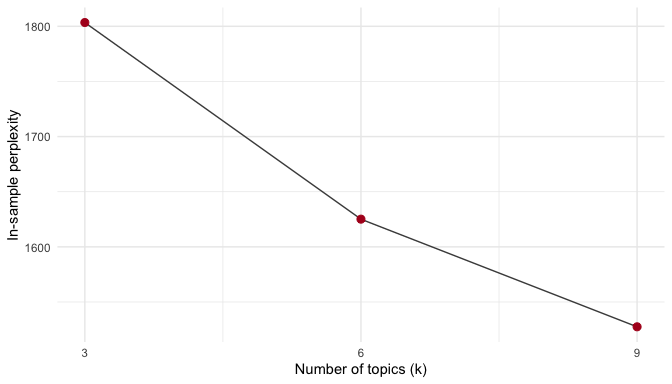
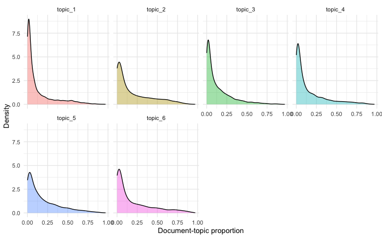
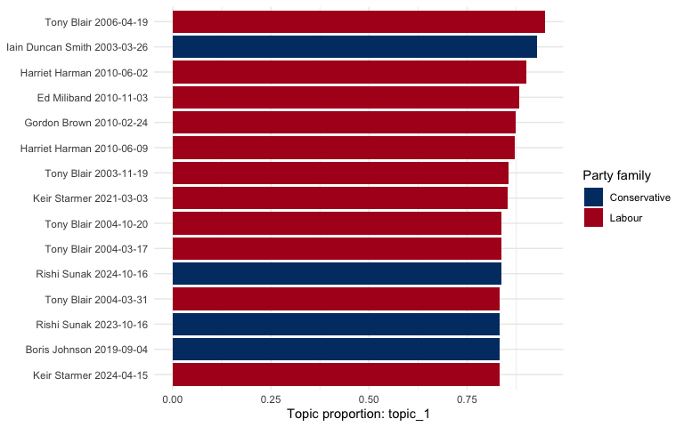
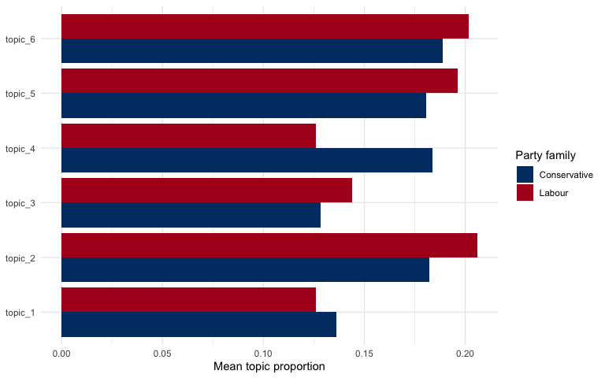
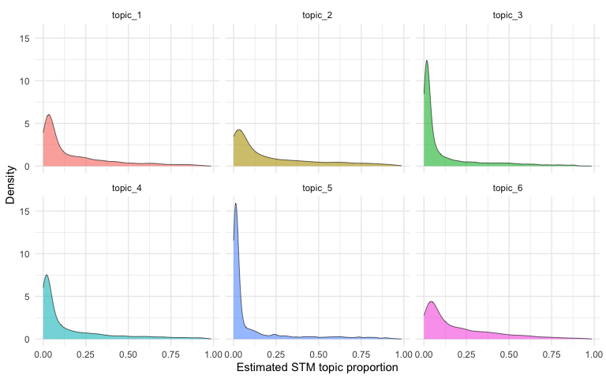
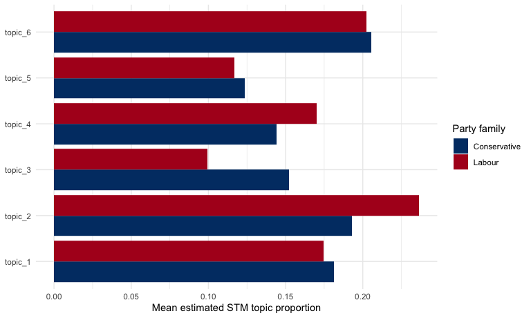
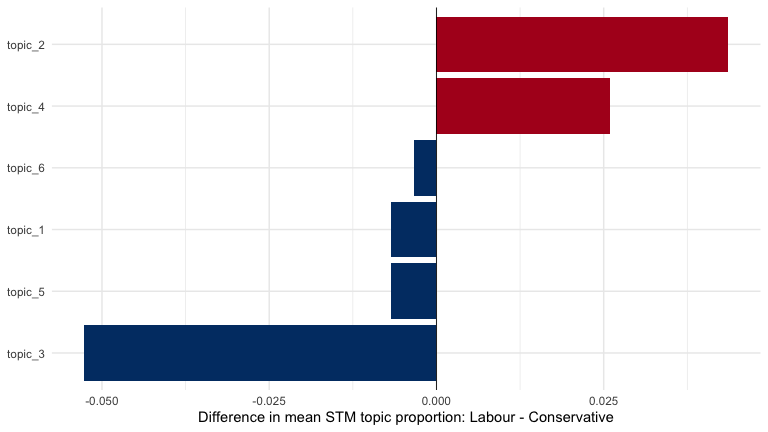
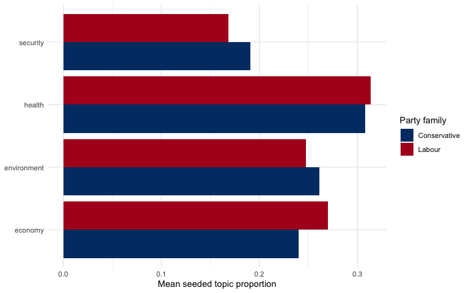
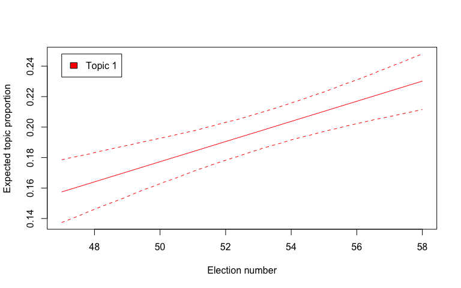
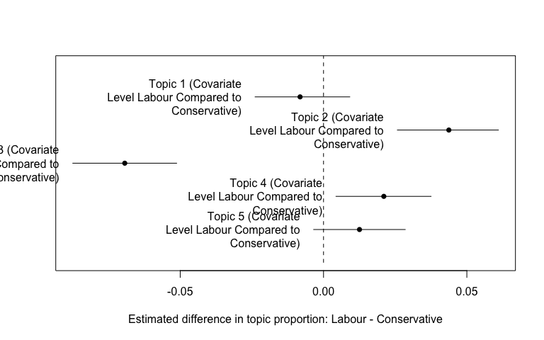

# QTA Lab 07 Answers: Topic Models with House of Commons Speeches


## Learning goals

In this lab, you will learn how to:

- estimate an unsupervised LDA topic model;
- inspect topic terms and document-topic proportions;
- visualise topic prevalence across individual speeches and parties;
- estimate a Structural Topic Model (STM) with document metadata;
- estimate a seeded LDA model with researcher-defined topic seeds;
- think critically about topic interpretation, including how LLMs can
  help label topics.

The running corpus is the same House of Commons leader speech sample
used in Lab 6, but the unit of analysis is different. In Lab 6, we
aggregated speeches into leader-period documents for scaling. In this
lab, each document is one individual speech. This lets us ask: what
topics appear in leader speeches, and how do those topics vary by party,
leader, and election period?

## Load packages

``` r
library(dplyr)
library(stringr)
library(tidyr)
library(ggplot2)
library(quanteda)
library(quanteda.textstats)
library(seededlda)
library(stm)

party_colors <- c(
  "Conservative" = "#003B73",
  "Labour" = "#B00020"
)
```

## Read and prepare the data

``` r
data_path <- "Data/hc_leader_period_sample_1979_2024.rds"

hoc <- readRDS(data_path)

hoc <- hoc |>
  mutate(
    year = as.integer(format(date, "%Y")),
    party_family = party
  )
```

Topic models need enough words in each document. We keep the unit of
analysis at the level of individual speeches, but remove very short
speeches that do not contain enough language for meaningful topic
modelling.

``` r
speech_counts <- hoc |>
  count(
    election_no,
    election_period,
    party_family,
    leader,
    name = "available_speeches"
  )

speech_counts
```

    # A tibble: 42 × 5
       election_no election_period            party_family leader available_speeches
             <int> <chr>                      <chr>        <chr>               <int>
     1          47 47th Parliament (1979-198… Conservative Marga…                200
     2          47 47th Parliament (1979-198… Labour       James…                147
     3          47 47th Parliament (1979-198… Labour       Micha…                 61
     4          48 48th Parliament (1983-198… Conservative Marga…                200
     5          48 48th Parliament (1983-198… Labour       Micha…                  9
     6          48 48th Parliament (1983-198… Labour       Neil …                100
     7          49 49th Parliament (1987-199… Conservative John …                200
     8          49 49th Parliament (1987-199… Conservative Marga…                200
     9          49 49th Parliament (1987-199… Labour       Neil …                200
    10          50 50th Parliament (1992-199… Conservative John …                200
    # ℹ 32 more rows

``` r
topic_docs <- hoc |>
  filter(!is.na(text), text != "", terms >= 80) |>
  arrange(date, party_family, leader, speechnumber) |>
  mutate(
    period = election_period,
    period_years = str_extract(period, "\\d{4}-\\d{4}"),
    topic_doc = paste0("speech_", row_number())
  )

topic_docs |>
  count(party_family, sort = TRUE)
```

    # A tibble: 2 × 2
      party_family     n
      <chr>        <int>
    1 Labour        1977
    2 Conservative  1920

``` r
topic_docs |>
  count(leader, party_family, sort = TRUE)
```

    # A tibble: 21 × 3
       leader            party_family     n
       <chr>             <chr>        <int>
     1 Tony Blair        Labour         533
     2 Jeremy Corbyn     Labour         407
     3 David Cameron     Conservative   392
     4 Keir Starmer      Labour         267
     5 Theresa May       Conservative   255
     6 Neil Kinnock      Labour         187
     7 Boris Johnson     Conservative   183
     8 Margaret Thatcher Conservative   178
     9 John Major        Conservative   176
    10 William Hague     Conservative   166
    # ℹ 11 more rows

## Create a corpus, tokens, and DFM

``` r
topic_corpus <- corpus(
  topic_docs,
  text_field = "text",
  docid_field = "topic_doc"
)

summary(topic_corpus, n = 10)
```

    Corpus consisting of 3897 documents, showing 10 documents:

          Text Types Tokens Sentences        party            leader election_no
      speech_1   315    784        32 Conservative Margaret Thatcher          47
      speech_2   385   1061        44       Labour   James Callaghan          47
      speech_3   285    675        42 Conservative Margaret Thatcher          47
      speech_4   598   1890       102       Labour   James Callaghan          47
      speech_5    71    109         5       Labour   James Callaghan          47
      speech_6   483   1302        63       Labour   James Callaghan          47
      speech_7    67     94         2       Labour   James Callaghan          47
      speech_8    93    144         5       Labour   James Callaghan          47
      speech_9   173    350        21       Labour   James Callaghan          47
     speech_10    71    103         4       Labour   James Callaghan          47
                 election_period       date
     47th Parliament (1979-1983) 1979-05-09
     47th Parliament (1979-1983) 1979-05-09
     47th Parliament (1979-1983) 1979-05-15
     47th Parliament (1979-1983) 1979-05-15
     47th Parliament (1979-1983) 1979-05-16
     47th Parliament (1979-1983) 1979-06-12
     47th Parliament (1979-1983) 1979-06-13
     47th Parliament (1979-1983) 1979-06-21
     47th Parliament (1979-1983) 1979-06-21
     47th Parliament (1979-1983) 1979-06-21
                                                        agenda speechnumber
                                           ELECTION OF SPEAKER       877846
                                           ELECTION OF SPEAKER       877841
                                         DEBATE ON THE ADDRESS       877948
                                         DEBATE ON THE ADDRESS       877898
     Orders of the Day — HEALTH, EDUCATION AND SOCIAL SERVICES       878047
                                          AMENDMENT OF THE LAW       880027
                           SOCIAL SECURITY BENEFITS (UPRATING)       880603
                                         BUSINESS OF THE HOUSE       882176
                     MEMBERS OF PARLIAMENT AND MINISTERS (PAY)       882269
                     MEMBERS OF PARLIAMENT AND MINISTERS (PAY)       882270
                                         speaker party.facts.id chair terms
     The Prime Minister (Mrs. Margaret Thatcher)             NA FALSE   672
                             Mr. James Callaghan             NA FALSE   953
     The Prime Minister (Mrs. Margaret Thatcher)             NA FALSE   603
                             Mr. James Callaghan             NA FALSE  1729
                             Mr. James Callaghan             NA FALSE    95
                             Mr. James Callaghan             NA FALSE  1201
                             Mr. James Callaghan             NA FALSE    88
                             Mr. James Callaghan             NA FALSE   135
                             Mr. James Callaghan             NA FALSE   322
                             Mr. James Callaghan             NA FALSE    98
                                      speech_url        parliament iso3country
       uk.org.publicwhip/debate/1979-05-09a.10.2 UK-HouseOfCommons         GBR
       uk.org.publicwhip/debate/1979-05-09a.11.1 UK-HouseOfCommons         GBR
       uk.org.publicwhip/debate/1979-05-15a.73.1 UK-HouseOfCommons         GBR
       uk.org.publicwhip/debate/1979-05-15a.59.1 UK-HouseOfCommons         GBR
      uk.org.publicwhip/debate/1979-05-16a.215.3 UK-HouseOfCommons         GBR
      uk.org.publicwhip/debate/1979-06-12a.264.1 UK-HouseOfCommons         GBR
      uk.org.publicwhip/debate/1979-06-13a.450.1 UK-HouseOfCommons         GBR
     uk.org.publicwhip/debate/1979-06-21a.1506.5 UK-HouseOfCommons         GBR
     uk.org.publicwhip/debate/1979-06-21a.1514.0 UK-HouseOfCommons         GBR
     uk.org.publicwhip/debate/1979-06-21a.1520.0 UK-HouseOfCommons         GBR
              party_raw leadership_start leadership_end election_date
     Conservative Party       1975-02-11     1990-11-27    1979-05-03
           Labour Party       1976-04-05     1980-11-10    1979-05-03
     Conservative Party       1975-02-11     1990-11-27    1979-05-03
           Labour Party       1976-04-05     1980-11-10    1979-05-03
           Labour Party       1976-04-05     1980-11-10    1979-05-03
           Labour Party       1976-04-05     1980-11-10    1979-05-03
           Labour Party       1976-04-05     1980-11-10    1979-05-03
           Labour Party       1976-04-05     1980-11-10    1979-05-03
           Labour Party       1976-04-05     1980-11-10    1979-05-03
           Labour Party       1976-04-05     1980-11-10    1979-05-03
     next_election_date period_end_date leader_period_start leader_period_end year
             1983-06-09      1983-06-08          1979-05-03        1983-06-08 1979
             1983-06-09      1983-06-08          1979-05-03        1980-11-10 1979
             1983-06-09      1983-06-08          1979-05-03        1983-06-08 1979
             1983-06-09      1983-06-08          1979-05-03        1980-11-10 1979
             1983-06-09      1983-06-08          1979-05-03        1980-11-10 1979
             1983-06-09      1983-06-08          1979-05-03        1980-11-10 1979
             1983-06-09      1983-06-08          1979-05-03        1980-11-10 1979
             1983-06-09      1983-06-08          1979-05-03        1980-11-10 1979
             1983-06-09      1983-06-08          1979-05-03        1980-11-10 1979
             1983-06-09      1983-06-08          1979-05-03        1980-11-10 1979
     party_family                      period period_years
     Conservative 47th Parliament (1979-1983)    1979-1983
           Labour 47th Parliament (1979-1983)    1979-1983
     Conservative 47th Parliament (1979-1983)    1979-1983
           Labour 47th Parliament (1979-1983)    1979-1983
           Labour 47th Parliament (1979-1983)    1979-1983
           Labour 47th Parliament (1979-1983)    1979-1983
           Labour 47th Parliament (1979-1983)    1979-1983
           Labour 47th Parliament (1979-1983)    1979-1983
           Labour 47th Parliament (1979-1983)    1979-1983
           Labour 47th Parliament (1979-1983)    1979-1983

We remove common procedural language and a few encoding artefacts. These
terms otherwise tend to become topics about parliamentary style rather
than substantive content.

``` r
parliamentary_stopwords <- c(
  "hon", "member", "right", "friend", "sir", "gentleman",
  "lady", "house", "commons", "speaker", "minister", "secretary",
  "asked", "question", "mr", "mrs", "ms", "â", "ã"
)

topic_tokens <- tokens(
  topic_corpus,
  what = "word",
  remove_punct = TRUE,
  remove_symbols = TRUE,
  remove_numbers = TRUE,
  remove_url = TRUE,
  remove_separators = TRUE,
  split_hyphens = FALSE
) |>
  tokens_tolower() |>
  tokens_remove(stopwords("en")) |>
  tokens_remove(parliamentary_stopwords)
```

As before, we identify frequent collocations and compound the top
examples.

``` r
topic_collocations <- topic_tokens |>
  textstat_collocations(
    min_count = 8,
    size = 2:3
  ) |>
  arrange(desc(lambda))

head(topic_collocations, 20)
```

                         collocation count count_nested length   lambda         z
    1940                   hong kong    27           27      2 17.61280  8.766638
    2017                buenos aires     9            9      2 16.54995  8.168193
    1752                   sinn fein    20           20      2 16.22044  9.843323
    1829                   ebbw vale    11           11      2 15.64238  9.426500
    1573                    per cent   554          554      2 15.53378 10.945174
    1663                       vol c    42           42      2 15.34001 10.445138
    1794               parity esteem    11           11      2 14.79508  9.605022
    1825                   bin laden     9            9      2 14.60403  9.444626
    1812              waltham forest    10           10      2 14.45279  9.493917
    1831               asset freezes     9            9      2 14.35271  9.407848
    1795                    lib dems    13           13      2 14.33637  9.604819
    1785                saudi arabia    18           18      2 14.17186  9.666713
    1278           chambers commerce    10           10      2 13.94197 12.934167
    1857                  privy seal     9            9      2 13.84188  9.251389
    1879               joseph clarke     8            8      2 13.60549  9.100111
    1876                westland plc     9            9      2 13.50540  9.104297
    1858    devolved administrations    16           16      2 13.43839  9.247228
    1915 proportional representation     8            8      2 13.14286  8.877626
    1856              united kingdom   336          336      2 13.10026  9.252252
    881               saddam hussein    78           78      2 13.05200 15.584702

``` r
if (nrow(topic_collocations) > 0) {
  topic_tokens <- tokens_compound(
    topic_tokens,
    phrase(head(topic_collocations$collocation, 30))
  )
}
```

We trim rare terms and terms that appear in more than three quarters of
all documents. This makes the model faster and removes words that are
too common to distinguish topics.

``` r
topic_dfm <- dfm(topic_tokens) |>
  dfm_trim(
    min_termfreq = 5,
    min_docfreq = 2
  ) |>
  dfm_trim(
    max_docfreq = 0.75,
    docfreq_type = "prop"
  )

topic_dfm <- topic_dfm[ntoken(topic_dfm) > 0, ]

dim(topic_dfm)
```

    [1] 3897 7002

``` r
topfeatures(topic_dfm, 30)
```

         prime government     people        can       said    country        now 
          5208       3950       3285       2471       2077       1978       1955 
            us        one       time       also       last       made       make 
          1915       1719       1435       1335       1293       1278       1273 
           say    support      years       know        new       must   european 
          1271       1200       1190       1181       1141       1128       1114 
          many       work      first       just       need       take       year 
          1094       1079       1073       1058       1052       1045       1044 
       british        way 
          1036       1035 

## Estimate an LDA topic model

Latent Dirichlet Allocation (LDA) is an unsupervised topic model. The
researcher chooses the number of topics, `k`. Here we estimate six
topics. This is not the “true” number of topics; it is a modelling
choice we inspect and can vary.

``` r
set.seed(20260710)

lda_6 <- textmodel_lda(
  topic_dfm,
  k = 6,
  alpha = 0.5,
  max_iter = 500
)
```

The `terms()` function shows the highest-probability terms for each
topic.

``` r
terms(lda_6, 10)
```

          topic1     topic2       topic3       topic4     topic5       topic6      
     [1,] "prime"    "people"     "government" "european" "prime"      "government"
     [2,] "security" "health"     "community"  "can"      "government" "prime"     
     [3,] "can"      "can"        "council"    "union"    "said"       "people"    
     [4,] "support"  "service"    "made"       "deal"     "members"    "tax"       
     [5,] "us"       "government" "countries"  "prime"    "one"        "chancellor"
     [6,] "also"     "nhs"        "statement"  "europe"   "time"       "budget"    
     [7,] "must"     "need"       "must"       "people"   "say"        "year"      
     [8,] "people"   "care"       "economic"   "country"  "know"       "now"       
     [9,] "british"  "work"       "states"     "eu"       "us"         "labour"    
    [10,] "world"    "local"      "shall"      "northern" "may"        "country"   

The `topics()` function returns the highest-probability topic for each
document.

``` r
head(topics(lda_6), 10)
```

     speech_1  speech_2  speech_3  speech_4  speech_5  speech_6  speech_7  speech_8 
       topic5    topic5    topic5    topic5    topic3    topic6    topic6    topic5 
     speech_9 speech_10 
       topic3    topic5 
    Levels: topic1 topic2 topic3 topic4 topic5 topic6

``` r
docvars(topic_dfm, "top_topic") <- topics(lda_6)

table(docvars(topic_dfm, "top_topic"))
```


    topic1 topic2 topic3 topic4 topic5 topic6 
       514    869    405    578    725    806 

Document-topic proportions are stored in `theta`. Each row is one
document and each column is one topic.

``` r
head(lda_6$theta, 10)
```

                   topic1      topic2     topic3      topic4     topic5
    speech_1  0.002212389 0.024336283 0.14823009 0.002212389 0.82079646
    speech_2  0.001533742 0.023006135 0.12730061 0.059815951 0.78680982
    speech_3  0.002100840 0.023109244 0.25000000 0.002100840 0.50210084
    speech_4  0.014285714 0.063909774 0.30902256 0.107518797 0.50451128
    speech_5  0.011904762 0.011904762 0.39285714 0.011904762 0.20238095
    speech_6  0.001144165 0.010297483 0.35583524 0.001144165 0.16819222
    speech_7  0.014285714 0.242857143 0.01428571 0.300000000 0.07142857
    speech_8  0.008928571 0.008928571 0.18750000 0.312500000 0.40178571
    speech_9  0.013636364 0.004545455 0.46818182 0.040909091 0.40454545
    speech_10 0.012820513 0.012820513 0.16666667 0.166666667 0.62820513
                    topic6
    speech_1  0.0022123894
    speech_2  0.0015337423
    speech_3  0.2205882353
    speech_4  0.0007518797
    speech_5  0.3690476190
    speech_6  0.4633867277
    speech_7  0.3571428571
    speech_8  0.0803571429
    speech_9  0.0681818182
    speech_10 0.0128205128

``` r
head(rowSums(lda_6$theta), 10)
```

     speech_1  speech_2  speech_3  speech_4  speech_5  speech_6  speech_7  speech_8 
            1         1         1         1         1         1         1         1 
     speech_9 speech_10 
            1         1 

## Compare models using perplexity

Perplexity is a model-fit diagnostic. It asks how surprising the
observed words are under the fitted topic model. Lower perplexity means
that the model assigns higher probability to the words we observe in the
speeches.

The intuition is simple: if a model has learned a health topic, it
should not be very surprised by words such as `nhs`, `patients`, and
`care` in a health-related speech. If it is surprised by many words
across many speeches, perplexity will be higher.

The function below calculates in-sample perplexity from the fitted LDA
model. In a research project, we would ideally evaluate held-out text as
well. Here we use in-sample perplexity because it makes the mechanics
transparent and keeps the lab manageable.

``` r
calculate_lda_perplexity <- function(model, data) {
  feature_names <- colnames(model$phi)
  counts <- as.matrix(data[, feature_names])
  predicted_probabilities <- model$theta %*% model$phi
  predicted_probabilities <- pmax(predicted_probabilities, 1e-12)

  log_likelihood <- sum(counts * log(predicted_probabilities))
  total_tokens <- sum(counts)

  exp(-log_likelihood / total_tokens)
}
```

Now we compare models with different numbers of topics. This takes a
little longer because we estimate several LDA models.

``` r
set.seed(20260714)

k_candidates <- c(3, 6, 9)

perplexity_results <- bind_rows(
  lapply(k_candidates, function(k_value) {
    model <- textmodel_lda(
      topic_dfm,
      k = k_value,
      alpha = 0.5,
      max_iter = 200
    )

    tibble(
      k = k_value,
      perplexity = calculate_lda_perplexity(model, topic_dfm)
    )
  })
)

perplexity_results
```

    # A tibble: 3 × 2
          k perplexity
      <dbl>      <dbl>
    1     3      1803.
    2     6      1625.
    3     9      1528.

``` r
ggplot(
  perplexity_results,
  aes(x = k, y = perplexity)
) +
  geom_line(color = "#4B4B4B") +
  geom_point(size = 2.5, color = "#B00020") +
  scale_x_continuous(breaks = k_candidates) +
  labs(
    x = "Number of topics (k)",
    y = "In-sample perplexity"
  ) +
  theme_minimal()
```



In this example, perplexity falls as we add more topics. That is common:
more complex models can often fit the observed words better. But lower
perplexity does not automatically mean better social science. We still
need to inspect terms, read high-topic speeches, and ask whether the
topics are interpretable and useful.

## Visualise topic prevalence

We first convert `theta` into a tidy data frame and add document
metadata.

``` r
lda_theta <- as.data.frame(lda_6$theta)
colnames(lda_theta) <- paste0("topic_", seq_len(ncol(lda_theta)))

lda_theta <- lda_theta |>
  mutate(
    doc_id = docnames(topic_dfm),
    party_family = docvars(topic_dfm, "party_family"),
    leader = docvars(topic_dfm, "leader"),
    period = docvars(topic_dfm, "period"),
    election_no = docvars(topic_dfm, "election_no"),
    date = docvars(topic_dfm, "date"),
    agenda = docvars(topic_dfm, "agenda"),
    speaker = docvars(topic_dfm, "speaker"),
    terms = docvars(topic_dfm, "terms")
  )

lda_theta_long <- lda_theta |>
  pivot_longer(
    cols = starts_with("topic_"),
    names_to = "topic",
    values_to = "proportion"
  )

head(lda_theta_long)
```

    # A tibble: 6 × 11
      doc_id  party_family leader period election_no date       agenda speaker terms
      <chr>   <chr>        <chr>  <chr>        <int> <date>     <chr>  <chr>   <dbl>
    1 speech… Conservative Marga… 47th …          47 1979-05-09 ELECT… The Pr…   672
    2 speech… Conservative Marga… 47th …          47 1979-05-09 ELECT… The Pr…   672
    3 speech… Conservative Marga… 47th …          47 1979-05-09 ELECT… The Pr…   672
    4 speech… Conservative Marga… 47th …          47 1979-05-09 ELECT… The Pr…   672
    5 speech… Conservative Marga… 47th …          47 1979-05-09 ELECT… The Pr…   672
    6 speech… Conservative Marga… 47th …          47 1979-05-09 ELECT… The Pr…   672
    # ℹ 2 more variables: topic <chr>, proportion <dbl>

The density plot shows how concentrated or diffuse each topic is across
individual speeches.

``` r
ggplot(
  lda_theta_long,
  aes(x = proportion, fill = topic)
) +
  geom_density(alpha = 0.4) +
  facet_wrap(~ topic, ncol = 4) +
  labs(
    x = "Document-topic proportion",
    y = "Density"
  ) +
  theme_minimal() +
  theme(legend.position = "none")
```



We can also look at the documents with the highest proportion of a
selected topic. Change `selected_topic` after inspecting the terms.

``` r
selected_topic <- "topic_1"

top_topic_documents <- lda_theta |>
  arrange(desc(.data[[selected_topic]])) |>
  select(
    leader,
    party_family,
    date,
    agenda,
    period,
    terms,
    all_of(selected_topic)
  ) |>
  slice_head(n = 15)

top_topic_documents
```

                           leader party_family       date
    speech_1646        Tony Blair       Labour 2006-04-19
    speech_1330 Iain Duncan Smith Conservative 2003-03-26
    speech_2001    Harriet Harman       Labour 2010-06-02
    speech_2047       Ed Miliband       Labour 2010-11-03
    speech_1988      Gordon Brown       Labour 2010-02-24
    speech_2004    Harriet Harman       Labour 2010-06-09
    speech_1380        Tony Blair       Labour 2003-11-19
    speech_3321      Keir Starmer       Labour 2021-03-03
    speech_1496        Tony Blair       Labour 2004-10-20
    speech_1428        Tony Blair       Labour 2004-03-17
    speech_3634       Rishi Sunak Conservative 2024-10-16
    speech_1433        Tony Blair       Labour 2004-03-31
    speech_3061     Boris Johnson Conservative 2019-09-04
    speech_3516       Rishi Sunak Conservative 2023-10-16
    speech_3581      Keir Starmer       Labour 2024-04-15
                                                                                                               agenda
    speech_1646                                                                                                  <NA>
    speech_1330 Engagements [Oral Answers To Questions > Oral Answers To Questions > Prime Minister > Prime Minister]
    speech_2001 Engagements [Oral Answers to Questions > Oral Answers to Questions > Prime Minister > Prime Minister]
    speech_2047                                              Engagements [Oral Answers to Questions > Prime Minister]
    speech_1988                                              Engagements [Oral Answers to Questions > Prime Minister]
    speech_2004                                              Engagements [Oral Answers to Questions > Prime Minister]
    speech_1380                                                               Engagements [Oral Answers To Questions]
    speech_3321                                                                                           Engagements
    speech_1496                                                                                                  <NA>
    speech_1428                                                                                                  <NA>
    speech_3634                                                                                           Engagements
    speech_1433                                                                                                  <NA>
    speech_3061 Engagements [Oral Answers to Questions > Oral Answers to Questions > Prime Minister > Prime Minister]
    speech_3516                                                                                       Israel and Gaza
    speech_3581                                                                                    Iran-Israel Update
                                     period terms   topic_1
    speech_1646 53rd Parliament (2005-2010)   111 0.9479167
    speech_1330 52nd Parliament (2001-2005)   103 0.9270833
    speech_2001 54th Parliament (2010-2015)   208 0.9000000
    speech_2047 54th Parliament (2010-2015)    96 0.8829787
    speech_1988 53rd Parliament (2005-2010)   227 0.8739130
    speech_2004 54th Parliament (2010-2015)   167 0.8719512
    speech_1380 52nd Parliament (2001-2005)    99 0.8555556
    speech_3321 57th Parliament (2019-2024)    86 0.8522727
    speech_1496 52nd Parliament (2001-2005)    91 0.8375000
    speech_1428 52nd Parliament (2001-2005)   111 0.8365385
    speech_3634 58th Parliament (2024-2025)   110 0.8365385
    speech_1433 52nd Parliament (2001-2005)   168 0.8333333
    speech_3061 56th Parliament (2017-2019)    86 0.8333333
    speech_3516 57th Parliament (2019-2024)    99 0.8333333
    speech_3581 57th Parliament (2019-2024)   692 0.8327703

``` r
ggplot(
  top_topic_documents,
  aes(
    x = reorder(paste(leader, date), .data[[selected_topic]]),
    y = .data[[selected_topic]],
    fill = party_family
  )
) +
  geom_col() +
  coord_flip() +
  labs(
    x = NULL,
    y = paste("Topic proportion:", selected_topic),
    fill = "Party family"
  ) +
  scale_fill_manual(values = party_colors) +
  theme_minimal()
```



Average topic proportions by party give us a first descriptive
comparison.

``` r
party_topic_means <- lda_theta_long |>
  group_by(party_family, topic) |>
  summarise(
    mean_proportion = mean(proportion),
    .groups = "drop"
  )

ggplot(
  party_topic_means,
  aes(
    x = topic,
    y = mean_proportion,
    fill = party_family
  )
) +
  geom_col(position = "dodge") +
  coord_flip() +
  labs(
    x = NULL,
    y = "Mean topic proportion",
    fill = "Party family"
  ) +
  scale_fill_manual(values = party_colors) +
  theme_minimal()
```



## Estimate a Structural Topic Model

Structural Topic Models (STMs) extend topic models by allowing topic
prevalence or topic content to depend on metadata. Here we estimate six
topics and model topic prevalence as a function of party family and
election period.

``` r
stm_6 <- stm(
  topic_dfm,
  data = docvars(topic_dfm),
  seed = 20260710,
  K = 6,
  prevalence = ~ party_family + election_no,
  max.em.its = 25,
  verbose = FALSE,
  init.type = "Spectral"
)
```

`labelTopics()` reports several ways of describing topics. FREX terms
are often useful because they balance frequency and exclusivity.

``` r
labelTopics(stm_6, n = 8)
```

    Topic 1 Top Words:
         Highest Prob: prime, said, government, us, last, now, today, one 
         FREX: queen, inquiry, royal, lord, allegations, david, majesty, corporal 
         Lift: as-level, bskyb, burglars, corporal, coulson, cox, cuckney, david’s 
         Score: prime, inquiry, novel, queen, lord, hutton, battalion, meetings 
    Topic 2 Top Words:
         Highest Prob: people, health, government, country, work, need, can, prime 
         FREX: nhs, mental, patients, homes, waiting, health, nurses, care 
         Lift: diagnostic, hospice, labour-run, out-patients, owning, potholes, rented, starter 
         Score: nhs, health, cobra, patients, mental, schools, homes, care 
    Topic 3 Top Words:
         Highest Prob: european, union, europe, countries, prime, eu, deal, council 
         FREX: eu, european, europe, summit, treaty, union, enlargement, euro 
         Lift: bonn, enterprises, globalisation, houston, malta, semi-detached, tusk, convergence 
         Score: european, summit, eu, expanding, countries, union, treaty, europe 
    Topic 4 Top Words:
         Highest Prob: government, tax, chancellor, budget, year, per_cent, prime, people 
         FREX: taxes, tax, chancellor, per_cent, budget, unemployment, income, borrowing 
         Lift: 25p, calculating, communism, depression, devaluation, gamble, hits, lower-paid 
         Score: tax, taxes, unemployment, chancellor, budget, communism, inflation, per_cent 
    Topic 5 Top Words:
         Highest Prob: security, government, united, can, must, support, prime, international 
         FREX: argentine, saddam_hussein, iraqi, military, falkland, israel, weapons, forces 
         Lift: aggressor, antarctic, argentina's, argentine, bibi, burmese, contingent, cuellar 
         Score: argentine, iraq, military, falkland, saddam_hussein, afghanistan, lanka, president 
    Topic 6 Top Words:
         Highest Prob: can, people, way, members, government, think, one, say 
         FREX: northern, ireland, debate, scotland, speaker-elect, leader, congratulate, scottish 
         Lift: retrospective, sectarian, speakership, speaker-elect, nationalist, unionist, cricket, nationalists 
         Score: ireland, speaker-elect, northern, retrospective, debate, harold, devolution, qualities 

The default `plot(stm_6)` output is useful for quick inspection, but it
can be visually crowded in a rendered lab document. The next block turns
the STM topic proportions into a tidy data frame so that we can make
clearer plots ourselves.

``` r
stm_theta <- as.data.frame(stm_6$theta)
colnames(stm_theta) <- paste0("topic_", seq_len(ncol(stm_theta)))

stm_theta <- stm_theta |>
  mutate(
    doc_id = docnames(topic_dfm),
    party_family = docvars(topic_dfm, "party_family"),
    leader = docvars(topic_dfm, "leader"),
    election_no = docvars(topic_dfm, "election_no")
  )

stm_theta_long <- stm_theta |>
  pivot_longer(
    cols = starts_with("topic_"),
    names_to = "topic",
    values_to = "proportion"
  )
```

This plot shows how each STM topic is distributed across individual
speeches. Topics with many speeches near zero are more concentrated;
topics with many moderate values are more diffuse.

``` r
ggplot(
  stm_theta_long,
  aes(x = proportion, fill = topic)
) +
  geom_density(alpha = 0.6, linewidth = 0.2, show.legend = FALSE) +
  facet_wrap(~ topic, ncol = 3) +
  labs(
    x = "Estimated STM topic proportion",
    y = "Density"
  ) +
  theme_minimal()
```



The `findThoughts()` function returns documents that are strongly
associated with a topic. This is essential for interpretation: never
label a topic from top words alone.

``` r
findThoughts(
  stm_6,
  texts = as.character(topic_corpus)[docnames(topic_dfm)],
  n = 2,
  topics = c(1)
)
```


     Topic 1: 
         Lord Hutton expressly finds, at paragraphs 402 and 403 of his report, that there was no conflict between what Sir Kevin Tebitt said to the inquiry and what the Prime Minister said to the inquiry. As the Prime Minister well knows, the questions I have put to him are about what he said on the plane to Hong Kong and eventually repeated in this House. On that, Lord Hutton merely says, in very carefully worded language, at paragraph 411: " the answers given by the Prime Minister to members of the press in the aeroplane cast no light on the issues about which I have heard a large volume of evidence." Of course they do not. Lord Hutton never heard evidence about what was said on the aeroplane. The Prime Minister never sent him a transcript of what he said on the aeroplane. If he had not been sent it by one of my right hon. Friends, Lord Hutton might never have even seen that transcript. Lord Hutton says, at paragraph 416 of his report, " I am satisfied that the decision to issue the statement which said that a civil servant. who was not named, had come forward was taken by the Prime Minister at a meeting in 10 Downing Street on 8 July". So the Prime Minister chaired the meeting that decided to issue that press release. That press release led inevitably to the naming of David Kelly. David Kelly knew that, and it says so in the report, at paragraph 439. The Ministry of Defence knew that. It says so in the report, at paragraph 409. Alastair Campbell knew that. That is why he wrote in his diary, " That meant do it as a press release." Anyone with any sense would know that if one issues a press release like that, the name will come out. That is why the press got David Kelly's name the very next day. Is the Prime Minister the only person who thought that issuing that press release would not lead to the naming of David Kelly? Is that what he is asking us to believe? Is he really that naive? Is it not clear to everyone that the release of the statement, authorised by the Prime Minister, led inevitably to the naming of David Kelly? Is the Prime Minister really telling the House that he had no idea that that would happen? Listen to what Lord Hutton said at paragraph 407. He said: " The issuing of the statement authorised by the Prime Minister did give rise to the questions by the press as to the identity of the civil servant and these questions led on to the MoD confirming Dr Kelly's name". It is no wonder that Lord Hutton says that there was no plan or strategy to do this covertly. There did not need to be. It was all going to happen anyway, as night follows day, all because of the decision made by the Prime Minister. The best that can be said about the answer that the Prime Minister gave on the plane, and repeated in this House, is that it is at odds with what Lord Hutton concludes. When all is said and done, I suspect that what will remain in people's minds is the blinding light that this inquiry has shed on the innermost workings of the Prime Minister and his Government. Is not the picture painted in that evidence an extraordinarily vivid one? Vital meetings are unminuted, crucial telephone calls are unrecorded. In Lord Hutton's words in a letter to my right hon. Friend the Member for Hitchin and Harpenden (Mr. Lilley), the notes made by private secretaries were " very sparse and of no relevance." Whatever happened to the recommendations made by the Hammond inquiry into the Hinduja passports affair? Oh, yes-just listen. That report, given to the Prime Minister-
        The reason why it was essential for the Prime Minister to come to the House today is that the Culture Secretary is in clear breach of the ministerial code-and the Prime Minister stands by and does nothing. He asks why this matters. It matters because we need a Government who stand up for families, not the rich and powerful. He is failing that test. Playing for time, he says we should wait for the Leveson inquiry, but Lord Justice Leveson could not be clearer. This is what his spokesperson said: “the simple fact is” that Lord Justice Leveson“is not the arbiter of the ministerial code, whatever anybody else is saying. There is somebody else who has that role...Alex Allan”. Lord Justice Leveson is doing his job; it's time the Prime Minister did his. Can the Prime Minister confirm that there are no fewer than three breaches of the ministerial code by the Culture Secretary? First, in the House on 3 March the Culture Secretary told the hon. Member for Banbury (Tony Baldry) that“all the exchanges between my Department and News Corporation”- -were being published. But he has now admitted that he knew, when he gave that answer, that there were exchanges that he himself had authorised between his special adviser and News Corporation. Yet none of those exchanges was disclosed, and we have 163 pages to prove it. The Prime Minister does not need to wait for the Leveson inquiry. Will he confirm to the House that this was a breach of paragraph 1.2 c of the code, which says that Ministers must provide full and accurate information to Parliament? Secondly, on 25 January the Culture Secretary gave a statement to the House. We now know that two days before that statement, News Corporation was given confidential inside information-and this when the Culture Secretary had a constitutional duty to act in a quasi-judicial manner. The Prime Minister does not need to wait for the Leveson inquiry; will he confirm that that breaches paragraph 1 of the code, which requires the Minister to act with the “highest standards of propriety”, and paragraph 9.1, which says that Parliament must be told first? Finally, the Culture Secretary would have us believe that his special adviser was on a freelance mission-six months of daily e-mails, texts, leaks and the leaking of confidential information about what opposing parties were saying. On one of the biggest media bids for decades, is the Prime Minister really reduced to the News of the World defence-one rogue individual acting alone? If the Culture Secretary really was that clueless about the biggest issue facing his Department, he should be sacked anyway. The central question that the Prime Minister must answer, in view of three clear breaches of the ministerial code, is: why will he not refer the matter to the man whose responsibility it is-Sir Alex Allan? The Prime Minister is defending the indefensible, and he knows it. He is protecting the Culture Secretary's job while up and down the country hundreds of thousands are losing theirs. We all know why the special adviser had to go to protect the Culture Secretary; the Culture Secretary has to stay to protect the Prime Minister. The Prime Minister has shown today that he is incapable of doing his duty-too close to a powerful few, and out of touch with everyone else.

## Estimate topic prevalence effects

`estimateEffect()` fits regressions where the outcome is estimated topic
prevalence. Here, we compare topic prevalence by party family.

``` r
stm_party_effects <- estimateEffect(
  1:6 ~ party_family,
  stmobj = stm_6,
  meta = docvars(topic_dfm)
)

summary(stm_party_effects, topics = 1)
```


    Call:
    estimateEffect(formula = 1:6 ~ party_family, stmobj = stm_6, 
        metadata = docvars(topic_dfm))


    Topic 1:

    Coefficients:
                        Estimate Std. Error t value Pr(>|t|)    
    (Intercept)         0.178966   0.005968  29.989   <2e-16 ***
    party_familyLabour -0.004390   0.008359  -0.525      0.6    
    ---
    Signif. codes:  0 '***' 0.001 '**' 0.01 '*' 0.05 '.' 0.1 ' ' 1

The plot below compares Labour and Conservative speeches for each STM
topic.

``` r
stm_party_means <- stm_theta_long |>
  group_by(party_family, topic) |>
  summarise(mean_proportion = mean(proportion), .groups = "drop")

ggplot(
  stm_party_means,
  aes(
    x = topic,
    y = mean_proportion,
    fill = party_family
  )
) +
  geom_col(position = "dodge") +
  coord_flip() +
  labs(
    x = NULL,
    y = "Mean estimated STM topic proportion",
    fill = "Party family"
  ) +
  scale_fill_manual(values = party_colors) +
  theme_minimal()
```



The next plot shows the same comparison as a Labour-minus-Conservative
difference. Positive values indicate topics that are more prevalent in
Labour leader speeches; negative values indicate topics that are more
prevalent in Conservative leader speeches.

``` r
stm_party_differences <- stm_party_means |>
  pivot_wider(
    names_from = party_family,
    values_from = mean_proportion
  ) |>
  mutate(difference = Labour - Conservative)

ggplot(
  stm_party_differences,
  aes(
    x = reorder(topic, difference),
    y = difference,
    fill = difference > 0
  )
) +
  geom_col(show.legend = FALSE) +
  coord_flip() +
  geom_hline(yintercept = 0, linewidth = 0.3) +
  scale_fill_manual(values = c("TRUE" = "#B00020", "FALSE" = "#003B73")) +
  labs(
    x = NULL,
    y = "Difference in mean STM topic proportion: Labour - Conservative"
  ) +
  theme_minimal()
```



## Seeded LDA

Seeded LDA is semi-supervised. We provide seed words for topics we
expect to exist, and the model uses those seeds to guide topic
discovery.

This is where LLMs may be helpful: they can suggest possible seed words.
But those suggestions should be checked against theory, corpus context,
and known terminology.

``` r
hoc_topic_dictionary <- dictionary(
  list(
    economy = c(
      "econom*", "tax*", "budget*", "inflation", "growth",
      "business*", "jobs"
    ),
    health = c(
      "health*", "nhs", "hospital*", "patient*", "care"
    ),
    security = c(
      "security", "defence", "police", "crime", "terror*", "border*"
    ),
    environment = c(
      "climate", "environment*", "carbon", "energy", "green", "emission*"
    )
  )
)

hoc_topic_dictionary
```

    Dictionary object with 4 key entries.
    - [economy]:
      - econom*, tax*, budget*, inflation, growth, business*, jobs
    - [health]:
      - health*, nhs, hospital*, patient*, care
    - [security]:
      - security, defence, police, crime, terror*, border*
    - [environment]:
      - climate, environment*, carbon, energy, green, emission*

``` r
seeded_topics <- textmodel_seededlda(
  topic_dfm,
  hoc_topic_dictionary,
  batch_size = 0.25,
  auto_iter = TRUE,
  verbose = FALSE
)

terms(seeded_topics, 10)
```

          economy      health       security   environment 
     [1,] "tax"        "prime"      "security" "european"  
     [2,] "government" "health"     "prime"    "government"
     [3,] "people"     "people"     "can"      "can"       
     [4,] "prime"      "government" "police"   "union"     
     [5,] "budget"     "said"       "support"  "made"      
     [6,] "economic"   "care"       "defence"  "said"      
     [7,] "economy"    "nhs"        "people"   "deal"      
     [8,] "jobs"       "one"        "us"       "europe"    
     [9,] "chancellor" "service"    "crime"    "community" 
    [10,] "year"       "know"       "also"     "prime"     

``` r
head(seeded_topics$theta, 10)
```

                  economy     health    security environment
    speech_1  0.011111111 0.72666667 0.033333333   0.2288889
    speech_2  0.007692308 0.73692308 0.010769231   0.2446154
    speech_3  0.196202532 0.38185654 0.010548523   0.4113924
    speech_4  0.044427711 0.37725904 0.050451807   0.5278614
    speech_5  0.353658537 0.08536585 0.036585366   0.5243902
    speech_6  0.498853211 0.07912844 0.014908257   0.4071101
    speech_7  0.544117647 0.10294118 0.073529412   0.2794118
    speech_8  0.009090909 0.17272727 0.009090909   0.8090909
    speech_9  0.142201835 0.09633028 0.013761468   0.7477064
    speech_10 0.065789474 0.17105263 0.013157895   0.7500000

Seeded LDA can also include residual topics. These capture language that
does not fit well into the seeded topics.

``` r
seeded_topics_residual <- textmodel_seededlda(
  topic_dfm,
  hoc_topic_dictionary,
  residual = 2,
  batch_size = 0.25,
  auto_iter = TRUE,
  verbose = FALSE
)

terms(seeded_topics_residual, 10)
```

          economy      health    security        environment other1      
     [1,] "tax"        "health"  "security"      "european"  "members"   
     [2,] "budget"     "people"  "defence"       "union"     "government"
     [3,] "government" "care"    "police"        "can"       "one"       
     [4,] "economic"   "nhs"     "prime"         "deal"      "may"       
     [5,] "economy"    "country" "united"        "europe"    "time"      
     [6,] "jobs"       "can"     "must"          "agreement" "shall"     
     [7,] "chancellor" "work"    "can"           "eu"        "matter"    
     [8,] "people"     "need"    "international" "country"   "many"      
     [9,] "business"   "service" "countries"     "people"    "made"      
    [10,] "year"       "many"    "support"       "ireland"   "debate"    
          other2      
     [1,] "prime"     
     [2,] "said"      
     [3,] "government"
     [4,] "now"       
     [5,] "us"        
     [6,] "last"      
     [7,] "can"       
     [8,] "know"      
     [9,] "says"      
    [10,] "answer"    

``` r
seeded_theta <- as.data.frame(seeded_topics$theta)

seeded_theta <- seeded_theta |>
  mutate(
    doc_id = docnames(topic_dfm),
    party_family = docvars(topic_dfm, "party_family")
  ) |>
  pivot_longer(
    cols = -c(doc_id, party_family),
    names_to = "seeded_topic",
    values_to = "proportion"
  )

seeded_party_means <- seeded_theta |>
  group_by(party_family, seeded_topic) |>
  summarise(
    mean_proportion = mean(proportion),
    .groups = "drop"
  )

ggplot(
  seeded_party_means,
  aes(
    x = seeded_topic,
    y = mean_proportion,
    fill = party_family
  )
) +
  geom_col(position = "dodge") +
  coord_flip() +
  labs(
    x = NULL,
    y = "Mean seeded topic proportion",
    fill = "Party family"
  ) +
  scale_fill_manual(values = party_colors) +
  theme_minimal()
```



## Topic labelling and LLMs

Topic labels are interpretations, not model outputs. A careful workflow
combines:

- top probability terms;
- FREX or lift terms;
- high-probability documents;
- metadata patterns;
- sensitivity checks across different values of `k`, preprocessing
  choices, and seeds.

LLMs can help by proposing possible labels from top terms and example
documents. They can also help compare alternative labels or flag overly
broad labels. They should not replace human validation, because topic
models often mix policy areas, procedural language, time periods, and
party style.

## Practice exercises

1.  Estimate an LDA model with five topics on `topic_dfm` and
    `alpha = 0.5`. Call the model `lda_5`.

``` r
set.seed(20260710)

lda_5 <- textmodel_lda(
  topic_dfm,
  k = 5,
  alpha = 0.5,
  max_iter = 500
)
```

2.  Display the 10 highest-probability terms for each topic in `lda_5`.

``` r
terms(lda_5, 10)
```

          topic1       topic2          topic3       topic4    topic5      
     [1,] "government" "security"      "government" "prime"   "european"  
     [2,] "prime"      "countries"     "people"     "people"  "can"       
     [3,] "said"       "united"        "prime"      "country" "prime"     
     [4,] "members"    "prime"         "tax"        "can"     "union"     
     [5,] "one"        "council"       "chancellor" "us"      "deal"      
     [6,] "made"       "world"         "year"       "support" "people"    
     [7,] "may"        "international" "health"     "know"    "europe"    
     [8,] "matter"     "also"          "labour"     "work"    "government"
     [9,] "report"     "support"       "budget"     "police"  "now"       
    [10,] "shall"      "must"          "now"        "many"    "country"   

3.  Show the topic distributions of `lda_5` in the first 20 documents.

``` r
head(lda_5$theta, 20)
```

                  topic1      topic2      topic3      topic4      topic5
    speech_1  0.53880266 0.028824834 0.011086475 0.414634146 0.006651885
    speech_2  0.43164363 0.050691244 0.023041475 0.483870968 0.010752688
    speech_3  0.53263158 0.065263158 0.221052632 0.178947368 0.002105263
    speech_4  0.62377728 0.127163281 0.036869827 0.068472536 0.143717081
    speech_5  0.44578313 0.084337349 0.349397590 0.108433735 0.012048193
    speech_6  0.44788087 0.072164948 0.468499427 0.005727377 0.005727377
    speech_7  0.27536232 0.159420290 0.420289855 0.101449275 0.043478261
    speech_8  0.63963964 0.009009009 0.009009009 0.009009009 0.333333333
    speech_9  0.88127854 0.022831050 0.041095890 0.013698630 0.041095890
    speech_10 0.87012987 0.012987013 0.038961039 0.064935065 0.012987013
    speech_11 0.06575964 0.705215420 0.052154195 0.002267574 0.174603175
    speech_12 0.39255014 0.489971347 0.042979943 0.048710602 0.025787966
    speech_13 0.60000000 0.072000000 0.104000000 0.040000000 0.184000000
    speech_14 0.61616162 0.313131313 0.010101010 0.030303030 0.030303030
    speech_15 0.11773472 0.824143070 0.052160954 0.004470939 0.001490313
    speech_16 0.63076923 0.230769231 0.046153846 0.046153846 0.046153846
    speech_17 0.25601751 0.352297593 0.291028446 0.006564551 0.094091904
    speech_18 0.75824176 0.010989011 0.010989011 0.010989011 0.208791209
    speech_19 0.84761905 0.028571429 0.009523810 0.009523810 0.104761905
    speech_20 0.87421384 0.006289308 0.018867925 0.006289308 0.094339623

``` r
head(rowSums(lda_5$theta), 20)
```

     speech_1  speech_2  speech_3  speech_4  speech_5  speech_6  speech_7  speech_8 
            1         1         1         1         1         1         1         1 
     speech_9 speech_10 speech_11 speech_12 speech_13 speech_14 speech_15 speech_16 
            1         1         1         1         1         1         1         1 
    speech_17 speech_18 speech_19 speech_20 
            1         1         1         1 

4.  Estimate another LDA model with five topics, but set `alpha = 5`.
    Call it `lda_5_alpha_5`.

``` r
set.seed(20260710)

lda_5_alpha_5 <- textmodel_lda(
  topic_dfm,
  k = 5,
  alpha = 5,
  max_iter = 500
)
```

5.  Compare the first 20 topic distributions from `lda_5` and
    `lda_5_alpha_5`. What effect does a larger alpha appear to have?

``` r
head(lda_5$theta, 20)
```

                  topic1      topic2      topic3      topic4      topic5
    speech_1  0.53880266 0.028824834 0.011086475 0.414634146 0.006651885
    speech_2  0.43164363 0.050691244 0.023041475 0.483870968 0.010752688
    speech_3  0.53263158 0.065263158 0.221052632 0.178947368 0.002105263
    speech_4  0.62377728 0.127163281 0.036869827 0.068472536 0.143717081
    speech_5  0.44578313 0.084337349 0.349397590 0.108433735 0.012048193
    speech_6  0.44788087 0.072164948 0.468499427 0.005727377 0.005727377
    speech_7  0.27536232 0.159420290 0.420289855 0.101449275 0.043478261
    speech_8  0.63963964 0.009009009 0.009009009 0.009009009 0.333333333
    speech_9  0.88127854 0.022831050 0.041095890 0.013698630 0.041095890
    speech_10 0.87012987 0.012987013 0.038961039 0.064935065 0.012987013
    speech_11 0.06575964 0.705215420 0.052154195 0.002267574 0.174603175
    speech_12 0.39255014 0.489971347 0.042979943 0.048710602 0.025787966
    speech_13 0.60000000 0.072000000 0.104000000 0.040000000 0.184000000
    speech_14 0.61616162 0.313131313 0.010101010 0.030303030 0.030303030
    speech_15 0.11773472 0.824143070 0.052160954 0.004470939 0.001490313
    speech_16 0.63076923 0.230769231 0.046153846 0.046153846 0.046153846
    speech_17 0.25601751 0.352297593 0.291028446 0.006564551 0.094091904
    speech_18 0.75824176 0.010989011 0.010989011 0.010989011 0.208791209
    speech_19 0.84761905 0.028571429 0.009523810 0.009523810 0.104761905
    speech_20 0.87421384 0.006289308 0.018867925 0.006289308 0.094339623

``` r
head(lda_5_alpha_5$theta, 20)
```

                  topic1     topic2     topic3     topic4     topic5
    speech_1  0.04435484 0.75000000 0.04435484 0.11290323 0.04838710
    speech_2  0.10632184 0.62356322 0.04597701 0.06321839 0.16091954
    speech_3  0.10000000 0.54230769 0.17307692 0.04230769 0.14230769
    speech_4  0.22561863 0.50509461 0.06259098 0.05094614 0.15574964
    speech_5  0.17187500 0.28125000 0.23437500 0.07812500 0.23437500
    speech_6  0.17429194 0.33551198 0.38779956 0.03050109 0.07189542
    speech_7  0.28070175 0.10526316 0.31578947 0.21052632 0.08771930
    speech_8  0.19230769 0.38461538 0.06410256 0.14102564 0.21794872
    speech_9  0.18181818 0.48484848 0.15909091 0.05303030 0.12121212
    speech_10 0.18032787 0.44262295 0.08196721 0.13114754 0.16393443
    speech_11 0.71193416 0.05761317 0.09053498 0.08641975 0.05349794
    speech_12 0.43654822 0.25380711 0.11675127 0.13197970 0.06091371
    speech_13 0.29411765 0.34117647 0.11764706 0.10588235 0.14117647
    speech_14 0.30555556 0.33333333 0.11111111 0.11111111 0.13888889
    speech_15 0.70391061 0.09217877 0.09776536 0.07262570 0.03351955
    speech_16 0.25454545 0.27272727 0.10909091 0.10909091 0.25454545
    speech_17 0.34661355 0.17131474 0.25498008 0.07968127 0.14741036
    speech_18 0.14705882 0.36764706 0.08823529 0.08823529 0.30882353
    speech_19 0.09333333 0.48000000 0.09333333 0.16000000 0.17333333
    speech_20 0.39215686 0.37254902 0.05882353 0.05882353 0.11764706

``` r
alpha_comparison <- data.frame(
  document = docnames(topic_dfm),
  max_topic_alpha_0_5 = apply(lda_5$theta, 1, max),
  max_topic_alpha_5 = apply(lda_5_alpha_5$theta, 1, max)
)

summary(alpha_comparison$max_topic_alpha_0_5)
```

       Min. 1st Qu.  Median    Mean 3rd Qu.    Max. 
     0.2211  0.4622  0.5696  0.5853  0.7030  0.9728 

``` r
summary(alpha_comparison$max_topic_alpha_5)
```

       Min. 1st Qu.  Median    Mean 3rd Qu.    Max. 
     0.2167  0.3125  0.3621  0.3813  0.4348  0.8098 

``` r
# A larger alpha usually encourages more mixed topic distributions. In this
# example, compare the maximum topic proportion per document: lower maxima mean
# that documents are spread more evenly across topics.
```

6.  Estimate an STM with five topics and
    `prevalence = ~ party_family + election_no`. Call it
    `stm_5_party_period`.

``` r
stm_5_party_period <- stm(
  topic_dfm,
  data = docvars(topic_dfm),
  seed = 20260710,
  K = 5,
  prevalence = ~ party_family + election_no,
  max.em.its = 25,
  verbose = FALSE,
  init.type = "Spectral"
)

labelTopics(stm_5_party_period, n = 8)
```

    Topic 1 Top Words:
         Highest Prob: prime, said, government, us, one, members, know, last 
         FREX: speaker-elect, queen, harold, royal, majesty, inquiry, died, corporal 
         Lift: as-level, bernard, burglars, celebrations, chamberlain, douglas-home, ear, epstein 
         Score: prime, speaker-elect, inquiry, novel, queen, harold, lord, hutton 
    Topic 2 Top Words:
         Highest Prob: people, health, can, government, country, work, need, get 
         FREX: nhs, mental, patients, health, nurses, schools, waiting, care 
         Lift: diagnostic, out-patients, potholes, rented, roll, ventilators, walk-in, workless 
         Score: nhs, health, cobra, patients, mental, care, schools, homes 
    Topic 3 Top Words:
         Highest Prob: european, prime, union, can, countries, europe, deal, also 
         FREX: summit, nato, eu, european, ukraine, treaty, union, europe 
         Lift: afghan, afghans, austria, bonn, chernobyl, continent, copenhagen, csce 
         Score: european, summit, eu, expanding, countries, treaty, europe, nato 
    Topic 4 Top Words:
         Highest Prob: government, tax, chancellor, prime, budget, people, year, one 
         FREX: tax, taxes, chancellor, unemployment, per_cent, budget, borrowing, income 
         Lift: 25p, commentators, communism, devaluation, escalator, gamble, hits, lower-paid 
         Score: tax, taxes, unemployment, chancellor, budget, communism, growth, per_cent 
    Topic 5 Top Words:
         Highest Prob: government, can, must, made, matter, may, ireland, make 
         FREX: ireland, northern, argentine, falkland, saddam_hussein, resolution, weapons, islands 
         Lift: argentine, anglo-irish, antarctic, argentina's, botha, buenos_aires, carrington, casualties 
         Score: argentine, falkland, lanka, saddam_hussein, iraq, ireland, united, nations 

7.  Use `estimateEffect()` to estimate the relationship between
    `party_family`, `election_no`, and topics in `stm_5_party_period`.

``` r
stm_party_period_effects <- estimateEffect(
  1:5 ~ party_family + election_no,
  stmobj = stm_5_party_period,
  meta = docvars(topic_dfm)
)

summary(stm_party_period_effects, topics = 1)
```


    Call:
    estimateEffect(formula = 1:5 ~ party_family + election_no, stmobj = stm_5_party_period, 
        metadata = docvars(topic_dfm))


    Topic 1:

    Coefficients:
                        Estimate Std. Error t value Pr(>|t|)    
    (Intercept)        -0.147030   0.073162  -2.010   0.0445 *  
    party_familyLabour -0.008119   0.008703  -0.933   0.3509    
    election_no         0.006651   0.001368   4.861 1.21e-06 ***
    ---
    Signif. codes:  0 '***' 0.001 '**' 0.01 '*' 0.05 '.' 0.1 ' ' 1

``` r
plot(
  stm_party_period_effects,
  covariate = "election_no",
  method = "continuous",
  topics = 1,
  xlab = "Election number",
  ylab = "Expected topic proportion"
)
```



``` r
plot(
  stm_party_period_effects,
  covariate = "party_family",
  cov.value1 = "Labour",
  cov.value2 = "Conservative",
  method = "difference",
  xlab = "Estimated difference in topic proportion: Labour - Conservative"
)
```



8.  Create a new seeded LDA dictionary with at least three topics of
    your choice. Estimate a seeded LDA model called
    `seeded_topics_custom`.

``` r
custom_topic_dictionary <- dictionary(
  list(
    housing = c("housing", "homes", "rent*", "tenant*", "landlord*"),
    education = c("school*", "teacher*", "student*", "universit*", "education"),
    transport = c("rail", "bus*", "transport", "road*", "airport*")
  )
)

seeded_topics_custom <- textmodel_seededlda(
  topic_dfm,
  custom_topic_dictionary,
  residual = 2,
  batch_size = 0.25,
  auto_iter = TRUE,
  verbose = FALSE
)

terms(seeded_topics_custom, 10)
```

          housing      education    transport    other1      other2    
     [1,] "government" "people"     "prime"      "european"  "prime"   
     [2,] "members"    "government" "said"       "countries" "people"  
     [3,] "may"        "tax"        "government" "union"     "can"     
     [4,] "made"       "health"     "people"     "can"       "support" 
     [5,] "one"        "chancellor" "now"        "europe"    "country" 
     [6,] "said"       "year"       "us"         "agreement" "us"      
     [7,] "matter"     "years"      "can"        "council"   "also"    
     [8,] "time"       "budget"     "business"   "community" "security"
     [9,] "debate"     "country"    "party"      "also"      "work"    
    [10,] "shall"      "education"  "just"       "economic"  "must"    

``` r
head(seeded_topics_custom$theta, 10)
```

                housing   education  transport      other1      other2
    speech_1  0.7339246 0.033259424 0.07760532 0.011086475 0.144124169
    speech_2  0.6251920 0.019969278 0.17665131 0.004608295 0.173579109
    speech_3  0.6842105 0.204210526 0.06105263 0.040000000 0.010526316
    speech_4  0.5545523 0.023325809 0.16779533 0.231000752 0.023325809
    speech_5  0.5180723 0.349397590 0.08433735 0.036144578 0.012048193
    speech_6  0.4272623 0.429553265 0.05612829 0.085910653 0.001145475
    speech_7  0.2463768 0.449275362 0.04347826 0.188405797 0.072463768
    speech_8  0.6756757 0.009009009 0.18918919 0.117117117 0.009009009
    speech_9  0.7625571 0.105022831 0.11415525 0.004566210 0.013698630
    speech_10 0.9220779 0.012987013 0.03896104 0.012987013 0.012987013

9.  Write a short reflection: how would you use an LLM to help label the
    topics in this lab, and how would you check that the labels are not
    misleading?

``` r
# I would give an LLM the top probability terms, FREX terms, and a few high-topic
# documents, then ask it for several possible labels rather than one definitive
# answer. I would also ask it to explain which terms or excerpts support each
# possible label.
#
# I would check the labels manually by reading high-probability documents,
# comparing labels across different values of k, and checking whether the topic
# is really about a policy area rather than a party, time period, procedural
# phrase, or speech style. The final label should be treated as a research
# interpretation, not as an output mechanically produced by the model or the LLM.
```
