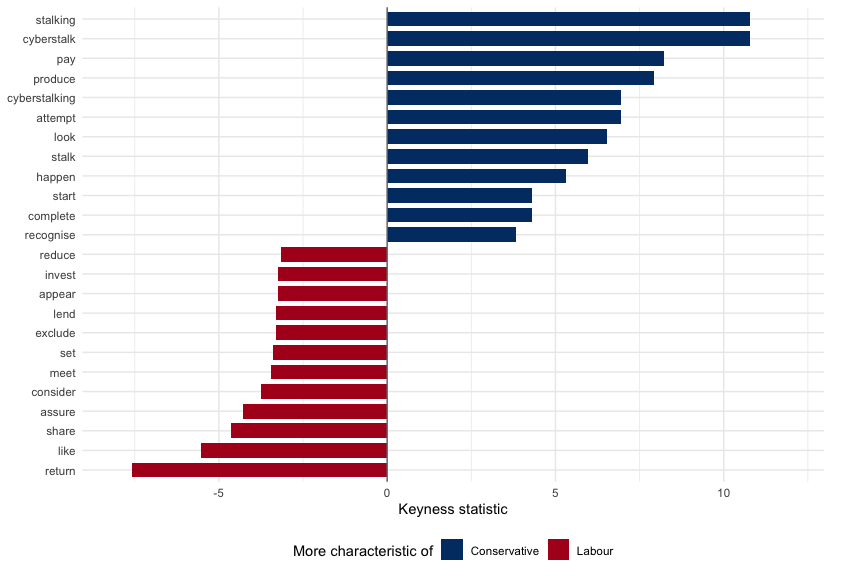

# QTA Lab 08: NLP Processing and Model-Generated Annotation


## Learning goals

In this lab, you will learn how to:

- use UDPipe to tokenize, lemmatize, POS-tag, and dependency-parse text;
- move between UDPipe output and quanteda objects;
- build noun- and verb-only DFMs;
- compare verb usage across parties with keyness;
- use dependency relations to inspect grammatical roles;
- inspect NLP annotations as a model-generated data product;
- create a small validation sample for model-generated labels;
- think about how classical NLP preprocessing complements LLM-based
  workflows.

The running example is again the House of Commons sample. We use a small
sample of recent speeches because UDPipe performs linguistic annotation
token by token, which is slower than ordinary quanteda tokenization.

This lab connects to the lecture theme of *new forms of data*. UDPipe
does not just “clean” text. It produces new annotations: lemmas,
part-of-speech tags, and dependency relations. Those annotations can be
useful, but they should also be inspected before we treat them as
evidence.

``` text
speech text -> UDPipe annotation -> structured token table -> features -> validation
```

## Load Packages

``` r
library(dplyr)
library(stringr)
library(ggplot2)
library(quanteda)
library(quanteda.textstats)
library(udpipe)
```

## Download UDPipe Models

If you want to work with UDPipe models, you first need to download them.
The model should match the language of your corpus. For example, if you
want to work with a Dutch corpus, you need a Dutch model.

UDPipe models are too large to store in the course GitHub repository.
Instead, download the models you need once and keep them in a local
`models` folder. Run this chunk when you first work through the lab, or
when you move the lab to a new computer. The chunk is not evaluated when
the document is rendered, because downloading depends on an internet
connection and only needs to happen once.

``` r
model_dir <- "models"
dir.create(model_dir, showWarnings = FALSE)

udmodel_english <- udpipe_download_model(
  language = "english-ewt",
  model_dir = model_dir
)

udmodel_dutch <- udpipe_download_model(
  language = "dutch",
  model_dir = model_dir
)

udmodel_german <- udpipe_download_model(
  language = "german-gsd",
  model_dir = model_dir
)

str(udmodel_dutch)
```

After downloading, we tell R where the model files are stored. If you
downloaded the models yourself, they should be in the `models` folder.

``` r
model_dir <- "models"

if (!dir.exists(model_dir)) {
  model_dir <- "Labs/Lab_8"
}

english_model_path <- file.path(model_dir, "english-ewt-ud-2.5-191206.udpipe")
dutch_model_path <- file.path(model_dir, "dutch-alpino-ud-2.5-191206.udpipe")
german_model_path <- file.path(model_dir, "german-gsd-ud-2.5-191206.udpipe")

file.exists(english_model_path)
```

    [1] TRUE

``` r
file.exists(dutch_model_path)
```

    [1] TRUE

``` r
file.exists(german_model_path)
```

    [1] TRUE

## Read And Sample The Data

``` r
data_path <- "Data/hc_sample_1945_2025.rds"

hoc <- readRDS(data_path)

hoc <- hoc |>
  mutate(
    year = as.integer(format(date, "%Y")),
    doc_id = paste0("hoc_", row_number()),
    party_group = case_when(
      party %in% c(
        "Conservative",
        "Labour",
        "Liberal Democrat",
        "Scottish National Party"
      ) ~ party,
      TRUE ~ "Other"
    )
  )
```

We keep recent speeches with at least 80 terms, then draw a reproducible
sample. This gives UDPipe enough text to annotate while keeping the lab
fast.

``` r
udpipe_pool <- hoc |>
  filter(
    year >= 1997,
    terms >= 80,
    party_group != "Other",
    !is.na(text),
    text != ""
  )

set.seed(20260710)

udpipe_docs <- udpipe_pool |>
  slice_sample(n = min(150, nrow(udpipe_pool)))

udpipe_docs |>
  count(party_group, sort = TRUE)
```

                  party_group  n
    1                  Labour 74
    2            Conservative 54
    3        Liberal Democrat 15
    4 Scottish National Party  7

This sample is designed for speed, not representativeness. Before
interpreting any party comparison, we should inspect what ended up in
the sample.

``` r
udpipe_docs |>
  count(party_group, sort = TRUE)
```

                  party_group  n
    1                  Labour 74
    2            Conservative 54
    3        Liberal Democrat 15
    4 Scottish National Party  7

``` r
udpipe_docs |>
  mutate(decade = paste0(floor(year / 10) * 10, "s")) |>
  count(decade, party_group) |>
  arrange(decade, party_group)
```

       decade             party_group  n
    1   1990s            Conservative  2
    2   1990s                  Labour  8
    3   1990s        Liberal Democrat  2
    4   2000s            Conservative 15
    5   2000s                  Labour 45
    6   2000s        Liberal Democrat  8
    7   2010s            Conservative 25
    8   2010s                  Labour 14
    9   2010s        Liberal Democrat  3
    10  2010s Scottish National Party  5
    11  2020s            Conservative 12
    12  2020s                  Labour  7
    13  2020s        Liberal Democrat  2
    14  2020s Scottish National Party  2

## Load The UDPipe Model

We start with the English model because the House of Commons speeches
are in English.

``` r
english_model <- udpipe_load_model(english_model_path)
```

## Annotate The Speeches

UDPipe works with character vectors. We pass the speech texts and the
HoC document ids so that we can later join the annotations back to
metadata.

``` r
parsed_tokens <- udpipe_annotate(
  english_model,
  x = udpipe_docs$text,
  doc_id = udpipe_docs$doc_id
) |>
  as.data.frame() |>
  as_tibble()
```

``` r
parsed_tokens |>
  select(doc_id, sentence_id, token_id, token, lemma, upos, dep_rel) |>
  slice_head(n = 10)
```

    # A tibble: 10 × 7
       doc_id   sentence_id token_id token  lemma upos  dep_rel
       <chr>          <int> <chr>    <chr>  <chr> <chr> <chr>  
     1 hoc_3807           1 1        I      I     PRON  nsubj  
     2 hoc_3807           1 2        beg    beg   VERB  root   
     3 hoc_3807           1 3        to     to    PART  mark   
     4 hoc_3807           1 4        move   move  VERB  xcomp  
     5 hoc_3807           1 5        ,      ,     PUNCT punct  
     6 hoc_3807           1 6        That   that  SCONJ mark   
     7 hoc_3807           1 7        the    the   DET   det    
     8 hoc_3807           1 8        House  house NOUN  nsubj  
     9 hoc_3807           1 9        agrees agree VERB  advcl  
    10 hoc_3807           1 10       with   with  ADP   case   

``` r
glimpse(parsed_tokens)
```

    Rows: 58,260
    Columns: 14
    $ doc_id        <chr> "hoc_3807", "hoc_3807", "hoc_3807", "hoc_3807", "hoc_380…
    $ paragraph_id  <int> 1, 1, 1, 1, 1, 1, 1, 1, 1, 1, 1, 1, 1, 1, 1, 1, 1, 1, 1,…
    $ sentence_id   <int> 1, 1, 1, 1, 1, 1, 1, 1, 1, 1, 1, 1, 1, 1, 1, 1, 1, 2, 2,…
    $ sentence      <chr> "I beg to move, That the House agrees with the Lords in …
    $ token_id      <chr> "1", "2", "3", "4", "5", "6", "7", "8", "9", "10", "11",…
    $ token         <chr> "I", "beg", "to", "move", ",", "That", "the", "House", "…
    $ lemma         <chr> "I", "beg", "to", "move", ",", "that", "the", "house", "…
    $ upos          <chr> "PRON", "VERB", "PART", "VERB", "PUNCT", "SCONJ", "DET",…
    $ xpos          <chr> "PRP", "VBP", "TO", "VB", ",", "IN", "DT", "NN", "VBZ", …
    $ feats         <chr> "Case=Nom|Number=Sing|Person=1|PronType=Prs", "Mood=Ind|…
    $ head_token_id <chr> "2", "0", "4", "2", "2", "9", "8", "9", "2", "12", "12",…
    $ dep_rel       <chr> "nsubj", "root", "mark", "xcomp", "punct", "mark", "det"…
    $ deps          <chr> NA, NA, NA, NA, NA, NA, NA, NA, NA, NA, NA, NA, NA, NA, …
    $ misc          <chr> NA, NA, NA, "SpaceAfter=No", NA, NA, NA, NA, NA, NA, NA,…

For this lab, the most important columns are:

- `doc_id`: the speech identifier;
- `token`: the original token;
- `lemma`: the lemmatized token;
- `upos`: the universal part-of-speech tag;
- `xpos`: the more detailed Penn Treebank tag;
- `dep_rel`: the dependency relation.

``` r
parsed_tokens <- parsed_tokens |>
  select(
    doc_id,
    sentence_id,
    token_id,
    token,
    lemma,
    upos,
    xpos,
    head_token_id,
    dep_rel
  ) |>
  mutate(lemma = str_to_lower(lemma))

head(parsed_tokens)
```

    # A tibble: 6 × 9
      doc_id   sentence_id token_id token lemma upos  xpos  head_token_id dep_rel
      <chr>          <int> <chr>    <chr> <chr> <chr> <chr> <chr>         <chr>  
    1 hoc_3807           1 1        I     i     PRON  PRP   2             nsubj  
    2 hoc_3807           1 2        beg   beg   VERB  VBP   0             root   
    3 hoc_3807           1 3        to    to    PART  TO    4             mark   
    4 hoc_3807           1 4        move  move  VERB  VB    2             xcomp  
    5 hoc_3807           1 5        ,     ,     PUNCT ,     2             punct  
    6 hoc_3807           1 6        That  that  SCONJ IN    9             mark   

## Validate The Annotation Product

Before building features from the annotations, inspect the intermediate
product. Are the lemmas plausible? Do the POS tags look sensible? Are
parliamentary terms or proper names tagged in ways that make sense for
your question?

``` r
set.seed(20260710)

parsed_tokens |>
  filter(upos %in% c("NOUN", "VERB", "ADJ", "PROPN")) |>
  select(doc_id, sentence_id, token, lemma, upos, dep_rel) |>
  slice_sample(n = 20)
```

    # A tibble: 20 × 6
       doc_id   sentence_id token      lemma      upos  dep_rel   
       <chr>          <int> <chr>      <chr>      <chr> <chr>     
     1 hoc_3872          10 Government government NOUN  obl:npmod 
     2 hoc_4832           7 place      place      NOUN  obl       
     3 hoc_3435          64 Minister   minister   PROPN obj       
     4 hoc_4620          30 including  include    VERB  case      
     5 hoc_3429          42 vital      vital      ADJ   conj      
     6 hoc_3427           1 commercial commercial ADJ   amod      
     7 hoc_4589          35 mixed      mix        ADJ   amod      
     8 hoc_3435          81 complex    complex    NOUN  compound  
     9 hoc_3429          38 Richmond   richmond   PROPN nmod      
    10 hoc_3543           4 Home       home       PROPN compound  
    11 hoc_4620          61 West       west       PROPN nsubj     
    12 hoc_4377           7 project    project    NOUN  obj       
    13 hoc_4577           4 estates    estate     NOUN  obl       
    14 hoc_4293          59 victims    victim     NOUN  nsubj:pass
    15 hoc_3601          13 welcome    welcome    ADJ   conj      
    16 hoc_3590           9 Bill       bill       PROPN nsubj     
    17 hoc_4832           8 Bryant     bryant     PROPN flat      
    18 hoc_3429          63 services   service    NOUN  conj      
    19 hoc_3427           3 consumers  consumer   NOUN  obl       
    20 hoc_4926           6 knows      know       VERB  ccomp     

It is also useful to inspect cases where UDPipe changed the surface form
of the token into a different lemma.

``` r
parsed_tokens |>
  filter(
    str_detect(token, "[A-Za-z]"),
    str_to_lower(token) != lemma
  ) |>
  distinct(token, lemma, upos) |>
  slice_head(n = 30)
```

    # A tibble: 30 × 3
       token     lemma    upos 
       <chr>     <chr>    <chr>
     1 agrees    agree    VERB 
     2 Lords     lord     NOUN 
     3 said      say      VERB 
     4 their     they     PRON 
     5 lordships lordship NOUN 
     6 left      leave    VERB 
     7 changes   change   NOUN 
     8 us        we       PRON 
     9 are       be       AUX  
    10 taken     take     VERB 
    # ℹ 20 more rows

These checks do not prove that the annotations are correct. They help us
decide whether the model-generated annotations are plausible enough for
the downstream task.

## Inspect POS Tags

``` r
sum(parsed_tokens$upos == "NOUN")
```

    [1] 10739

``` r
sum(parsed_tokens$upos == "VERB")
```

    [1] 6482

``` r
sum(parsed_tokens$upos == "ADJ")
```

    [1] 3634

``` r
parsed_tokens |>
  count(upos, sort = TRUE)
```

    # A tibble: 17 × 2
       upos      n
       <chr> <int>
     1 NOUN  10739
     2 VERB   6482
     3 ADP    5904
     4 PUNCT  5742
     5 DET    5734
     6 PRON   4864
     7 AUX    3896
     8 ADJ    3634
     9 PROPN  2807
    10 ADV    2609
    11 PART   1731
    12 CCONJ  1710
    13 SCONJ  1612
    14 NUM     683
    15 SYM      87
    16 INTJ     17
    17 X         9

Proper nouns are tagged as `PROPN`. In parliamentary speeches, these
often identify places, organisations, and named individuals.

``` r
proper_nouns <- parsed_tokens |>
  filter(upos == "PROPN")

proper_nouns |>
  count(lemma, sort = TRUE) |>
  slice_head(n = 30)
```

    # A tibble: 30 × 2
       lemma         n
       <chr>     <int>
     1 member      117
     2 minister    112
     3 bill         66
     4 house        50
     5 uk           47
     6 gentleman    42
     7 secretary    40
     8 london       39
     9 state        37
    10 mr.          33
    # ℹ 20 more rows

## Clean Lemmas

We create a small cleaning helper so that POS-specific analyses use
comparable preprocessing. This removes punctuation-like lemmas,
stopwords, and common parliamentary formulae.

``` r
parliamentary_stopwords <- c(
  "hon", "member", "right", "friend", "sir", "gentleman",
  "lady", "house", "commons", "speaker", "minister", "secretary",
  "asked", "question", "mr", "mrs", "ms", "would", "could", "may"
)

parsed_tokens <- parsed_tokens |>
  mutate(
    clean_lemma = if_else(
      !is.na(lemma) &
        str_detect(lemma, "^[a-z][a-z_-]*$") &
        !lemma %in% stopwords("en") &
        !lemma %in% parliamentary_stopwords,
      lemma,
      NA_character_
    )
  )
```

## Noun Lemmas

Nouns are useful when we want to focus on policy objects, institutions,
groups, and issues.

``` r
nouns <- parsed_tokens |>
  filter(upos == "NOUN", !is.na(clean_lemma))

nouns_dfm <- split(nouns$clean_lemma, nouns$doc_id) |>
  as.tokens() |>
  dfm()

hoc_metadata <- udpipe_docs |>
  select(doc_id, date, year, speaker, party, party_group, terms)

docvars(nouns_dfm) <- hoc_metadata[
  match(docnames(nouns_dfm), hoc_metadata$doc_id),
  -1
]

dim(nouns_dfm)
```

    [1]  150 2262

``` r
topfeatures(nouns_dfm, 30)
```

    government     people       year       time      issue    country      point 
           228        134        121        101         87         81         70 
         place        way     debate    service    problem       case   business 
            68         67         63         62         58         58         55 
        victim      child    company      today       work     system     report 
            54         51         49         47         46         46         46 
        number      money        day       fact     change     police      world 
            46         45         44         42         40         40         39 
     amendment     matter 
            37         36 

## Verb Lemmas

Verbs are useful when we want to study actions, commitments, claims, and
blame.

``` r
verbs <- parsed_tokens |>
  filter(upos == "VERB", !is.na(clean_lemma))

verbs_dfm <- split(verbs$clean_lemma, verbs$doc_id) |>
  as.tokens() |>
  dfm()

docvars(verbs_dfm) <- hoc_metadata[
  match(docnames(verbs_dfm), hoc_metadata$doc_id),
  -1
]

dim(verbs_dfm)
```

    [1]  150 1068

``` r
topfeatures(verbs_dfm, 30)
```

          say      make      take      know      need      want        go      work 
          184       182       119        94        92        80        79        73 
         give       see       use      come     think       get       put      hope 
           72        70        66        64        61        60        58        57 
       ensure       ask   provide      find  consider     bring      look       set 
           55        51        44        40        39        38        38        37 
         tell      hear       pay   believe introduce       try 
           37        36        36        34        34        33 

We can compare verb usage between Conservative and Labour speeches using
keyness. Positive values indicate verbs that are more characteristic of
Conservative speeches in this sample; negative values indicate verbs
that are more characteristic of Labour speeches.

``` r
verbs_dfm_grouped <- verbs_dfm |>
  dfm_group(groups = party_group) |>
  dfm_subset(party_group %in% c("Conservative", "Labour"))

verb_keyness <- textstat_keyness(
  verbs_dfm_grouped,
  target = "Conservative"
)

verb_keyness_plot <- bind_rows(
  verb_keyness |>
    slice_max(order_by = chi2, n = 12, with_ties = FALSE),
  verb_keyness |>
    slice_min(order_by = chi2, n = 12, with_ties = FALSE)
) |>
  mutate(
    party_more = if_else(chi2 > 0, "Conservative", "Labour"),
    feature_label = str_replace_all(feature, "_", " ")
  )

ggplot(
  verb_keyness_plot,
  aes(
    x = reorder(feature_label, chi2),
    y = chi2,
    fill = party_more
  )
) +
  geom_col(width = 0.75) +
  geom_hline(yintercept = 0, color = "grey45") +
  coord_flip(clip = "off") +
  labs(
    x = NULL,
    y = "Keyness statistic",
    fill = "More characteristic of"
  ) +
  scale_fill_manual(
    values = c("Conservative" = "#003B73", "Labour" = "#B00020")
  ) +
  scale_y_continuous(expand = expansion(mult = c(0.08, 0.12))) +
  theme_minimal() +
  theme(
    legend.position = "bottom",
    plot.margin = margin(5.5, 30, 5.5, 5.5)
  )
```



``` r
head(verb_keyness, 20)
```

             feature      chi2           p n_target n_reference
    1     cyberstalk 10.779679 0.001026205       11           0
    2       stalking 10.779679 0.001026205       11           0
    3            pay  8.229548 0.004121379       23           7
    4        produce  7.915946 0.004900094       10           0
    5        attempt  6.945838 0.008401445        9           0
    6  cyberstalking  6.945838 0.008401445        9           0
    7           look  6.530456 0.010604275       24           9
    8          stalk  5.978927 0.014477805        8           0
    9         happen  5.300875 0.021314711       19           7
    10      complete  4.308549 0.037921291        9           2
    11         start  4.308549 0.037921291        9           2
    12     recognise  3.834977 0.050193667       12           4
    13       receive  3.623340 0.056974382       10           3
    14          hope  3.501792 0.061302472       29          16
    15          hear  3.131792 0.076779291       20          10
    16      estimate  3.114041 0.077620155        5           0
    17     subsidise  3.114041 0.077620155        5           0
    18           use  2.819618 0.093118556       34          21
    19          find  2.739926 0.097869326       22          12
    20      increase  2.502215 0.113686267       16           8

The noun and verb examples use the same basic recipe:

``` text
choose a POS tag -> keep clean lemmas -> group by document -> create a DFM
```

You can reuse this recipe for adjectives, proper nouns, or any other POS
tag when it is substantively useful.

## Dependency Relations

UDPipe also provides dependency relations. For example, `nsubj` tags
nominal subjects and `obj` tags direct objects. These tags can help us
ask more precise questions about who is acting and what is being acted
upon.

``` r
parsed_tokens |>
  count(dep_rel, sort = TRUE) |>
  slice_head(n = 20)
```

    # A tibble: 20 × 2
       dep_rel       n
       <chr>     <int>
     1 case       5900
     2 punct      5753
     3 det        5585
     4 nsubj      4533
     5 amod       2892
     6 obj        2798
     7 advmod     2793
     8 mark       2767
     9 obl        2702
    10 nmod       2623
    11 root       2539
    12 compound   2070
    13 aux        2066
    14 conj       1949
    15 cc         1713
    16 cop        1227
    17 advcl      1006
    18 ccomp       986
    19 nmod:poss   885
    20 xcomp       796

``` r
subjects_objects <- parsed_tokens |>
  filter(
    dep_rel %in% c("nsubj", "obj"),
    !is.na(clean_lemma)
  )

subjects_objects |>
  count(dep_rel, clean_lemma, sort = TRUE) |>
  group_by(dep_rel) |>
  slice_head(n = 15) |>
  ungroup()
```

    # A tibble: 30 × 3
       dep_rel clean_lemma     n
       <chr>   <chr>       <int>
     1 nsubj   government     79
     2 nsubj   people         50
     3 nsubj   one            44
     4 nsubj   bill           15
     5 nsubj   company        15
     6 nsubj   change         13
     7 nsubj   report         13
     8 nsubj   ministers      12
     9 nsubj   office         12
    10 nsubj   point          12
    # ℹ 20 more rows

## Other Languages

UDPipe supports many languages. Because we downloaded English, Dutch,
and German models at the start of the lab, we can inspect short examples
in all three languages.

The point here is not to do a full multilingual analysis. The point is
to see that tokenization, lemmatization, and grammatical annotation are
language-specific. This connects to the lecture discussion of
multilingual text: even if two sentences are conceptually similar, the
input data produced by a processing pipeline may look different.

``` r
dutch_model <- udpipe_load_model(dutch_model_path)
german_model <- udpipe_load_model(german_model_path)

english_documents <- c(
  en1 = "The government discusses the budget today."
)

dutch_documents <- c(
  nl1 = "De regering bespreekt vandaag de begroting."
)

german_documents <- c(
  de1 = "Die Regierung bespricht heute den Haushalt."
)

parsed_tokens_english <- udpipe_annotate(
  english_model,
  x = english_documents,
  doc_id = names(english_documents)
) |>
  as.data.frame() |>
  as_tibble() |>
  mutate(language = "English")

parsed_tokens_dutch <- udpipe_annotate(
  dutch_model,
  x = dutch_documents,
  doc_id = names(dutch_documents)
) |>
  as.data.frame() |>
  as_tibble() |>
  mutate(language = "Dutch")

parsed_tokens_german <- udpipe_annotate(
  german_model,
  x = german_documents,
  doc_id = names(german_documents)
) |>
  as.data.frame() |>
  as_tibble() |>
  mutate(language = "German")

bind_rows(
  parsed_tokens_english,
  parsed_tokens_dutch,
  parsed_tokens_german
) |>
  select(language, token, lemma, upos, dep_rel)
```

    # A tibble: 21 × 5
       language token      lemma      upos  dep_rel 
       <chr>    <chr>      <chr>      <chr> <chr>   
     1 English  The        the        DET   det     
     2 English  government government NOUN  nsubj   
     3 English  discusses  discuss    VERB  root    
     4 English  the        the        DET   det     
     5 English  budget     budget     NOUN  obj     
     6 English  today      today      NOUN  obl:tmod
     7 English  .          .          PUNCT punct   
     8 Dutch    De         de         DET   det     
     9 Dutch    regering   regering   NOUN  nsubj   
    10 Dutch    bespreekt  bespreken  VERB  root    
    # ℹ 11 more rows

## NLP And LLM Workflows

LLMs can label, summarise, classify, and extract information from
political text, but classical NLP still matters. POS tags, lemmas, and
dependency relations are transparent, reproducible features. They can
help:

- build better dictionary features;
- audit LLM-coded data;
- select examples for prompting;
- compare model outputs to explicit linguistic patterns;
- reduce prompt context by passing structured features instead of raw
  text.

The key trade-off is interpretability. UDPipe annotations are imperfect,
but they are inspectable. LLM outputs can be powerful, but they require
validation.

The same validation logic applies to both: inspect the intermediate
output and then ask whether errors matter for the final quantity of
interest.

``` r
set.seed(20260710)
validation_n <- min(12, nrow(udpipe_docs))

llm_validation_sample <- udpipe_docs |>
  select(doc_id, date, speaker, party, party_group, agenda, text) |>
  slice_sample(n = validation_n) |>
  mutate(
    llm_label = NA_character_,
    human_label = NA_character_,
    agreement = NA,
    notes = NA_character_
  )

llm_validation_sample |>
  mutate(text_preview = str_trunc(text, 160)) |>
  select(doc_id, date, speaker, party_group, agenda, text_preview) |>
  head(3)
```

        doc_id       date        speaker  party_group                 agenda
    1 hoc_3289 1998-03-18    Derek Wyatt       Labour               Internet
    2 hoc_4589 2019-03-07     Jake Berry Conservative New Ferry Regeneration
    3 hoc_3920 2008-05-14 Philip Hammond Conservative    Vehicle Excise Duty
                                                                                                                                                          text_preview
    1 I am aware of that. It is to the immense credit of Bill Gates and his brilliant team at Microsoft that he has travelled the road to Damascus and changed his ...
    2 The hon. Member for Wirral South (Alison McGovern) has made an impassioned plea on behalf of her constituents, and I pay tribute to her for her tenacity and ...
    3 I want to make a little progress. I said that I would give way to the hon. Gentleman again, and I will. However, in view of his earlier intervention, perhaps...

If we later asked an LLM to label these speeches, this small data frame
could become the start of a validation workflow. We would fill in the
model label, compare it with human judgment, inspect disagreements, and
ask whether errors are patterned by party, period, speaker, or issue.

## Practice Exercises

For these exercises, work with the `parsed_tokens` data frame and the
HoC metadata created above.

1.  Create a data frame called `adjs` that contains all clean adjective
    lemmas in the HoC sample.

``` r
# Your answer here
```

2.  Display the most common adjective lemmas using `count()`.

``` r
# Your answer here
```

3.  Group the adjectives by speech and turn them into a DFM called
    `adjs_dfm`.

``` r
# Your answer here
```

4.  Append `date`, `year`, `speaker`, `party`, `party_group`, and
    `terms` from `hoc_metadata` as docvars to `adjs_dfm`.

``` r
# Your answer here
```

5.  Use `topfeatures()` to inspect the most common adjective lemmas. Do
    they look like useful evaluative features?

``` r
# Your answer here
```

6.  Use dependency relations to count the most common direct-object
    lemmas, where `dep_rel == "obj"`.

``` r
# Your answer here
```

7.  Write a short reflection: where might POS tags, lemmas, or
    dependency relations help you validate an LLM-coded analysis of
    parliamentary speeches?

``` r
# Your notes here
```

8.  Create a validation sample of 10 speeches from `udpipe_docs`. Keep
    the columns `doc_id`, `date`, `speaker`, `party_group`, `agenda`,
    and `text`, and add empty columns called `llm_label`, `human_label`,
    and `notes`.

``` r
# Your answer here
```

9.  Briefly note one way in which resource, retrieval, medium, or
    incentive bias could affect an LLM annotation project using
    parliamentary speeches.

``` r
# Your notes here
```
