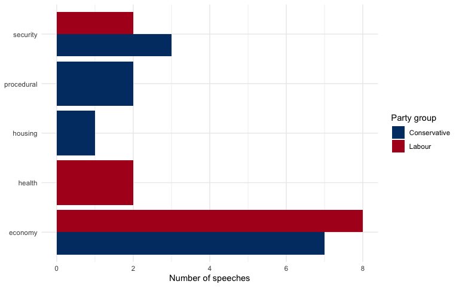

# QTA Lab 09: Zero-Shot Classification with NLI Models


## Learning Goals

In this lab, you will learn how to:

- explain why transformer models make transfer learning useful for text
  classification;
- define a zero-shot classification task using labels and
  natural-language hypotheses;
- use Natural Language Inference (NLI) logic for document
  classification;
- compare model-style labels against a weak keyword baseline;
- create a small validation sample for inspecting model-generated
  labels;
- understand how the optional transformer extension differs from the
  Part 1 teaching workflow.

## Conceptual Overview

In traditional supervised machine learning, we usually need labelled
training examples for the exact task we want to solve. Classical text
classifiers often start from a document-feature matrix, so they must
learn both the relevant language patterns and the classification task
from the labelled examples we provide.

Transformer models change this starting point. They are pre-trained on
large text corpora and learn contextual representations of language: the
same word can be represented differently depending on the surrounding
text. This is why they are useful for transfer learning. Instead of
learning everything from our House of Commons sample, we can reuse a
model that already contains general language representations.

BERT-NLI is one specific kind of transformer-based model. It is not the
only BERT-style model, and BERT is not a single method for all tasks.
Other models include BERT, RoBERTa, DeBERTa, Longformer, domain-specific
models, and multilingual models. BERT-NLI is especially useful for this
lab because it has also been trained on Natural Language Inference
(NLI), which gives it task knowledge about comparing two pieces of text.

NLI models are trained to compare two input texts: a `context` and a
`hypothesis`. The task is to determine whether the hypothesis is `true`,
`false`, or `neutral` given the context. In other terminology, these
classes are often called `entailment`, `contradiction`, and `neutral`.

For document classification, we turn a label into a hypothesis:

- context: a House of Commons speech;
- candidate label: `health`;
- hypothesis: “This speech is about health policy.”

If the NLI model assigns a high `true` or entailment probability to that
hypothesis, we treat the speech as likely to belong to the `health`
category. This is not about whether the hypothesis is objectively true
in the world. It is about whether the speech text supports that
hypothesis.

This is powerful because we can classify documents without collecting
hundreds or thousands of labelled examples first. It is also risky
because the model choice, labels, hypotheses, corpus fit, and validation
design matter enormously.

## Load Packages

``` r
library(dplyr)
library(stringr)
library(tidyr)
library(purrr)
library(ggplot2)
library(quanteda)
library(caret)
library(reticulate)

party_colors <- c(
  "Conservative" = "#003B73",
  "Labour" = "#B00020"
)
```

## Part 1: Classification Workflow Without Transformers

## Read And Prepare The HoC Data

``` r
data_path <- "Data/hc_sample_1945_2025.rds"

hoc <- readRDS(data_path)

hoc <- hoc |>
  mutate(
    year = as.integer(format(date, "%Y")),
    speech_id = paste0("hoc_", row_number()),
    party_group = case_when(
      party %in% c("Conservative", "Labour") ~ party,
      TRUE ~ "Other"
    ),
    party_group = factor(party_group, levels = c("Conservative", "Labour", "Other"))
  )
```

We use a small sample of recent Conservative and Labour speeches.
Keeping the party comparison simple makes the examples easier to
inspect. Transformer inference is much slower than ordinary dictionary
or DFM methods, so start small and scale up only after the workflow is
correct.

``` r
nli_pool <- hoc |>
  filter(
    year >= 1997,
    party_group %in% c("Conservative", "Labour"),
    terms >= 80,
    !is.na(text),
    text != ""
  )

set.seed(20260710)

hoc_nli <- nli_pool |>
  slice_sample(n = min(80, nrow(nli_pool)))

hoc_nli |>
  count(party_group, sort = TRUE)
```

       party_group  n
    1 Conservative 40
    2       Labour 40

Most transformer models have maximum context lengths. We therefore
create a shortened text field for the lab of up to 220 tokens. In a real
project, you would decide whether to truncate, split long documents into
chunks, classify each chunk, or use a long-context model.

The function below keeps the first `max_words` words of each speech.
This is not a substantive claim about which part of the speech matters
most. It is a practical way to keep the lab fast and to mimic the
context limits that transformer models often impose.

``` r
truncate_words <- function(x, max_words = 220) {
  words <- str_split(str_squish(x), "\\s+")[[1]]
  paste(head(words, max_words), collapse = " ")
}

hoc_nli <- hoc_nli |>
  mutate(text_for_model = map_chr(text, truncate_words))

hoc_nli |>
  select(speech_id, date, speaker, party, agenda, text_for_model) |>
  slice_head(n = 3)
```

      speech_id       date        speaker        party
    1  hoc_3912 2008-04-01   Jacqui Smith       Labour
    2  hoc_4092 2011-03-14       Liam Fox Conservative
    3  hoc_4354 2015-06-29 George Osborne Conservative
                                                  agenda
    1                             Counter-Terrorism Bill
    2 North Africa [Oral Answers to Questions > Defence]
    3                                             Greece
                                                                                                                                                                                                                                                                                                                                                                                                                                                                                                                                                                                                                                                                                                                                                                                                                                                                                                                                                                                                                                                                                                                                                                                                                                                                      text_for_model
    1                                                                                                                                                                                                                                                                                                                                                                                                                                                                                                                                                     My right hon. Friend is completely right. The police, like prosecutors, want to bring people to charge and to court as quickly as possible if they believe that there is a case to answer. The idea that it would somehow serve the police to maintain people in detention, when they were able to bring a charge, is fallacious. Also, it is a condition of the close work between the police and the Crown Prosecution Service during these investigations that a charge must be brought as soon as possible. My right hon. Friend also makes the important point that we have a decision to take in the House about whether to ignore the potential risk or act now. Later in my speech I shall explain how we do that.
    2                                                                                                                                                                                                                                                                                                                                                                                                                                                                                                                                                                                                                                                                                                                                                                       The word missing from the right hon. Gentleman's comments was “sorryâ€\u009d-sorry for the position in which he left our armed forces, with an MOD budget massively over-committed at £158 billion. What Labour Members still have not recognised is that their own economic incompetence is a liability for this country's national security in the long term. We are taking the measures to put this country back on a firm footing in a way that they never could and never had the courage to do.
    3 Let me deal with the specific points that the hon. Gentleman has raised. Our advice to the many British people who are planning to go on holiday to Greece is very clear. They should continue to check the travel advice on the Government website. As I have just explained, that advice has been changed, and we are advising people to take more euros with them than they might have been expecting to take. The hon. Gentleman makes a point about our conversations with the Greek authorities. Clearly they have tried to, in some sense, protect tourists from their capital controls, because if people have access to a foreign bank account, they can withdraw up to €600 from the ATMs. But of course one has to think through a situation where the ATMs potentially start to run out of money, particularly in certain locations. That is why we are advising people to take more cash with them but also to be aware of the safety issues involved in that. On the question about British citizens who have deposits in Greek banks, I hope I made it clear in my statement that deposits in branches of Greek banks, and indeed, in that sense, also the host bank, are not covered by the UK's compensation scheme, but the deposits in the subsidiary are

## Define Candidate Labels

Good zero-shot labels should be clear, mutually intelligible, and close
to the concepts you actually want to measure. We define labels and then
write label-specific hypotheses.

``` r
label_descriptions <- tibble(
  label = c(
    "economy",
    "health",
    "security",
    "environment",
    "education",
    "housing",
    "procedural"
  ),
  hypothesis = c(
    "This speech is about the economy, taxation, public spending, jobs, or business.",
    "This speech is about health policy, the NHS, hospitals, patients, or social care.",
    "This speech is about security, defence, policing, crime, borders, or terrorism.",
    "This speech is about climate change, energy, carbon emissions, or environmental policy.",
    "This speech is about schools, universities, teachers, students, or education policy.",
    "This speech is about housing, rent, homes, tenants, planning, or homelessness.",
    "This speech is mainly procedural parliamentary business rather than substantive policy."
  )
)

label_descriptions
```

    # A tibble: 7 × 2
      label       hypothesis                                                        
      <chr>       <chr>                                                             
    1 economy     This speech is about the economy, taxation, public spending, jobs…
    2 health      This speech is about health policy, the NHS, hospitals, patients,…
    3 security    This speech is about security, defence, policing, crime, borders,…
    4 environment This speech is about climate change, energy, carbon emissions, or…
    5 education   This speech is about schools, universities, teachers, students, o…
    6 housing     This speech is about housing, rent, homes, tenants, planning, or …
    7 procedural  This speech is mainly procedural parliamentary business rather th…

This table does two things. The `label` column gives the short category
names that will appear in our output. The `hypothesis` column states
what each label means in ordinary language. In a real NLI model, these
hypotheses are compared to each speech. In Part 1, we keep the
hypotheses visible because they are still the codebook for the task.

## A Weak Keyword Baseline

Before using a transformer, build a simple baseline. This gives you
something to compare against and helps reveal whether the zero-shot
model is doing something useful.

These are not gold-standard labels. They are weak labels.

The code below has three steps. First, `keyword_patterns` defines one
regular expression per label. Second, `map_dfc()` applies each pattern
to every speech and stores the counts in separate columns. Third, the
`rowwise()` block selects the label with the highest keyword count for
each speech.

``` r
keyword_patterns <- c(
  economy = "\\b(economy|economic|tax|taxes|budget|inflation|growth|business|businesses|jobs|wages|spending)\\b",
  health = "\\b(health|nhs|hospital|hospitals|patient|patients|care|doctor|doctors|nurse|nurses)\\b",
  security = "\\b(security|defence|police|crime|criminal|terrorism|terrorist|border|borders|army|military)\\b",
  environment = "\\b(climate|environment|environmental|carbon|emissions|energy|green|renewable|pollution)\\b",
  education = "\\b(education|school|schools|teacher|teachers|student|students|university|universities|pupils)\\b",
  housing = "\\b(housing|housebuilding|homes|rent|rents|tenant|tenants|landlord|homeless|homelessness|planning)\\b",
  procedural = "\\b(order|motion|committee|clause|amendment|amendments|bill|division|standing order)\\b"
)

keyword_scores <- map_dfc(
  keyword_patterns,
  ~ str_count(str_to_lower(hoc_nli$text_for_model), regex(.x))
)

keyword_baseline <- bind_cols(
  hoc_nli |>
    select(speech_id, date, year, speaker, party, party_group, agenda),
  keyword_scores
) |>
  rowwise() |>
  mutate(
    max_keyword_score = max(c_across(all_of(names(keyword_patterns)))),
    weak_label = names(keyword_patterns)[
      which.max(c_across(all_of(names(keyword_patterns))))
    ],
    weak_label = if_else(max_keyword_score > 0, weak_label, "unlabelled")
  ) |>
  ungroup()

keyword_baseline |>
  count(weak_label, sort = TRUE)
```

    # A tibble: 8 × 2
      weak_label      n
      <chr>       <int>
    1 economy        25
    2 procedural     16
    3 unlabelled     16
    4 security       10
    5 health          6
    6 environment     4
    7 education       2
    8 housing         1

The output tells us which labels the keyword rules assign most often.
This is only a rough baseline. Its main purpose is to give us a
transparent comparison point for later model-style labels.

## Keep The First Workflow Simple

For the first part of the lab, we deliberately do **not** run the
transformer model. This keeps the workflow fast, reproducible, and
easier to understand.

The objects we create below have the same shape as zero-shot classifier
output: one row per speech-label combination and one score for each
candidate label. The scores come from the keyword baseline, not from an
NLI model. This lets us learn the workflow before complicating things by
relying on Python, model downloads, etc.

``` r
run_nli <- FALSE
transformer_available <- FALSE

run_nli
```

    [1] FALSE

For your own use, start with the simple workflow. Once the data
structure, labels, hypotheses, validation checks, and reporting logic
are clear, run the optional transformer extension in Part 2.

``` r
model_name <- "MoritzLaurer/deberta-v3-base-zeroshot-v1.1-all-33"

hypothesis_template <- "This speech is about {}."
```

## A Teaching Classifier

The function below is a teaching device. It takes one speech and a set
of candidate labels. For each label, it counts how often the matching
keyword pattern appears in the speech. It then rescales those counts so
that the label scores add up to one.

This is **not** a zero-shot NLI model. It is useful because it returns
the same kind of table that a zero-shot model would return: labels
ranked by score. This means all later steps–choosing the top label,
inspecting disagreements, checking sensitivity, and preparing validation
samples–can be learned without running a transformer.

The `classify_zero_shot()` function does four things:

1.  It loops over the candidate labels, such as `economy`, `health`, or
    `housing`.
2.  For each label, it counts how often the matching keyword pattern
    appears in the speech.
3.  If no keywords are found for any label, it assigns equal scores to
    all labels so that the function still returns a usable result.
4.  It rescales the scores so they sum to one and sorts the labels from
    highest to lowest score.

The `hypothesis_template` argument is included so that the function has
the same structure as the real NLI classifier in Part 2. In Part 1, the
keyword-based teaching classifier does not actually use the template.

``` r
classify_zero_shot <- function(text, labels, hypothesis_template) {
  raw_scores <- map_dbl(labels, function(label) {
    if (label %in% names(keyword_patterns)) {
      str_count(str_to_lower(text), regex(keyword_patterns[[label]]))
    } else {
      0
    }
  })

  if (sum(raw_scores) == 0) {
    raw_scores <- rep(1, length(labels))
  }

  tibble(
    label = labels,
    score = raw_scores / sum(raw_scores)
  ) |>
    arrange(desc(score))
}
```

## Classify A Small Batch Of Speeches

We begin with 25 speeches. In Part 1 this is fast because we use keyword
scores. With a real transformer model, the same code can become much
slower, so it is good practice to start with a small batch.

The code below loops over speech IDs and speech texts at the same time.
For each speech, it returns a table of label scores. `map2_dfr()` then
binds all those small tables into one larger table.

``` r
nli_batch <- hoc_nli |>
  slice_head(n = 25)

label_scores <- map2_dfr(
  nli_batch$speech_id,
  nli_batch$text_for_model,
  function(id, speech_text) {
    classify_zero_shot(
      text = speech_text,
      labels = label_descriptions$label,
      hypothesis_template = hypothesis_template
    ) |>
      mutate(speech_id = id, .before = 1)
  }
)

label_scores |>
  arrange(speech_id, desc(score)) |>
  group_by(speech_id) |>
  slice_head(n = 3) |>
  ungroup()
```

    # A tibble: 75 × 3
       speech_id label      score
       <chr>     <chr>      <dbl>
     1 hoc_3417  economy    0.143
     2 hoc_3417  health     0.143
     3 hoc_3417  security   0.143
     4 hoc_3471  economy    0.5  
     5 hoc_3471  procedural 0.5  
     6 hoc_3471  health     0    
     7 hoc_3610  security   1    
     8 hoc_3610  economy    0    
     9 hoc_3610  health     0    
    10 hoc_3650  economy    0.143
    # ℹ 65 more rows

Each speech now has several candidate labels. For most analyses we need
a single predicted label per speech. The next block keeps the
highest-scoring label for each speech and joins the speech metadata back
in.

``` r
predictions <- label_scores |>
  group_by(speech_id) |>
  slice_max(order_by = score, n = 1, with_ties = FALSE) |>
  ungroup() |>
  rename(
    predicted_label = label,
    predicted_score = score
  ) |>
  left_join(
    nli_batch |>
      select(speech_id, date, year, speaker, party, party_group, agenda, text_for_model),
    by = "speech_id"
  )

predictions |>
  select(speech_id, party_group, agenda, predicted_label, predicted_score) |>
  arrange(desc(predicted_score))
```

    # A tibble: 25 × 5
       speech_id party_group  agenda                 predicted_label predicted_score
       <chr>     <fct>        <chr>                  <chr>                     <dbl>
     1 hoc_3610  Labour       Engagements [Oral Ans… security                      1
     2 hoc_3847  Labour       NHS and the Private S… health                        1
     3 hoc_3912  Labour       Counter-Terrorism Bill security                      1
     4 hoc_3996  Conservative Law Commission Bill [… procedural                    1
     5 hoc_4125  Labour       Regional Growth Fund … economy                       1
     6 hoc_4131  Conservative Engagements [Oral Ans… economy                       1
     7 hoc_4354  Conservative Greece                 housing                       1
     8 hoc_4374  Labour       Jeremy Pemberton [Ora… health                        1
     9 hoc_4690  Conservative Shopworkers: Protecti… security                      1
    10 hoc_4838  Conservative Antisocial Behaviour … security                      1
    # ℹ 15 more rows

## Compare With Weak Labels

The keyword labels are not ground truth, but disagreements are useful.
They tell us which speeches need closer inspection and where the model
or the dictionary may be interpreting the task differently.

In Part 1 the “classifier” and the weak baseline are closely related, so
this comparison is mainly about learning the validation workflow. In
Part 2, the same comparison becomes more interesting because the NLI
model may label a speech differently from the keyword baseline.

``` r
comparison <- predictions |>
  left_join(
    keyword_baseline |>
      select(speech_id, weak_label, max_keyword_score),
    by = "speech_id"
  ) |>
  mutate(agrees_with_weak_label = predicted_label == weak_label)

comparison |>
  count(predicted_label, weak_label, sort = TRUE)
```

    # A tibble: 6 × 3
      predicted_label weak_label     n
      <chr>           <chr>      <int>
    1 economy         economy       11
    2 security        security       5
    3 economy         unlabelled     4
    4 health          health         2
    5 procedural      procedural     2
    6 housing         housing        1

``` r
comparison |>
  filter(!agrees_with_weak_label) |>
  select(
    speech_id,
    party_group,
    agenda,
    predicted_label,
    predicted_score,
    weak_label,
    max_keyword_score,
    text_for_model
  ) |>
  slice_head(n = 5)
```

    # A tibble: 4 × 8
      speech_id party_group  agenda       predicted_label predicted_score weak_label
      <chr>     <fct>        <chr>        <chr>                     <dbl> <chr>     
    1 hoc_3417  Labour       Wild Mammal… economy                   0.143 unlabelled
    2 hoc_3650  Labour       Iraq [Oral … economy                   0.143 unlabelled
    3 hoc_3887  Labour       European Af… economy                   0.143 unlabelled
    4 hoc_4777  Conservative Ukraine      economy                   0.143 unlabelled
    # ℹ 2 more variables: max_keyword_score <int>, text_for_model <chr>

When inspecting disagreements, read the speech text and ask: is the
predicted label substantively plausible, did the keyword baseline fire
for an incidental reason, or is the case genuinely mixed?

## Visualise Predicted Labels

``` r
comparison |>
  count(party_group, predicted_label) |>
  ggplot(
    aes(
      x = predicted_label,
      y = n,
      fill = party_group
    )
  ) +
  geom_col(position = "dodge") +
  coord_flip() +
  scale_fill_manual(values = party_colors) +
  labs(
    x = NULL,
    y = "Number of speeches",
    fill = "Party group"
  ) +
  theme_minimal()
```



## Create A Validation Sample

The most important habit in this lab is not to trust the predicted
labels automatically. We need a small set of cases that a human can
inspect.

The code below keeps two high-scoring cases per predicted label. This is
a simple validation sample, not a full validation design. In a research
project, we would also include low-confidence cases, disagreements, and
important subgroups such as party or period.

``` r
validation_sample <- comparison |>
  group_by(predicted_label) |>
  slice_max(order_by = predicted_score, n = 2, with_ties = FALSE) |>
  ungroup() |>
  select(
    speech_id,
    predicted_label,
    predicted_score,
    weak_label,
    party_group,
    agenda,
    text_for_model
  )

validation_sample
```

    # A tibble: 9 × 7
      speech_id predicted_label predicted_score weak_label party_group  agenda      
      <chr>     <chr>                     <dbl> <chr>      <fct>        <chr>       
    1 hoc_4125  economy                     1   economy    Labour       Regional Gr…
    2 hoc_4131  economy                     1   economy    Conservative Engagements…
    3 hoc_3847  health                      1   health     Labour       NHS and the…
    4 hoc_4374  health                      1   health     Labour       Jeremy Pemb…
    5 hoc_4354  housing                     1   housing    Conservative Greece      
    6 hoc_3996  procedural                  1   procedural Conservative Law Commiss…
    7 hoc_4675  procedural                  0.9 procedural Conservative Point of Or…
    8 hoc_3610  security                    1   security   Labour       Engagements…
    9 hoc_3912  security                    1   security   Labour       Counter-Ter…
    # ℹ 1 more variable: text_for_model <chr>

## Part 2: Running A Real Zero-Shot NLI Model

The first part of the lab taught the workflow without requiring Python
or model downloads. The optional extension below runs the same kind of
task with a BERT/DeBERTa-style NLI model through Python’s Hugging Face
`transformers` library. This is one transformer model choice, not the
only way to use transformers for classification.

This is more advanced for three reasons. First, R has to talk to Python
through `reticulate`. Second, the required Python packages must be
installed in the same Python environment that R is using. Third, the
model may need to be downloaded the first time you run it.

### Install Python Dependencies

We use a project-level virtual environment called `.venv`. The command
below installs the transformer packages into that environment. Run it in
the terminal, not inside R.

``` bash
uv venv --python 3.13 .venv
uv pip install --python .venv/bin/python transformers torch sentencepiece accelerate
```

If you run the command from inside `Labs/Lab_9`, use the path to the
course-level environment:

``` bash
uv pip install --python ../../.venv/bin/python transformers torch sentencepiece accelerate
```

### Connect R To The Python Environment

The next block tells `reticulate` which Python to use. This must happen
before Python has been initialized in the R session. If `reticulate` has
already chosen a different Python, restart R and run the lab from the
top.

``` r
library(reticulate)

python_candidates <- c(
  ".venv/bin/python",
  "../../.venv/bin/python"
)

python_path <- python_candidates[file.exists(python_candidates)][1]

if (!is.na(python_path)) {
  use_python(python_path, required = TRUE)
}

py_config()
```

### Check Whether The Transformer Stack Is Available

This check only asks whether the Python packages are available. It does
not yet download or run the model. The actual model is specified below
by `model_name`.

``` r
run_nli <- TRUE

transformer_available <- py_module_available("transformers") &&
  py_module_available("torch")

transformer_available
```

### Define The Real NLI Classifier

This function sends a speech to the transformer pipeline as the
`context`. For each candidate label, the model evaluates whether the
context makes the label hypothesis `true` or entailed. The output is
deliberately made to look like the Part 1 output: a table with `label`
and `score`.

We define `model_name` and `hypothesis_template` again here so that this
advanced section can be run on its own after the setup chunks.

``` r
model_name <- "MoritzLaurer/deberta-v3-base-zeroshot-v1.1-all-33"
hypothesis_template <- "This speech is about {}."

transformers <- import("transformers")

zero_shot_pipeline <- transformers$pipeline(
  task = "zero-shot-classification",
  model = model_name,
  device = -1L
)

classify_with_nli <- function(text, labels, hypothesis_template) {
  result <- zero_shot_pipeline(
    text,
    candidate_labels = as.list(labels),
    hypothesis_template = hypothesis_template,
    multi_label = TRUE
  )

  tibble(
    label = unlist(result$labels),
    score = as.numeric(result$scores)
  )
}
```

### Try The Real Model On A Very Small Batch

Start with a few speeches. The first run may take longer because the
model has to be downloaded and loaded into memory.

``` r
real_nli_batch <- hoc_nli |>
  slice_head(n = 5)

real_label_scores <- map2_dfr(
  real_nli_batch$speech_id,
  real_nli_batch$text_for_model,
  function(id, speech_text) {
    classify_with_nli(
      text = speech_text,
      labels = label_descriptions$label,
      hypothesis_template = hypothesis_template
    ) |>
      mutate(speech_id = id, .before = 1)
  }
)

real_label_scores |>
  arrange(speech_id, desc(score)) |>
  group_by(speech_id) |>
  slice_head(n = 3) |>
  ungroup()
```

## Reporting Checklist

When reporting zero-shot or weakly supervised classification, document:

- model name and version;
- labels and full hypothesis templates;
- whether classification was single-label or multi-label;
- truncation or chunking decisions;
- validation sample design;
- performance by label and by relevant subgroups;
- examples of false positives and false negatives;
- any use of weak labels or pseudo-labels.

## Practice Exercises

1.  Add a new candidate label called `migration` with an appropriate
    hypothesis.

``` r
# Your answer here
```

2.  Add a keyword pattern for `migration` to the weak baseline and
    inspect how many sampled speeches it labels.

``` r
# Your answer here
```

3.  Run the Part 1 classification workflow for 10 speeches using the
    expanded label set.

``` r
# Your answer here
```

4.  Create a validation sample with at least one speech per predicted
    label.

``` r
# Your answer here
```

5.  Identify three speeches where the predicted label and weak keyword
    label disagree. What should a human coder inspect?

``` r
# Your answer here
```

6.  Write a short codebook entry for one label, including positive
    examples, negative examples, and borderline cases.

``` r
# Your notes here
```

7.  Reflection: how does NLI-based zero-shot classification differ from
    the Naive Bayes classifier in Lab 5? When would you still prefer
    human-labelled training data?

``` r
# Your notes here
```
